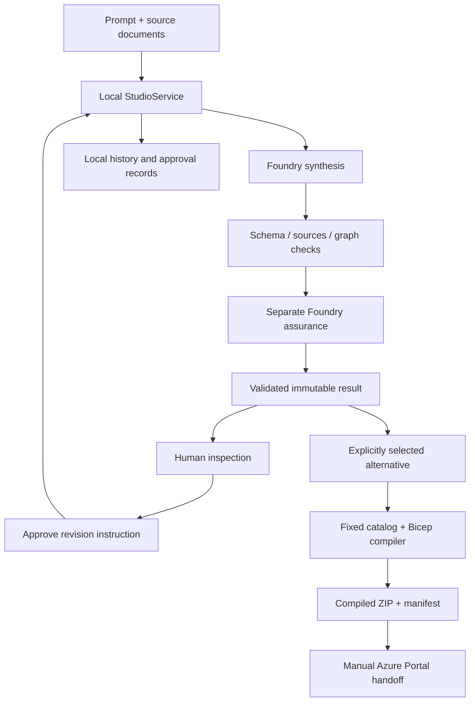

## Intent-to-Impact Studio: From Business Intent to Build-Ready Architecture

[](https://youtu.be/pyOx9IfUOqM)

Turn customer intent and supporting evidence into traceable Azure architecture, independently challenge the design, generate validated infrastructure, and continuously verify outcomes. Humans set direction; agents operate the workflow; deterministic controls keep it governed.

## Start here

| Document | What it answers |
|---|---|
| [Numbered user guide](./docs/intent-to-impact-user-guide.md) | How to use screenshot points 1-17, assurance actions, regeneration, history and the Azure handoff |
| [Technical deep dive](./docs/intent-to-impact-technical-deep-dive.md) | How the governed design-to-evidence engine works; implemented boundaries and evidence |
| [Detailed design specification](./docs/intent-to-impact-design-spec.md) | Current implementation overlay and the broader target architecture |
| [P0 implementation plan](./docs/intent-to-impact-p0-implementation-plan.md) | Delivered vertical slice, local adaptations and remaining implementation work |
| [Engineering task decomposition](./docs/intent-to-impact-p0-task-decomposition.md) | Current delivery status alongside the preserved 75-task planning backlog |
| [Experience setup](./intent-to-impact-studio/apps/experience/README.md) | UI behavior, build/test commands and operating limitations |
| [Backend setup](./intent-to-impact-studio/apps/control-plane/studio/README.md) | Local API, model configuration, sessions, persistence and recovery |
| [Infrastructure catalog](./intent-to-impact-studio/apps/control-plane/studio/templates/README.md) | Supported resources, edge-to-permission mappings and deployment prerequisites |
| [Azure Container Apps solution](./aca/README.md) | Container build, protected hosted configuration, persistent storage, deployment and verification |

The [ACA solution](./aca) hosts the studio itself as `intent2impact-hack26`.
It is separate from the in-product **Deploy to Azure** handoff for a generated
customer workload. Hosted mode adds Entra protection, managed-identity model
access, a single persistent writer and Linux Bicep; local mode stays unchanged.
See its README for current deployment status and the private-NFS transport trade-off.

**Judge walkthrough:** ACA has an explicit public, no-model simulation mode:
**Load example inputs -> Generate architecture** returns authored sample designs
and reviews, clearly labeled throughout the workflow. Revision demonstrations,
session-private history and real Bicep package compilation remain available.
There are no Foundry calls or inference charges in simulated mode; Azure hosting
still costs money. Local mode continues to use real Foundry calls. See
[ACA judge instructions](./aca/README.md#judge-demo-no-foundry-usage).

The earlier three-minute presenter script and original review documents were
moved to the local `_bkp` archive. That archive is intentionally not published.
The maintained user guide is the published walkthrough.

## What works

- **Business-first input:** project name, prompt and actual UTF-8 TXT/Markdown
  sources. Loading the fictional example fills input only; it makes no AI call.
- **Real synthesis and separate assurance:** two bounded Microsoft Agent Framework
  calls to the configured existing Foundry `gpt-5.2` deployment.
- **Validated structured output:** request-specific source enums, canonical JSON
  Schema, reference checks and literal existing-integration source bindings.
- **Interactive alternatives:** component/source inspection, requirement highlights,
  Dagre layered layout, Re-layout, flow direction, Expand, Fit and scoped zoom.
- **Actionable assurance:** Request recommended change or Challenge finding;
  explicit revision-only consent; a new model proposal and independent review.
- **Recorded decisions:** immutable parent/result/finding binding, before/after
  findings, preserved failed attempts and accessible run history.
- **Real infrastructure compilation:** selected-alternative catalog validation,
  Bicep execution, diagnostics, eight-file ZIP and file hashes.
- **Package regeneration:** distinct build attempts without another AI call;
  earlier compiled packages remain in history.
- **Guided Deploy to Azure handoff:** verified ARM/parameter JSON downloads,
  required-input guidance and the Azure Portal custom-template page.

### Recent corrections

The selected order-fulfilment package no longer fails because an **unselected**
alternative contains duplicate connections. Selected self-loops and duplicate
directed pairs still return actionable errors. Queue direction, not a "consume"
label, determines sender/receiver permissions; discrepancies remain explicit.

The model prompt now distinguishes component **kinds** from actual endpoint
**IDs**. Unknown endpoints are rejected, not guessed. Both assurance action paths
were retested with real model calls and their resulting packages compiled.

The old offline **Draft mode** link and route were removed. Old `/draft` bookmarks
open the studio. Historical components/tests and shared input helpers remain;
retired workbench assets are not shipped in the production bundle.

## How it works



The engine is a cooperating set of code-owned modules, not an autonomous model
with infrastructure permissions. The nine assurance dimensions are reviewed in
one separate call, not by nine agents.

**Approval authorizes a revision request, not a risk waiver or final design
sign-off. Compilation is not deployment. Portal navigation is not provisioning.**

## Run locally

### Prerequisites

- Windows and PowerShell; Node.js 22.19 or newer.
- Python 3.13 is the tested runtime.
- Azure CLI signed in to the approved existing Foundry tenant/subscription.
- Access to the project/model configured in
  [model_client.py](./intent-to-impact-studio/apps/control-plane/studio/model_client.py). This checkout
  retains the existing demo configuration; it is not automatically configured
  for another tenant. No keys or login tokens are included.
- For package generation: Bicep 0.47.16 or newer in one of the builder's approved
  locations, such as `$HOME\.azure\bin\bicep.exe`. See
  [Microsoft's Bicep installation guide](https://learn.microsoft.com/azure/azure-resource-manager/bicep/install).
  Local compiler binaries/caches are not in Git.

### First-time dependencies

From the repository root:

```powershell
npm ci --prefix .\intent-to-impact-studio\contracts
npm ci --prefix .\intent-to-impact-studio\apps\experience
python -m venv .\.intent-to-impact\studio\.venv
& .\.intent-to-impact\studio\.venv\Scripts\python.exe -m pip install -r .\intent-to-impact-studio\apps\control-plane\studio\requirements.txt
```

The contracts dependencies are needed by the schema generator used during the
frontend startup check. Install dependencies once, not on every launch.

### Start the combined application

```powershell
.\intent-to-impact-studio\tools\Run-LiveStudio.ps1
```

Open **http://127.0.0.1:5173/**. The launcher builds the frontend and starts the
same-origin Python API. After a successful build, it automatically stops this
workspace's existing studio or Vite dev/preview server on port 5173, waits for
the port to be released, then starts the replacement. Unrelated or unidentifiable
processes are not stopped; the error identifies the PID for manual inspection.
Finish active model/build work before restarting: termination can interrupt it,
and remote model completion may be unknown. Saved runs are preserved.
Stop the process you started with Ctrl+C when finished.

Use `.\intent-to-impact-studio\tools\Run-LiveStudio.ps1 -SkipBuild` to restart using already-built assets.
The same port-cleanup checks apply. Launcher regression tests are in
[Stop-LiveStudioPort.Tests.ps1](./intent-to-impact-studio/tests/tools/Stop-LiveStudioPort.Tests.ps1)
and run with Pester 5.

To stop the studio without starting a replacement:

```powershell
.\intent-to-impact-studio\tools\Stop-LiveStudioPort.ps1
```

From the `intent-to-impact-studio\tools` directory, use `.\Stop-LiveStudioPort.ps1`. The script infers
the workspace from its own location, not your current directory. It stops only
recognized workspace servers listening on port 5173 and reports when the port
is already free. Importing it with dot-sourcing loads functions without stopping
anything, so the launcher can build before performing cleanup.

**Do not use `npm run dev` or `npm run preview` alone for the live product.**
A frontend-only server can return HTML for API requests, causing
**The live service returned unreadable JSON**. Use the combined launcher instead.

The live studio has no database or hosted control plane. Do not publish this
loopback server behind a proxy or expose it on a network.

## Data, history and permission boundaries

- Prompt/document submission requires explicit model consent and can incur
  inference charges. Attached files are local until submission.
- Submitted text, results, approvals and packages are stored **unencrypted**
  under `.intent-to-impact\studio\runs`; this directory is ignored by Git.
- The safe default is **session-private history**. The current developer
  installation explicitly selected workspace sharing. A new checkout does not
  inherit that local setting.
- Workspace sharing, if deliberately selected, is configured in
  `.intent-to-impact\studio\settings.json` using `{"historyScope":"workspace"}`.
  Anyone using the local studio can then read saved runs from other sessions.
- `demo-human` is a local demo label, not enterprise identity or separation of duties.
- API sessions use cookies, exact Host/Origin checks and CSRF protection. Azure
  credentials remain server-side. These are local-demo controls.
- Restoring history does not make another model call. Failed records remain
  visible; interrupted work is not automatically retried.

## Deployment boundary

The package catalog supports Linux App Service, dedicated Linux Functions,
Blob Storage, Service Bus work queues, Key Vault and existing HTTPS integrations.
It does not generate arbitrary Azure services or business application handlers.

**Deploy to Azure** verifies the local compiled files and opens a manual portal
workflow. The user must supply the target subscription/resource group/region,
existing Entra and external integration values, and approve costs/resources
separately. Public-network policy can still reject the generated design.

There is no studio resource-provisioning endpoint and no automatic Azure outcome
import. Local packages remain `not-deployed`. Actual Azure provisioning,
application deployment, runtime checks and measured customer outcomes are
outstanding; do not present the handoff as their proof.

## Validation

From `intent-to-impact-studio\apps\experience`:

```powershell
npm run check:studio
npm run typecheck
npm test -- src\AppRoutes.test.tsx src\studio
npm run build
```

Backend fixture/contract tests can run without model calls after dependencies
are installed:

```powershell
& .\.intent-to-impact\studio\.venv\Scripts\python.exe -B -m unittest discover -s .\intent-to-impact-studio\tests\studio -p test_model.py
& .\.intent-to-impact\studio\.venv\Scripts\python.exe -B -m unittest discover -s .\intent-to-impact-studio\tests\studio -p test_design_changes.py
```

Bundle tests include actual compiler cases and need Bicep. Browser tests use
Playwright with isolated Edge profiles; chargeable model tests require explicit
`--execute-live`. The [user guide](./docs/intent-to-impact-user-guide.md) separates
real inference, compiler proof, replay tests and portal-only validation.

Local verification before publication included:

- A fresh publication check: **89 live-studio/routing/client/layout/handoff tests**,
  generated-contract consistency, TypeScript and production build all passed.
- Earlier 59-test frontend/client/deployment-handoff subset (included in the
  broader publication coverage above, not an additional 59 tests).
- 25 bundle tests, 19 model/validation tests and 16 approval tests.
- The original failing selection compiled twice with distinct build IDs;
  both eight-file downloads matched recorded hashes.
- Recommendation and challenge each produced real synthesis/assurance results;
  both revised designs then compiled and downloaded successfully.
- Numbered browser surfaces and real Azure Portal navigation passed.

These are scoped execution records, not a new all-repository certification.
Raw receipts and saved customer/example runs are **not distributed in Git**.
Some historical/spike tests require those operator-local artifacts or additional
environments and are not fresh-checkout acceptance gates.

## Repository map

| Path | Purpose |
|---|---|
| [intent-to-impact-studio](./intent-to-impact-studio) | Application source, contracts, engines, fixtures, reporting, tests and developer tools |
| [docs](./docs) | User, architecture, implementation and design documentation |
| [aca](./aca) | Azure Container Apps hosting, deployment and verification |
| [infra](./infra) | Historical NSP sandbox templates; not an approved automatic deployment path |
| [imgs](./imgs) | Supplied project illustrations |

The [engine illustration](./imgs/intent-to-impact-deep-dive.png),
[UI illustration](./imgs/intent-to-impact-UI.png) and
[project illustration](./imgs/IntentToImpact-Hack26.png) communicate the concept.
They include aspirational elements such as runtime continuity or services outside
the current catalog; they are **not screenshots or proof of implemented features**.
The specifications and user guide define the current behavior.
