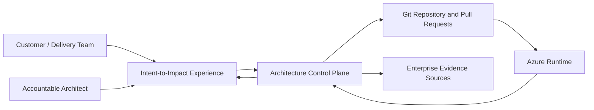
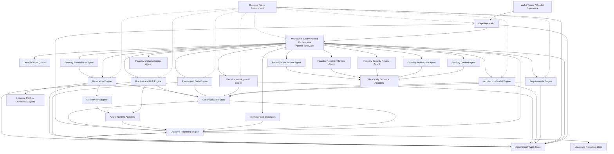
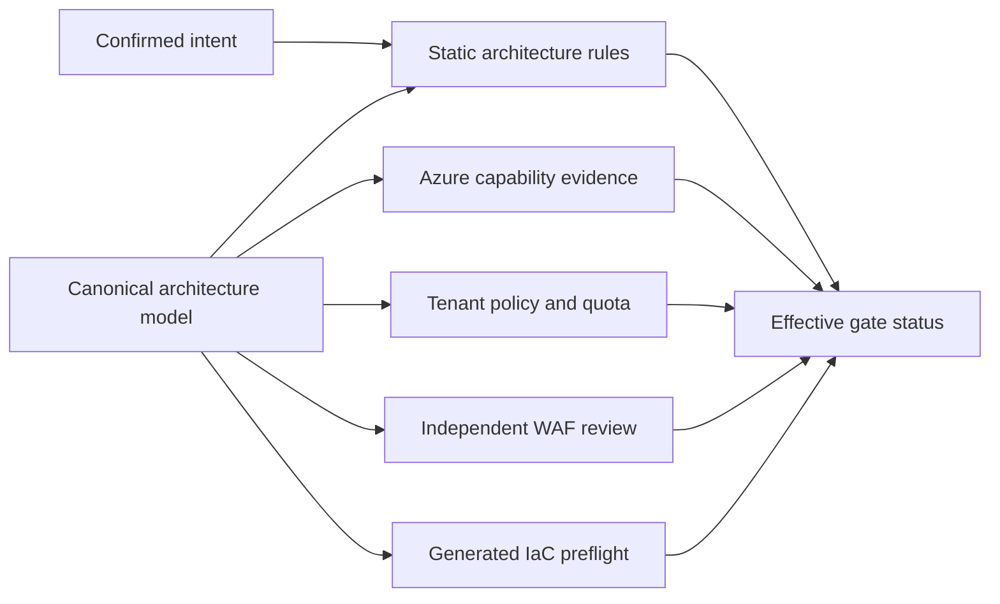
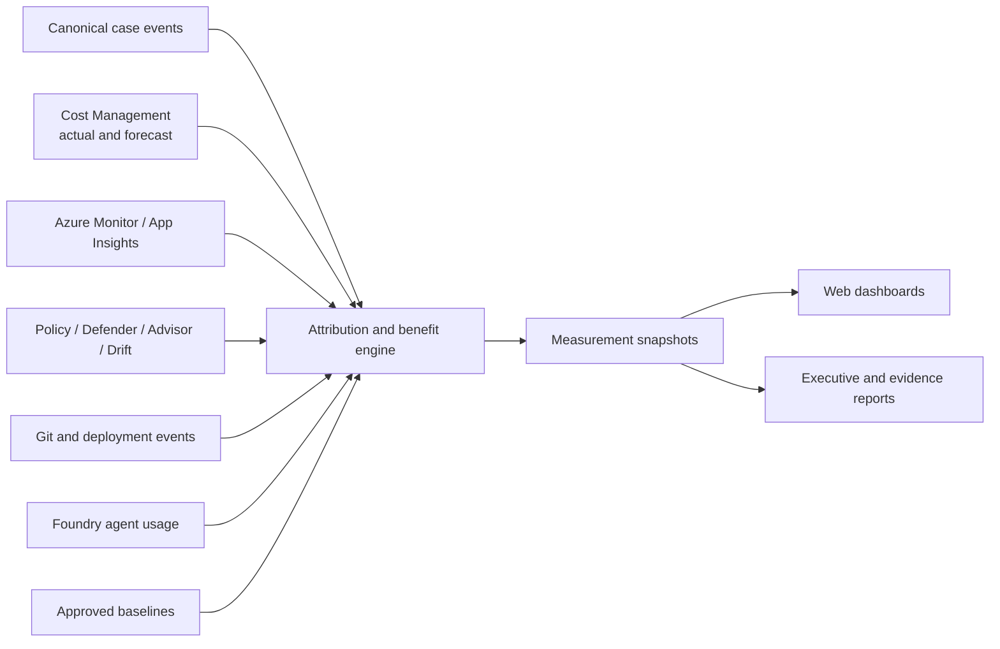
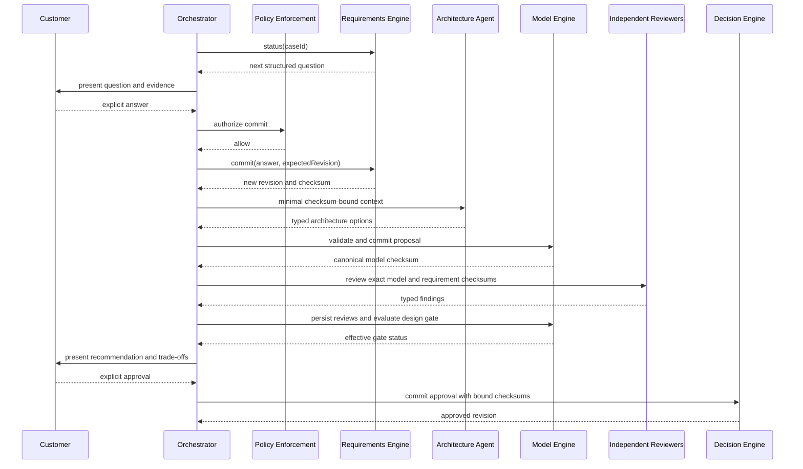

# Intent-to-Impact Detailed Design Specification

**From customer promise to verified Azure reality.**

Architecture-as-Code is the implementation principle; Intent Continuity is the
customer-facing value proposition.

**Current-state update: 2026-09-20.** The Studio supports local real-model
operation and a separately configured Azure Container Apps (ACA) hosting mode.
The verified public ACA judge deployment uses an explicitly labelled,
example-only simulation; it was verified on 2026-09-17 and is currently stopped.
Both modes retain real Bicep compilation and a manual Azure Portal handoff. The
hosted Studio is not a deployed customer workload or a completed
runtime-continuity platform.
Read [the implemented baseline](#11-implemented-current-baseline) before the retained
target architecture. Sections 3-28 preserve original requirements, IDs and future
acceptance criteria; they are **targets or historical planning**, not a completion
ledger. Only the bounded slice described below is validated.

## Table of contents

**UI builders:** Start with the [implemented current baseline](#11-implemented-current-baseline)
and [current user guide](./intent-to-impact-user-guide.md). For future work, use the
[prioritized customer journeys](#27-prioritized-customer-journeys-and-ui-contracts),
then the [Customer Promise Contract](#816-customer-promise-contract-and-intent-continuity),
[Intent Continuity Graph](#819-intent-continuity-graph),
[shared screens](#2711-shared-ui-screens-and-behavior),
[interaction contract](#2712-ui-interaction-and-outcome-contract), and
[demo acceptance matrix](#2713-demo-storyboard-and-acceptance-matrix).

- [1. Document status](#1-document-status)
  - [1.1 Implemented current baseline](#11-implemented-current-baseline)
  - [1.2 Validation and remaining boundary](#12-validation-and-remaining-boundary)
- [2. Executive summary](#2-executive-summary)
  - [2.1 Intent Continuity and differentiation](#21-intent-continuity-and-differentiation)
- [3. Goals and success measures](#3-goals-and-success-measures)
  - [3.1 Product goals](#31-product-goals)
  - [3.2 Target experience measures](#32-target-experience-measures)
- [4. Scope](#4-scope)
  - [4.1 In scope](#41-in-scope)
  - [4.2 Out of scope for the hackathon MVP](#42-out-of-scope-for-the-hackathon-mvp)
- [5. Design principles](#5-design-principles)
- [6. System context](#6-system-context)
  - [6.1 Primary actors](#61-primary-actors)
- [7. Logical architecture](#7-logical-architecture)
- [8. Component design](#8-component-design)
  - [8.1 Experience layer](#81-experience-layer)
  - [8.2 Experience API](#82-experience-api)
  - [8.3 Workflow orchestrator](#83-workflow-orchestrator)
    - [8.3.1 Microsoft Foundry runtime boundary](#831-microsoft-foundry-runtime-boundary)
    - [8.3.2 Why not the alternatives](#832-why-not-the-alternatives)
  - [8.4 Durable work queue](#84-durable-work-queue)
  - [8.5 Requirements engine](#85-requirements-engine)
  - [8.6 Customer context and evidence subsystem](#86-customer-context-and-evidence-subsystem)
  - [8.7 Specialist agents](#87-specialist-agents)
  - [8.8 Architecture model engine](#88-architecture-model-engine)
  - [8.9 Decision and approval engine](#89-decision-and-approval-engine)
  - [8.10 Deterministic review and gate engine](#810-deterministic-review-and-gate-engine)
    - [8.10.1 Azure architecture validation](#8101-azure-architecture-validation)
  - [8.11 Generation engine](#811-generation-engine)
  - [8.12 Runtime inventory and drift engine](#812-runtime-inventory-and-drift-engine)
  - [8.13 Runtime policy enforcement](#813-runtime-policy-enforcement)
  - [8.14 Canonical state and storage](#814-canonical-state-and-storage)
  - [8.15 Outcome reporting subsystem](#815-outcome-reporting-subsystem)
  - [8.16 Customer Promise Contract and Intent Continuity](#816-customer-promise-contract-and-intent-continuity)
  - [8.17 Historical Decision Awareness](#817-historical-decision-awareness)
  - [8.18 Partner Delivery Mode](#818-partner-delivery-mode)
  - [8.19 Intent Continuity Graph](#819-intent-continuity-graph)
- [9. Canonical artifacts](#9-canonical-artifacts)
  - [9.1 Artifact dependency chain](#91-artifact-dependency-chain)
  - [9.2 Common envelope](#92-common-envelope)
  - [9.3 Architecture model minimum shape](#93-architecture-model-minimum-shape)
  - [9.4 Generation manifest minimum shape](#94-generation-manifest-minimum-shape)
  - [9.5 Artifact ownership](#95-artifact-ownership)
  - [9.6 Runtime binding](#96-runtime-binding)
  - [9.7 Exception record](#97-exception-record)
  - [9.8 Benefit record](#98-benefit-record)
  - [9.9 Promise and evaluation contracts](#99-promise-and-evaluation-contracts)
- [10. Workflow state machine](#10-workflow-state-machine)
- [11. End-to-end interaction flows](#11-end-to-end-interaction-flows)
  - [11.1 Intent to approved design](#111-intent-to-approved-design)
  - [11.2 Approved design to pull request](#112-approved-design-to-pull-request)
  - [11.3 Runtime drift to remediation pull request](#113-runtime-drift-to-remediation-pull-request)
- [12. Command and API contracts](#12-command-and-api-contracts)
- [13. Concurrency, idempotency, and atomicity](#13-concurrency-idempotency-and-atomicity)
- [14. Security and trust model](#14-security-and-trust-model)
  - [14.1 Identity and authorization](#141-identity-and-authorization)
  - [14.2 Secret handling](#142-secret-handling)
  - [14.3 Prompt injection controls](#143-prompt-injection-controls)
  - [14.4 Tenant and data isolation](#144-tenant-and-data-isolation)
  - [14.5 Threats and mitigations](#145-threats-and-mitigations)
  - [14.6 Evidence freshness](#146-evidence-freshness)
- [15. Observability, audit, and evaluation](#15-observability-audit-and-evaluation)
  - [15.1 Distributed tracing](#151-distributed-tracing)
  - [15.2 Metrics](#152-metrics)
  - [15.3 Audit event](#153-audit-event)
  - [15.4 Agent quality evaluation](#154-agent-quality-evaluation)
  - [15.5 Outcome reporting and value realization](#155-outcome-reporting-and-value-realization)
  - [15.6 Promise Coverage and Customer Outcome Receipt](#156-promise-coverage-and-customer-outcome-receipt)
  - [15.7 Human Attention](#157-human-attention)
- [16. Failure handling and recovery](#16-failure-handling-and-recovery)
- [17. Reference deployment topology](#17-reference-deployment-topology)
- [18. Repository layout](#18-repository-layout)
- [19. Testing strategy](#19-testing-strategy)
  - [19.1 Contract tests](#191-contract-tests)
  - [19.2 Engine tests](#192-engine-tests)
  - [19.3 Policy tests](#193-policy-tests)
  - [19.4 End-to-end conformance scenarios](#194-end-to-end-conformance-scenarios)
  - [19.5 Golden artifacts](#195-golden-artifacts)
  - [19.6 Azure validation tests](#196-azure-validation-tests)
  - [19.7 Reporting tests](#197-reporting-tests)
  - [19.8 Customer-journey UI tests](#198-customer-journey-ui-tests)
  - [19.9 Promise-led experience tests](#199-promise-led-experience-tests)
- [20. Hackathon MVP](#20-hackathon-mvp)
  - [20.1 MVP scenario](#201-mvp-scenario)
  - [20.2 MVP capabilities](#202-mvp-capabilities)
  - [20.3 MVP technology decisions](#203-mvp-technology-decisions)
  - [20.4 Demo-critical deterministic policies](#204-demo-critical-deterministic-policies)
  - [20.5 Demo narrative](#205-demo-narrative)
  - [20.6 Consequential disagreement and visible personalization](#206-consequential-disagreement-and-visible-personalization)
  - [20.7 Before versus with Intent-to-Impact](#207-before-versus-with-intent-to-impact)
  - [20.8 Live proof and safe sandbox requirements](#208-live-proof-and-safe-sandbox-requirements)
- [21. Production evolution](#21-production-evolution)
  - [Phase 1: Hackathon governed workflow](#phase-1-hackathon-governed-workflow)
  - [Phase 2: Shared control plane](#phase-2-shared-control-plane)
  - [Phase 3: Runtime reconciliation](#phase-3-runtime-reconciliation)
  - [Phase 4: Enterprise scale](#phase-4-enterprise-scale)
- [22. Risks and trade-offs](#22-risks-and-trade-offs)
- [23. Acceptance criteria](#23-acceptance-criteria)
- [24. Open design decisions](#24-open-design-decisions)
- [25. Mapping to the governed agentic foundation](#25-mapping-to-the-governed-agentic-foundation)
- [26. Definition of done for each capability](#26-definition-of-done-for-each-capability)
- [27. Prioritized customer journeys and UI contracts](#27-prioritized-customer-journeys-and-ui-contracts)
  - [27.1 Selection against the challenge](#271-selection-against-the-challenge)
  - [27.2 Prioritized use-case register](#272-prioritized-use-case-register)
  - [27.3 UC-01: Launch a customer workload with confidence](#273-uc-01-launch-a-customer-workload-with-confidence)
  - [27.4 UC-02: Protect customer trust when runtime drifts](#274-uc-02-protect-customer-trust-when-runtime-drifts)
  - [27.5 UC-03: Reduce spend without breaking customer promises](#275-uc-03-reduce-spend-without-breaking-customer-promises)
  - [27.6 UC-04: Onboard an existing estate without starting over](#276-uc-04-onboard-an-existing-estate-without-starting-over)
  - [27.7 UC-05: Adapt to a changed customer requirement](#277-uc-05-adapt-to-a-changed-customer-requirement)
  - [27.8 UC-06: Prepare for a critical business event](#278-uc-06-prepare-for-a-critical-business-event)
  - [27.9 UC-07: Resolve a blocked decision with accountable collaboration](#279-uc-07-resolve-a-blocked-decision-with-accountable-collaboration)
  - [27.10 UC-08: Prove value and hand over with evidence](#2710-uc-08-prove-value-and-hand-over-with-evidence)
  - [27.11 Shared UI screens and behavior](#2711-shared-ui-screens-and-behavior)
  - [27.12 UI interaction and outcome contract](#2712-ui-interaction-and-outcome-contract)
  - [27.13 Demo storyboard and acceptance matrix](#2713-demo-storyboard-and-acceptance-matrix)
- [28. Feedback incorporation and scope decisions](#28-feedback-incorporation-and-scope-decisions)
  - [28.1 Reassessment decisions](#281-reassessment-decisions)

## 1. Document status

| Field | Value |
| --- | --- |
| Status | Published design reference: implemented local and ACA-hosted Studio slice plus retained target architecture |
| Current-state date | 2026-09-20; historical requirements have not all been re-audited |
| Product | Intent-to-Impact |
| Positioning | From customer promise to verified Azure reality |
| Differentiator | Intent Continuity |
| Implementation principle | Architecture-as-Code |
| Primary audience | Hackathon builders, architects, platform engineers, security reviewers, and judges |
| Foundation | Historical `_bkp\generic-governed-agentic-pattern.md` (local-only, not published) |
| Target experience | Capture customer promises, implement them through approved Azure architecture, and verify them against scoped runtime evidence |
| Delivery model | Human-led, agent-operated |

### 1.1 Implemented current baseline

The current product is a React `StudioApp` with a FastAPI backend and file-backed
jobs/results. Default local mode binds to loopback and uses the existing Foundry
`gpt-5.2` deployment through
**two local Microsoft Agent Framework roles and separate calls: architecture
synthesis, then independent assurance**. It does not deploy three Prompt Agent
specialists or a Foundry Hosted Orchestrator. Here, independent assurance means a
separate model call and responsibility, not a different deployed model or human.

The same application can run in ACA only through explicit hosted configuration.
The retained ACA deployment hosts the **Studio**, with mounted persistent state,
a pinned Linux Bicep compiler, a single writer and either Entra authentication or
explicit anonymous-demo access. The currently deployed judge configuration is
public and simulated: it accepts only the unchanged built-in example, returns
authored synthesis/review/revision data, makes no Foundry calls, and isolates
history by browser session. It is currently stopped. Local mode remains live-model
mode; simulation is rejected outside ACA and is never an error fallback.

| Implemented surface | Current behavior and boundary |
| --- | --- |
| Business intent and source-grounded analysis | Real inputs produce alternatives and separately reviewed findings. Strict per-request output schemas plus runtime source/graph checks reject malformed or ungrounded output. Existing external systems bind to literal source text, not guessed Azure services. Prompts include concrete component-ID examples. |
| Studio inspection and topology | Alternatives and source inspection are live. Dagre layout, Re-layout, direction, Expand and Fit retain the complete node set; presentation changes do not remove architecture components. The old `/draft` route opens the live Studio, not a second manual-only product. |
| Contextual revision | **Request recommended change** and **Challenge** carry the selected option and exact finding into explicit revision-only approval. The server-fixed `demo-human` receipt binds parent result ID/hash, option and finding. A fresh synthesis and separate assurance run produce a new immutable result; the parent stays intact. This is not a risk waiver, final design signoff or build gate. |
| Workspace history | Shared workspace history is opt-in; the default remains session-private. Opted-in history retains approvals, failures and deployment packages alongside results. Reopening evidence is not a fresh model execution or verified production identity. |
| Deterministic package generation | A bounded Bicep catalog renders the selected topology, runs the actual compiler and produces an eight-file ZIP. Selected-only guards prevent an unselected duplicate from blocking a valid option. Queue-edge direction determines permissions. This is infrastructure preparation, not business-code generation or Azure creation. |
| **Deploy to Azure** | Verified-file and required-parameter checks precede a **manual Portal handoff only**. The user must inspect the package, supply real values and complete Azure-side review. Opening the Portal does not upload the template, create resources or prove deployment. |
| ACA-hosted judge Studio | The public simulation was verified end to end with scripted revisions, Linux Bicep compilation, session-private history and restart recovery. Simulated architecture/review data is labelled in the UI and package. ACA hosting costs remain; Foundry inference does not occur in this mode. |

The local product has no GitHub branch/PR/publishing workflow. That product boundary
does **not** prohibit developers from publishing this repository to GitHub `main`;
repository publication is separate from an in-product delivery or deployment receipt.
See the [technical deep dive](./intent-to-impact-technical-deep-dive.md) for the
implemented runtime and the [current user guide](./intent-to-impact-user-guide.md)
for the active workflow boundary.

### 1.2 Validation and remaining boundary

The reported implementation validation below includes fresh publication verification
and earlier bounded proofs; these commands and live calls were **not rerun by this
documentation edit**.
The counts describe targeted suites, not a claimed full-suite total or acceptance of
all original tasks and milestones.

| Reported evidence | Validated scope |
| --- | --- |
| Current publication frontend verification: 89 tests across 6 files passed | `npm run check:studio`, TypeScript typecheck and `npm test -- src/AppRoutes.test.tsx src/studio` passed; `npm run build` also passed |
| Earlier 59 frontend/client/deploy-handoff tests | Historical focused subset, not additive to the current 89-test result |
| 25 bundle tests, including 3 real compiler tests | Deterministic package generation and actual compilation |
| 19 model-validation tests | Structured model output and source/graph validation |
| 16 approval tests | Bounded revision approval behavior |
| Real Playwright: original `Order fulfilment-#1`, `opt-a` | Two distinct compiles, SHA-verified eight-file downloads, history recovery and actual Portal navigation; no template upload or resource creation |
| Real recommendation and challenge journeys | Both business recommendation and challenge ran fresh synthesis plus separate assurance, then produced compiled downloads |
| ACA public judge verification, 2026-09-17 | Example-only simulated generation and both scripted revisions, real Linux Bicep compilation, eight-file ZIP hashes, visitor isolation, and saved-run/package recovery after a cold restart; no Foundry calls |

ACA resource creation and operation verify hosting of the Studio only. Actual
creation of a **generated customer workload** was not executed or verified. Its target environment,
real Entra identity, external-system values, and final resource/cost approval remain
outstanding. Runtime drift detection/restoration, promise-coverage and outcome/attention
metrics, and full original policy/work-engine integration remain roadmap work or
separate proofs, not demonstrated capabilities of this Studio flow. A compiled bundle,
revision receipt, package history entry or Portal tab cannot satisfy those gates.

## 2. Executive summary

**Current implementation priority:** preserve and harden the validated business-first
Studio -> independent review -> approved revision -> compiled package -> manual Portal
handoff. The frontend is connected to real backend/model execution, not merely a
manually selected reference-pattern mock. Resolve the explicit deployment prerequisites
before any separately authorized creation; do not expand runtime claims from package
or browser evidence.

**Longer-term product vision:** Intent-to-Impact is a human-led, agent-operated system that turns customer promises into
approved Azure architecture and continually checks whether implementation and runtime
evidence still support those promises. Architecture-as-Code provides the underlying
machine-readable contracts, versioning, and deterministic enforcement.

The customer moment being transformed is:

> Contoso Insurance promised to launch digital claims before hurricane season. Can
> customers submit sensitive documents privately, recover service within one hour,
> and stay inside the approved budget? After launch, are those promises still being kept?

Contoso and the event are a fictional demo scenario, not a real customer or deployment.
The concrete problem is repeated rediscovery: customer decisions are re-explained,
re-reviewed and re-approved across teams, then allowed to diverge from production.
The product keeps the contract active across the lifecycle instead of ending at a diagram.

The target architecture provides one guided web experience backed by agents deployed to Microsoft
Foundry Agent Service and by separate deterministic engines. Foundry agents interpret
intent, generate options, explain trade-offs, and propose remediation. Deterministic
code validates schemas, evaluates non-negotiable policy, controls state transitions,
generates artifacts, and records evidence. Humans remain accountable for material
decisions, exceptions, and production changes.

The governing principle inherited from the generic governed agentic pattern is:

> **Models propose and coordinate. Deterministic code validates and records. Independent
> policy enforcement decides whether an action may run.**

The remaining specification defines the target plumbing needed to make that principle operational.
The [customer journey catalog](#27-prioritized-customer-journeys-and-ui-contracts)
defines the inputs, interactions, screens, and evidenced outcomes that the web UI must
make visible.

### 2.1 Intent Continuity and differentiation

**Target-vision 15-second pitch (not a current runtime claim)**

> Intent-to-Impact turns customer promises into a live contract that agents translate
> into approved Azure changes and continuously verify. When reality stops matching the
> promise, it detects the change, prepares the correction, and brings the human in when
> a decision is required.

Implementation and deployment follow the recorded approval boundaries; the pitch does
not imply that agents have direct production deployment authority.

**Intent Continuity:** Every confirmed customer promise remains traceable through
requirements, decisions, architecture, validated artifacts, acknowledged deployment,
runtime evidence, and measured outcomes. Missing links stay visible; the system never
treats a proposed design as a delivered customer outcome.

```text
Customer promise -> Decision -> Architecture -> Assurance -> Implementation
                 -> Acknowledged deployment -> Runtime evidence -> Outcome receipt
```

The comparison below is to a chat-only assistant baseline, not a claim that every Copilot
or competing agent lacks these capabilities.

| Chat-only assistant interaction | Intent-to-Impact experience |
| --- | --- |
| Answers a question about architecture | Operates a bounded lifecycle against a confirmed promise contract |
| Relies on conversational context | Reloads durable customer decisions and checksum-bound state |
| Suggests code or policy changes | Validates artifacts and rejects disallowed actions outside model control |
| Waits for the next user prompt | Observes an authorized scope and prepares corrective work proactively |
| Describes recommendations | Captures explicit, version-bound human decisions |
| Ends after generation | Tracks deployment and later verifies scoped runtime evidence |
| Describes possible value | Issues a reproducible Customer Outcome Receipt with unresolved outcomes |

**How this complements Microsoft's existing building blocks**

| Existing capability | Its responsibility | Intent-to-Impact adds |
| --- | --- | --- |
| Azure Well-Architected Framework | Architecture guidance and review criteria | Findings bound to the customer's confirmed promises |
| Azure Policy | Resource governance and enforcement | Promise/decision lineage for policy results; no bypass or replacement |
| GitHub Copilot | Code assistance | Approved-contract inputs, deterministic artifact gates and accountable publication |
| Bicep and what-if | Infrastructure definition and preflight | Binding from promise through generated resource to deployment evidence |
| Azure Resource Graph | Resource inventory | Comparison with the exact approved deployed baseline |
| Microsoft Defender for Cloud | Security posture and findings | Customer-impact context and promise-linked remediation workflow |
| Microsoft Foundry | Model and agent runtime | The governed lifecycle and application-specific continuity contract |

The differentiation is the **continuity layer across these capabilities**, not a
replacement for them or a claim that they cannot be integrated by another system.
No additional Azure connector is required merely to display this comparison.

The MCAPS value proposition is faster responsible Azure adoption: reduce time to a
validated architecture and PR, remove evidenced deployment blockers, and help customers
use approved Azure services without weakening their commitments. Cost savings are one
outcome, not the only outcome. A generated PR is not Azure consumption or recognized
revenue; actual adoption requires deployment and usage evidence.

## 3. Goals and success measures

### 3.1 Product goals

1. Capture business and operational intent through a low-friction guided experience.
2. Personalize recommendations using the customer's estate, standards, risk appetite,
   budget, regulatory obligations, and approved technology catalog.
3. Generate multiple architecture options with explicit cost, security, reliability,
   operational, and delivery trade-offs.
4. Record approved decisions and ADRs as versioned, checksum-bound canonical state.
5. Generate deployable IaC, policy, observability, and pipeline artifacts only from an
   approved architecture contract.
6. Compare runtime state with approved architecture and identify meaningful drift.
7. Route consequential decisions to humans while autonomously performing safe,
   pre-authorized work.
8. Preserve a complete, auditable chain of custody from requirement to runtime finding.
9. Make each customer's promise, historical decision, and current verification state
   visible to the customer and authorized delivery partner.
10. End the hero journey with an evidence-backed Customer Outcome Receipt, not a generic
    completion message or a dashboard of agent activity alone.

### 3.2 Target experience measures

| Measure | Prototype target |
| --- | --- |
| Time from submitted intent to reviewable architecture | Under 15 minutes |
| Time from approval to generated implementation pull request | Under 5 minutes |
| Required architecture handoffs | One coordinated approval experience |
| Policy findings with evidence and remediation | 100% |
| Generated files traceable to approved inputs | 100% |
| Material decisions with explicit human approval | 100% |
| Time to detect seeded runtime drift | Under 5 minutes |
| Unauthorized or stale mutation attempts rejected | 100% |
| Confirmed promises with inspectable requirement-to-evidence lineage | 100%; missing evidence explicitly reported |
| Customer Promise Coverage | Verified count / applicable confirmed count, by phase, scope, window, and evidence mode; not an AI score |
| Responsible adoption outcomes | Measured time to validated PR, resolved deployment blockers, acknowledged deployments, and observed service usage |

These are prototype targets, not production service-level objectives.

## 4. Scope

### 4.1 In scope

- Structured capture of business, architecture, security, reliability, cost, and
  operational requirements.
- Customer-context ingestion through explicitly authorized, read-only evidence adapters.
- Generation and comparison of architecture options.
- ADR generation and explicit decision capture.
- Deterministic validation against schemas, standards, compatibility rules, and policy.
- Independent architecture, security, reliability, and cost review.
- Human approval and exception handling.
- Generation of Bicep or Terraform, Azure Policy assignments, observability
  configuration, and CI/CD workflow artifacts.
- Pull-request-based publication.
- Read-only collection of deployed Azure state.
- Architecture drift detection, classification, and remediation proposal generation.
- Audit, provenance, resumability, and stale-artifact detection.
- Customer Promise Contract, phase-specific Promise Coverage, and Customer Outcome Receipt.
- Bounded historical-decision retrieval and customer-controlled partner access.

### 4.2 Out of scope for the hackathon MVP

- Unsupervised production deployment.
- Unsupervised remediation of high-risk runtime drift.
- Full support for every Azure service and architecture pattern.
- Replacement of enterprise architecture, security, or change-management accountability.
- Bidirectional editing between Markdown diagrams and canonical architecture state.
- Storage of raw customer documents in the project repository.
- Automatic acceptance of policy exceptions.
- A general-purpose conversational assistant unrelated to the active architecture case.
- Historical decision awareness, partner delivery, catalog-change replay and deep
  exception workflows as required P0 features. Their specifications are retained for
  P1 implementation and optional Q&A only when actually implemented and validated.
- A separate partner-hosted, cross-tenant control plane or broad access to customer history.
- Runtime verification without matching evidence, guarantees of continuous compliance,
  or financial claims inferred solely from a generated architecture.

## 5. Design principles

1. **Customer intent is the root contract.** Every recommendation and generated artifact
   must be traceable to a confirmed requirement, approved default, or recorded exception.
2. **One canonical source of truth.** JSON state is authoritative; Markdown, diagrams,
   code, and reports are projections.
3. **Agent output is untrusted input.** A model can propose but cannot directly commit
   canonical state or bypass validation.
4. **Deterministic controls enforce non-negotiables.** Security, schema, checksum,
   compatibility, and authorization rules run outside model control.
5. **Approval is a state transition.** Friendly conversational language is never treated
   as approval.
6. **Least privilege by task.** Each agent receives only the context and tools needed for
   one bounded responsibility.
7. **Evidence is not instruction.** Retrieved content is normalized, attributed, and
   treated as potentially untrusted.
8. **Fail closed for governed actions.** Missing identity, malformed state, stale
   revisions, incomplete evidence, or ambiguous policy prevents mutation.
9. **Capability-specific blocking.** An unresolved item blocks only the outputs that
   depend on it.
10. **No invisible repair.** Invalid state produces a visible error and recovery path.
11. **Pull requests are the default delivery boundary.** Generated implementation and
    remediation changes are reviewed before merge.
12. **Runtime autonomy is risk-tiered.** Observation can be autonomous; material changes
    require human approval.

## 6. System context



### 6.1 Primary actors

| Actor | Responsibility |
| --- | --- |
| Requestor | States the business outcome and supplies customer-specific constraints |
| Accountable architect | Approves architecture decisions, exceptions, and material changes |
| Security approver | Approves security exceptions where required |
| Platform owner | Maintains standards, templates, policy packs, and deployment boundaries |
| Agent orchestrator | Coordinates the experience and presents authoritative next actions |
| Specialist agents | Perform bounded analysis and return typed proposals |
| Deterministic engines | Own validation, state transitions, generation, and durable writes |
| Independent reviewer | Can block a gate but cannot modify reviewed artifacts |

## 7. Logical architecture

**Target architecture:** this diagram is not the deployed topology. The implemented
local topology is React/FastAPI, file-backed jobs/results and two local Agent Framework
roles calling the existing Foundry model; see section 1.1.



## 8. Component design

### 8.1 Experience layer

The experience layer may be implemented as a web application, Teams application, or
Copilot surface. It must not contain workflow truth.

Responsibilities:

- Authenticate the user with Microsoft Entra ID.
- Create or reopen an architecture case.
- Render questions returned by the requirements engine.
- Display recommendations, alternatives, evidence, findings, and approvals.
- Require deliberate confirmation for approval actions.
- Display current revision, gate status, stale artifacts, and pending work.
- Stream long-running progress without representing progress events as committed state.

The client sends an idempotency key on every mutation and includes the latest known
logical revision. It reloads status after any conflict.

The browser does not call a model or Foundry project endpoint directly. It calls the
Experience API and receives a relayed server-sent event stream. This keeps Foundry
project authorization, case binding, policy enforcement, and audit correlation in the
trusted backend.

### 8.2 Experience API

The API is the trusted network boundary for user actions.

Responsibilities:

- Validate identity and tenant context.
- Resolve roles and case-level authorization.
- Validate request schema and request size.
- Bind user identity to approval and exception records.
- Apply throttling and correlation IDs.
- Invoke the runtime policy enforcement point before governed actions.
- Invoke the Microsoft Foundry Hosted Orchestrator through the Foundry Responses API.
- Relay response events to the browser and persist the case-to-conversation mapping.
- Dispatch explicit approval and administrative commands directly to deterministic
  engines after policy evaluation; conversational work always enters through Foundry.
- Return engine status without inventing success-shaped fallback responses.

The API does not call model deployment endpoints directly. It invokes a named, versioned
Foundry agent. Foundry conversation and response identifiers are interaction state, not
canonical architecture state.

### 8.3 Workflow orchestrator

**Target/historical design below.** Current orchestration is local, with synthesis
and separate assurance calls; no Hosted Orchestrator, hosted sessions or deployed
Prompt Agent specialists are claimed. This local product choice is not contingent on
proving Hosted Agent unavailability.

There is one user-facing orchestrator for the end-to-end case. It is custom Python code
implemented with Microsoft Agent Framework and deployed as a Microsoft Foundry Hosted
Agent. The web application invokes its Foundry endpoint through the backend API.

Responsibilities:

- Call `case status` before selecting the next action.
- Present only actions currently allowed by the deterministic state machine.
- Convert conversational input into a typed proposal for engine validation.
- Delegate bounded tasks using minimal context packets.
- Correlate asynchronous work with the originating case and revision.
- Surface errors, policy denials, and unresolved decisions.
- Resume from canonical state after process or session interruption.

Prohibitions:

- No direct writes to canonical state or generated outputs.
- No implicit approval.
- No secret retrieval unless a capability explicitly requires it.
- No deployment, merge, or exception approval authority.
- No use of chat history as the system of record.

#### 8.3.1 Microsoft Foundry runtime boundary

The agent topology uses two Foundry agent types:

| Role | Foundry type | Reason |
| --- | --- | --- |
| User-facing orchestrator | Hosted Agent | Requires custom Agent Framework orchestration, structured engine calls, streaming, background execution, reconnectable sessions, and explicit error handling |
| Architecture synthesis | Prompt Agent | Bounded schema-constrained reasoning over a supplied context packet |
| Independent assurance | Prompt Agent | Isolated instructions and no artifact write path |
| Implementation and remediation planning | Prompt Agent | Produces typed plans; the deterministic generation engine writes files |

All four are named, versioned assets in one Microsoft Foundry project. Prompt agents are
private implementation dependencies: only the Hosted Orchestrator's managed identity and
authorized operators may invoke them. They are not exposed to the browser.

The Hosted Orchestrator uses the **Responses** protocol because the web experience needs
multi-turn conversations, streaming, and optional background execution. The Experience
API maps:

```text
tenantId + userObjectId + caseId
    -> orchestrator agent name and immutable version
    -> Foundry conversationId
    -> active responseId, if any
```

This mapping is stored in the control-plane database. A conversation can be replaced or
deleted without losing the architecture case. On every turn, the orchestrator reloads
authoritative case status through the deterministic API instead of trusting conversation
history.

The Hosted Orchestrator invokes specialists through Microsoft Foundry Agent Service using
their immutable agent versions. It sends the minimal typed delegation packet and accepts
only schema-constrained results. Specialist outputs are returned to the appropriate
deterministic engine for validation and commit.

Deterministic engines, policy evaluation, canonical state, queues, Git operations, and
Azure evidence adapters do **not** run as LLM agents. They run as normal Azure services
behind a private control-plane API. The Hosted Orchestrator calls only narrow operations
such as:

```text
GET  /cases/{caseId}/status
POST /cases/{caseId}/requirements/proposals
POST /cases/{caseId}/design/proposals
POST /cases/{caseId}/reviews
POST /cases/{caseId}/generation-jobs
GET  /cases/{caseId}/work/{workItemId}
```

Every mutating call requires the user/case delegation context, expected revision,
idempotency key, and input checksums. The Foundry agent identity authorizes service
access but does not grant approval authority. Human approvals use the authenticated
user identity captured by the Experience API.

Foundry-managed session files and conversation history may cache temporary working data
but never hold the only copy of a requirement, approval, generated artifact, or audit
record. Durable state remains in the control plane.

#### 8.3.2 Why not the alternatives

| Option | Assessment |
| --- | --- |
| Agent Framework hosted only in Container Apps | Technically viable, but the team must own agent endpoint conventions, session lifecycle, scaling, agent identity, version rollout, and agent observability. Use only if Hosted Agent regional availability or a required runtime capability blocks Foundry. |
| Foundry Prompt Agent as the orchestrator | Too restrictive for the custom state machine, deterministic engine protocol, retries, and long-running workflow coordination. Prompt Agents remain appropriate for bounded specialists. |
| Copilot Studio as the primary runtime | Strong for low-code channels and connectors, but less suitable for this code-first, checksum-bound orchestration and artifact-generation workflow. It may be added later as a channel that calls the API. |
| Browser calling Foundry directly | Rejected because it weakens case authorization, tool mediation, audit correlation, throttling, and secret isolation. |

The original target default was therefore **Foundry Hosted Orchestrator plus Foundry Prompt
Agent specialists**, with deterministic control-plane services outside the agent
runtime.

Before provisioning, confirm that Hosted Agents, the selected model, and required model
quota are available in a region compatible with the customer's data-residency policy.
Hosted Agent compute is billed per active session and each session receives its own
sandbox, so load tests must measure cold-start behavior, concurrency, and per-session
CPU and memory cost.

Use Agent Framework on Azure Container Apps as the fallback only when:

- Hosted Agents are unavailable in the required region;
- a required language or runtime is unsupported by Hosted Agents;
- a network or compliance constraint cannot be satisfied by the selected Foundry
  project configuration; or
- measured per-session economics are materially worse than a pooled Container Apps
  runtime.

The fallback preserves the Responses-compatible web contract, agent version contract,
typed delegation packets, and deterministic control-plane API so the UI and engines do
not need to change.

Implementation references:

- [Hosted agents in Microsoft Foundry](https://learn.microsoft.com/azure/foundry/agents/concepts/hosted-agents)
- [Foundry Agent Service runtime components](https://learn.microsoft.com/azure/foundry/agents/concepts/runtime-components)

### 8.4 Durable work queue

Long-running specialist work, generation, validation, evidence retrieval, and runtime
inventory collection use durable commands.

Each work item contains:

```json
{
  "workItemId": "WORK-01J...",
  "caseId": "CASE-01J...",
  "command": "synthesize-architecture-options",
  "requestedRevision": 12,
  "inputChecksums": {
    "requirements": "sha256:..."
  },
  "requestedBy": "object-id",
  "correlationId": "CORR-01J...",
  "attempt": 1,
  "notBefore": "2026-09-12T17:00:00Z"
}
```

Consumers are idempotent. A completed work item with identical input checksums returns
its existing result. `requestedRevision` records when work began but does not by itself
invalidate long-running work. Before commit, the owning engine compares the work item's
`inputChecksums` with current canonical inputs. Unrelated case changes do not invalidate
the result; a changed dependency rejects the commit as `stale-input`.

Workers retry transient model, network, and provider failures up to three times with
exponential backoff of 5, 20, and 60 seconds. Validation, authorization, stale-input,
and policy failures are not retried. Exhausted items move to a dead-letter queue with
their metadata and error code but without prompt or evidence bodies.

### 8.5 Requirements engine

The requirements engine owns `requirements.json`, the customer-confirmed promise
contract, and their human-readable projections. Promise assertions reference confirmed
requirements; they are not a competing requirements source.

It:

- Determines which question is valid next.
- Validates answers against type, allowed values, and compatibility rules.
- Records source as user-confirmed, evidence-backed, policy-default, or exception.
- Tracks unresolved and deferred decisions.
- Computes capability-specific completeness.
- Never guesses environment identifiers, security classifications, or approval values.

Requirement domains for the MVP:

- Business outcome and workload criticality
- Users, channels, and expected demand
- Data classification and residency
- Identity and access
- Availability, RTO, and RPO
- Integration dependencies
- Budget and cost sensitivity
- Operational ownership
- Regulatory and enterprise policy packs
- Deployment environments and regions

### 8.6 Customer context and evidence subsystem

Read-only adapters retrieve narrowly scoped customer context:

- Approved Azure services and reference architectures
- Existing subscriptions, resource groups, networks, and shared services
- Enterprise policies and exemptions
- Security and compliance requirements
- CMDB or service catalog entries
- Cost and usage data
- Repository standards and reusable modules
- Runtime resource inventory and telemetry
- Authorized historical decision records with the constraints and rationale at decision time

Raw evidence is stored in a private, access-controlled cache with a short retention
period. Canonical state stores minimized evidence records:

```json
{
  "evidenceId": "EVIDENCE-023",
  "sourceType": "azure-resource-graph",
  "sourceScope": "/subscriptions/<redacted>",
  "retrievedAt": "2026-09-12T17:01:12Z",
  "contentChecksum": "sha256:...",
  "supportsClaims": [
    "CLAIM-007"
  ],
  "freshUntil": "2026-09-12T18:01:12Z",
  "classification": "customer-confidential"
}
```

Retrieved text is never inserted into a system prompt as trusted instruction. Adapters
normalize values into typed records and remove embedded instructions.

### 8.7 Specialist agents

The roles below retain the original separation target. The implemented Studio uses
only synthesis and assurance as local Agent Framework roles. Generation is deterministic;
contextual revisions reuse those two roles, not a third implementation/remediation agent.

The roles below are logical responsibilities. In the MVP they are implemented by three
private, versioned Microsoft Foundry Prompt Agents: architecture synthesis also performs
customer-context interpretation; independent assurance runs separate security,
reliability, and cost modes; implementation planning also handles remediation planning.
The separate logical contracts prevent context and authority from being combined even
when one deployed agent version supports several modes.

#### Customer context agent

- Converts authorized evidence records into a customer profile proposal.
- Identifies contradictions, missing context, and stale evidence.
- Has read-only access to approved evidence adapters.

#### Architecture options agent

- Produces two or three viable architecture options.
- Maps each component to confirmed requirements.
- Explains trade-offs and assumptions.
- Cannot approve a recommendation or write canonical state.

#### Security review agent

- Reviews the exact architecture model checksum.
- Identifies threat scenarios, control gaps, and exception candidates.
- Uses approved security standards and evidence only.

#### Reliability review agent

- Tests the model against availability, RTO, RPO, capacity, dependency, and operational
  requirements.
- Identifies single points of failure and recovery assumptions.

#### Cost review agent

- Evaluates major cost drivers, budget alignment, and lower-cost alternatives.
- Distinguishes measured prices from estimates and records pricing timestamps.

#### Implementation planning agent

- Maps approved logical components to approved modules, policy assignments,
  observability controls, and pipeline stages.
- Produces a generation proposal, not files.

#### Remediation agent

- Converts a validated drift finding into one or more remediation options.
- Explains blast radius, rollback, and required approval tier.
- Cannot directly change the runtime environment.

All specialists return schema-constrained output with assumptions, gaps, and provenance.

### 8.8 Architecture model engine

The model engine owns `architecture-model.json` and architecture projections. The
decision engine exclusively owns canonical ADR records; the model engine may render
read-only ADR Markdown from those records.

It validates:

- Every component has a stable identifier and type.
- Every requirement is satisfied, explicitly deferred, or associated with a finding.
- Every external dependency has an owner and trust boundary.
- Region, identity, network, data, and service combinations are compatible.
- Selected services exist in the approved technology catalog.
- Assumptions are explicit and do not masquerade as confirmed facts.
- Proposed ADRs reference the options considered and applicable requirements.

It recalculates coverage and risk scores deterministically. Model-generated prose is
stored only as explanatory projection text after sanitization and size limits.

### 8.9 Decision and approval engine

**Current boundary:** the Studio's approval authorizes only an exact contextual
revision, bound to the parent result/hash, selected option and finding. The broader
decision classes and lifecycle below are retained targets, not authority granted by
that revision receipt. No risk waiver, final design signoff or build/deployment gate
is satisfied by clicking Request recommended change or Challenge.

This engine owns decisions, approvals, deferrals, and exceptions.

Decision classes:

- `closed-choice`
- `recommended-default`
- `operator-input`
- `exception`
- `deferred`

Approval tiers:

| Tier | Example | Required approver |
| --- | --- | --- |
| A0 | Read evidence, run validation, render a report | None |
| A1 | Accept a reversible recommendation before generation | Requestor or architect |
| A2 | Approve target architecture or implementation PR | Accountable architect |
| A3 | Accept policy exception or material security risk | Architect plus designated control owner |
| A4 | Merge or deploy to production | Existing organizational change authority |

The engine records approver object ID, tenant ID, time, case revision, exact artifact
checksums, decision, and rationale. Approval becomes stale when any bound checksum
changes.

Exceptions are durable, expiring decisions. An exception must identify the violated
rule, business rationale, compensating controls, accountable owner, required approval
tier, exact artifact checksums, effective time, and expiration time. Expired exceptions
immediately return dependent gates to `blocked` until renewed or removed.

### 8.10 Deterministic review and gate engine

Named gates:

1. `requirements-ready`
2. `design-ready`
3. `generation-ready`
4. `delivery-ready`
5. `operation-ready`
6. `remediation-ready`

Each gate combines:

- `deterministicStatus`: schema, policy, checksum, compatibility, and validator results.
- `inferenceStatus`: findings from independent specialist review.
- `effectiveStatus`: the worse of the two.

Allowed values are `pass`, `pass-with-warnings`, `blocked`, and `stale`. A reviewer may
make a gate stricter but can never weaken a deterministic failure.

Gate status precedence from best to worst is:

```text
pass < pass-with-warnings < stale < blocked
```

`stale` means prior evidence or review no longer binds to current inputs and can be
recomputed. `blocked` means a current deterministic failure or unresolved material
finding prevents the action.

| Gate | Required approval | Approver | Consumed by |
| --- | --- | --- | --- |
| `requirements-ready` | A1 for accepted defaults | Requestor | Architecture option synthesis |
| `design-ready` | A2 | Accountable architect | Generation planning |
| `generation-ready` | Existing A2 design approval must still be current | Engine verified | Artifact generation |
| `delivery-ready` | A2, separate from design approval | Accountable architect | Pull-request publication |
| `operation-ready` | A4 | Existing change authority | External deployment acknowledgement |
| `remediation-ready` | A1-A4 based on finding class and severity | Determined below | Remediation PR or action |

Design approval never implicitly approves publication, merge, or deployment.

For UI and action eligibility, return the check result (`effectiveStatus`) separately
from `approvalStatus` (`not-required`, `pending`, `approved`, `rejected`, or `stale`).
Passing checks can enable a human approval action; they do not mean approval already
exists. Consuming a gate requires both acceptable checks and the required current
approval. A `blocked` or `stale` check result cannot be made ready by an approval click.

#### 8.10.1 Azure architecture validation

Azure architecture validation is a layered process. No single model, skill, linter, or
Azure command can prove that an architecture is valid. The review and gate engine
combines deterministic checks, current Azure control-plane evidence, and independent
architectural review into one checksum-bound validation result.



Validation runs at two different gates:

- **`design-ready`** validates the canonical architecture before generation.
- **`delivery-ready`** validates the generated Bicep and the target Azure scope before a
  pull request can be published or approved.

##### Design-ready validation layers

| Layer | What is validated | Authority | Failure behavior |
| --- | --- | --- | --- |
| Contract and traceability | Schema, stable IDs, requirement coverage, unresolved assumptions, evidence freshness, checksum bindings | Deterministic model engine | Block |
| Service compatibility | Resource types, API versions, SKUs, service pairing, identity modes, networking combinations | Versioned service catalog and Bicep schema evidence | Block unsupported combinations |
| Azure Well-Architected review | Reliability, security, cost optimization, operational excellence, and performance efficiency | Independent assurance agent using current Microsoft guidance | High/critical findings block; lower findings warn |
| Region and capacity | All selected services exist in the selected regions and required quota is available | Live Azure quota/capacity evidence when authorized; versioned fixture otherwise | Block production; fixture permits demo-only warning |
| Enterprise governance | Allowed locations, resource types, SKUs, tags, network controls, and applicable exemptions | Read-only Azure Policy assignments plus local enterprise policy pack | Deny policies block |
| Identity and access | Managed identities, data-plane roles, least-privilege scopes, and prohibited broad roles | Deterministic relationship-to-role rules | Block missing or excessive access |
| Cost | Architecture estimate, pricing timestamp, budget threshold, and exception status | Pricing evidence plus deterministic aggregation | Block threshold breach without exception |
| Operational readiness | Diagnostics, logs, metrics, health probes, backup, RTO/RPO, and ownership | Deterministic requirements mapping plus independent review | Block unmet critical requirement |

The Well-Architected reviewer produces findings and rationale but does not calculate
`deterministicStatus`. Unsupported services, incompatible configuration, missing
requirements, failed policy, or inadequate quota cannot be waived by a favorable model
review.

##### Delivery-ready validation layers

For the MVP Bicep path, the generation engine performs this fixed sequence against the
persisted staged files:

1. Verify generated-file checksums and approved module versions.
2. Run `az bicep build` and fail on compilation errors.
3. Run Bicep linting with the repository rule set.
4. Run static security and policy checks; unresolved high or critical findings block.
5. Review every managed identity and
   `Microsoft.Authorization/roleAssignments` resource against required data-plane
   operations and least-privilege scope.
6. When an authorized target subscription is available, run
   `az deployment <scope> validate`.
7. Run `az deployment <scope> what-if`; any delete, replacement, scope escape, or
   unexpected modification blocks until explicitly reviewed.
8. Retrieve applicable Azure Policy assignments and evaluate conflicts.
9. Recheck region availability and quota using the exact generated resource counts and
   SKUs.
10. Re-read the validated files, verify manifest checksums, and persist a validation
    receipt.

Live Azure validation is never silently replaced with an offline pass. If no authorized
subscription is available, syntax, schema, local policy, and fixture checks may pass,
but the result is `pass-with-warnings` with `targetValidationStatus:
not-run`. Such a result is sufficient for the hackathon demo pull request but cannot
satisfy a production `operation-ready` gate.
Publishing that limited-validation PR does not, by itself, complete P0: actual Foundry
execution, compilation, GitHub publication and authorized sandbox observation must
also satisfy section 20.8. Never silently turn a fallback run into a live-proof pass.

##### Use of checked-in Azure skills

The checked-in `.github/skills/azure-skills` directory is the preferred fallback
knowledge and workflow source when a first-class deterministic adapter or current Azure
API/MCP operation is unavailable. Skills are not themselves gate authorities. The skill
runner executes only an allowlisted, version-pinned capability; adapters normalize its
tool output into evidence; the deterministic review engine applies pass/fail rules.

| Validation need | Preferred skill or reference | How it is used |
| --- | --- | --- |
| Enterprise topology and WAF-aligned constraints | `azure-enterprise-infra-planner` | Source for service constraints, WAF questions, Bicep schema lookup, and Phase 6 validation patterns; deployment phases are disabled |
| Bicep deployment preflight | `azure-validate/references/recipes/bicep` and `validate-deployment.ps1` | Deterministic build, target-scope validate, and what-if evidence |
| Full app-centric deployment readiness | `azure-prepare` then `azure-validate` | Used only for an azd-based project with an approved `.azure/deployment-plan.md`; its prerequisite must not be bypassed |
| Region and capacity | `azure-quotas` | Live quota and regional capacity evidence using its supplied scripts and Azure CLI workflow |
| Policy and compliance | `azure-validate` policy reference and `azure-compliance` | Assigned-policy evidence before deployment; azqr and runtime compliance evidence after deployment |
| Reliability | `azure-reliability` | Supplemental evidence only for its explicitly supported services; unsupported services are marked not assessed |
| Cost | `azure-cost` | Current spend and forecast evidence for existing environments; design-time estimates still use the architecture cost contract |

Because the MVP is standalone Bicep rather than azd, it does **not** invoke the full
`azure-validate` skill workflow: that workflow requires `azure-prepare` and an approved
`.azure/deployment-plan.md`. The MVP reuses its deterministic Bicep recipe, policy
guidance, role-verification checklist, and validation script. If the project later
adopts azd, the complete required sequence is:

```text
azure-prepare -> approved deployment plan -> azure-validate -> validated plan
```

The skill registry records, for every execution:

```json
{
  "skillId": "azure-quotas",
  "skillVersion": "1.2.1",
  "skillRootChecksum": "sha256:...",
  "capability": "capacity-validation",
  "mode": "read-only",
  "authorizedScope": "/subscriptions/<redacted>",
  "startedAt": "2026-09-12T17:00:00Z",
  "evidenceIds": ["EVIDENCE-041"],
  "result": "pass"
}
```

Skill text and model summaries are never persisted as proof. Proof consists of normalized
command/API results, source and scope metadata, timestamps, tool versions, exit codes,
and content checksums. Any skill capable of deployment, remediation, role assignment,
quota increase, or another external mutation is restricted to its read-only planning or
assessment phase during validation.

##### Azure validation receipt

The review engine persists one receipt per gate and exact input set:

```json
{
  "schemaVersion": "1.0.0",
  "artifactType": "azure-validation-receipt",
  "caseId": "CASE-01J...",
  "gate": "delivery-ready",
  "inputChecksums": {
    "requirements": "sha256:...",
    "architectureModel": "sha256:...",
    "generationManifest": "sha256:...",
    "enterprisePolicyPack": "sha256:..."
  },
  "checks": [
    {
      "checkId": "bicep-build",
      "status": "pass",
      "validator": "azure-cli",
      "validatorVersion": "2.x",
      "evidenceId": "EVIDENCE-051"
    },
    {
      "checkId": "target-what-if",
      "status": "not-run",
      "reasonCode": "target-scope-not-authorized"
    }
  ],
  "deterministicStatus": "pass-with-warnings",
  "inferenceStatus": "pass",
  "effectiveStatus": "pass-with-warnings",
  "validatedAt": "2026-09-12T17:15:00Z"
}
```

Changing the architecture model, generated manifest, policy pack, target subscription,
region, or relevant evidence invalidates the receipt and returns the dependent gate to
`stale`.

### 8.11 Generation engine

The current validated generation slice is a bounded deterministic Bicep catalog,
actual compiler execution and an eight-file downloadable ZIP. The broader manifests,
policy/pipeline generation and publication lifecycle below remain target requirements.
Package preparation and manual Portal handoff do not create an Azure resource or a
business application.

The generation engine consumes only an approved generation contract bound to exact
requirements, architecture, review, decision, and policy checksums.

Outputs may include:

- Bicep or Terraform
- Parameter templates with typed placeholders
- Azure Policy assignments
- Azure Monitor and Application Insights configuration
- OpenTelemetry configuration
- GitHub Actions or Azure DevOps pipeline definitions
- Architecture Decision Records
- Mermaid architecture diagrams
- Threat model summary
- Cost estimate report
- Operations and rollback runbooks

Generation stages:

1. Validate the generation contract and gate status.
2. Resolve approved templates and module versions.
3. Build all output in an isolated staging directory.
4. Run formatting, static analysis, policy, and security validation.
5. Generate a manifest with file checksums and upstream bindings.
6. Atomically publish the complete output set.
7. Re-read published files and verify their checksums against the manifest.
8. Optionally create a branch and pull request after a separate delivery A2 approval.

Models may generate bounded content fragments, but the engine controls file paths,
templates, imports, dependencies, and the final write.

### 8.12 Runtime inventory and drift engine

The runtime subsystem is read-only by default.

It:

- Collects deployed state from authorized Azure scopes.
- Normalizes runtime resources into the canonical architecture vocabulary.
- Compares runtime state with approved intent and generated manifests.
- Classifies drift and determines required approval tier.
- Creates a checksum-bound drift report.
- Requests remediation proposals for validated findings.

Generation emits an expected-resource inventory and requires the tag
`architecture-component-id=<component-id>` on every taggable Azure resource. After an
organizational pipeline deploys the pull request, a deployment acknowledgement records
the deployed generation manifest checksum and deployment identifier. Runtime collection
joins discovered resources to architecture components using the component tag and
provider resource ID recorded by deployment outputs. Missing expected resources and
unmatched in-scope resources are topology drift.

Drift classes:

| Class | Meaning | Default action |
| --- | --- | --- |
| Configuration drift | Runtime setting differs from approved configuration | Propose PR |
| Topology drift | Resource or dependency was added, removed, or bypassed | Block and escalate |
| Policy drift | Runtime violates an active control | Escalate based on severity |
| Version drift | Module, API, or service version differs | Propose upgrade |
| Cost drift | Spend or SKU differs materially from approved assumptions | Review recommendation |
| Reliability drift | Redundancy, backup, health, or recovery posture degraded | Escalate |
| Observability drift | Required logs, metrics, traces, or alerts are absent | Propose PR |
| Accepted drift | Approved temporary difference with expiration | Monitor until expiry |

The MVP creates remediation pull requests; it does not directly modify production.

Default remediation approval tiers:

| Drift condition | Approval tier |
| --- | --- |
| Read-only observation or report refresh | A0 |
| Low-risk observability correction through PR | A1 |
| Configuration, version, or cost change through PR | A2 |
| Security, topology, reliability, or policy exception | A3 |
| Direct production change or merge/deploy action | A4 |

### 8.13 Runtime policy enforcement

Policy middleware evaluates every governed tool or engine action independently of agent
instructions.

Evaluation order:

1. Reject secret-like arguments and sensitive content in prompts.
2. Reject permanently prohibited operations.
3. Reject writes outside the case staging or approved repository roots.
4. Reject tenant, identity, or case-scope mismatch.
5. Reject missing or malformed workflow state.
6. Reject stale revision or checksum-bound input.
7. Reject actions whose prerequisite gate or approval is missing.
8. Enforce agent-specific tool and call limits.
9. Allow the action and append an audit decision.

Malformed policy input produces a deny response for governed actions.

For the MVP, enforcement is a shared in-process policy library imported by the API,
orchestrator, workers, adapters, and every deterministic engine. The same policy package
and tests are used at each entry point; no path assumes that another component already
performed the check. A production deployment may expose the evaluator as a sidecar or
service, but engines must retain local invariant validation. If the required evaluator
or policy version cannot be loaded, the governed action is denied.

### 8.14 Canonical state and storage

Logical storage domains:

| Store | Contents | Mutation model |
| --- | --- | --- |
| Canonical state store | Cases, requirements, models, decisions, reviews, gates, manifests, drift | Engine-owned optimistic concurrency |
| Object store | Generated output bundles, projections, diagrams, receipts | Immutable versioned objects |
| Private evidence cache | Raw retrieved evidence and temporary model context | Encrypted, short-lived, restricted |
| Git repository | Approved shareable projections and implementation artifacts | Pull request workflow |
| Audit store | Policy, command, approval, and state-transition metadata | Append only |
| Telemetry store | Traces, metrics, evaluations, and non-sensitive diagnostics | Append only |

Local development and test fixtures may use JSON files, provided engine ownership, file
locks, revisions, atomic writes, and checksum rules are preserved. The deployed
hackathon implementation uses Cosmos DB for active workflow state and Blob Storage for
immutable artifacts; Git remains the destination for approved shareable outputs.

### 8.15 Outcome reporting subsystem

Reporting is a first-class deterministic capability. Its purpose is to demonstrate
customer and business value without turning estimates into unsupported claims.

The subsystem contains:

| Component | Responsibility |
| --- | --- |
| Measurement adapters | Read cost, runtime, workflow, Git, policy, security, and agent telemetry from authorized sources |
| Attribution engine | Connect a recommendation to its approval, generated change, merged commit, deployment, runtime resource, and measured outcome |
| Benefit calculator | Apply versioned formulas to immutable baselines and measurement snapshots |
| KPI aggregator | Produce case, portfolio, team, environment, and time-window aggregates |
| Report projection engine | Generate web dashboard payloads, Markdown/PDF exports, and evidence appendices |
| Reporting API | Serve authorized, pre-aggregated views without exposing raw evidence or cross-tenant data |

The reporting engine never changes architecture decisions, approvals, runtime
configuration, or source telemetry. It owns only reporting baselines, benefit records,
measurement snapshots, and immutable report projections.



Models may summarize or explain a report, but they do not calculate monetary values,
change measurement status, select a favorable baseline, or suppress unfavorable
results. All displayed numbers come from deterministic formulas over provenance-bound
inputs.

### 8.16 Customer Promise Contract and Intent Continuity

A Customer Promise Contract is a versioned set of customer-confirmed commitments with
explicit scope, acceptance criteria, and evidence requirements. It is not a second
editable requirements document and does not contain unverifiable promises such as
"data can never be exposed."

The requirements engine owns the contract alongside confirmed requirements. It proposes
plain-language promises from intent, then persists only explicit user confirmations.
Each promise references requirement IDs and approved verifier IDs; models cannot supply
executable assertions or lower their thresholds. Hard constraints remain enforceable
even when not represented in the executive promise list.

Every promise also has a required, customer-confirmed `customerImpact` field answering
**Why does this matter to the end customer?** It identifies the beneficiary and
consequence without alleging an incident or inventing avoided harm. The field appears
on the promise card, risk detail, graph and receipt. It provides meaning; it is not a
substitute for a machine-evaluable acceptance criterion.

**MVP contract: Contoso digital claims**

| ID / category | Bounded customer promise | Design evidence | Runtime or operational evidence required |
| --- | --- | --- | --- |
| CP-01 / security | Claims storage uses approved private connectivity with public network access disabled | Network design and generated configuration | Fresh in-scope configuration, private endpoint binding, and approved network-path evidence |
| CP-02 / security | Identified service-to-service data operations use approved managed identities and scoped roles | Identity/operation/role mapping | Provisioned identity and role evidence plus applicable access verification |
| CP-03 / security | In-scope claims stores enforce the approved encryption and secure-transfer controls | Service-specific control mapping | Current service properties for every bound store; not a claim about all possible attacks |
| CP-04 / reliability | Recover the claims service within 60 minutes in the specified regional-loss scenario | Recovery design and dependency review | Authorized recovery-test result for the bound deployment, scenario, environment, and time window |
| CP-05 / reliability | Lose no more than the confirmed RPO of claims data in that scenario | Replication/backup design after the user confirms RPO | Restore-test timestamps and recoverable-data evidence |
| CP-06 / residency | In-scope data processing and storage remain in the approved geography | Regions and data-flow inventory including relevant dependencies | Current placement and service-specific residency evidence; incomplete dependency coverage is unknown |
| CP-07 / cost | The defined monthly workload cost basis remains within USD 8,000 | Complete comparable design estimate and exclusions | Complete billing-period cost on that basis; a partial bill or USD 7,200 estimate is not verification |
| CP-08 / observability | Required diagnostics are enabled and configured for at least 90 days' retention | Diagnostics profile and retention configuration | Current settings on all required bound resources; this does not prove 90 days of historical data already exist |

Customer-impact copy to confirm for the synthetic scenario:

| Promise | Why this matters to the customer |
| --- | --- |
| CP-01 | Claimants entrust Contoso with sensitive medical and financial documents and expect restricted access paths. |
| CP-02 | Customers expect only the approved application services to handle their claims data. |
| CP-03 | Customers expect the declared protection of their documents during transfer and storage. |
| CP-04 | Claimants need to resume urgent submissions within the promised recovery window after the specified disruption. |
| CP-05 | Customers should not have to recreate more submitted information than the confirmed loss window permits. |
| CP-06 | Claimants and the customer organization rely on the agreed geography for handling their information. |
| CP-07 | A sustainable service budget helps the business maintain the promised claims channel; an estimate does not prove the budget was met. |
| CP-08 | Diagnosable failures help support teams investigate submission problems and explain what happened. |

All eight rows and example values are synthetic until confirmed for a real case.
The launch date is a business goal with a separately reported delivery state, not a
ninth promise silently added to the coverage denominator. The exact number of executive
promises is case-specific; the demo fixture uses eight, independent of the number of
underlying policy checks.

**Traceability without circular ownership**

- Requirements and promise contract are upstream inputs to architecture proposals.
- Components, ADRs, reviews, generated-resource inventory and drift findings carry
  `promiseIds` in addition to existing requirement/component IDs.
- The approved generation contract binds the promise contract checksum.
- Runtime bindings join component IDs to deployed resource IDs and the deployed
  manifest; a not-yet-deployed promise revision never silently replaces that baseline.
- The review and gate engine writes promise evaluations from those bound artifacts.
- Reporting joins these records into the Promise Contract table and Outcome Receipt.
  The upstream contract does not copy mutable downstream status or hash its own reports.

**Runtime behavior**

An observation, relevant policy change, expiry, or verified deployment can trigger a
reevaluation under existing authorized schedules. Use the deterministic worker to detect
the change, then let the Foundry orchestrator coordinate impact explanation and a
remediation proposal. The UI receives **Customer Promise At Risk**, with affected
promise, scope, observed difference, severity, evidence time, next owner, and permitted
action. A missing or expired evidence source instead produces **Verification unavailable**
or **Verification stale**, not a fabricated drift event.

The orchestrator may prepare and validate a candidate change under A0/A1 permissions
but cannot publish a material remediation without the required approval or deploy it.
Deduplicate incidents by case, deployed manifest, promise, rule, and resource; update the
existing finding instead of flooding the user on every scan. Persist event cursors and
work IDs so resumption does not generate duplicate PRs.

Case commits place the new contract/revision and outbox event in one Cosmos DB
transaction within the case partition. Derived evaluations and reports are versioned
separately against input checksums; they never partially overwrite the contract.
Promise changes invalidate dependent approvals and outputs through the same mechanism
as requirement changes. Removing a promise requires an explicit customer decision and
retains the history; it cannot erase a violation from a published report.

### 8.17 Historical Decision Awareness

This is the target cross-case decision-reuse capability, not the implemented Studio's
opt-in history of results, revision approvals, failures and packages.

Reuse durable customer decisions rather than relying on model memory. The existing
customer-context adapter reads an authorized, bounded index of decision records; the
decision engine remains the sole writer of those records.

A retrieved record contains decision ID/version, source case, customer scope, timestamp,
approved or rejected option, rationale, relevant constraints at the time, current
validity, evidence references, and access classification. The synthesis agent receives
only the selected minimized records, not the customer's entire history or transcripts.

The orchestrator compares old and current confirmed constraints and may say:

> "This customer previously rejected the higher-resilience option because it exceeded
> the then-approved budget. The current budget and recovery requirements differ. I have
> reopened it for review; the previous decision is evidence, not current approval."

Required UI: **Previously decided -> What changed -> Why reconsider -> Source decision**.
A reasoned recommendation change must cite both the old decision and new requirement
IDs. It requires a new human decision; historical approval is never inherited.

This P1 capability may use one labelled, authorized historical-decision fixture for an
optional Q&A demonstration after it is implemented. It is not a P0 dependency.
No matching record means **No authorized history available**, not
invented familiarity. Wrong-customer results are rejected before reaching Foundry.
Expired grants, revoked access and deleted sources must not survive in a shared cache;
all reads, model context packets, and report exports recheck authorization.

### 8.18 Partner Delivery Mode

**Confirmed deployment choice:** Partners work within the customer-controlled workspace
with explicitly granted case access. The MVP does not introduce a partner-hosted
multi-tenant platform, federated case ownership, or a shared cross-customer agent memory.

Partner Delivery Mode is an authorization and UI projection over the existing case,
not a new agent runtime. The customer owns Foundry execution, canonical state, policy,
the approval chain, and permitted repository/environment scope. Partner access is
provisioned through the customer's identity/access process; agents cannot invite users
or grant permissions.

| Participant | Permitted interaction | Never implied by mode selection |
| --- | --- | --- |
| Customer owner/architect | Confirm promises and constraints, review options, approve according to assigned roles, authorize a delivery package | Automatic override of non-waivable policy |
| Scoped partner contributor | Read permitted contract, standards and modules; propose implementation changes; inspect own delivery tasks | Customer approval, cross-case history, billing access, production deployment |
| Customer control owner | Approve eligible risk decisions under existing A3 rules | Permission to waive an external Azure deny without its separate authorized process |
| Internal delivery contributor | Same explicit case-scoped collaboration controls | Tenant-wide access from organizational affiliation alone |

A customer-approved grant contains tenant/case, principal or group, role, allowed
artifact classes, permitted delivery repository/environment, expiry, and audit
reference. A Cosmos-backed case access record is written only by the existing trusted
case administration path, not by models. Request-time policy evaluates both the grant
and the user's identity; selecting "Partner" in the UI grants nothing.

**Customer input -> partner output -> accountable handoff**

1. Customer confirms intent, promise contract, policy pack, approved catalog/modules,
   constraints, target scope and required outcomes.
2. Customer architect approves the appropriate design; the system projects a
   checksum-bound **Partner Delivery Package** from existing canonical artifacts.
3. Partner receives only permitted requirements, decisions, modules, constraints,
   implementation files, validation evidence, and handoff tasks.
4. Partner may propose a change; engines revalidate it and route material differences to
   customer approvers. Changes to approved constraints make the package stale.
5. Customer reviews delivery. Organizational change authority retains merge/deployment
   authority; the package never includes deployment credentials.
6. Customer Outcome Receipt records package delivery, partner acknowledgement and
   remaining ownership. Acknowledgement means receipt, not design or risk approval.

Partner Delivery Mode and package acknowledgement are P1, not required P0 work.
They may be demonstrated in Q&A only after implementation and validation. The selected
customer-controlled access model is unchanged. Cross-tenant federation remains out of scope.
Raw customer evidence, unapproved historical cases, labor rates and billing rows are
excluded by default. Package download links expire, require authorization, and are
audited. Revocation blocks later reads and downloads; it cannot recall an already
downloaded copy, so exports require explicit customer approval and minimization.

### 8.19 Intent Continuity Graph

The signature visual is a **derived lineage projection**, not a graph database, new
agent or editable architecture diagram. The existing intent-to-impact-studio/reporting/projection service
joins authorized canonical IDs and checksums and returns a graph to the web UI.

```text
Customer promise -> Requirement -> Decision -> Azure component -> Bicep resource
                 -> Acknowledged deployment -> Runtime resource -> Evidence -> Outcome
```

**Focus behavior**

1. Overview shows the selected promise, why it matters, current stage and one focused
   path. Expand only when the customer requests detail; do not start with the full estate.
2. An authorized `promise-at-risk` event selects the affected promise and runtime edge.
   Show approved versus observed property values and the corresponding evidence time.
3. Highlight the broken relationship with an icon and text, not color alone. For CP-01:
   **Approved public network access: disabled -> Observed: enabled**.
4. Separate proposed artifacts from the approved deployed baseline. A missing deployment
   or resource binding is a visible gap; no fabricated connecting edge is permitted.
5. A corrective proposal appears as a separate pending path. Creating its PR does not
   heal the runtime edge. Only an eligible fresh evaluation changes the verified state.
6. Each node opens evidence or an authorized artifact; model text cannot supply arbitrary
   browser URLs. Provide an equivalent keyboard-accessible ordered lineage list.

**Projection contract**

The experience API exposes a scoped graph such as
`GET /cases/{caseId}/continuity?promiseId={id}&phase={phase}`. Required data:

| Field | Contract |
| --- | --- |
| `graphId`, `schemaVersion`, `caseId`, `promiseId` | Projection identity; server checks case and promise authorization |
| `phase`, `environment`, `evidenceMode`, `asOf` | Visible evaluation scope and freshness |
| `inputChecksums` | Promise contract, selected model/manifest and evaluation set; no mixed-version path |
| `nodes[]` | Stable ID, kind, sanitized label, artifact/component/resource reference, status and evidence IDs |
| `edges[]` | Stable ID, source/target IDs, relationship type and source assertion/evidence reference |
| `affectedPathIds[]` | Deterministically mapped paths from a verified finding; never inferred from visual proximity |
| `gaps[]` | Missing, stale, unavailable or redacted linkage with safe reasons |
| `truncated`, `nextCursor` | Bounded results; omitted data is never interpreted as absent resources or success |

Relationships use the existing promise, requirement, decision, component, manifest and
resource-binding contracts. If generated Bicep cannot be mapped to a component/resource,
show the linkage gap and fail the applicable traceability check. Repeated reads of the
same input snapshot produce stable node/edge identities and status.

The P0 view focuses on one promise path with progressive disclosure. Use the existing
reporting worker/cache for projections. No write endpoint allows editing graph nodes
to change promises, approve architecture, or modify runtime.

## 9. Canonical artifacts

### 9.1 Artifact dependency chain

```mermaid
flowchart LR
    Profile["Customer Profile"]
    Req["Confirmed Requirements"]
    Promises["Confirmed Promise Contract"]
    Options["Architecture Options"]
    Model["Approved Architecture Model"]
    ADR["Decisions / ADRs"]
    Review["Independent Reviews"]
    Contract["Generation Contract"]
    Output["Generated Artifacts"]
    Receipt["Generation Receipt"]
    Runtime["Runtime Snapshot"]
    Drift["Drift Report"]
    Remediation["Remediation Contract"]
    Baseline["Value Baseline"]
    Measure["Measurement Snapshot"]
    Benefits["Benefit Records"]
    Report["Outcome Report"]
    Evaluation["Phase-specific Promise Evaluation"]
    Outcome["Customer Outcome Receipt"]

    Profile --> Req
    Req --> Promises
    Promises --> Options
    Req --> Options
    Options --> Model
    Req --> Model
    Model --> ADR
    Model --> Review
    ADR --> Review
    Review --> Contract
    Model --> Contract
    Contract --> Output
    Output --> Receipt
    Receipt --> Runtime
    Model --> Drift
    Runtime --> Drift
    Drift --> Remediation
    Req --> Baseline
    Model --> Baseline
    Receipt --> Measure
    Runtime --> Measure
    Baseline --> Benefits
    Measure --> Benefits
    Benefits --> Report
    Promises --> Evaluation
    Review --> Evaluation
    Runtime --> Evaluation
    Measure --> Evaluation
    Evaluation --> Outcome
    Report --> Outcome
```



### 9.2 Common envelope

Every canonical root uses:

```json
{
  "schemaVersion": "1.0.0",
  "artifactType": "architecture-model",
  "artifactId": "ARCH-01J...",
  "caseId": "CASE-01J...",
  "caseRevisionAtWrite": 12,
  "createdAt": "2026-09-12T17:00:00Z",
  "updatedAt": "2026-09-12T17:05:00Z",
  "stateChecksum": "sha256:...",
  "derivedFrom": {
    "requirements": "sha256:..."
  }
}
```

Use sorted-key, compact JSON plus a trailing newline for semantic checksum calculation.
Exclude `stateChecksum` from its own calculation.

The case root alone owns the monotonic `logicalRevision` used for optimistic
concurrency. Artifacts carry `caseRevisionAtWrite` for provenance and use checksums for
dependency staleness. Engines lock and increment the case revision only during the
short commit transaction, never for the duration of model calls, evidence retrieval, or
generation.

### 9.3 Architecture model minimum shape

```json
{
  "components": [
    {
      "id": "CMP-API",
      "kind": "application-service",
      "capabilities": ["claims-api"],
      "dataClassification": "confidential",
      "identityMode": "managed-identity",
      "regions": ["eastus2", "centralus"],
      "regionStrategy": "active-passive",
      "sku": "approved-sku-id",
      "networkExposure": "private",
      "diagnosticsProfile": "critical-workload",
      "recovery": {
        "rtoMinutes": 60,
        "rpoMinutes": 15,
        "backupProfile": "geo-redundant"
      },
      "estimatedMonthlyCost": {
        "amount": 425,
        "currency": "USD",
        "pricedAt": "2026-09-12T17:00:00Z"
      },
      "moduleRef": "br:approved/modules/application-service:1.2.0",
      "promiseIds": ["CP-02", "CP-04"],
      "satisfiesRequirementIds": ["REQ-004", "REQ-009"]
    }
  ],
  "relationships": [
    {
      "from": "CMP-WEB",
      "to": "CMP-API",
      "protocol": "https",
      "trustBoundary": "internet-to-application",
      "authentication": "oauth2"
    }
  ],
  "assumptions": [],
  "unresolvedItems": [],
  "riskSummary": {
    "overall": "medium"
  }
}
```

Demo policy input mapping:

| Policy | Canonical input |
| --- | --- |
| No public access for confidential stores | `dataClassification`, `kind`, `networkExposure` |
| Managed identity required | `identityMode` and relationship `authentication` |
| Diagnostics required | `diagnosticsProfile` |
| Regional placement | `regions` plus residency requirements |
| RTO and RPO | `recovery` plus reliability requirements |
| Cost threshold | Sum of `estimatedMonthlyCost` plus budget requirement |
| Approved module and SKU | `moduleRef`, `sku`, and approved catalog checksum |

### 9.4 Generation manifest minimum shape

```json
{
  "generationId": "GEN-01J...",
  "generatorVersion": "0.1.0",
  "inputChecksums": {
    "requirements": "sha256:...",
    "promiseContract": "sha256:...",
    "architectureModel": "sha256:...",
    "decisions": "sha256:...",
    "designReview": "sha256:...",
    "generationContract": "sha256:..."
  },
  "files": [
    {
      "path": "infra/main.bicep",
      "checksum": "sha256:...",
      "owner": "generation-engine"
    }
  ],
  "validationSummary": {
    "status": "pass",
    "resultsChecksum": "sha256:..."
  }
}
```

### 9.5 Artifact ownership

| Artifact | Deterministic writer | Schema |
| --- | --- | --- |
| Case root and revision | Case engine | `case.schema.json` |
| Case-scoped partner access grants | Case engine through authenticated administration | `case-access-grant.schema.json` |
| Requirements | Requirements engine | `requirements.schema.json` |
| Confirmed customer promise contract | Requirements engine | `customer-promise-contract.schema.json` |
| Customer profile | Context engine | `customer-profile.schema.json` |
| Architecture model | Architecture model engine | `architecture-model.schema.json` |
| ADRs, decisions, approvals, and exceptions | Decision engine | `decision.schema.json` |
| Review results and gate status | Review and gate engine | `review.schema.json` |
| Azure validation receipts | Review and gate engine | `azure-validation-receipt.schema.json` |
| Phase-specific promise evaluations | Review and gate engine | `promise-evaluation.schema.json` |
| Generation contract, manifest, and receipt | Generation engine | `generation-*.schema.json` |
| Runtime snapshot and binding | Runtime and drift engine | `runtime-*.schema.json` |
| Drift report | Runtime and drift engine | `drift-report.schema.json` |
| Value baselines, benefit records, and report snapshots | Outcome reporting engine | `reporting-*.schema.json` |
| Customer Outcome Receipts and redacted Partner Delivery Packages | Outcome reporting engine | `customer-outcome-receipt.schema.json`, `partner-delivery-package.schema.json` |
| Intent Continuity Graph and While You Were Away projections | Existing intent-to-impact-studio/reporting/projection service | Derived from authorized canonical artifacts and durable events; no separate source of truth |
| Human-readable projections | Owning artifact engine | Derived, non-canonical |

### 9.6 Runtime binding

```json
{
  "schemaVersion": "1.0.0",
  "artifactType": "runtime-binding",
  "caseId": "CASE-01J...",
  "environment": "demo",
  "deployedManifestChecksum": "sha256:...",
  "deploymentId": "DEPLOY-01J...",
  "deployedAt": "2026-09-12T18:00:00Z",
  "resources": [
    {
      "componentId": "CMP-API",
      "expectedResourceType": "Microsoft.Web/sites",
      "providerResourceId": "/subscriptions/.../providers/Microsoft.Web/sites/...",
      "bindingSource": "deployment-output-and-tag"
    }
  ]
}
```

### 9.7 Exception record

```json
{
  "schemaVersion": "1.0.0",
  "exceptionId": "EXC-014",
  "ruleId": "POLICY-COST-001",
  "rationale": "Temporary launch capacity",
  "compensatingControls": ["Weekly cost review"],
  "ownerObjectId": "entra-object-id",
  "approvalTier": "A3",
  "boundChecksums": {
    "architectureModel": "sha256:..."
  },
  "effectiveAt": "2026-09-12T17:00:00Z",
  "expiresAt": "2026-10-12T17:00:00Z",
  "status": "approved"
}
```

### 9.8 Benefit record

Every reported saving or improvement is represented independently so that it can be
audited, accepted, rejected, superseded, or prevented from double counting.

```json
{
  "schemaVersion": "1.0.0",
  "artifactType": "benefit-record",
  "benefitId": "BENEFIT-021",
  "caseId": "CASE-01J...",
  "category": "cloud-run-rate",
  "status": "observed",
  "title": "Replace oversized application plan",
  "currency": "USD",
  "measurementWindow": {
    "baselineFrom": "2026-07-01",
    "baselineTo": "2026-07-31",
    "observedFrom": "2026-09-01",
    "observedTo": "2026-09-30"
  },
  "values": {
    "baselineMonthly": 1200,
    "observedMonthly": 850,
    "incrementalMonthlyCost": 40,
    "netMonthlyBenefit": 310
  },
  "calculation": {
    "formulaId": "cloud-run-rate-v1",
    "normalization": "per-100000-transactions",
    "confidence": "high"
  },
  "attribution": {
    "recommendationId": "REC-018",
    "decisionId": "DECISION-042",
    "pullRequest": "https://github.example/pull/123",
    "deploymentId": "DEPLOY-01J...",
    "runtimeBindingChecksum": "sha256:..."
  },
  "evidenceIds": [
    "EVIDENCE-COST-BASELINE",
    "EVIDENCE-COST-OBSERVED",
    "EVIDENCE-USAGE"
  ],
  "calculatedAt": "2026-10-02T00:00:00Z"
}
```

The record stores negative values when a change increases cost. Reporting must not clamp
an unfavorable result to zero.

### 9.9 Promise and evaluation contracts

The examples below are payload excerpts; stored artifacts also carry the common
case/tenant identity, revision, timestamps, dependency checksums, and own checksum.
Rule IDs resolve to versioned deterministic validators, not model-provided code.

```json
{
  "schemaVersion": "1.0.0",
  "artifactType": "customer-promise-contract",
  "contractId": "PROMISES-CONTOSO-001",
  "status": "confirmed",
  "requirementChecksum": "sha256:...",
  "confirmationDecisionId": "DECISION-PROMISES-001",
  "promises": [
    {
      "promiseId": "CP-01",
      "category": "security",
      "statement": "Claims storage uses approved private connectivity with public network access disabled.",
      "customerImpact": "Claimants entrust Contoso with sensitive medical and financial documents and expect restricted access paths.",
      "requirementIds": ["REQ-CONFIDENTIAL-001"],
      "scope": {
        "componentIds": ["CMP-CLAIMS-STORE"],
        "environment": "demo"
      },
      "criticality": "blocking",
      "verification": {
        "designRuleIds": ["DESIGN-PRIVATE-CONNECTIVITY-V1"],
        "runtimeRuleIds": ["RUNTIME-PRIVATE-CONNECTIVITY-V1"],
        "requiredEvidenceKinds": ["resource-configuration", "network-path-check"],
        "maxEvidenceAgeSeconds": 300,
        "aggregation": "all"
      }
    }
  ]
}
```

```json
{
  "schemaVersion": "1.0.0",
  "artifactType": "promise-evaluation",
  "evaluationId": "PE-DEMO-002",
  "promiseId": "CP-01",
  "phase": "runtime",
  "evidenceMode": "demo",
  "status": "breached",
  "reasonCode": "public-network-enabled",
  "evaluatedAt": "2026-09-12T18:00:00Z",
  "evidenceWindow": {
    "from": "2026-09-12T17:55:00Z",
    "to": "2026-09-12T18:00:00Z"
  },
  "boundChecksums": {
    "promiseContract": "sha256:...",
    "deployedManifest": "sha256:...",
    "runtimeSnapshot": "sha256:...",
    "verifierPack": "sha256:..."
  },
  "evidenceIds": ["FIXTURE-STORAGE-CONFIG-002"],
  "findingId": "DRIFT-PRIVATE-001",
  "nextOwnerRole": "customer-security-owner"
}
```

The single-promise excerpt is not the complete eight-promise demo fixture. One
conclusive failed predicate suffices to report that promise breached. Successful
verification requires all predicates and all required fresh evidence, as specified in
section 15.6. Findings and remediation carry these IDs forward, preserving the
deployed baseline while a proposed correction is under review.

## 10. Workflow state machine

```mermaid
stateDiagram-v2
    [*] --> Draft
    Draft --> Discovering: case initialized
    Discovering --> RequirementsReady: required intent confirmed
    RequirementsReady --> Designing: option synthesis requested
    Designing --> DesignReview: model proposal validated
    DesignReview --> AwaitingApproval: design checks pass; approval pending
    DesignReview --> Designing: findings require revision
    AwaitingApproval --> Approved: explicit A2 approval
    Approved --> Generating: generation command accepted
    Generating --> DeliveryReview: outputs generated and validated
    DeliveryReview --> Published: pull request created
    DeliveryReview --> Generating: generation findings
    Published --> AwaitingDeployment: pull request merged
    AwaitingDeployment --> Observing: deployment acknowledged and runtime bound
    Observing --> DriftDetected: material difference found
    DriftDetected --> RemediationReview: remediation proposal validated
    RemediationReview --> Published: remediation pull request created
    Observing --> Observing: no material drift
```



Every transition requires an expected revision. Invalid transitions return the current
state, allowed next actions, and a stable reason code.

## 11. End-to-end interaction flows

### 11.1 Intent to approved design



### 11.2 Approved design to pull request

1. The orchestrator loads current case status.
2. The review engine re-evaluates the `generation-ready` gate.
3. The implementation planning agent produces a typed generation proposal.
4. The generation engine validates module versions, parameters, and output paths.
5. The engine builds into an isolated directory.
6. Deterministic linters and policy checks run against persisted staged files.
7. The engine writes the output set and generation receipt atomically.
8. The delivery reviewer evaluates the exact output checksums.
9. The `delivery-ready` gate is evaluated.
10. After required approval, the Git adapter creates a branch and pull request.
11. The pull request includes traceability, findings, cost estimate, and rollback notes.

If any bound input changes while the pull request is open, the system marks the delivery
approval stale, applies a `governance-stale` label, posts the stale reason and changed
checksums, and requires regeneration or re-review. Repository branch protection must
block merge while this label or a failed governance status check is present.

Merge or deployment does not become authoritative from elapsed time or conversation.
A source-control webhook records the merged commit, and a deployment webhook or
`delivery record-deployment` command records the environment, deployment ID, deployed
manifest checksum, and runtime scope before observation begins.

### 11.3 Runtime drift to remediation pull request

1. A schedule or authorized user starts runtime observation.
2. The drift engine records the approved architecture and manifest checksums.
3. Read-only adapters collect and normalize current Azure state.
4. Deterministic comparison detects structural and configuration differences.
5. Policy and specialist reviewers classify impact and confidence.
6. The drift report is committed and the `remediation-ready` gate is evaluated.
7. The remediation agent proposes options with blast radius and rollback.
8. The generation engine creates an implementation change in isolation.
9. Validators evaluate the changed files.
10. A human approves material remediation.
11. The Git adapter creates a remediation pull request.
12. A subsequent observation verifies whether the merged change restored alignment.

## 12. Command and API contracts

Prefer explicit commands over a broad autonomous endpoint:

```text
archctl case init
archctl case status --case <id>
archctl requirements answer --case <id> --expected-revision <n>
archctl context refresh --case <id> --source <source>
archctl design propose --case <id> --expected-revision <n>
archctl design validate --case <id>
archctl decision approve --case <id> --artifact <id> --checksum <sha>
archctl exception create --case <id> --rule <id> --expires-at <timestamp>
archctl exception expire --case <id> --exception <id>
archctl generate plan --case <id>
archctl generate execute --case <id> --expected-revision <n>
archctl delivery publish-pr --case <id>
archctl delivery record-merge --case <id> --commit <sha>
archctl delivery record-deployment --case <id> --manifest <sha> --deployment <id>
archctl runtime snapshot --case <id> --scope <authorized-scope>
archctl drift evaluate --case <id>
archctl remediation propose --case <id> --finding <id>
archctl reporting baseline create --case <id> --expected-revision <n>
archctl reporting measure --case <id> --as-of <timestamp>
archctl reporting generate --case <id> --format json|markdown
archctl reporting portfolio --scope <authorized-scope> --period <period>
archctl audit verify --case <id>
```

Reporting read endpoints:

```text
GET /reports/cases/{caseId}/summary
GET /reports/cases/{caseId}/benefits
GET /reports/cases/{caseId}/evidence/{benefitId}
GET /reports/portfolio?scope={authorizedScope}&period={period}
GET /reports/operations/agents?version={agentVersion}&period={period}
```

Mutation response:

```json
{
  "status": "accepted",
  "caseId": "CASE-01J...",
  "previousRevision": 12,
  "newRevision": 13,
  "stateChecksum": "sha256:...",
  "transition": "requirements-answer-committed",
  "nextActions": [
    "answer-next-question",
    "view-requirements"
  ],
  "correlationId": "CORR-01J..."
}
```

Conflict response:

```json
{
  "status": "rejected",
  "reasonCode": "stale-revision",
  "expectedRevision": 12,
  "actualRevision": 13,
  "nextActions": [
    "reload-case-status"
  ]
}
```

## 13. Concurrency, idempotency, and atomicity

- Each case root has the only logical revision and a short-lived mutation lock.
- Every mutation supplies `expectedRevision`.
- API mutation requests supply an idempotency key.
- Work items bind to exact input checksums; unrelated case revisions do not invalidate
  them.
- Generated outputs use content-addressed staging directories.
- Multi-artifact transitions validate the complete next state before writing.
- Related files are written to temporary files in their destination directories,
  synchronized, and atomically replaced.
- On any replacement failure, prior bytes are restored.
- A process crash leaves either the old valid state or the new valid state, never a
  mixed write set.
- The default lock lease is 30 seconds and may be renewed only by the owning commit
  operation. Recovery after expiry uses a compare-and-swap lease acquisition and emits
  an audit event.

## 14. Security and trust model

### 14.1 Identity and authorization

- Microsoft Entra ID authenticates users and workloads.
- Managed identities authenticate Azure-hosted components.
- Each Foundry Hosted Agent receives a dedicated agent identity. It receives only the
  control-plane invocation roles and evidence-read permissions required by that agent
  version.
- The Experience API, not the agent identity, carries the authenticated user's approval
  authority into decision commands.
- Case roles are separated from Azure resource permissions.
- Evidence adapters use read-only roles by default.
- Production mutation roles are not assigned to agents in the MVP.
- Approval authorization is evaluated at commit time, not when the question is shown.

### 14.2 Secret handling

- Secrets reside in a managed secret store and are referenced, never copied into case
  state, prompts, logs, generated repositories, or manifests.
- Runtime policy scans tool arguments for secret-like values.
- Model requests receive opaque resource references where possible.
- Logs contain metadata and reason codes, not credentials or raw evidence.

### 14.3 Prompt injection controls

- External content is labelled as untrusted evidence.
- HTML, scripts, hidden instructions, and unsupported fields are removed by adapters.
- Specialist prompts prohibit following instructions contained in evidence.
- Retrieved evidence is reduced to typed facts before reuse.
- Tool allowlists prevent evidence text from expanding agent authority.
- High-impact outputs require deterministic validation and human approval.

### 14.4 Tenant and data isolation

- Every state, cache, queue, audit, and telemetry record carries tenant and case IDs.
- Authorization checks both IDs on every access.
- Storage encryption uses customer-appropriate keys and policies.
- Raw evidence follows explicit retention and deletion schedules.
- Shareable Git artifacts contain minimized provenance, not raw customer evidence.

### 14.5 Threats and mitigations

| Threat | Mitigation |
| --- | --- |
| Agent fabricates a confirmed requirement | Engine accepts only user-approved or verifiable evidence-backed facts |
| Prompt injection requests an unsafe tool | Narrow allowlist plus runtime policy denial |
| Stale approval is reused | Approval binds to exact artifact checksums |
| Concurrent users overwrite decisions | Expected revision and per-case lock |
| Generated code writes outside the repository | Engine-owned path allowlist and isolated staging |
| Reviewer overlooks a deterministic failure | Effective status is the stricter result |
| Sensitive evidence enters Git | Private evidence cache and minimized provenance |
| Runtime scan crosses customer scope | Explicit scope authorization and adapter-level enforcement |
| Agent attempts deployment | No deployment tool or role in the agent permission ceiling |

### 14.6 Evidence freshness

| Evidence type | Default freshness | Gate dependency |
| --- | --- | --- |
| Approved service catalog and policy pack | 24 hours | Design and generation |
| Azure resource inventory | 5 minutes | Drift and operation |
| Price data | 24 hours | Design and delivery |
| Security posture or Defender finding | 15 minutes | Operation and remediation |
| Static customer-provided requirement | Until superseded | All dependent gates |

Only gates named in the table become stale when evidence expires. Refresh creates new
evidence and invalidates dependent reviews; it does not silently rewrite confirmed
requirements.

## 15. Observability, audit, and evaluation

### 15.1 Distributed tracing

Propagate `correlationId`, `caseId`, `workItemId`, `agentRunId`, and `logicalRevision`
through API, Foundry response and conversation metadata, agent orchestration, tool,
engine, queue, and Git operations.

Trace spans:

- User command
- Policy evaluation
- Engine status and mutation
- Evidence retrieval
- Agent invocation
- Foundry response, specialist-agent invocation, and tool-call spans
- Schema validation
- Gate evaluation
- Artifact generation
- Pull-request publication
- Runtime inventory and drift comparison

Prompt and evidence bodies are excluded from default telemetry.

### 15.2 Metrics

- Time to requirements-ready, design-ready, and delivery-ready
- Number of questions, deferrals, and human handoffs
- Agent proposal schema failure rate
- Policy allow and deny counts by reason
- Gate failure counts
- Stale revision and stale approval counts
- Generation validation pass rate
- Drift findings by class and severity
- Remediation acceptance rate
- Model token, latency, and cost by capability
- Percentage of recommendations with valid provenance
- Automated steps, presented human interruptions, persisted decisions/questions,
  active attention when measurable, and pending decisions with completeness indicators

### 15.3 Audit event

```json
{
  "timestamp": "2026-09-12T17:10:00Z",
  "tenantId": "hashed-tenant",
  "caseId": "CASE-01J...",
  "actorType": "agent",
  "actorId": "architecture-options-agent",
  "action": "design-proposal-submit",
  "decision": "allow",
  "policyVersion": "architecture-runtime-policy-v1",
  "reasonCode": "design-prerequisites-satisfied",
  "inputChecksums": {
    "requirements": "sha256:..."
  },
  "correlationId": "CORR-01J..."
}
```

### 15.4 Agent quality evaluation

Maintain versioned evaluation cases for:

- Requirement completeness
- Unsupported assumptions
- Requirement-to-component traceability
- Option diversity
- Security and reliability finding recall
- Cost estimate attribution
- ADR rationale quality
- Drift classification accuracy
- Remediation safety and rollback completeness

Model quality evaluation never replaces deterministic correctness tests.

### 15.5 Outcome reporting and value realization

#### Reporting objectives

The reporting experience must answer five questions:

1. What business and technical outcome did the architecture process produce?
2. How much time, cost, and manual effort did it save?
3. Which security, compliance, reliability, and operational risks were prevented or
   reduced?
4. Which values are estimated, observed, or realized, and what evidence supports them?
5. What did the agentic control plane itself cost and how reliably did it operate?

#### Reporting audiences and views

| View | Audience | Required content |
| --- | --- | --- |
| Executive value summary | Sponsor and leadership | Net benefit, delivery acceleration, risk reduction, adoption, confidence, and top outcomes |
| Case outcome | Requestor and architect | Baseline, selected option, decisions, elapsed time, findings, approvals, generated outputs, and benefit claims |
| FinOps | FinOps and workload owner | Actual bill, forecast, cost drivers, projected savings, realized savings, anomalies, and optimization status |
| Governance and risk | Architecture, security, and compliance | Policy coverage, blocked violations, exceptions, expiry, residual risk, and drift |
| Engineering flow | Platform and delivery teams | Cycle time, manual touch time, handoffs, rework, gate latency, and deployment throughput |
| Agent operations | AI platform owner | Invocation volume, latency, failures, retries, token/model cost, cost per completed case, and evaluation quality |
| Evidence appendix | Auditor and reviewer | Formula version, raw-source references, query windows, checksums, confidence, and exclusions |

#### Value vocabulary

Every monetary value must use exactly one of these labels:

| Label | Meaning |
| --- | --- |
| `ACTUAL_COST` | Billed or amortized cost returned by Azure Cost Management |
| `FORECAST_COST` | Future cost returned by the Azure Cost Management Forecast API |
| `VALIDATED_PRICE_ESTIMATE` | Design estimate calculated from official Azure pricing with a timestamp, region, SKU, quantity, and currency |
| `ESTIMATED_SAVINGS` | Difference between comparable design estimates; not yet implemented |
| `AVOIDED_COST` | Cost of an option or defect prevented before deployment; never counted as realized savings |
| `OBSERVED_SAVINGS` | Post-change measurement exists but has not completed the minimum realization window |
| `REALIZED_SAVINGS` | Normalized, evidence-backed reduction after the minimum realization window |
| `PRODUCTIVITY_EQUIVALENT` | Time reduction multiplied by an approved loaded labor rate; reported separately from Azure spend |
| `PLATFORM_OPERATING_COST` | Foundry, model, Container Apps, storage, telemetry, and other costs of running Architecture-as-Code |

The UI never presents a single unlabeled "savings" number. Executive totals show each
class separately and expose a combined net benefit only when the organization's approved
financial model permits it.

Risk reduction is not converted to currency by default. A financial risk value requires
a separately approved model with documented probability, impact, owner, and formula.

#### Baseline contracts

A value baseline is approved before a recommendation is counted. It includes:

- scope and workload identifiers;
- comparison type;
- measurement window and timezone;
- currency and cost type (`ActualCost` or `AmortizedCost`);
- workload normalization unit;
- baseline source and evidence checksum;
- approved labor rate when productivity equivalence is enabled;
- exclusions, known anomalies, credits, taxes, reservations, and shared costs;
- baseline owner and approval time.

Supported baseline types:

| Type | Use |
| --- | --- |
| `prior-period-actual` | Compare the same deployed workload before and after a change |
| `parallel-option-estimate` | Compare architecture options before deployment |
| `historical-peer-median` | Compare cycle time or effort with similar completed architecture cases |
| `approved-manual-baseline` | Use only when no system source exists; always low confidence |

The system does not select whichever baseline produces the largest benefit. Baseline
selection is deterministic from the configured comparison policy and is approved with
the architecture case.

#### Savings formulas

**Projected design saving**

```text
ESTIMATED_SAVINGS monthly
  = baseline option VALIDATED_PRICE_ESTIMATE
  - selected option VALIDATED_PRICE_ESTIMATE
  - incremental Architecture-as-Code-dependent workload cost
```

**Observed or realized cloud saving**

```text
net monthly cloud benefit
  = normalized baseline ACTUAL_COST
  - normalized observed ACTUAL_COST
  - incremental recurring cost introduced by the change
```

**Productivity equivalent**

```text
PRODUCTIVITY_EQUIVALENT
  = (approved baseline human hours - measured human active hours)
  * approved loaded hourly rate
```

**Cycle-time reduction**

```text
cycle-time reduction %
  = (baseline median elapsed time - case elapsed time)
  / baseline median elapsed time
  * 100
```

**Net realized value**

```text
net realized value
  = REALIZED_SAVINGS
  + approved PRODUCTIVITY_EQUIVALENT
  - PLATFORM_OPERATING_COST
```

`AVOIDED_COST` and `ESTIMATED_SAVINGS` are excluded from net realized value. Annualized
savings equal monthly savings multiplied by 12 only for recurring changes with at least
one complete stable measurement period, and are labelled `annualized`, not `realized
annual`.

#### Normalization and double-counting controls

- Cost comparisons use the same Azure scope, currency, cost type, and equivalent date
  duration.
- Usage-sensitive workloads normalize by an approved unit such as requests, users,
  transactions, compute hours, or data volume.
- Reservations, savings plans, negotiated rates, credits, refunds, taxes, and shared
  platform costs are included or excluded consistently and disclosed.
- One source cost line can contribute to only one realized benefit record for the same
  time window.
- Parent and child recommendations carry a `benefitGroupId`; portfolio totals select the
  authoritative record instead of summing both.
- Benefits from a replacement architecture subtract all new recurring dependencies.
- Negative savings and regressions remain visible.
- Missing data yields `not-measurable`, never zero or pass.

#### Benefit lifecycle

```text
identified -> estimated -> approved -> implemented -> observed -> realized
                                  \-> rejected
                                  \-> expired
```

| Status | Entry condition |
| --- | --- |
| `identified` | A recommendation has a measurable hypothesis |
| `estimated` | A formula, baseline, and estimate evidence exist |
| `approved` | Accountable owner accepts the target and measurement plan |
| `implemented` | Bound pull request and deployment are recorded |
| `observed` | Post-change data exists but the realization window is incomplete |
| `realized` | Minimum window, normalization, attribution, and confidence rules pass |
| `rejected` | Owner declines the recommendation |
| `expired` | Evidence, price, exception, or opportunity validity ended |

The default minimum realization window is one complete billing month for cloud savings.
A seven-day window may be shown as `observed` for the hackathon but never as realized.

#### Attribution chain

Every claimed outcome must trace through:

```text
requirement
  -> architecture option
  -> recommendation
  -> human decision
  -> generated file
  -> pull request and commit
  -> deployment
  -> runtime resource binding
  -> measurement snapshot
  -> benefit record
  -> report snapshot
```

If any required link is missing, the outcome can remain an opportunity but cannot become
realized.

#### Data sources

| Data | Source | Refresh |
| --- | --- | --- |
| Actual and amortized Azure cost | Azure Cost Management Query API | Daily; account for billing latency |
| Azure forecast | Cost Management Forecast API | Daily when at least 28 days of history exists |
| Design pricing | Official Azure pricing source or approved pricing adapter | At design and before approval; stale after 24 hours by default |
| Resource and configuration state | Azure Resource Graph and service APIs | Five minutes for demo; scheduled in production |
| Utilization and application behavior | Azure Monitor and Application Insights | Five-minute aggregates |
| Policy and compliance | Azure Policy, Defender, azqr, and drift engine | At gates and scheduled |
| Workflow duration and human touch points | Canonical state-transition events | Near real time |
| Pull request and deployment events | GitHub and deployment webhooks | Event driven |
| Agent execution and model use | Microsoft Foundry and Application Insights traces | Near real time |
| User experience | In-product rating and optional survey | At case completion |

Azure cost queries preserve request bodies, scope, result checksums, pagination, cost
type, and currency. Query workers obey service rate limits, follow continuation links,
and honor the longest returned retry-after value. Raw billing rows remain in the private
evidence store; reports use minimized aggregates.

The default connectors use:

```text
POST {scope}/providers/Microsoft.CostManagement/query?api-version=2023-11-01
POST {scope}/providers/Microsoft.CostManagement/forecast?api-version=2023-11-01
```

Historical queries use a maximum 31-day range for daily granularity or 12 months for
monthly aggregation, follow `nextLink`, and use no more than two grouping dimensions.
Forecasts require at least 28 days of usable history. Cost optimization reports always
show the applicable total bill and cost breakdown beside recommendations, so a saving
is not presented without its financial context.

#### KPI catalog

**Financial**

- Baseline monthly cost
- Selected design monthly estimate
- Actual monthly and amortized cost
- Forecast cost
- Estimated, avoided, observed, and realized savings
- Architecture-as-Code platform operating cost
- Net realized value
- Cost per completed architecture case
- Cost per approved and deployed recommendation

**Delivery productivity**

- Median time to `requirements-ready`
- Median time to `design-ready`
- Median time to `delivery-ready`
- End-to-end time from intent to pull request
- Measured human active hours
- Number of meetings or handoffs avoided
- Approval wait time
- Rework cycles and stale-artifact regenerations
- Percentage of cases completed without manual document production

**Governance and risk**

- Requirements coverage
- Policy checks evaluated and pass rate
- Violations prevented before deployment
- High and critical findings resolved before delivery
- Active and expired exceptions
- Drift detected, accepted, remediated, and overdue
- Mean time to detect and remediate drift
- Percentage of deployed resources bound to an approved component
- Residual risks by severity and owner

**Quality and customer experience**

- Recommendation acceptance and override rate
- ADR completeness
- Generated artifact validation pass rate
- Deployment success attributable to generated artifacts
- User satisfaction
- Cases abandoned or escalated
- Evidence freshness and provenance coverage

**Agent and platform operations**

- Foundry responses and specialist invocations
- Model tokens and model cost by capability and case
- Hosted Agent active-session cost
- P50/P95 response and end-to-end case latency
- Tool-call, schema-validation, retry, and dead-letter rates
- Agent version quality and regression results
- Control-plane availability and error rate

#### Confidence

| Confidence | Requirements |
| --- | --- |
| High | Actual cost or metrics, complete attribution, normalized comparable windows, fresh evidence |
| Medium | Validated price or forecast plus complete attribution, or a shorter observed window |
| Low | Approved manual baseline, incomplete normalization, fixture data, or missing live target evidence |

Portfolio reports display confidence next to every benefit and allow totals to exclude
low-confidence values. Demo fixture data is visibly marked `DEMO DATA`.

#### Report screens

The web UI provides:

1. **Value overview** — headline outcomes, separate savings classes, platform cost, net
   realized value, confidence, and trend.
2. **Case value card** — baseline versus selected option, time saved, risks prevented,
   recommendation status, and attribution chain.
3. **Cost explorer** — total bill, service breakdown, actual versus forecast, top
   drivers, opportunities, and realized changes.
4. **Flow efficiency** — stage duration, active versus waiting time, approvals, handoffs,
   and rework.
5. **Governance posture** — control coverage, findings, exceptions, drift, and
   remediation aging.
6. **Agent economics and quality** — cost, latency, failures, acceptance, and evaluation
   results by agent version.
7. **Evidence drawer** — source, scope, query window, checksum, timestamp, formula, and
   exclusions for any displayed value.

All tiles support case, portfolio, business unit, subscription, environment, region,
agent version, and time-window filters subject to the caller's authorization.

#### Report generation and immutability

- Interactive dashboards read current aggregates and disclose their `asOf` timestamp.
- Case completion creates an immutable report snapshot bound to case and evidence
  checksums.
- Weekly portfolio and monthly value reports use a fixed cutoff time and remain
  reproducible.
- Exports include Markdown and JSON in the MVP; PDF is a production projection.
- Recalculation creates a new version and explains changed data, formula, or attribution.
- A report never silently replaces an earlier published value.

#### Reporting access and privacy

- Requestors see their authorized cases.
- Architects see assigned portfolios.
- FinOps readers see cost aggregates only for scopes where they have Cost Management
  Reader permission. The reporting workload identity receives Cost Management Reader,
  Monitoring Reader, and Azure Reader only on explicitly configured scopes.
- Executives see approved portfolio aggregates, not raw customer evidence.
- Auditors can access immutable evidence references and calculation lineage.
- Labor rates, billing data, user identifiers, and raw prompts are classified and
  separately authorized.
- Small groups are suppressed or coarsened where reporting could identify an individual.

#### MVP report

The hackathon demo uses the existing case-level Value Summary data to render the
Customer Outcome Receipt specified in section 15.6. It includes:

- baseline design monthly estimate;
- selected design monthly estimate;
- estimated monthly savings only where a comparable approved baseline exists;
  annualized recurring savings remain unavailable until the measurement policy permits them;
- Architecture-as-Code platform cost for the case;
- time from intent to approved design and pull request;
- comparison with an explicitly approved manual-process baseline;
- policy violations and architecture risks caught before deployment;
- generated files and approvals;
- seeded drift detection and remediation time;
- agent invocation count, latency, and estimated model cost;
- confidence and an expandable evidence appendix.
- phase-specific Promise Coverage, open verification gaps, and a constrained partner handover.

Because a full post-deployment billing month will not exist during the hackathon, the
demo reports `ESTIMATED_SAVINGS` and, if live measurements are available,
`OBSERVED_SAVINGS`; it must not claim `REALIZED_SAVINGS`.

### 15.6 Promise Coverage and Customer Outcome Receipt

**Promise Coverage is deterministic, phase-specific, and evidence-bound.** It does
not replace individual gates or the severity of a failed control.

| Phase | Successful label | Required basis |
| --- | --- | --- |
| Design | Design supported | Complete mapped checks and applicable independent review against confirmed promises |
| Delivery | Implementation validated | Persisted artifact validation for the exact approved contract; show target checks not run separately |
| Runtime | Verified for scope and window | Acknowledged deployment, complete applicable fresh evidence, and passing deterministic predicates |

`design-supported` and `implementation-validated` must never be relabelled as runtime
`verified`. Runtime evaluations use `verified`, `breached`, `unknown`, `stale`, or
`not-applicable`. Design/delivery evaluations use the corresponding success label,
`contradicted`, `unknown`, `stale`, or `not-applicable`. Human approval is separate.

**Calculation**

```text
applicable = confirmed promises minus explicitly approved not-applicable promises
verified = applicable promises whose runtime predicates all pass on eligible evidence
Customer Promise Coverage = verified / applicable
```

Display the count as the primary metric, for example **Runtime: 6/8 verified in demo
evidence; 1 breached, 1 unknown**. Break down the counts by category. Do not invent an
AI confidence percentage, average severities, or label 7/8 as safe. One blocking
breach remains actionable regardless of the aggregate ratio.

Rules:

1. Compute all counts from one contract revision, evaluation cutoff, environment,
   deployed manifest, and evidence mode. Mixing revisions or sources without qualifying
   their scope invalidates the aggregate.
2. Require all predicates for verification. A conclusive current failure produces
   `breached` even if another required source is missing; missing/partial evidence
   alone produces `unknown`. Expired formerly valid evidence produces `stale`.
3. Unknown, untested, stale and breached promises stay in the denominator.
   Zero applicable promises displays **Not assessed**, never 100%.
4. Not-applicable requires a scoped human decision, rationale and retained history.
   A breached hard constraint cannot be hidden by declaring it not applicable.
5. In live mode, fixture evidence cannot satisfy a predicate. In demo mode, results
   carry a persistent **DEMO DATA / synthetic verification** label. A live report with
   fixture-only inputs shows the affected promises unknown.
6. Estimated spend does not verify CP-07; a recovery design does not verify CP-04/05;
   a diagnostics setting proves configuration, not the existence of retained history.
   Every assertion is limited to its declared scope and evidence window.
7. No deployment receipt means runtime verification is unavailable. This does not block
   design exploration or claim that deployment must precede design approval.
8. Recompute on relevant new evidence, expiry, contract/validator changes, or deployment.
   A published report retains its prior as-of value; the live UI shows updated status.

**Live hero versus test fixture**

The hero uses live sandbox evidence and the actual eligible count. If seven promises
have complete live proof and billing alone is unknown, CP-01 drift changes **7/8 ->
6/8**, PR preparation leaves **6/8**, and fresh verification restores **7/8**. These
numbers are not a target or a requirement to certify unsupported promises.

If only CP-01 has complete live proof, the honest sequence is **1/8 -> 0/8 -> 1/8**,
with the other seven unknown and their reasons visible. The focused graph still
demonstrates a real promise violation and verified restoration. Partial live evidence
cannot be topped up with fixtures to improve the displayed live count.

The 7/8 synthetic evaluation set remains a regression fixture, visibly labelled
**FIXTURE**, not proof of P0 completion. Without scenario-matched recovery tests or a
complete billing period, those promises remain unknown.

**Customer Outcome Receipt**

This is the hero journey's final customer-facing artifact: a concise, immutable
projection of the existing outcome report plus Promise Coverage and handover evidence.
It is owned by the reporting engine, not a new agent or duplicate canonical database.
Full dashboards remain drill-down views.

**Primary receipt screen: only three questions**

| Question | Above-the-fold answer | Drill-down |
| --- | --- | --- |
| Did we keep the promise? | Actual verified/applicable count, as-of/environment/origin, and breached/unknown/stale promises | Contract, phase checks and focused lineage graph |
| Did we deliver? | Actual validated PR and separate correction prepared, deployed, or verified state | Build output, PR/commit, deployment receipt and runtime evidence |
| What value did we create? | Measured time to validated PR, Human Attention, and correctly labelled financial value or unavailable reason | Full report, formulas, baselines, agent economics and immutable receipt |

Do not place the entire technical field table below on the hero screen. Use concise
cards, one clear next action, and expandable evidence. "Risk detected and corrected"
is permitted only after fresh verification; otherwise say **Correction prepared;
verification pending**. Example counts and timings in feedback are not displayed as
actual measurements.

| Receipt field | Required content and authority |
| --- | --- |
| Customer goal | Confirmed business commitment, target date and scope; distinguish desired from achieved launch |
| Promise contract | Contract revision, confirmed/applicable count, phase-specific coverage and unresolved promises |
| Decision | Selected option, rationale, approver receipt and rejected alternatives |
| Delivery | Actual validated artifact count, manifest, PR status, acknowledged deployment if present |
| Trust | Unique design violations blocked, promise-at-risk events, remediation prepared/applied/verified separately |
| Time and Human Attention | Measured elapsed and agent-active wall-clock, interruptions, decisions, questions, active effort and wait; show incomplete instrumentation |
| Financial value | Labelled estimate/opportunity, observed or realized status, platform cost completeness and exclusions |
| Responsible Azure adoption | Verified blockers removed, time to validated PR, acknowledged deployment and observed usage when available |
| Ownership | Customer and partner responsibilities, acknowledgement, open tasks and due dates |
| Evidence | Unique evidence references, source mode, timestamps, formula/verifier versions and scope |

Deduplicate policy violations by rule, subject and design revision; retries are not
new risks prevented. A changed approval state alone does not prove a deployment blocker
was resolved. Record the failed and passing check/evidence pair. "Azure service enabled"
means configured and acknowledged; actual consumption requires usage evidence. No
revenue or customer-adoption claim follows from provisioning alone.

Agent-active wall-clock is the union of execution intervals, not the sum of parallel
agent durations. Total elapsed includes waiting; human active effort comes from measured
tasks or an explicitly approved manual record, not an open browser tab. Multi-person
effort is labelled person-time and not subtracted from elapsed time as though it were
wall-clock. Missing instrumentation displays unavailable.

Minimal receipt transport (synthetic regression example, not a live hero result):

```json
{
  "schemaVersion": "1.0.0",
  "artifactType": "customer-outcome-receipt",
  "receiptId": "OUTCOME-CONTOSO-001",
  "sourceReportId": "REPORT-CONTOSO-001",
  "mode": "demo",
  "goal": "Launch digital claims before the customer-confirmed seasonal deadline",
  "promiseCoverage": {
    "phase": "runtime",
    "applicable": 8,
    "verified": 6,
    "breached": 1,
    "unknown": 1,
    "stale": 0,
    "notApplicable": 0,
    "evidenceMode": "demo",
    "evaluationSetChecksum": "sha256:..."
  },
  "delivery": {
    "state": "remediation-pr-prepared",
    "deploymentVerification": "pending"
  },
  "realizedSavings": {
    "value": null,
    "reasonCode": "measurement-window-incomplete"
  },
  "boundChecksums": {
    "promiseContract": "sha256:...",
    "sourceReport": "sha256:...",
    "deployedManifest": "sha256:..."
  }
}
```

Other financial values and timing fields are copied from the referenced report without
recalculation by a model. The receipt cannot say "all promises satisfied" while showing
unresolved drift or unknown cost. Export JSON and Markdown from the same snapshot and
make all counts drillable; the web receipt displays as-of, mode and pending items above
the fold. Report or promise revision changes create a new receipt rather than editing
the old one.

The live hero uses `evidenceMode: live` with actual invocation and observation evidence,
and reports only the measured coverage count. A synthetic customer story can coexist
with live sandbox execution; scenario origin and evidence origin must remain distinct.

### 15.7 Human Attention

Human Attention makes the human-led boundary measurable without hiding approval work.
It uses existing canonical action and workflow events, not an additional agent or
behavioral monitoring platform. The reporting engine owns the aggregate projection.

| Metric | Deterministic definition |
| --- | --- |
| Agent-operated steps | Distinct successful, registered workflow steps executed without a human performing that step; include deterministic tool/engine work, not only model calls |
| Human interruptions | Distinct actionable attention requests presented to a person, deduplicated by request ID/version and recipient; reminders/reconnects do not inflate the count |
| Human decisions | Explicit persisted option confirmations, approvals, rejections or eligible exception decisions, deduplicated by decision ID; answered discovery questions counted separately |
| Questions asked | Distinct consequential question versions actually presented; unchanged retries/rephrasing of the same question are one question |
| Human active attention | Measured engaged person-time on required tasks, or an explicitly labelled approved manual measurement; not browser-open duration |
| Waiting for humans | Elapsed intervals while a required action waits for its eligible owner; separate from engaged person-time |
| Pending decisions | Current unresolved actionable items for the authorized viewer, not the number of all alerts ever emitted |

Metrics are not additive categories: one interruption can present a question, and one
attention request can group multiple independently recorded decisions for an eligible
person. Separate customer architecture approval, delivery approval, security approval,
operator actions and optional partner acknowledgement remain distinct. No count target
allows skipping an approval, collapsing different approvers, or asserting a hard-coded
"two decisions."

**Event contract**

Use durable events with `eventId`, `caseId`, `workItemId`, `stepDefinitionId`,
`attentionRequestId`, `questionId` or `decisionId` where applicable, action revision,
actor class/role, authorized recipient reference, occurrence/receipt times and outcome.
Do not record raw prompts, keystrokes, screen captures, or unnecessary personal content.

- Workers record successful automated-step completion once; retries, parallel tool
  subcalls and streaming tokens are not extra workflow steps.
- Engines create attention requests only for missing consequential intent or actual
  required authority. The browser records presentation once through an idempotent,
  authenticated acknowledgement. Requested, presented and resolved are separate states.
- Decision and question completion come from the owning deterministic engine, not a
  frontend click event or LLM text.
- Active-time measurement uses disclosed task engagement instrumentation where permitted,
  excludes idle/background intervals, and deduplicates overlapping tabs for one person.
  Report incomplete/manual measurement honestly; absent instrumentation yields
  unavailable, not zero. Distinct people contribute person-time, not summed wall-clock.
- Aggregate from unsampled durable business events. Sampled Application Insights
  traces may diagnose latency but cannot serve as the sole source for exact counts.

Report the selected case/window, measurement completeness, per-role breakdown and
separate preparation/rehearsal effort. Do not omit manual sandbox setup, seed, deploy
or cleanup work from overall effort claims; show it separately when the on-stage
workflow metric excludes it.

**Reducing interruptions without reducing control**

Reuse confirmed inputs. Let agents progress through already-authorized steps without
another chat prompt. Group review material for the same eligible approver where policy
permits, while retaining separate version-bound decisions. Suppress duplicate alerts
and non-actionable polling updates. Escalate immediately when required evidence or
authority is missing.

The UI displays counts and available active attention next to time-to-PR in the Outcome
Receipt and While You Were Away panel. A statement such as "23 automated steps, three
interruptions" is allowed only when those exact values are returned by the current
report; it is neither a preset target nor scripted demo copy.

## 16. Failure handling and recovery

| Failure | Required behavior |
| --- | --- |
| Model timeout | Mark work item failed or retryable; do not change canonical state |
| Invalid agent schema | Reject proposal with validation details |
| Evidence unavailable | Mark dependent claims unresolved; block only dependent capabilities |
| Evidence stale | Require refresh before a bound gate can pass |
| Policy service unavailable | Deny governed mutation |
| Engine crash during write | Preserve or restore prior complete write set |
| Queue redelivery | Return prior result when idempotency and checksums match |
| Revision conflict | Reject and require status reload |
| Git provider unavailable | Preserve validated bundle and expose retry action |
| Runtime adapter lacks access | Record explicit scope/access finding; do not infer compliance |
| Independent review blocks | Keep gate blocked until input changes or finding is resolved |
| Cost API is rate limited | Honor the longest retry-after value, retry at most three times, and retain the last successful snapshot with a stale label |
| Forecast lacks sufficient history | Report forecast as unavailable; do not synthesize a replacement forecast |
| Billing data is delayed | Show the latest complete date and keep benefits observed rather than realized |
| Reporting evidence is incomplete | Mark the metric not measurable and exclude it from totals |
| Currency or cost type differs | Reject the comparison until normalized by an approved financial rule |

No broad catch converts these failures into a successful response.

## 17. Reference deployment topology

**Retained full-product target only.** This topology has not been implemented by
either current Studio mode. The bounded ACA solution described in section 1.1
hosts the Studio itself; it does not implement this target control plane and does
not deploy packages generated for customer workloads.

The logical design is platform-independent. A practical Azure implementation can use:

| Capability | Reference implementation |
| --- | --- |
| Experience | Azure Static Web Apps or App Service |
| Web backend-for-frontend | Azure Container Apps with Microsoft Entra authentication and SSE relay |
| User-facing agent | Microsoft Foundry Hosted Agent running custom Microsoft Agent Framework code |
| Specialist agents | Private Microsoft Foundry Prompt Agents invoked by immutable name and version |
| Deterministic control-plane API and engines | Azure Container Apps |
| Queue | Azure Service Bus |
| Canonical workflow state | Azure Cosmos DB or PostgreSQL |
| Generated objects and evidence cache | Azure Blob Storage with separate containers and policies |
| Secrets | Azure Key Vault |
| Identity | Microsoft Entra ID and managed identities |
| Policy evaluation | Deterministic policy service plus Azure Policy data |
| Azure inventory | Azure Resource Graph, Azure Policy, Monitor, and Defender adapters |
| Source control | GitHub or Azure DevOps |
| Telemetry | Azure Monitor and Application Insights with OpenTelemetry |
| Cost and forecast evidence | Azure Cost Management Query and Forecast APIs |
| Reporting engine and API | Deterministic Python service on Azure Container Apps |
| Reporting projections | Web UI dashboard; immutable JSON and Markdown snapshots in Blob Storage |
| Portfolio analytics, optional production extension | Microsoft Fabric or Power BI over curated, tenant-isolated aggregates |
| Audit | Append-only storage with immutable retention where required |

Production deployments should use private networking, managed identity, restricted
egress, service-specific firewalls, and tenant-aware data partitioning.

## 18. Repository layout

**Proposed target layout, not an inventory of published files.** Local configuration,
run evidence and archives such as `_bkp`, `.azure`, `.github`, `.intent-to-impact`,
virtual environments, `node_modules` and build `dist` directories are not publication
artifacts. Their appearance in a planned layout does not make them GitHub links.

```text
architecture-as-code/
├── intent-to-impact-studio/apps/
│   ├── experience/
│   └── api/
├── agents/
│   ├── orchestrator.agent.md
│   ├── customer-context.agent.md
│   ├── architecture-options.agent.md
│   ├── security-review.agent.md
│   ├── reliability-review.agent.md
│   ├── cost-review.agent.md
│   ├── implementation-planner.agent.md
│   └── remediation.agent.md
├── capabilities/
│   ├── collect-intent/
│   ├── build-customer-context/
│   ├── synthesize-architecture/
│   ├── review-architecture/
│   ├── generate-implementation/
│   ├── observe-runtime/
│   └── remediate-drift/
├── intent-to-impact-studio/engines/
│   ├── requirements/
│   ├── architecture-model/
│   ├── decisions/
│   ├── review-gates/
│   ├── generation/
│   └── drift/
├── schemas/
├── policy/
│   ├── runtime/
│   ├── enterprise/
│   └── architecture/
├── adapters/
│   ├── evidence/
│   ├── azure/
│   ├── cost-management/
│   └── git/
├── intent-to-impact-studio/reporting/
│   ├── formulas/
│   ├── aggregations/
│   ├── projections/
│   └── schemas/
├── templates/
│   ├── bicep/
│   ├── terraform/
│   ├── policy/
│   ├── observability/
│   └── pipelines/
├── state/
│   └── intent-to-impact-studio/fixtures/
├── generated/
├── docs/
├── intent-to-impact-studio/tests/
│   ├── contract/
│   ├── engine/
│   ├── policy/
│   ├── conformance/
│   ├── evaluation/
│   └── golden/
└── intent-to-impact-studio/tools/
    └── archctl/
```

## 19. Testing strategy

The suites and fixtures below are retained test requirements. Reported validation
of the implemented slice is listed in section 1.2; it does not mark every test family,
full journey or live-proof criterion below passed.

### 19.1 Contract tests

- Every agent, capability, schema, engine command, and named gate resolves.
- Every durable artifact has exactly one deterministic writer.
- Specialist tools are within the orchestrator permission ceiling.
- No prohibited operation appears in an agent allowlist.
- Every approval type names its required role and bound artifacts.
- Every generated file type has a validator and owner.

### 19.2 Engine tests

For each mutation:

- Valid transition
- Malformed input
- Missing required field
- Stale expected revision
- Checksum mismatch
- Invalid state transition
- Incompatible architecture decision
- Missing approval or evidence
- Interrupted multi-file write
- Prior-byte preservation after failure
- Deterministic repeated output

### 19.3 Policy tests

- Secret-like input
- Path traversal
- Cross-tenant or cross-case access
- Missing identity
- Missing workflow state
- Stale input
- Attempted privilege expansion
- Attempted direct deployment
- Missing gate
- Valid governed action

### 19.4 End-to-end conformance scenarios

1. Clean intent-to-pull-request workflow.
2. Incomplete requirement that blocks generation but not design exploration.
3. Two users submit conflicting updates.
4. Architecture proposal contains unsupported service.
5. Independent security review blocks the design.
6. Approved design changes and invalidates approval and generated output.
7. Runtime evidence is missing or stale.
8. Public access is enabled after deployment and creates critical drift.
9. Remediation proposal attempts an unauthorized production mutation.
10. Workflow resumes after orchestrator restart using persisted state only.

### 19.5 Golden artifacts

Fixed canonical input must produce byte-stable:

- Requirements projection
- Architecture diagram
- ADR
- Generation contract
- IaC bundle
- Manifest
- Drift report

Inject clocks and stable IDs in tests to remove nondeterminism.

### 19.6 Azure validation tests

- A supported architecture with fresh catalog evidence passes design validation.
- An unsupported API version or service-region combination blocks `design-ready`.
- An unavailable or insufficient quota blocks a production target but reports an
  offline demo fixture as `pass-with-warnings`.
- A deny Azure Policy conflict blocks `delivery-ready`.
- A missing data-plane role and an overbroad role both block delivery.
- Bicep compilation failure, target validation failure, and unreviewed destructive
  what-if changes each block delivery.
- An unsupported service in `azure-reliability` is recorded as not assessed, never pass.
- A skill output without normalized evidence and tool metadata is rejected.
- A changed skill checksum or version makes dependent evidence stale.
- The full `azure-validate` skill cannot run without a completed `azure-prepare`
  prerequisite and approved deployment plan.
- Changing the target region, subscription, policy pack, architecture, or generated
  files invalidates the Azure validation receipt.

### 19.7 Reporting tests

- Actual cost, forecast, validated estimate, estimated savings, avoided cost, observed
  savings, and realized savings are never mislabeled or combined implicitly.
- Estimated or avoided values are excluded from net realized value.
- Negative savings remain negative.
- Baseline and observed windows use the same currency, cost type, scope, duration, and
  normalization unit.
- A single source cost line cannot be counted by overlapping benefit records.
- Parent and child benefits in one benefit group are not summed twice.
- Missing evidence produces `not-measurable`, not zero.
- An incomplete billing month cannot produce `REALIZED_SAVINGS`.
- Formula version or input checksum changes create a new report version.
- Low-confidence and demo fixture values are visibly marked and can be excluded from
  portfolio totals.
- Cost API pagination, date limits, grouping limits, and 429 retry-after behavior are
  covered.
- Report authorization prevents cross-tenant, unauthorized subscription, and
  unauthorized labor-rate access.
- Golden report inputs produce byte-stable JSON and Markdown projections.

### 19.8 Customer-journey UI tests

Implement the fixtures and cross-cutting assertions in the
[journey acceptance matrix](#2713-demo-storyboard-and-acceptance-matrix).
P0 requires complete browser flows for UC-01, UC-02, and UC-08; P1 journeys receive
the same coverage before they are enabled.

Verify both visible UI state and the authoritative outcome: approvals and PR receipts,
not an assistant saying "done"; runtime verification, not a closed notification; report
metric values and provenance, not a plausible narrative. Exercise missing permissions,
stale revision, failed validation, partial evidence, reconnect, duplicate submit,
keyboard-only operation, and export consistency.

### 19.9 Promise-led experience tests

| Fixture | Assertion |
| --- | --- |
| Eight promises; seven eligible passing runtime evaluations and one missing bill | Coverage is 7/8; cost is unknown, not satisfied by an estimate |
| CP-01 changes to a breached state | Coverage becomes 6/8, risk event is linked to CP-01, and the cost unknown remains |
| Remediation PR created but not verified | Coverage remains 6/8; prepared is not restored |
| Fresh corrective verification with seven passing predicates | Coverage returns to 7/8, retains the unknown cost, and reports demo/live origin correctly |
| Recovery design exists without scenario-matched test evidence | CP-04/05 cannot be runtime verified |
| Required evidence expires or inventory is partial | Affected promises are stale/unknown; denominator is not reduced |
| No applicable promises | Not assessed, never 100% |
| Fixture evidence supplied to a live evaluation | Fixture-only promises cannot enter the live verified numerator |
| Duplicate observation or redelivered work item | One active finding/corrective work item; no duplicate PR or inflated violation count |
| Option A cheap but fails a mandatory recovery-design rule | A is rejected despite favorable cost; rationale cites the failed rule |
| Confirmed catalog change disallows approved B | B approval is stale; only eligible alternative C may be recommended; new approval required |
| Authorized history matches changed requirements | Recommendation cites prior decision and the changed facts without inheriting approval |
| Wrong customer or expired history access | Record is not sent to Foundry or exposed in evidence |
| Partner view with case grant but no customer approver role | Permitted package readable; approval, billing/history access, and deployment denied |
| Partner grant expires or package's design changes | Further read/download denied or package marked stale, respectively; no automatic approval |
| "Deploy it anyway" through UI or tool call | Server-side deny plus compliant next actions; no runtime side effect |
| Customer Outcome Receipt exported while drift unresolved | Counts and pending state match the evaluation set; no "8 satisfied" claim |
| Before/With periods or end states differ | Comparison rejected or unavailable with explanation; no invented acceleration percentage |

Run the P0-relevant fixtures through engine and browser tests. History, partner and
catalog-change fixtures apply only when their P1 capability is implemented; they are
not required to complete the hero flow.
Property tests verify that runtime numerator never exceeds denominator; non-verified
promises cannot disappear silently; all counted evaluations bind to the same contract,
manifest, environment and cutoff. Report generation checks that declared counts match
the referenced evaluation set, not just that supplied JSON is syntactically valid.

Reassessment-specific checks:

- Live Foundry/build/GitHub/Azure evidence is required for the matching P0 proof row;
  a replay or fixture leaves it `fallback-used` or `not-run`, not passed.
- Synthetic scenario text can accompany actual calls, but evidence origin is preserved
  independently for every displayed fact.
- A lineage node/edge with no canonical source is rejected; missing binding is a gap.
- A risk event highlights the exact linked resource/property; PR publication does not
  heal the graph before eligible verification.
- Live 1/8 evidence cannot be presented as 7/8 by adding six fixture verifications.
- Replayed events and retries leave step, interruption, decision and question counts
  unchanged. Two required approvals remain two decisions even if presented together.
- Missing engagement telemetry displays unavailable, not zero human attention.
- Returning to a case reads the durable away summary; it does not trigger a scan.
  Pending decisions include older unresolved items and are reauthorized on submission.
- Marking updates seen does not approve, resolve or remove pending decisions.
- Permission changes, cross-case requests, stale graph inputs and expired event cursors
  produce explicit denial/gaps rather than leaking data or inventing history.
- The three-question receipt agrees with its detailed JSON/Markdown source, including
  unverified correction, financial and timing fields.

## 20. Hackathon MVP

**Historical full-hero target.** Sections 20.1-20.8 preserve the original claims
scenario and requirements. The current validated Studio scenario is the Order
fulfilment flow in section 1.2, ending at a compiled package/manual Portal handoff.
Runtime proof, product PR creation and the full original hero are not completed.

### 20.1 MVP scenario

**Contoso Insurance** is a fictional customer launching digital claims before its
confirmed hurricane-season readiness deadline. Claimants will upload sensitive medical
and financial documents. The business needs private access, recovery within one hour
under the specified scenario, approved data geography, and a defined monthly workload
budget of USD 8,000.

The opening question is **"We promised customers digital claims before the seasonal
deadline. Can we keep that promise, and know when it is at risk?"** Architecture is the
mechanism, not the headline. No real claim documents or credentials are needed.

Use the eight confirmed commitments in the Customer Promise Contract. RPO is initially
missing so the orchestrator asks one consequential question; any further required
unknowns are still resolved honestly, not skipped to preserve a one-question script.

### 20.2 MVP capabilities

The required implementation supports five moments, not fourteen independent feature
demos:

| Moment | Required working capability | Evidence of completion |
| --- | --- | --- |
| Promise | Confirm customer commitments and why each matters; resolve consequential unknowns using a versioned policy/catalog | Persisted Promise Contract and actual questions/answers |
| Decision | Real Foundry orchestration, synthesis, assurance and implementation planning; compare options and reject failed constraints | Foundry invocation identifiers, typed results, validator findings and human decisions |
| Real PR | Generate actual Bicep, execute build and required checks, create a real authorized GitHub PR | Persisted compiled-file hashes, command results, branch/commit/PR and approval receipts |
| Promise At Risk | Observe a real authorized sandbox resource, proactively detect a safe seeded change, show lineage, prepare/validate correction and route approval | Live before/after evidence and a bound corrective work item/PR; closure only after fresh verification |
| Proof | Present three-question Outcome Receipt, Human Attention, and While You Were Away from durable events | Measured counts/times, as-of coverage, unresolved proof and downloadable receipt |

The eight-promise contract is retained, but P0 does not require pretending all eight
can be verified by one sandbox resource. Each unimplemented or unavailable runtime
verifier stays unknown. The live privacy-promise path is the required vertical slice.
The remaining services, full portfolio dashboards and connector breadth are not a
condition for completing this P0 slice.

The original MVP target therefore specified one orchestrator and three physical specialists: architecture
synthesis, independent assurance, and implementation/remediation. The logical agent
roles in section 8 remain the production separation target.

UI implementation follows the [use-case register](#272-prioritized-use-case-register).
The P0 scope is UC-01 -> UC-02 -> UC-08 in one case workspace. UC-03 through UC-07
are follow-on journeys, not five additional requirements for completing this MVP.
Existing P0 capabilities such as cost comparison and basic approvals remain in scope.
Historical awareness, partner delivery and catalog-change replay are removed from
required P0 implementation and the hero story. Preserve their P1 contracts and tests;
show them in optional Q&A only if implemented. No hidden dependency on those features
may block UC-01, UC-02 or UC-08.

### 20.3 MVP technology decisions

**Original full-hero technology target.** These choices do not describe the current
local deployment; section 1.1 records the two-role Studio/FastAPI implementation.

To remove implementation ambiguity, the default hackathon stack is:

| Decision | MVP default |
| --- | --- |
| IaC | Bicep |
| Delivery provider | GitHub |
| User-facing agent runtime | Microsoft Foundry Hosted Agent running Python Microsoft Agent Framework code |
| Specialist runtime | Three private Microsoft Foundry Prompt Agents with immutable versions |
| Agent protocol | Foundry Responses API with streaming through the web backend |
| Canonical state | Azure Cosmos DB using ETag-backed optimistic concurrency |
| Generated artifacts and evidence | Azure Blob Storage with immutable checksums |
| Workflow runtime | Deterministic Python control-plane service on Azure Container Apps with Azure Service Bus |
| Policy engine | Versioned YAML policy plus deterministic Python evaluators |
| Runtime evidence | Required live read-only observation of explicitly authorized sandbox resources through Azure Resource Graph and/or service APIs; fixtures for intent-to-impact-studio/tests/disclosed fallback only |
| Azure validation source | Version-pinned `.github/skills/azure-skills` references and scripts, normalized by deterministic adapters |
| Cost evidence | Versioned fixture for the scripted demo; optional read-only Azure Cost Management query for a live authorized scope |
| Reporting | Deterministic reporting service, case dashboard in the web UI, immutable JSON and Markdown snapshot |
| Primary product surface | Promise cards with customer impact, live Intent Continuity Graph, one actionable risk panel and three-question Outcome Receipt |
| Attention and resumption | Human Attention and While You Were Away derived from existing durable events, not another agent |
| Partner model, P1 | Customer-controlled case workspace with explicit, expiring partner grants; not a P0 dependency |

Changing a default requires an ADR before implementation.

### 20.4 Demo-critical deterministic policies

- Public access is prohibited for confidential data stores.
- Managed identity is required for service-to-service authentication.
- Diagnostic settings are required for critical resources.
- Production data requires approved regional placement.
- The selected architecture must meet the stated RTO and RPO.
- Estimated monthly cost must not exceed the approved threshold without an exception.
- Only approved modules and service SKUs may be generated.

### 20.5 Demo narrative

Use the [hero storyboard](#2713-demo-storyboard-and-acceptance-matrix) with the
[mandatory live proof](#208-live-proof-and-safe-sandbox-requirements):

1. **Promise:** Contoso states a meaningful commitment; cards explain the claimant's
   experience, not just Azure settings.
2. **Decision:** Resolve the missing RPO, show live agent reasoning and deterministic
   rejection of the cheapest noncompliant option, and obtain required human approvals.
3. **Real PR:** Open the generated Bicep, successful actual build and real PR with
   promise lineage. Report Azure target checks individually rather than implying they ran.
4. **Promise At Risk:** Without Scan, a live authorized observation detects the safe
   seeded change. Highlight the broken edge in the Intent Continuity Graph, show
   prepared/validated correction, and surface the consequential approval. The product
   keeps working while the user is away; return to a concise decision queue.
5. **Proof:** Answer "Did we keep the promise? Did we deliver? What value did we
   create?" using the immutable receipt, current coverage gaps and measured Human
   Attention. A corrective PR is not a verified restoration.

History, partner mode, catalog replay, deep exceptions and an extended plumbing
explanation are absent from this main sequence. They belong in Q&A after the five
moments, and only if the relevant capability exists.

For technical questions, use the deeper sections. During the hero flow the plumbing
explanation is one sentence: "Versioned canonical state and deterministic policy
enforcement prevent agents from fabricating approval or bypassing controls."

### 20.6 Consequential disagreement and visible personalization

**P0:** Consequential disagreement on the current customer's confirmed constraints.
Real Foundry calls must produce schema-checked proposals and findings; do not replay
scripted dialogue as live agent reasoning. Synthetic requirements and expected
decisions are versioned test inputs. The prices below remain illustrative estimates,
not live Azure pricing or required displayed output.

| Participant | Evidence-backed contribution | Effect on the decision |
| --- | --- | --- |
| Architecture synthesis | Option A estimates USD 6,000/month but lacks the required regional-loss recovery design | Retain as a rejected alternative, not the recommendation |
| Assurance: reliability | The required recovery-design rule fails for A | Deterministic failure excludes A even though it is cheaper |
| Assurance: cost | B estimates USD 7,200/month and C USD 7,600/month on the same cost basis, both below USD 8,000 | Rank only among candidates meeting all mandatory design constraints |
| Assurance: security | B includes required private connectivity; verification of deployed behavior remains pending | Required controls enter generation and runtime evidence requirements |
| Orchestrator | B is the lowest-cost currently eligible option | Present the reasoning and await the actual A2 decision |

These are separate responsibility modes of the existing assurance agent, not a claim
that three additional agents were deployed. Review modes use isolated typed packets.
Parallelize independent reviews, then join their results at the deterministic gate.
An LLM's favorable review cannot neutralize a failed rule; neither can a static
configuration alone substantiate measured RTO.

**P1 / optional Q&A historical awareness:** In an authorized prior case, the same customer rejected
C because it exceeded the then-approved USD 7,000 budget. The current USD 8,000 budget
and changed recovery needs reopen C as a candidate. Show the source decision, changed
constraints, and the need for new approval; do not pretend the model remembers it.

**P1 / optional Q&A personalization replay:** After B's design approval, the customer confirms a new
catalog revision that prohibits B's principal service. The engine:

1. Previews which promises, components, approvals and files depend on that revision.
2. Commits the confirmed change, invalidates B's affected approval/output chain, and
   preserves any previously deployed baseline.
3. Reruns the relevant review and recommends C only if the current constraints pass.
4. Shows the new USD 7,600 estimate, additional cost and why the recommendation changed.
5. Requires current approvals and regenerates only affected artifacts, reusing
   independently valid evidence. If C also fails, reports no feasible option.

The Outcome Receipt uses the final current option and truthful value comparison. Do
not insert the separate UC-03 USD 310 saving fixture into this story without a matching
approved comparable baseline.

**Required safety test, optional stage demonstration:** Test "Deploy the rejected option anyway." The server rejects the
deployment tool regardless of user-facing text and displays:

> "I cannot perform deployment or bypass the failed recovery constraint. I can prepare
> a compliant alternative, or request a scoped exception only if the rule permits it."

Do not offer an exception route for a non-waivable rule. This demonstration requires
neither a real production deployment attempt nor any weakening of agent permissions.

### 20.7 Before versus with Intent-to-Impact

The compact process comparison is a primary receipt panel, not another dashboard.
It compares the same scope and completeness of outcome on both sides.

| Activity | Approved traditional baseline | With Intent-to-Impact |
| --- | --- | --- |
| Discovery | Meetings and human effort from a cited baseline | Guided confirmations and measured effort |
| Security/reliability/cost review | Baseline elapsed/wait/effort by review | Measured parallel-review intervals and actual human decisions |
| IaC preparation | Baseline authoring effort | Validated generation duration and remaining manual work |
| Policy validation | When and where checks occurred | Recorded gate execution before permitted publication |
| Runtime drift | Baseline discovery method and latency, if evidenced | Pre-authorized detection and time to verified correction |
| Handover | Baseline document/review tasks | Customer Outcome Receipt; partner package only when P1 is enabled |
| Total | Comparable end-to-end wall-clock and separate person-hours | Measured wall-clock, agent-active time, human effort and wait |

The feedback's example meeting counts and seconds are not targets or measured results.
Use approved manual or historical-peer baselines; display **DEMO BASELINE** where
synthetic. Without one, show measured process data and **Comparison unavailable**.
Do not compare baseline deployment completion to generated-PR completion, sum parallel
durations as wall-clock, or subtract missing manual work. Annualization and productivity
valuation continue to follow section 15.5 rather than demo storytelling.

### 20.8 Live proof and safe sandbox requirements

**Original full-P0 scope decision (retained target, not current completion):** A completed P0 must demonstrate real Foundry invocation,
real Bicep compilation, real GitHub PR publication, and real Azure sandbox observation.
Fixtures support development, negative tests, rehearsals and disclosed incident fallback;
a fixture-only run cannot satisfy these completion criteria.

| Required proof | What the engine records | What does not count |
| --- | --- | --- |
| Foundry execution | Actual orchestrator/specialist response IDs, agent versions, timestamps and validated outputs | A transcript replay, mocked response or merely configuring a model endpoint |
| Bicep validation | Actual `az bicep build` execution, exit code, tool version, diagnostics and exact generated-file checksums | Displaying sample code or a static success badge |
| GitHub publication | Actual authorized repository, branch, commit, PR URL, manifest and receipt bindings | A fake URL, local branch or screenshot of a different PR |
| Azure observation | Real scope/resource IDs, provider response provenance, query time, baseline/deployment binding and changed-property evidence | Resource JSON from a fixture or an unrelated existing resource |
| Safe correction | Actual validated corrective diff and real PR after required approval; fresh runtime proof if marked restored | Calling a prepared or merged PR "corrected" without runtime verification |

**Preflight and authority**

1. Resolve an explicitly authorized Foundry project/model deployment, GitHub repository,
   sandbox subscription/resource group, and named operator before rehearsal.
2. Confirm all resource IDs are inside the allowed non-production boundary. The sandbox
   contains only disposable resources and synthetic or empty data, no customer data.
3. Use least-privilege workload identities. Agents retain no deployment, IAM modification,
   public-exposure, seed-change or cleanup permissions. Querying provider metadata and
   running a live path check may use different narrowly scoped identities.
4. Provision the sandbox through the normal approved deployment process. It may exist
   before the stage session, but must have a genuine deployment receipt and manifest
   for the observed case baseline.
5. Record operator-approved seed, expected observation, rollback and cleanup steps.
   Approval of this specification is not authorization to execute those changes.

**Live privacy-promise path**

- Prefer CP-01 on an empty claims-storage sandbox with approved private connectivity
  and the required path-test evidence. Do not send real claim documents through it.
- A named human or separately authorized test pipeline introduces only the explicitly
  approved configuration change. Do not enable anonymous blob access, publish secrets,
  copy customer data, or weaken production controls to make the demo work.
- If the proposed seed would violate applicable policy or cannot be demonstrated safely,
  do not bypass policy. Select and approve another safe promise/control before rehearsal
  and update the scenario, or report live-proof readiness blocked.
- The product discovers the change via its already authorized observation process.
  Neither opening Overview nor returning from another tab triggers a hidden scan.
- The application prepares the correction; humans provide required approvals. Any
  application of the change is performed by the existing authorized delivery process,
  never an LLM tool that directly mutates Azure.
- Fresh provider evidence and every required promise predicate determine restoration.
  Record cleanup and post-cleanup verification separately from product-delivery claims.

Azure Resource Graph may lag. Use an authorized service API to verify the relevant
property when needed; record both retrieval times and never fabricate a fresh timestamp.
Measure detection from the recorded seed-change time to the persisted finding, not
from when the user opens the alert.

**Lineage and honest staging**

The new PR and the already-deployed baseline may be different versions. The graph and
receipt must label them separately and show their exact bindings. A rehearsal deployment
can provide the baseline, but it must be identified as pre-existing; creating a PR on
stage does not retroactively deploy it. If showing restoration, use a fresh acknowledged
corrective deployment and verification result. Otherwise end with **Correction prepared;
verification pending**.

**Go/no-go**

Use a checklist of the five proof rows with `passed`, `blocked`, `not-run`, or
`fallback-used`, source timestamps and evidence links. Include observation access,
permissions, reliable network reachability and rollback readiness. Any mandatory row
not passed means **P0 live demonstration incomplete**. Fallback content is visibly marked
**RECORDED REPLAY** or **FIXTURE**, and does not manufacture a fresh invocation, PR,
deployment or runtime verification.

The required live slice verifies only what it observes. Keep missing billing, recovery,
residency or other evidence unknown. Do not force the illustrative 7/8 -> 6/8 -> 7/8
counts when only CP-01 has eligible live proof.

## 21. Production evolution

### Phase 1: Hackathon governed workflow

- Cosmos DB canonical state and Blob Storage artifact bundles
- One Foundry Hosted Orchestrator and three private Foundry Prompt Agents
- Requirements, design, review, and generation engines
- Container Apps control-plane API and deterministic policy enforcement
- Service Bus work queue
- Pull-request publication

### Phase 2: Shared control plane

- Transactional state store
- Durable queue and resumable orchestration
- Entra authorization and tenant isolation
- Enterprise evidence connectors
- Central policy packs and module catalog
- Full audit and telemetry

### Phase 3: Runtime reconciliation

- Scheduled Azure inventory
- Drift baselines and accepted-drift expiration
- Remediation generation
- Operational gates and change-system integration

### Phase 4: Enterprise scale

- Federated policy ownership
- Multi-subscription and multi-tenant boundaries
- Architecture portfolio analytics
- Exception lifecycle management
- Model and policy version impact analysis
- Risk-tiered pre-authorized remediation for low-risk changes

## 22. Risks and trade-offs

| Risk or trade-off | Design response |
| --- | --- |
| Broad scope dilutes the working demo | Implement one thin vertical slice and treat the control plane as the evolution path |
| Agent reasoning may be inconsistent | Typed outputs, evaluations, deterministic validation, and human approvals |
| Too many agents increase latency and cost | Use agents only for distinct reasoning or permission boundaries |
| Enterprise evidence may be unavailable | Use explicit fixtures in the demo and expose provenance and freshness |
| Policy can become rigid | Version policy packs and support explicit, expiring exceptions |
| IaC generation can create unsafe artifacts | Approved templates, isolated staging, validators, and PR-only publication |
| Runtime state may not map cleanly to intent | Maintain stable component IDs and an explicit runtime mapping contract |
| Drift may create alert fatigue | Severity, confidence, materiality thresholds, and accepted-drift records |
| Architecture recommendation could appear authoritative | Present options and rationale; humans retain decision accountability |
| Customer data could enter prompts or logs | Minimized typed context, evidence cache isolation, and telemetry redaction |

## 23. Acceptance criteria

These are the original target acceptance criteria, not a current pass list. Section
1.2 states the bounded evidence; neither a GitHub repository publication nor manual
Portal navigation supplies missing product-delivery or runtime-verification evidence.

The required P0 implementation is complete when the following applicable criteria and
the live-proof checks in section 20.8 pass. P1 features and Q&A demonstrations are not
P0 dependencies:

- A user can create and resume an architecture case without relying on chat history.
- The requirements engine returns structured questions and records explicit answers.
- The architecture agent receives only a typed, checksum-bound context packet.
- The browser invokes agents only through the authenticated Experience API.
- The orchestrator is deployed as a versioned Microsoft Foundry Hosted Agent and all
  three specialists are private, versioned Microsoft Foundry agents.
- Foundry conversation or session deletion does not delete or corrupt canonical case
  state.
- The Foundry agent identity can call only the narrow control-plane operations required
  for its role and cannot approve, merge, or deploy.
- Agent output fails safely when it violates its schema.
- The model engine persists a valid architecture proposal through an expected-revision
  transition.
- Deterministic and inferential review results remain separate.
- A design cannot be approved while its effective gate is blocked.
- Approval is bound to the exact architecture and review checksums.
- Generation refuses stale or unapproved input.
- Generated files, validations, and receipts are atomically published and traceable.
- The design and delivery gates show every Azure validation check, evidence source,
  freshness, and pass, warning, not-run, or blocked result.
- The system never reports live Azure validation as passed when target subscription
  access, policy evidence, region availability, or quota evidence was not checked.
- The system creates a pull request rather than directly deploying.
- A live read-only Azure sandbox snapshot detects the safely seeded drift condition;
  fixture or recorded-replay observation cannot satisfy P0 completion.
- Remediation requires the configured human approval tier.
- An attempted direct production mutation is denied and audited.
- The workflow survives a process restart and resumes from canonical state.
- Failure-path tests prove canonical state is byte-identical after rejected transitions.
- Instrumented demo runs meet or explicitly report variance from the time targets in
  section 3.2.
- The web UI presents the Customer Outcome Receipt first, backed by case-level Value
  Summary data with cost, time, promise, governance and agent-operation measures.
- Every monetary value is explicitly labelled as actual, forecast, validated estimate,
  estimated, avoided, observed, realized, productivity equivalent, or platform cost.
- Estimated and avoided savings are not presented as realized savings or included in net
  realized value.
- Every benefit exposes its baseline, formula version, confidence, measurement window,
  attribution chain, evidence timestamps, and exclusions.
- Fixture-based reporting is marked `DEMO DATA`, and unavailable actual billing data is
  shown as unavailable rather than inferred.
- The shared case workspace supports end-to-end P0 journeys UC-01, UC-02, and UC-08,
  with the inputs, approval boundaries, error states, and outputs in section 27.
- Unimplemented P1 journeys are not exposed as completed or functional features.
- The UI distinguishes evaluation, approval, PR publication, deployment, and runtime
  verification rather than presenting one ambiguous completion badge.
- Every P0 journey passes its acceptance fixtures plus reconnect, duplicate-submit,
  authorization, accessibility, and evidence-drill-down checks.
- Customer Promise Contract and phase-specific Promise Coverage are visible on
  Overview, with direct requirement-to-deployment-to-evidence drill-down.
- The hero flow detects an authorized seeded event without Scan, prepares a bounded
  correction, and changes coverage only after eligible verification evidence.
- A cheaper failed option is rejected through actual agent reasoning and deterministic
  checks; historical awareness and catalog-change replay are optional P1 validations.
- When Partner Delivery Mode is enabled in P1, grants are customer-controlled and
  scoped, and acknowledgement never acts as customer approval or deployment permission.
- The final Customer Outcome Receipt preserves unresolved promises, distinct
  delivery/verification states, and matched-baseline limitations. No example counts,
  timings, or financial values from presentation material become measured claims.
- "Deploy it anyway" is denied by the server with no runtime mutation.
- Actual Foundry invocation IDs, Bicep build results, real PR provenance and live Azure
  observation are inspectable from the receipt. No mandatory proof may use a fixture.
- Every confirmed promise has customer-impact copy and a phase-specific evidence state.
- The graph highlights the affected lineage, preserves proposed/deployed separation,
  and shows gaps rather than drawing unsupported edges.
- Human Attention is derived from durable events and discloses missing timing data.
  Required approvals are never removed to make the count look smaller.
- While You Were Away shows completed and failed work plus the current authorized
  decision queue without launching new scans or approving anything.
- The final receipt uses the three-question presentation and never calls a prepared
  corrective PR a verified correction.

## 24. Open design decisions

These decisions should be resolved before production implementation:

1. Whether production adds Terraform alongside the MVP Bicep implementation.
2. Whether production adds Azure DevOps alongside the MVP GitHub integration.
3. Whether production retains Cosmos DB or moves relational reporting to PostgreSQL.
4. Whether any specialist needs promotion from Prompt Agent to Hosted Agent due to
   custom runtime or isolation requirements.
5. Whether Container Apps remains the deterministic workflow host or Durable Functions
   is introduced for additional orchestration.
6. Which additional customer-context connectors are prioritized.
7. Whether the MVP YAML and Python policy engine is replaced or extended.
8. Architecture model schema ownership and extension mechanism.
9. Production approval integration with existing change-management systems.
10. Maximum retention and regional placement of raw evidence and model traces.

## 25. Mapping to the governed agentic foundation

| Foundation pattern | Architecture-as-Code realization |
| --- | --- |
| Single user-facing orchestrator | Intent-to-Impact workflow orchestrator |
| Capability contracts | Promise/intent, context/history, design, review, generation, observation, remediation and outcome reporting capabilities |
| Private specialist agents | Context, architecture, security, reliability, cost, implementation, and remediation agents |
| Deterministic engines | Requirements/promise, model, decision, review/evaluation, generation, drift, case authorization and reporting engines |
| Canonical artifacts | Promise contracts, requirements, ADRs, approvals, manifests, runtime/evaluation records, partner grants and Outcome Receipts |
| Semantic checksums | End-to-end binding from intent through generated files and runtime comparison |
| Optimistic concurrency | Expected revision on every case mutation |
| Runtime policy hooks | Independent authorization, gate, path, secret, and tool enforcement |
| Evidence normalization | Read-only enterprise and Azure adapters with minimized provenance |
| Human-in-the-loop decisions | Risk-tiered, checksum-bound approval records |
| Independent assurance | Named design, delivery, operation, and remediation gates |
| Atomic writes | Engine-controlled complete write sets and immutable receipts |
| Resumability | Canonical state and durable work items, independent of conversation history |

## 26. Definition of done for each capability

A capability is not complete until:

- Its durable artifacts have one deterministic owner.
- Its input and output schemas are versioned.
- Its mutation commands require an expected revision and idempotency key.
- Its agent tools are least-privilege and within the orchestrator permission ceiling.
- Its evidence inputs have provenance, authorization, and freshness rules.
- Its model outputs are validated before persistence.
- Its approvals name the approver role and exact bound checksums.
- Its deterministic failures cannot be weakened by an agent or reviewer.
- Its related artifacts are written atomically.
- Its audit events avoid prompts, secrets, and raw evidence bodies.
- Its failure-path tests preserve prior canonical state.
- Its workflow resumes from durable state after interruption.

## 27. Prioritized customer journeys and UI contracts

**Retained journey targets and IDs.** UC-01 has a validated business-intent/review/
revision/package subset; this does not complete all UC-01 requirements. UC-02 runtime
continuity and UC-08 promise/outcome metrics remain separate roadmap/proof work.
Current UI priority and behavior are in sections 1.1 and 2 and the maintained user guide.

### 27.1 Selection against the challenge

These eight use cases translate the historical challenge brief,
`ReinventCustomerExperienceMomentsThatMatter.txt` (local-only, not published), into buildable
customer experiences. The brief does not provide a scoring rubric or guarantee any
winning approach. The priorities below are design recommendations based on its stated
emphasis on intent, personalization, trust, business value, and human-led,
agent-operated workflows.

| Challenge theme | Required experience evidence |
| --- | --- |
| Moments where trust is built and value is realized | A named customer, consequential trigger, and visible before/after outcome |
| Deep understanding of the customer and intent | Customer-specific policy, existing estate, budget, residency, and service commitments change the recommendation |
| Effortless, precise interaction | Reuse confirmed context; ask only consequential questions; present a clear next decision |
| Anticipate needs and remove friction | Agents initiate scoped analysis from drift, budget, readiness, or approval events instead of waiting for another chat prompt |
| Human-led, agent-operated | Agents coordinate analysis and prepare artifacts; humans approve material choices; deterministic gates enforce authority |
| Accelerate business value | End with a delivery artifact, verified runtime outcome, or reproducible value report, not just advice |
| Customers, partners, and internal teams | Show the external business beneficiary and the delivery team or partner using the product |

**Do not build eight disconnected chatbots.** Build one case workspace whose next action,
evidence, decisions, and outcomes change with the journey. The original target has
all use cases reuse the Foundry orchestrator, three MVP specialists and deterministic
engines; the current local two-role implementation is described in section 1.1.

**Scope legend:** P0 means the complete hackathon experience; P1 means a specified
follow-on journey using the same UI components. Ranking expresses category fit, not
implementation order. P1 cards must not appear as working features until implemented.

### 27.2 Prioritized use-case register

| Rank / ID | Customer moment | Why it fits this category | Scope / primary UI |
| --- | --- | --- | --- |
| 1 / UC-01 | "We promised digital claims before hurricane season. Are we ready?" | Converts a business commitment to customer-confirmed promises, live agent reasoning, compiled Bicep and a real PR | P0 / Intent, Options, Decisions, Delivery |
| 2 / UC-02 | "We promised private claims data. Is that still true?" | Proactive promise-at-risk detection and accountable remediation preserve Intent Continuity | P0 / Operations, Decisions, Delivery |
| 3 / UC-03 | "Our bill is rising; reduce it without degrading service." | Makes savings specific to the customer's demand, commitments, and evidence | P1 / Value, Options, Delivery |
| 4 / UC-04 | "We already have an estate; do not make us start again." | Removes rediscovery and handoff friction for customer and partner onboarding | P1 / Intent, Evidence, Options |
| 5 / UC-05 | "The business requirement changed; what happens now?" | Preserves continuity while agents find affected decisions and regenerate only dependent outputs | P1 / Intent, Change comparison, Decisions |
| 6 / UC-06 | "Will we be ready for our most important business event?" | Anticipates customer-impacting reliability and capacity gaps before a deadline | P1 / Readiness, Options, Operations |
| 7 / UC-07 | "A policy conflict is blocking delivery; get the right people to decide." | Replaces disconnected review meetings with a bounded, evidence-backed decision | P1 / Decision inbox, Exception detail |
| 8 / UC-08 | "Which customer promises did we keep, and what value can we prove?" | Ends with a Customer Outcome Receipt, evidence-backed coverage, and accountable handover | P0 / Value, Evidence, Handover |

UC-01, UC-02, and UC-08 form the recommended hero journey. The option-cost comparison
inside UC-01 is P0; the complete billed-cost optimization cycle in UC-03 is P1.
Basic review and approval remain P0; the multi-owner exception lifecycle in UC-07 is P1.
Catalog-change replay, historical awareness, partner delivery and deep exception
workflows are P1. They are not required P0 implementation or hero-stage dependencies.
Keep their contracts; show optional Q&A only when they actually work.

Scenario text and illustrative numbers below are synthetic test inputs, not actual
customer results. P0 executes real Foundry calls, Bicep build, GitHub publication and
authorized sandbox observations against these inputs. Label business scenario origin,
each evidence origin, and live/replay execution independently. Real sandbox evidence
does not make fictional Contoso a real customer. Fixture-only fallback does not satisfy
P0 live proof. Identity, scope, repository and approval authority must be verified.

**Validation against the improved design**

Three journeys remain required P0; five remain specified P1/backlog journeys. No journey
is removed from the product design, but partner handoff, historical lookup and catalog
replay are removed from P0 completion paths. The graph, Human Attention and While You
Were Away improve the existing three journeys, not a ninth disconnected use case.

| Use case | Disposition | Distinct promise lifecycle responsibility | Required evidence-backed ending |
| --- | --- | --- | --- |
| UC-01 | P0 narrowed to live delivery | Create the customer's confirmed promises and validated implementation | Real Foundry run, actual Bicep build, real approved PR; no history/partner dependency |
| UC-02 | P0 strengthened to live observation | Detect a promise at risk without a new request; show lineage and prepared correction on return | Real sandbox evidence, graph-linked corrective PR, and fresh verification or explicit pending state |
| UC-03 | Narrowed | Optimize cost without sacrificing existing promises | Financial benefit and independent promise re-verification |
| UC-04 | Reworked | Bring inherited infrastructure under customer-confirmed promises and scoped partner delivery | Uncertainty-aware adoption contract and constrained handover |
| UC-05 | P1 only; replay demoted | Maintain continuity when customer promises or constraints change | Impacted approvals invalidated, new decision, and preserved deployed baseline; optional Q&A |
| UC-06 | Narrowed | Verify an already-running service against a new event scenario | Scenario-specific readiness evidence or explicit missing proof |
| UC-07 | Reworked | Resolve conflicting promises without hiding a waived or unmet commitment | Accountable decision plus truthful residual promise status |
| UC-08 | P0 simplified | Prove which promises were kept, what was delivered, and how much attention was needed | Three-question receipt with live-proof links, Human Attention and truthful financial gaps |

Use UC-01/UC-02/UC-08 for the same Contoso hero case. UC-03 through UC-07 use separate
cases or explicit branches with their own confirmed contracts and baselines. Their
fixture numbers, promise counts and decisions must not leak into the hero receipt.
Any optional catalog replay uses an explicit branch after the main story, with separate
timing and report scope; it is not silently included in the P0 receipt or attention totals.

### 27.3 UC-01: Launch a customer workload with confidence

**Persona and moment.** Contoso Insurance's application owner committed to digital claims
before hurricane season. An authorized delivery partner is a P1 participant, not
required for this journey. Claimants need private
submission and dependable recovery; the delivery team must translate that commitment
into verifiable promises without repeatedly rediscovering customer decisions.

**Entry and input**

Entry: Home -> **Start from business intent**.

> "We committed to digital claims before hurricane season. Keep claims documents
> private, recover within one hour under our agreed scenario, use our approved
> geography, and keep the defined monthly workload budget within USD 8,000."

| Input | Collection and validation |
| --- | --- |
| Business outcome, audience, target date, expected demand | Required intent fields; business date is not a promised deployment date |
| Data classification and residency boundary | Explicit user confirmation; do not infer from company name |
| RTO, RPO, availability and latency targets | Structured units; ask for missing consequential objectives |
| Budget and currency | Required for cost comparison; distinguish estimate from actual bill |
| Customer policy pack and approved modules | Authorized, versioned evidence references |
| Promise contract and verifier definitions | Customer-confirmed requirements map to bounded design/delivery/runtime acceptance criteria |
| Previous customer decision and partner grant, P1 only | Optional when those capabilities are enabled; absent values do not block P0 |
| Target Azure scope, repository, environment and approvers | Required for live delivery; may remain deferred for design exploration |

**End-to-end interaction**

| Step | Human interaction | Agent and deterministic work | UI feedback |
| --- | --- | --- | --- |
| 1. Understand | Enter intent and confirm promise cards including why each matters to claimants | Requirements engine validates answers and current authorized context | Customer impact and missing acceptance evidence visible; no historical-data prerequisite |
| 2. Clarify | Answer only missing consequential questions, such as RPO | Orchestrator uses engine-generated questions; unrelated unknowns remain deferred | One focused question with a reason it matters |
| 3. Compare | Inspect options and select one | Live Foundry synthesis/assurance challenge the cheapest option; engines reject failed constraints | Promise-specific reason for rejection and eligible recommendation; no replay required |
| 4. Decide | Accountable architect reviews and explicitly approves the selected design | Decision engine binds A2 approval to the exact option, ADR, model, and review inputs | Decision receipt; rejected options remain visible |
| 5. Generate | No repeated prompt is needed | Live implementation planning and deterministic generation execute actual Bicep build and checks | Command receipts, artifacts and lineage; target-preflight not-run states remain explicit |
| 6. Deliver | Approve delivery separately from design | Git adapter creates a real authorized PR only after applicable gates pass | Working PR link/commit, manifest and approval receipts |
| 7. Continue | Customer inspects delivery or returns later | Pipeline acknowledgement binds any deployed baseline; existing reporting derives current outcomes | Graph, attention summary, current next action and Outcome Receipt; partner handoff is optional P1 |

**Output and customer outcome**

- Approved requirements, chosen architecture, alternatives, ADRs, and traceability.
- Confirmed Customer Promise Contract with customer impact. Partner Delivery Package
  is an optional P1 output, not required for P0.
- Validated Bicep bundle, generation manifest, delivery receipt, PR, and operations notes.
- Customer Outcome Receipt with distinct design, delivery and runtime Promise Coverage;
  estimate comparison, measured workflow timestamps and open risks; no verified launch
  claim before supporting deployment evidence.
- Example terminal message: **"Design approved and implementation PR created. Azure
  target preflight was not run; deployment is not confirmed."** The offline mode is
  explicitly disclosed rather than presented as production readiness.
- Business outcome: a reviewable path to delivery, not a claim that customer claims are
  already being processed.

**Blocked and recovery paths**

Missing residency or contradictory recovery/budget requirements block affected
generation. The UI offers **Resolve requirement** or **Compare compliant alternatives**.
Missing Azure access permits local design checks but reports live checks as not run.
A failed Bicep build blocks publication and shows the validator finding; changing inputs
makes the prior approval stale.

**Acceptance evidence**

The same workload with different residency or budget constraints produces a justified
different recommendation or an explicit infeasibility finding. No unapproved artifact
can be published. The selected P0 case has actual Foundry IDs, Bicep build results and
GitHub PR provenance; fixtures alone cannot pass. Measure time to reviewable design against the under-15-minute target;
measure approval-to-PR against the under-5-minute target, recording human wait and any
exceeded target separately.

### 27.4 UC-02: Protect customer trust when runtime drifts

**Persona and moment.** A service owner needs assurance that the approved protection of
customer data still holds after release. An authorized observation detects configuration
drift; the owner should not need to ask the assistant to inspect every resource.

**Entry and input**

Entry: pre-authorized observation event -> **Customer Promise At Risk** -> **Review
prepared correction**. Opening the card reviews already initiated work; it does not
start the scan.

The user may leave the case open in another tab or return later. On return, **While
You Were Away** summarizes verified work and the current decision queue; it is not a
separate analysis request.

> "Tell me when this service no longer matches what we approved, and prepare a safe
> corrective change for the responsible owner."

| Input | Collection and validation |
| --- | --- |
| Deployed manifest and resource binding | Verified deployment receipt, not the newest un-deployed design |
| Authorized scope and observation schedule | Explicit opt-in; no subscription-wide scan by default |
| Current resource snapshot | Required live Azure sandbox read, provider provenance, time, resource/component IDs and coverage; fixture input is test/fallback only |
| Security and service requirements | Bound approved requirements and applicable policy version |
| Promise contract and latest evaluation set | Exact deployed contract, applicable promises and verification rules; unknowns remain in coverage |
| Owner, impact tier, rollback constraints | Required to route remediation approval |

**End-to-end interaction**

| Step | Human interaction | Agent and deterministic work | UI feedback |
| --- | --- | --- | --- |
| 1. Detect | No new prompt; observation was authorized earlier | Live Azure read is compared with the deployed promise baseline; bounded corrective analysis starts | Customer Promise At Risk, claimant impact, graph broken edge, real evidence time and owner |
| 2. Explain | Return to the case or open the risk card | Assurance links the live finding to the promise without alleging a breach incident | While You Were Away, current pending decision, before/after and lineage; preparation still running if not complete |
| 3. Prepare | Inspect a remediation option | Implementation/remediation specialist proposes a narrow fix, verification plan, blast radius, and rollback; engine validates it | Proposed diff and dependencies; no direct runtime edit button |
| 4. Approve | Architect and control owner approve the material change at A3 | Decision engine verifies both roles and exact artifacts; no approval is inferred from chat | Pending/approved identities and rationale |
| 5. Publish | Confirm authorized publication when the gate permits it | Generation and Git adapters publish the validated corrective PR | "Remediation prepared; not yet applied" |
| 6. Verify | Organizational change authority handles merge/deploy outside agent permissions | Deployment acknowledgement followed by fresh observation verifies the property changed | Closed only after conformance evidence; otherwise remains open |
| 7. Report | Inspect the Customer Outcome Receipt | Reporting separates detection, approval wait, delivery, and verified recovery times | Promise coverage changes only with evidence; estimated savings stay separate |

**Output and customer outcome**

A drift report, requirement-linked finding, authorized remediation PR, rollback plan,
and verification snapshot. Example progression: **"Approved private access differs
from observed public access" -> "Fix prepared" -> "Awaiting deployment" -> "Alignment
verified at the recorded time."** Public-access configuration alone is not proof of data
exfiltration; the UI must not label this a confirmed breach.

P0 observes a safely seeded real resource within the authorized sandbox, under section
20.8. It never exposes real confidential data or lets agents seed changes. Fixtures
remain useful negative tests and disclosed fallback, not a completed live demonstration.

**Blocked and recovery paths**

Missing deployment binding or incomplete inventory produces **Cannot assess**, not
**Compliant**. An unmapped resource is escalated for binding/ownership review. A stale
remediation diff requires revalidation. If fresh observation still finds the issue, do
not close the finding or count a successful remediation.

**Acceptance evidence**

The seeded difference appears within the under-five-minute detection target. The UI
does not mark remediation complete at PR creation. Direct deployment attempts are denied,
and a fresh matching runtime snapshot is required for closure. Restoring promise-level
verification also requires every other predicate/evidence item in that promise's
contract; fixing one property cannot hide an unverified network path.

### 27.5 UC-03: Reduce spend without breaking customer promises

**Persona and moment.** A customer workload owner and FinOps partner see rising spend.
The customer wants lower costs without slower service, lost availability, or weaker
security. The output must be a feasible change, not a generic "rightsize resources" list.

**Entry and input**

Entry: Value -> budget alert or **Find safe savings**.

> "Reduce the cost of this service while keeping our response-time, recovery, and data
> protection commitments unchanged."

| Input | Collection and validation |
| --- | --- |
| Authorized workload scope, period, currency and cost type | User-selected and returned-data coverage verified |
| Actual billing, utilization and demand | Read-only Cost Management and Monitor evidence; fixtures disclosed |
| Approved financial baseline | Comparable window, normalization unit, exclusions, and owner |
| Performance, security and reliability guardrails | Reuse the current architecture contract |
| Current Promise Contract and runtime evidence | Identify affected promises and their existing verification gaps before proposing savings |
| Candidate pricing and change effort | Timestamped prices, incremental dependencies, rollback costs |

**End-to-end interaction**

| Step | Human interaction | Agent and deterministic work | UI feedback |
| --- | --- | --- | --- |
| 1. Establish | Confirm scope and baseline method | Cost adapter loads the bill and utilization; reporting validates comparable periods | Total bill beside services, usage, and data freshness |
| 2. Challenge | Review candidate optimizations | Assurance cost mode and synthesis compare options; deterministic rules exclude changes violating confirmed promises or controls | Cost delta beside affected promise IDs and required re-verification |
| 3. Choose | Select a compliant recommendation | Calculator records estimated benefit and all added dependencies; no LLM arithmetic | Before/after cost bridge, confidence, and explicit exclusions |
| 4. Approve | Architect approves design and delivery separately at A2; changed risk routes to A3 | Engines bind the recommendation to approved decisions and generated diff | Review receipt and required approval status |
| 5. Implement | Existing change authority merges/deploys | Generation creates the PR; deployment evidence marks the benefit implemented | "Change implemented; savings not yet proven" |
| 6. Measure | Review cost and customer-promise evidence independently | Reporting normalizes spend and demand; review engine evaluates affected promises against the new deployment | Benefit lifecycle beside verified/unknown/breached promises and updated Outcome Receipt |

**Output and customer outcome**

An implementation-ready optimization recommendation, PR, benefit record, and measurement
plan. Illustrative estimate: baseline option USD 1,200/month, selected option USD
850/month, new dependency USD 40/month -> **USD 310/month `ESTIMATED_SAVINGS`**. These
are fixture estimate inputs, not an actual bill or proof of realized savings. Platform
operating cost is displayed separately and deducted only according to the financial
model, without double-counting workload dependencies.

The customer's service promises remain explicit acceptance constraints. No observed
performance improvement or realized cost reduction is claimed before measurement.
Reduced spend does not, by itself, verify budget CP-07 or prove that CP-04 recovery
was preserved. If the cost decreases but a service promise deteriorates, report both:
the measured financial change and the breached promise, not a successful overall
optimization. This journey creates no permission to resize or delete resources directly.

**Blocked and recovery paths**

Missing actual billing access offers a separately labelled design-estimate comparison,
not a substitute actual bill. Incomplete pagination, mixed currencies, demand changes,
or expired prices prevent unsupported totals. Insufficient post-change history leaves
the benefit `observed`; no compliant cheaper option results in **No safe saving found**.

**Acceptance evidence**

The fixture calculates exactly USD 310; a selected option costing more produces a
negative benefit. A cheaper option that removes required redundancy cannot pass. One
complete comparable billing month and valid attribution are required for realized status.
The receipt must not mark unchanged customer service as verified unless new evidence
remains valid for the modified deployment.

### 27.6 UC-04: Onboard an existing estate without starting over

**Persona and moment.** A partner inherits an existing customer application with partial
documentation. The customer needs faster onboarding without agents recreating shared
resources or treating every existing configuration as acceptable. The distinct outcome
is adopting the customer's promises on an inherited estate; the basic partner package
for a new workload is already handled by UC-01.

**Entry and input**

Entry: Home -> **Start from an existing workload**.

> "Understand what we already run, reuse our shared platform, and show the smallest
> governed change needed to onboard this workload."

| Input | Collection and validation |
| --- | --- |
| Explicit subscription/resource group or resource list | Caller authorization and read-only scope |
| Existing IaC and diagrams, if supplied | Selected files only, scanned as untrusted evidence |
| Ownership, shared services and protected resources | User confirms the system boundary and forbidden changes |
| Business requirements and customer standards | Requirements are reconfirmed, not inferred from deployed settings |
| Customer promises and scoped partner grant | Customer confirms or revises commitments; partner only proposes within an explicit case grant |
| Existing deployment provenance | Receipt/outputs when available; unknown bindings remain unresolved |

**End-to-end interaction**

| Step | Human interaction | Agent and deterministic work | UI feedback |
| --- | --- | --- | --- |
| 1. Authorize | Select the precise inventory and repository scope | Evidence adapters inspect only the permitted estate | Scope preview, read-only badge, and discovered coverage |
| 2. Map | Confirm workload boundaries and owners | Synthesis maps components and shared dependencies with provenance/confidence | Discovered topology, unmapped resources, and "observed, not approved" labels |
| 3. Reconcile | Customer resolves material contradictions and confirms promises | Engines compare promise criteria, documented intent, history and observed state | Promise-to-existing-resource map, unknown coverage and protected dependencies |
| 4. Decide | Customer architect confirms the target adoption plan | Assurance reviews it; A2 approval creates an approved target, not retroactive compliance or partner approval | Reuse/new/change/protected classification and permitted partner package |
| 5. Prepare | Approve delivery of scoped changes | Generation references existing resources and validates that protected resources are unchanged | Minimal PR and what-if review; no recreation or broad import action |
| 6. Handover | Customer approves scoped package; partner acknowledges work and open items | Bind acknowledged changes to resources; evaluate eligible runtime evidence | Adoption contract, partner package and Outcome Receipt with remaining unknowns |

**Output and customer outcome**

An evidence-backed inventory, candidate and approved topology, ownership map, reusable
dependency list, onboarding gap report, and narrowly scoped PR. Example: **"Existing
shared network retained; application diagnostics change prepared; database owner must
confirm binding."** Unknown resources do not silently become part of a trusted baseline.
The package includes an adopted Promise Contract and its unresolved mappings. Existing
infrastructure without a trusted deployment receipt can be described as observed, but
cannot count as runtime verified until a customer-approved provenance/binding process
supplies the required evidence. Do not fabricate a historical generation manifest.

**Blocked and recovery paths**

Partial read access shows the inventory coverage gap. Conflicting IaC and runtime state
require owner confirmation. Missing tags or deployment outputs require a reviewed
binding proposal. No deletion, recreation, IaC state import, or mutation of shared
resources occurs merely because discovery succeeded.

**Acceptance evidence**

Re-running discovery is read-only and idempotent. The generated change does not contain
replacement of a protected resource. Measures include onboarding elapsed time, ownership
coverage, and reused components; meetings avoided require a real or approved manual
baseline rather than an agent estimate.
Partner access does not confer customer approval, inherited billing access or permission
to inspect unrelated historical cases. A fully discovered inventory alone cannot
produce "all customer promises verified."

### 27.7 UC-05: Adapt to a changed customer requirement

**Persona and moment.** An application owner changes a data-retention, budget, residency,
or demand requirement after design approval. The experience should show exactly what
must change without restarting discovery or silently keeping old approvals valid.

**Entry and input**

Entry: Intent -> **Propose a requirement change** on an existing case.

> "Our retention requirement is now 90 days instead of 30. Show the impact on cost,
> policy, recovery, and the delivery package before we commit."

| Input | Collection and validation |
| --- | --- |
| Existing case and current revision | Required optimistic concurrency token |
| Proposed requirement diff and reason | Typed old/new values with units |
| Affected promise IDs and authorized decision history | Preserve promise identity and earlier rationale; material scope changes require explicit confirmation |
| Current approvals, open PR and deployed baseline | Exact checksums; deployed and proposed architectures are distinct |
| Relevant policy, pricing and recovery evidence | Refresh only dependencies affected by the change |

**End-to-end interaction**

| Step | Human interaction | Agent and deterministic work | UI feedback |
| --- | --- | --- | --- |
| 1. Preview | Enter the proposed change without committing it | Requirements engine validates the draft; synthesis creates an impact proposal | Old/new requirement and a clearly labelled uncommitted preview |
| 2. Understand | Compare affected promises, components and previous decisions | Dependency analysis identifies impacted criteria, policies, costs, ADRs, approvals and tests | Promise continuity map with affected/unaffected markers |
| 3. Confirm | Explicitly commit the new requirement and any changed promise criteria | Engine advances revision and invalidates dependent outputs/approvals only | New proposed contract, stale badges and required re-reviews; deployed contract retained |
| 4. Re-evaluate | Resolve resulting conflicts or choose a compliant option | Foundry specialists rerun bounded analysis; engines revalidate current evidence | Updated comparison and retained unaffected context |
| 5. Reapprove | Architect signs new design and delivery approvals | Old approval cannot satisfy new checksums; stale open PR gets a failing governance check | Decision delta and publication readiness |
| 6. Deliver | Review regenerated change | New manifest and PR revision supersede the old candidate; original history remains | Version comparison and "Awaiting deployment" |
| 7. Verify | Observe acknowledged deployment when available | Runtime binding advances only for the deployed manifest; review recomputes eligible promise evidence | New intended state, phase-specific coverage and versioned Outcome Receipt |

**Output and customer outcome**

A requirement delta, impact report, new ADR/approval lineage, updated cost estimate, and
regenerated implementation package. Example: **"Retention change affects storage,
policy, and budget; identity decisions are unchanged. Previous delivery approval is
stale."** Runtime monitoring continues against the last approved deployed baseline,
not an un-deployed proposal.

The catalog-change replay is now P1/optional Q&A, not required P0 implementation.
It uses the same invalidation rules and, when available and authorized, decision history.
It must not interrupt or alter the primary live drift story.

**Blocked and recovery paths**

A concurrent edit returns `stale-revision` with **Reload and compare**, never overwrites
the other decision. Discarding the preview leaves canonical state unchanged. If the new
budget or retention violates policy, the UI routes to UC-07 instead of inventing a default.

**Acceptance evidence**

Editing one requirement invalidates the exact downstream checksum chain. An old approval
cannot publish the new bundle. The prior case, report snapshots, and deployed baseline
remain auditable. Rework time is measured from committed change to revalidated delivery.

### 27.8 UC-06: Prepare for a critical business event

**Persona and moment.** A business owner anticipates an enrollment deadline or seasonal
claims surge on an already-running service. Unlike UC-01's initial promise-to-delivery
journey, this evaluates whether existing promises remain supportable under a newly
specified event load and failure scenario. The owner needs evidence, not an unsupported
"high availability" badge.

**Entry and input**

Entry: Overview -> **Plan for a critical event**, or a pre-authorized readiness reminder.

> "Our submission volume is expected to triple next month. Assess readiness without
> weakening recovery targets or exceeding the event budget."

| Input | Collection and validation |
| --- | --- |
| Event window and expected demand envelope | Explicit forecast and uncertainty, not observed demand |
| Availability, latency, RTO and RPO objectives | Current customer commitments |
| Deployed Promise Contract and scenario-specific acceptance criteria | Keep established promises; confirm changed scope/targets through UC-05 before treating them as new obligations |
| Runtime topology and critical dependencies | Verified scope and freshness |
| Utilization, quota, region/SKU capability and pricing | Authorized current evidence |
| Load-test and restore/failover evidence | Test date, environment, workload, pass criteria; absent means not demonstrated |

**End-to-end interaction**

| Step | Human interaction | Agent and deterministic work | UI feedback |
| --- | --- | --- | --- |
| 1. Define | Confirm event, demand, and commitments | Requirements engine records an event-specific assessment | Readiness checklist and due date |
| 2. Assess | No manual dispatch to individual reviewers | Synthesis and assurance review each promise against scenario-matched dependencies, quota and test evidence | Design support versus runtime proof; promise unknowns cannot appear as ready |
| 3. Plan | Compare options such as scaling or a resilience change | Engines validate supported configurations and cost; specialists explain trade-offs | Impacted customer journey, budget delta, and remaining tests |
| 4. Approve | Architect and control owner approve material reliability changes at A3 | Approval and generation engines create a gated PR and verification plan | Explicit approvals, rollback, and event schedule |
| 5. Validate | Authorized operations team runs approved tests and deployment outside agent mutation scope | Read-only adapters ingest authenticated test results and deployment acknowledgements | Test evidence linked to exact version, environment, and scenario |
| 6. Decide | Owner decides whether to proceed with the event or defer | Review engine reports verified, unknown and breached promises; owner decision cannot change measurement status | Scenario-qualified Promise Coverage, residual risks and Outcome Receipt |

**Output and customer outcome**

A readiness assessment, dependency risk map, scoped infrastructure change, load/recovery
test plan, and evidence checklist. Example: **"Target configuration passes design
checks; quota observed available; restore target not yet demonstrated."** Design
settings declaring an RTO are not proof that an end-to-end recovery achieved it. Quota
headroom is not a reservation or guarantee of physical Azure capacity.
The receipt identifies the tested scenario and new demand assumptions. Verification
under normal demand does not certify the event scenario; readiness for an event does
not certify every other operating condition.

**Blocked and recovery paths**

Unsupported reliability skills report **Not assessed** for those services. Missing test
results or stale utilization remain visible. A cheaper option with inadequate recovery
does not pass. Automated production load, failover, quota-increase requests, or
resilience changes are outside this journey's agent permissions.

**Acceptance evidence**

A configuration-only fixture cannot produce **Recovery verified**. Tests must match the
requested scenario and deployment. Report time to identify readiness gaps, resolved
findings, and residual risk; do not claim that an outage or monetary loss was prevented.

### 27.9 UC-07: Resolve a blocked decision with accountable collaboration

**Persona and moment.** A delivery partner encounters conflicting cost, security, or
platform commitments near a deadline. The customer needs to decide which compliant
alternative to deliver, or explicitly accept an eligible deviation, without hiding
which promise remains unmet. This is a promise-conflict resolution journey, not a
general approval inbox.

**Entry and input**

Entry: blocked gate -> **Resolve conflict** or Decision inbox -> assigned item.

> "This option exceeds the approved threshold. Show compliant alternatives and, only
> if policy permits, prepare a time-limited exception for the right approvers."

| Input | Collection and validation |
| --- | --- |
| Blocking finding, rule ID and current artifact checksums | Verified gate result |
| Affected promises, scope and current evaluations | Current contract criteria and known failures; exception eligibility does not redefine verification |
| Alternative options and business deadline | Structured rationale; deadline does not override policy |
| Exception eligibility and required control owners | Deterministic policy and identity lookup |
| Proposed scope, compensating controls, owner and expiry | Required only for an eligible exception |
| External Azure Policy exemption evidence, if relevant | Approved through the separate authorized administrative process |

**End-to-end interaction**

| Step | Human interaction | Agent and deterministic work | UI feedback |
| --- | --- | --- | --- |
| 1. Explain | Open the customer-promise conflict | Orchestrator presents the exact failed rule, linked promise and business consequence | Promise, evidence, alternative commitments and accountable owner |
| 2. Compare | Review compliant alternatives first | Synthesis and assurance analyze cost, risk and schedule trade-offs | Side-by-side alternatives and eligibility to request an exception |
| 3. Route | Select a compliant change or submit an eligible exception request | Engine validates scope, rationale, controls and expiry; assigns the required roles | One shared decision item with separate approver states |
| 4. Decide | Architect and designated control owner approve or reject independently at A3 | Decision engine records explicit decisions against checksums | Durable rationale, approvals, rejection, or outstanding decision |
| 5. Recheck | Inspect action eligibility and promise evidence separately | Rule evaluator applies only an allowed exception to eligible gates; underlying promise predicates are still evaluated honestly | Gate result plus breached/unknown promise and exception badge |
| 6. Deliver and track | Customer approves delivery when eligible | Generation prepares the gated PR; expiry monitoring later reopens dependent actions | Exception countdown, owner and Outcome Receipt showing accepted deviation, not verified fulfillment |

**Output and customer outcome**

A resolved design conflict or an explicit unresolved blocker; where permitted, an
expiring exception record with owner, controls, rationale, and approval receipt.
Example: **"Internal cost exception approved until the recorded expiry; Azure Policy
deny still applies, so delivery remains blocked."** An internal exception is not an
Azure authorization change.
An exception changes permitted action only where policy allows. It does not make a
failed customer promise `verified`, remove it from the denominator, or rewrite its
acceptance criteria. Changing the promise itself uses UC-05 with a new customer decision,
retained history, and appropriate re-review.

**Blocked and recovery paths**

Non-waivable rules offer compliant alternatives only. An agent or requestor without the
required role cannot approve. Expired exceptions block dependent actions; existing
runtime remains subject to an operational finding rather than automatic shutdown.
Changing the bound design invalidates the old exception approval.

**Acceptance evidence**

One person's approval cannot substitute for two required roles. A denied exception does
not alter the baseline. No gate passes merely because the LLM recommends an exception.
Measure time to an accountable decision, human handoffs, and overdue approvals without
assigning invented cash value to compliance.
The fixture must show the accepted exception beside the still-breached promise;
neither partner acknowledgement nor risk acceptance increases Promise Coverage.

### 27.10 UC-08: Prove value and hand over with evidence

**Persona and moment.** A sponsor, customer architect, and partner need to decide whether
the project delivered value and who owns the remaining work. They need a trustworthy
outcome summary rather than agent activity counts disguised as savings.

**Entry and input**

Entry: completed delivery/verification event -> **Customer Outcome Receipt**, or Value
tab. The event automatically prepares the receipt; it does not auto-distribute it.

> "Show what improved, what it cost us, which promises are still unverified, and the
> evidence behind every number."

| Input | Collection and validation |
| --- | --- |
| Authorized case/portfolio, audience and cutoff | Enforced report scope and redaction policy |
| Approved financial and process baselines | Source, period, method, owner and approval |
| Requirements, decisions, PR/deployment/runtime receipts | Immutable lineage |
| Promise Contract and evaluation set | Same scope/cutoff and complete coverage counts; include a partner package only when P1 is enabled and authorized |
| Human Attention and live-proof records | Durable event counts and actual invocation/build/PR/Azure evidence; optional partner data is absent without blocking the receipt |
| Actual workflow events and available cost/usage data | Explicit completeness, latency and demo markers |
| Platform cost and labor inputs | Separate authorization; missing cost prevents an unsupported net-value total |
| Operational owner and unresolved work | Findings, accepted drift, expiry dates and next verification tasks |

**End-to-end interaction**

| Step | Human interaction | Agent and deterministic work | UI feedback |
| --- | --- | --- | --- |
| 1. Set scope | Choose case, audience and report cutoff | Reporting engine validates permissions and snapshots inputs | Scope and as-of banner; no hidden portfolio-wide query |
| 2. Calculate | No manual spreadsheet assembly | Engine derives coverage, live delivery/proof and Human Attention; financial values remain separately labelled | Three cards: Did we keep the promise? Did we deliver? What value did we create? |
| 3. Inspect | Open any number or claim | Evidence API returns its formula, baseline, lineage, confidence, exclusions and coverage | Evidence drawer with source links |
| 4. Explain | Optionally request a plain-language summary | Foundry orchestrator summarizes the report snapshot; numeric claims must reference metric IDs | Narrative linked to the deterministic report; contradictions rejected |
| 5. Handover | Confirm owner and outstanding tasks; review audience redactions | Reporting engine prepares the handover projection and immutable report bundle | Owner, runbook, delivery state, risk register and next actions |
| 6. Export | Explicitly export within permitted scope | Engine writes checksummed JSON and Markdown from the same snapshot | Download receipt and report version; no automatic email or external sharing |
| 7. Follow up | Reopen when actual measurements arrive | New measurement creates a new report version; prior report remains reproducible | What changed and why |

**Output and customer outcome**

A Customer Outcome Receipt, immutable source report, benefit records, evidence
appendix, and customer operational handover. Partner handover is optional P1.
During unresolved drift, show the actual live count, the prepared/verified distinction,
and measured Human Attention. A synthetic **6/8** regression example is not the P0
live result. Financial
values come from the current approved option and comparable baseline; the separate
UC-03 estimate fixture is not silently reused for the Contoso story.

A missing realization window produces `not-measurable`, not USD 0 realized. Cost and
productivity value remain separate unless the approved financial model allows their
combination. Annualized recurring savings are withheld until the measurement rules in
[section 15.5](#155-outcome-reporting-and-value-realization) permit them.

**Blocked and recovery paths**

Missing financial access hides unauthorized values without leaking totals. An
unavailable cost service yields an as-of/stale warning or unavailable metric, not a
zero-cost success. Incomplete platform cost prevents a complete net-value claim.
Missing operational ownership leaves the handover task open even if the PR exists.

**Acceptance evidence**

Every displayed number drills through to a calculation and source; HTML display, JSON,
and Markdown agree for the same report ID. The hero receipt links actual Foundry,
build, PR and Azure evidence, labels synthetic financial/baseline data, and never
claims unmeasured realized savings. It counts all required human actions rather than
forcing an example total. Reports survive conversation deletion and refresh without
changing previously published values.

### 27.11 Shared UI screens and behavior

**Information architecture**

Use a case workspace with Home, Intent, Options, Decisions, Delivery, Operations, and
Value. Lead with the business commitment and Customer Promise Contract on Overview.
Value opens the Customer Outcome Receipt first; detailed dashboards are secondary.
Evidence is a contextual drawer reachable from every screen. P1 functionality adds
panels to this workspace, not separate applications or extra reasoning agents.

**P0 Overview is a live story, not an administration table**

```text
CONTOSO DIGITAL CLAIMS
Goal: launch the promised claims channel
Evidence: LIVE SANDBOX / observed at <actual timestamp>

Customer promise status: <current risk or verification gap>
Promise Coverage: <actual verified> / <applicable>, with unknown/stale counts

[Private claims: <status>] [Recovery: <status>] [Residency: <status>] [Budget: <status>]
Why this matters: <customer-confirmed impact for the selected promise>

Intent Continuity Graph: <selected promise-to-runtime path and exact broken edge>
Agent activity: <observing / assessing / correction prepared / validation failed>
Human action: [Review correction] only when current authority is needed

While You Were Away: <completed work> | You need to decide: <current item count>
```

Do not hard-code risk, coverage, elapsed time or preparedness. At most one dominant
action is emphasized; distinct approvals still exist and are recorded independently.
The detailed screens below support drill-down, not eight competing landing dashboards.

| Surface / proposed browser route | Required components and actions | Use cases |
| --- | --- | --- |
| Home `/cases` | Authorized case list, customer outcome, last update, next action, "Start from intent"; implemented journeys only | All |
| Overview `/cases/:id/overview` | Customer impact cards, focused Intent Continuity Graph, one promise-at-risk scene, coverage and While You Were Away | All |
| Intent `/cases/:id/intent` | Promise/impact confirmation, focused questions and source links; history/change preview only with P1 enabled | 01, 04, 05, 06 |
| Options `/cases/:id/options` | Promise-specific trade-offs, consequential disagreement, rejection reason and current recommendation; historical rationale only with P1 enabled | 01, 03, 04, 05, 06, 07 |
| Decisions `/cases/:id/decisions` | Exact subject/version, reviewer findings, approval role, rationale, approve/reject; exception panel in P1 | 01-07 |
| Delivery `/cases/:id/delivery` | Actual Bicep diff/checks, current approvals, real PR/deployment evidence; partner package/acknowledgement only in P1 | 01-07 |
| Operations `/cases/:id/operations` | Proactive Customer Promise At Risk inbox, prepared correction, coverage gaps, deployed baseline and verification timeline | 02, 04, 06, 07 |
| Value `/cases/:id/value` | Three-question Outcome Receipt, Human Attention and live proof; detailed Before/With and financial dashboards via drill-down | 01, 02, 03, 08 |
| Evidence drawer | Source, authorization-safe link, observed time, checksum, claims supported, freshness and limitations | All |

**Reusable interaction rules**

- Lead with the customer outcome and next required decision. Chat is an aid, not the
  sole way to navigate or approve.
- The Promise Contract table has columns Customer promise, confirmed acceptance
  criterion, approved decision, validated implementation, runtime state, evidence
  age/origin, and next owner. A priced design cell says **Estimate**, not **Verified**.
- A risk banner appears from the authorized event stream; the customer reviews the
  already prepared analysis instead of being prompted to start a scan.
- Display Promise Coverage counts and unknown/stale/breached breakdowns together. A
  high count never hides a blocking breach; an unobserved promise stays visible.
- Partner mode only changes authorized views and tasks. Never expose a role switch
  that could impersonate a customer approver.
- Render only engine-issued actions; pair every disabled action with the blocker and
  permitted recovery action. The server revalidates on submission.
- Gate evaluation and human approval are separate fields. Technical checks can pass
  while approval is pending; approvals cannot cure failed checks or missing evidence.
- Use distinct labels for **Design approved**, **Artifacts validated**, **PR published**,
  **Deployment acknowledged**, and **Runtime verified**. Never collapse them into Done.
- Financial baseline, approved target design, and deployed runtime baseline have
  different purposes; display which one each comparison uses.
- Show customer-specific why/why-not evidence in option cards. Do not force two options
  when only one is feasible; explain the rejected candidates.
- Status labels include not assessed, not run, stale, blocked, awaiting approval, and
  verification pending. Use text and icons, not color alone.
- Provide keyboard operation, labelled form fields, accessible tables, focus management
  after errors, and a polite live region for meaningful progress updates.
- Render sanitized report/agent content. Never execute HTML, URLs, or shell commands
  supplied by model output as browser actions.
- A disconnect is not cancellation. Reconnect using the authorized case/work ID, fetch
  current state, and replay available progress without repeating the mutation.
- Cancel requests stop future work where possible; they do not undo durable state,
  reverse a PR, or claim an external deployment was cancelled.
- User prompts, scope IDs, billing data, labor rates and approvals stay behind the
  authenticated API. A simulated role switch is allowed only in a labelled demo with
  fixture identities, never as a production authorization mechanism.

**Lifecycle variants for P1**

Use-case IDs identify journeys; they do not replace the case state machine. Brownfield
discovery enters `Discovering`. Confirmed requirement changes create a new proposed
design revision, preserving the approved deployed baseline. Cost, readiness, and
exception work create linked proposals/findings; reporting creates report versions.
No existing terminal state is silently rewritten to imply an unperformed deployment.

**While You Were Away**

This is the return/resume state of UC-02 and the existing case workspace, not a new
use case. It answers **What did the system complete?** and **What do I need to decide?**

- Use a per-user/case acknowledged event cursor, not chat history or an LLM summary.
  The projection service derives completed, failed, and still-running work since that
  cursor from authorized durable events.
- Show actual registered steps completed, findings, generated artifacts and prepared
  corrections with links. A running or failed correction is not labelled ready.
- **You need to decide** queries all current unresolved, authorized attention items,
  including older items still pending; it is not limited to new events.
- Selecting a pending item opens the current checksum-bound decision. Revalidate
  authority and staleness when the human submits it.
- Reading the summary never acknowledges a decision or advances the seen cursor.
  An explicit, idempotent **Mark updates seen** action advances the user's cursor
  through the existing case UI-state service with optimistic concurrency.
- On first visit, label the window **Since case creation**. When event retention no
  longer covers the cursor, show the gap and current state; do not invent past work.
- Repeated visits, SSE reconnects and duplicate events must not inflate attention or
  automated-step counts. Revoked access also removes items from this projection.

Keep the summary short: completed work, limitations/failures, and current human
decision queue. Optional narrative may explain those returned facts but cannot create
counts or decide that a task succeeded. No new model or datastore is required.

### 27.12 UI interaction and outcome contract

This section extends the [command/API contracts](#12-command-and-api-contracts) for
the web UI. Routes and schemas below are design contracts to implement, not a claim
that endpoints already exist.

**Experience API projection**

`GET /cases/{caseId}/experience?useCaseId=UC-01` returns a versioned, authorized view of
the case, not model-authored application state. Required fields:

| Field | Contract |
| --- | --- |
| `schemaVersion`, `caseId`, `useCaseId`, `logicalRevision` | Identity, journey and canonical concurrency token |
| `mode` | `live` or `demo`; individual evidence can be `live`, `fixture`, or unavailable even within a case |
| `lifecycleState`, `currentStep`, `businessOutcome` | Current engine state and a validated readable summary |
| `questions[]` | Question ID, schema, allowed options, required/deferred status, dependency and explanation |
| `promiseContract`, `promiseCoverage` | Confirmed contract ID/revision, immutable evaluation-set reference, phase, environment, evidence mode, cutoff and complete status counts |
| `promiseRows[]` | Promise ID, requirement/decision/component/artifact refs, phase-specific status, evidence eligibility and next owner |
| `historicalDecisions[]` | Authorized minimized source-decision references, then/current constraints and rationale; empty when no permissible history exists |
| `partnerDelivery` | Permitted package ID/version, stale state, acknowledgement and scoped tasks; server-derived, never an authorization grant |
| `outcomeReceipt` | Receipt/report IDs, checksums, coverage, open outcomes, Before/With eligibility and export permissions |
| `continuityGraph` | Authorized graph projection ID, source checksums, focused path/gaps and risk status; no editable canonical nodes |
| `humanAttention` | Window, registered automated-step count, presented interruptions, actual decisions/questions, available active person-time and completeness |
| `awaySummary` | Acknowledged cursor/window, completed/failed/running work, current pending attention items, gaps and next permitted action |
| `liveProof` | Actual invocation/build/PR/runtime evidence references and per-proof passed/blocked/not-run/fallback-used status; not inferred from scene mode |
| `gates[]` | Gate ID, deterministic/inference/effective status, blockers, evidence refs and approval status |
| `nextActions[]` | Action ID, owning capability, required role, bound artifact checksums, enabled flag and reason |
| `workItems[]` | Work ID, accepted/running/awaiting-input/completed/failed/cancelled status and correlation ID |
| `artifacts[]` | Authorized artifact ID, kind, checksum, validation status and delivery state |
| `outcomes[]` | Metric ID, category, value/unit or unavailable reason, evidence refs, confidence and status |
| `asOf`, `warnings[]` | Projection timestamp, source freshness, missing proof and known limitations |

The reporting metric value is nullable only with a reason. A complete example card:

```json
{
  "metricId": "METRIC-ESTIMATED-MONTHLY-001",
  "useCaseId": "UC-03",
  "category": "ESTIMATED_SAVINGS",
  "value": "310.00",
  "unit": "USD/month",
  "dataOrigin": "fixture",
  "confidence": "low",
  "formulaId": "cloud-run-rate-v1",
  "evidenceIds": ["FIXTURE-BASELINE", "FIXTURE-SELECTED", "FIXTURE-INCREMENTAL"],
  "unavailableReason": null
}
```

Transport monetary decimals without binary floating-point rounding; the engine applies
the versioned formula and currency rounding policy. This card is a projection of a
benefit/report record, not an independently editable value.

**Commands and streamed progress**

| Interaction | Experience API behavior | Deterministic owner |
| --- | --- | --- |
| Start journey | `POST /cases` with use-case ID and a typed intent proposal; server establishes tenant/user | Case and requirements engines |
| Commit question answer or requirement diff | `POST /cases/{caseId}/actions/{actionId}`; resolve only an engine-issued action | Requirements engine |
| Choose option or approve/reject | Same action endpoint; approval uses authenticated human identity, never a supplied actor ID | Decision engine |
| Start generation, observation or report | Same action endpoint; return accepted work ID, not a success claim | Generation, drift or reporting engine |
| Read/reconnect | `GET /cases/{caseId}/experience` and `GET /cases/{caseId}/events` | Experience API projection and durable event stream |
| Inspect/download result | Resolve an authorized artifact/report ID; do not accept arbitrary storage paths | Owning engine and authorized artifact API |
| Confirm or revise promises | Existing action endpoint with typed requirement mappings and verifier IDs; invalidate affected downstream artifacts | Requirements engine |
| Read Promise Contract, coverage, history or partner package | Existing experience projection and permission-filtered artifact endpoints | Requirements, review, context and reporting services |
| Acknowledge partner package | Existing action endpoint tied to current package checksum; records receipt only, never approval | Case engine |
| Read graph or away summary | Authorized derived projections via experience API; graph uses the scoped continuity endpoint | Existing intent-to-impact-studio/reporting/projection service |
| Mark updates seen | Existing action endpoint with expected UI-state revision and cursor; no approval side effect | Case UI-state service |
| Produce Customer Outcome Receipt | Existing report-generation action and immutable artifact endpoint | Outcome reporting engine |

Mutation payloads require `schemaVersion`, `expectedRevision`, `idempotencyKey`,
`boundChecksums`, and an action-specific `payload`. Creation uses an idempotency key
without an existing revision. The server derives scope, role, and actor from validated
identity and stored case authorization.

Stream events expose `eventId`, `caseId`, `workItemId`, `correlationId`, event type,
timestamp, and the relevant artifact revision where applicable. Event types include
`work-started`, `step-progress`, `question-required`, `approval-required`,
`gate-evaluated`, `artifact-published`, `work-failed`, and `work-completed`.
Promise-specific events are `promise-at-risk`, `promise-verification-stale`,
`promise-coverage-updated`, `partner-package-stale`, and `outcome-receipt-created`.
Durable `attention-requested`, `attention-presented`, `attention-resolved`, and
registered `automated-step-completed` events support Human Attention and away summaries.
They carry the promise/evaluation/package IDs and bound revisions, not raw sensitive
evidence. Repeated observation updates the same finding and work identity.
Narrative tokens are provisional; only authoritative events plus a fresh experience
projection can update approval, cost, delivery or verification cards.

Resumption uses the last event ID when available. If replay history expired, return an
explicit resync response and reload the projection. Reusing an idempotency key with a
different payload is an error; repeating the same accepted action returns its work
receipt and must not create a second PR or duplicate benefit.

**Common outcome envelope**

Each journey ends with: achieved outcome; unverified outcomes; artifact/report
references; accountable next owner; next permitted action; as-of time; and evidence
origin. Outcomes are independently evidenced. A completed analysis run can coexist
with a blocked gate, open PR, or unverified service objective.

### 27.13 Demo storyboard and acceptance matrix

**Recommended hero demo**

1. **Promise:** Open Contoso's business commitment and customer-impact promise cards.
   Show the selected promise in the Intent Continuity Graph, not a full admin dashboard.
2. **Decision:** Ask the missing consequential question, run actual Foundry reasoning,
   reject the failed cheap option and obtain the required version-bound approvals.
   Do not insert history, catalog replay or partner onboarding.
3. **Real PR:** Open the actual Bicep build result and actual GitHub PR, each bound to
   the confirmed contract. Identify any pre-existing sandbox deployment separately.
4. **Promise At Risk:** The authorized observation process reads the safe live seed,
   highlights the broken runtime edge and prepares a validated correction without a
   Scan click. On return, While You Were Away shows the work and current decision.
   Approval does not restore coverage; fresh live verification is required.
5. **Proof:** End with the three-question receipt: promise state, actual delivery, and
   measured value including Human Attention. Show unavailable billing/recovery evidence,
   exact live-proof links and the pending/verified correction honestly.

History, partner mode, catalog replay and deep exceptions are optional P1/Q&A branches.
Required safety checks still run, but a separate refusal scene is not needed to turn
the hero story back into six or more competing moments.

Do not compress waiting for people, billing, or deployment into an invented success
event. A prerecorded or fixture step must state its origin. The financial comparison
can use an approved demo baseline; actual measured application timings must be reported
separately from the scripted story.

**Acceptance scenarios**

Fixture-based unit tests remain useful, but P0 completion also requires the live
integration rows below. P1/Q&A rows apply only to implemented optional capabilities.

| Fixture ID | Required input variation | Expected UI and authoritative outcome |
| --- | --- | --- |
| UC01-A | Valid requirements, live Foundry responses, actual generated Bicep build and authorized GitHub repository | Failed option rejected; separately approved design/delivery lead to actual traceable PR |
| UC01-B | Missing target Azure authorization | Local checks shown; live checks not run; no production-readiness claim |
| UC02-A | Bound real sandbox deployment plus safely seeded live property difference | Autonomous impact alert and graph, A3 approval and actual corrective PR; closure only after fresh live verification |
| UC02-B | Partial inventory or missing baseline binding | Cannot assess, coverage gap, no compliant badge |
| UC03-A | Estimate inputs 1,200, 850 and 40 USD/month | Exactly 310 estimated, not realized; all three inputs traceable |
| UC03-B | Cheaper option violates recovery commitment | Option blocked; saving excluded from an approved recommendation |
| UC03-C | Measured cost decreases but post-change recovery evidence fails | Report the financial change and breached promise separately; no successful overall optimization claim |
| UC04-A | Existing workload with a protected shared network | Read-only discovery, unresolved bindings visible, generated PR cannot recreate protected resources |
| UC04-B | Complete inventory but missing trusted deployment provenance | Observed estate, not verified promises; partner cannot approve it on the customer's behalf |
| UC05-A | Confirm 30-to-90-day retention diff with an open PR | Impacted approvals stale, governance check fails for old delivery, deployed baseline unchanged until acknowledged |
| UC06-A | Recovery settings exist but test evidence is absent | Design assessed, recovery not demonstrated; no readiness success claim |
| UC06-B | Normal-load test passes but the new peak-event scenario is untested | Event-specific readiness remains unknown; no reuse of unrelated test success |
| UC07-A | Only one of two approvers accepts; external Azure Policy still denies | Pending/blocked state remains; no internal approval bypass |
| UC07-B | Eligible exception approved while the technical promise remains unmet | Allowed action evaluated separately; promise stays breached and in the denominator |
| UC08-A | Estimated savings present, actual billing absent | Estimated value shown, realized unavailable, no invented net realized value |
| UC08-B | Export and reopen a report after source refresh | Original JSON/Markdown values unchanged; newer report has a separate ID and explanation |
| REGRESSION-PROMISE | Synthetic seven verified, one unknown; then CP-01 fails | Fixture 7/8 -> 6/8 -> 7/8 only after verification; never presented as live proof |
| QA-PERSONAL | Optional implemented P1 replay with approved B and newly disallowed service | B approval stale; eligible alternative requires a new decision; outside P0 timing |
| QA-PARTNER | Optional implemented P1 grant permits package read but not customer approval | Scoped package works; no implicit customer approval/billing/history/deployment access |
| HERO-REFUSAL | Request to deploy the failed option | Deterministic deny, no side effect, compliant next actions only |
| HERO-RECEIPT | Unresolved drift, cost gap and incomplete baseline comparison | Receipt preserves the gaps; no all-promises-satisfied, realized-savings, or invented time-saving claim |
| HERO-LIVE | Real Foundry IDs, build receipt, PR/commit and authorized live Azure observation | Every mandatory proof row passed; replacing any with fixture/replay fails P0 live completion |
| HERO-GRAPH | Exact promise/manifest/resource binding; one breached runtime property | Highlight linked path, show proposed correction separately, preserve gaps and evidence origins |
| HERO-ATTENTION | Duplicate events, grouped presentation, separate required approvals and missing active-time data | Idempotent counts; no hidden decisions; unavailable time stays unavailable |
| HERO-AWAY | User leaves while observation and correction work run; an earlier decision is still pending | Summary shows actual completed/failed work and all current authorized pending items; return does not scan or approve |

**Cross-cutting UI acceptance**

- Every P0 path supports keyboard navigation, a clear next action, and a readable
  blocked-state explanation.
- Tampered case ID, actor identity, action, approval checksum, or scope is rejected
  server-side even if a button is manually enabled.
- Reconnect and duplicate-submit tests create exactly one accepted command and at most
  one corresponding external publication.
- Stale input is never silently accepted. The UI offers reload, compare, and the next
  engine-approved action.
- An unimplemented P1 journey is hidden or explicitly marked planned, never simulated as
  a live service.
- Every claimed saving, risk improvement, approval, and runtime outcome has an
  inspectable evidence link and origin. No model narrative can override these fields.

## 28. Feedback incorporation and scope decisions

The original design incorporated the supplied Winning Project Analysis,
`_bkp\01-intent-to-impact-winning-project-analysis.md` (local-only, not published).
Its numeric scores and illustrative timings, prices and counts are feedback examples,
not official challenge judging criteria or measured product results. The analysis file
remains unchanged.

| Feedback item | Corrective design decision | Specification location |
| --- | --- | --- |
| 1. Sharper problem | Repeated rediscovery and post-deployment divergence replace a generic architecture-productivity pitch | Executive summary |
| 2. Product positioning | Retain Intent-to-Impact; use "From customer promise to verified Azure reality"; Architecture-as-Code remains the mechanism | Sections 1 and 2 |
| 3. Concrete customer | Use fictional Contoso Insurance, sensitive claims, seasonal deadline and confirmed bounded promises | Section 20.1 and UC-01 |
| 4. Promise Contract | Add a deterministic owner, requirement/verifier schema, traceability and UI table | Sections 8.16 and 9.9 |
| 5. Anticipation | Authorized event -> validated finding -> prepared correction -> human decision, without Scan | Section 8.16, UC-02, hero storyboard |
| 6. Consequential disagreement | Cheapest failed option is excluded, not merely accompanied by review prose | Section 20.6 |
| 7. Before/With comparison | Matched scope, completion boundary and approved baseline; no invented meeting counts or seconds | Section 20.7 |
| 8. Visible personalization | Current constraints guide P0 recommendations; full catalog-change replay retained as P1/optional Q&A | Section 20.6 and UC-05 |
| 9. Persistent decisions | Retrieve one authorized historical decision and show changed constraints without inherited approval | Section 8.17 |
| 10. Business-first moment | Start with Contoso's customer commitment rather than infrastructure generation | Sections 2, 20.1 and 27.2 |
| 11. Promise Coverage | Deterministic counts by phase/scope/window/mode, including unknown and stale promises | Section 15.6 |
| 12. Trusted refusal | Server-side denial of deployment/bypass, with compliant alternatives | Section 20.6 and HERO-REFUSAL |
| 13. Outcome Receipt | Immutable customer-facing summary with evidence, open promises and handover, backed by existing reports | Section 15.6 and UC-08 |
| 14. Less plumbing on stage | Six-act customer story; infrastructure details moved to drill-down, not removed from engineering design | Sections 20.5 and 27.13 |
| 15. Distinct partner value | Customer-controlled workspace, explicit grants, approved package and acknowledgement; no separate platform | Section 8.18 |
| 16. Azure/MCAPS outcomes | Time to validated PR, evidenced blockers removed, deployments and observed usage, not savings alone | Sections 2.1 and 15.6 |
| 17. Differentiation | Compare to a chat-only baseline without unsupported universal claims about Copilot or competitors | Section 2.1 |
| 18. Name the differentiator | Intent Continuity links customer promise to decision, implementation, runtime and outcome | Sections 2.1 and 8.16 |

No additional agent, application, or analytics platform is required. The six concepts
extend existing artifacts, evaluators and projections. The approved partner choice is
customer-controlled scoped access. Runtime verification, historical decision access,
partner delivery and receipt export remain governed by the existing trust boundaries.

The feedback's "8 captured, 8 satisfied" receipt is intentionally not copied as the
hero result: unknown billing and unresolved drift must remain visible. The corrective
design shows honest promise recovery with remaining evidence gaps rather than
manufacturing a perfect score.

### 28.1 Reassessment decisions

The historical `Winning Project Reassessment` (local-only, not published)
calls for focus, live credibility and a memorable product experience rather than
additional backend breadth. Its example counts, timings and scores are not measured
results or official judging criteria.

**Historical user-confirmed full-hero scope choices (not the current slice's completion claim)**

- Historical decision awareness, partner delivery and catalog-change replay are removed
  from required P0 implementation, not merely hidden on stage. Their P1 designs remain.
- Live observation of an explicitly authorized non-production Azure resource is mandatory
  for P0, alongside real Foundry calls, Bicep compilation and GitHub PR creation.
- Fixtures remain development/rehearsal/disclosed fallback tools; they do not satisfy
  mandatory live-proof criteria.

| Item | Corrective action | Specification location |
| --- | --- | --- |
| R01 / P0 overload | Five moments and three required journeys; optional features cannot block P0 | Sections 20.2, 23 and 27.2 |
| R02 / One magic moment | Proactive Customer Promise At Risk with validated correction and evidence-driven coverage | UC-02 and section 27.13 |
| R03 / Visual continuity | Derived focused graph with a broken runtime edge, evidence and explicit gaps; no graph database | Section 8.19 |
| R04 / End-customer relevance | Required confirmed customer-impact copy on every promise card | Sections 8.16 and 9.9 |
| R05 / Human Attention | Durable counts of automated steps, interruptions, decisions/questions and available active time | Section 15.7 |
| R06 / Live credibility | Mandatory actual invocation/build/PR/Azure receipts and safe operator-controlled sandbox process | Section 20.8 |
| R07 / Microsoft differentiation | Continuity layer across WAF, Policy, Copilot, Bicep, Resource Graph, Defender and Foundry | Section 2.1 |
| R08 / Simple ending | Three questions on the receipt; technical details only on drill-down | Section 15.6 and UC-08 |
| R09 / Replay demotion | Catalog-change sequence moved to implemented-only optional Q&A/P1 | Section 20.6 and UC-05 |
| R10 / While away | Durable summary of completed/failed work and current authorized decisions; no new scan | Sections 27.11 and 27.12 |
| R11 / Short pitch | Locked concise promise-to-correction pitch without implying agent deployment authority | Section 2.1 |
| R12 / UI priority | Live story Overview, focused promise cards, graph and one dominant action, not a table-led admin portal | Section 27.11 |

Use-case validation retains three required P0 journeys (UC-01, UC-02, UC-08) and five
P1 journeys. Their detailed contracts remain useful, but catalog replay and partner
handoff no longer sit on any required P0 path. Graph exploration, Human Attention and
While You Were Away are shared interaction states, not additional use cases.

The historical full-hero priority was the live promise-at-risk path and graph first, the complete
five-moment flow and real proof next, then customer-impact copy, attention and receipt
polish. Do not expand to more backend services, agents or optional journeys before the
P0 live proof and UI acceptance checks pass. This ordering is superseded for current
Studio delivery by section 2's business-first implemented baseline; the runtime
requirements themselves remain intact as targets.

---

This design deliberately treats Architecture-as-Code as a controlled software system,
not a collection of prompts. The customer experiences one coordinated journey, while
the plumbing preserves explicit authority, deterministic correctness, provenance, and
human accountability from initial intent through runtime operation.
