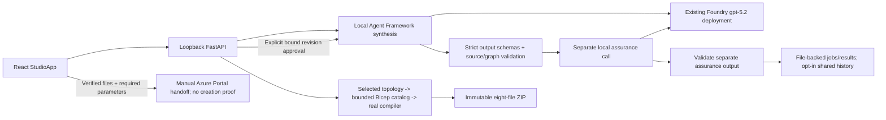
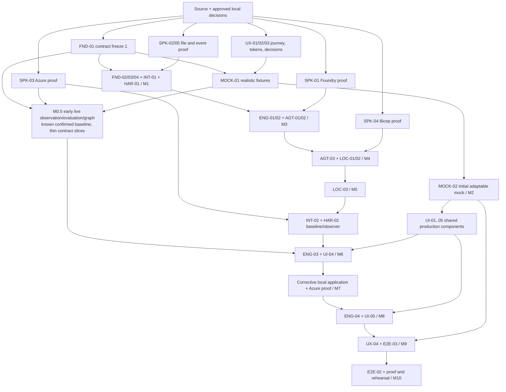

# Intent-to-Impact: Local P0 Implementation Plan

**Status:** Implemented local Studio slice with a preserved full-P0 target/backlog;
not a claim that all original tasks or live-proof gates are complete.
**Publication baseline:** 2026-09-14; original planning baseline 2026-09-12.
**Execution revision:** Current capability/status overlay supersedes historical dispatch
priority. Reviews 03/04, original IDs, acceptance gates and scenario contracts remain
traceable target requirements; the complete backlog has not been re-audited.
**Primary source:** [Intent-to-Impact Detailed Design Specification](./intent-to-impact-design-spec.md).
**Historical source reviewed:** The original 4,437-line specification, including the
reassessment and all eight use cases.
**Historical source SHA-256 (not the current revised specification):**
`BB0C6CC91EE7DDFC28D6D73B9B03D8749F1FEDD30A668216AC7E7A3FC1CBEAD4`.

This plan and the specification now distinguish implementation evidence from the
retained target architecture. Section 1 describes what exists. Unless explicitly
identified as current, sections 2-18 preserve the original full-P0 plan, not an
inventory of completed capabilities. Keep its ownership, evidence and promise
requirements when implementing those remaining targets.

**Task status overlay:** [Prioritized task decomposition](./intent-to-impact-p0-task-decomposition.md#current-implementation-status-overlay).
Historical review basis: `_bkp\03-intent-to-impact-implementation-plan-review.md`
(local-only, not published).
Historical dispatch refinement: `_bkp\04-intent-to-impact-task-decomposition-review.md`
(local-only, not published).
This documentation revision records supplied implementation evidence; it does not
execute tests, model calls, cloud operations or repository publication.

## Contents

1. [Executive Implementation Strategy](#1-executive-implementation-strategy)
   - [Implemented slice and reported validation](#17-implemented-slice-and-reported-validation)
2. [P0 Scope Boundary](#2-p0-scope-boundary)
3. [Architecture-to-Implementation Map](#3-architecture-to-implementation-map)
4. [Walking Skeleton](#4-walking-skeleton)
5. [Workstreams](#5-workstreams)
6. [Vertical Slices](#6-vertical-slices)
7. [Contract Inventory](#7-contract-inventory)
8. [Technical Spikes](#8-technical-spikes)
9. [Harness Strategy](#9-harness-strategy)
10. [UI/UX Parallelization Strategy](#10-uiux-parallelization-strategy)
11. [Testing Strategy](#11-testing-strategy)
12. [Live-Proof Plan](#12-live-proof-plan)
13. [Dependency Graph and Critical Path](#13-dependency-graph-and-critical-path)
14. [Phased Build Plan](#14-phased-build-plan)
15. [Plan Backlog](#15-plan-backlog)
16. [Integration Milestones](#16-integration-milestones)
17. [Implementation Risks](#17-implementation-risks)
18. [Task-Decomposition Guidance](#18-task-decomposition-guidance)

## 1. Executive Implementation Strategy

**Current execution priority: preserve and harden the implemented business-first
Studio, not build a manual-only frontend.** React `StudioApp` and loopback FastAPI
already connect real business/source inputs to alternatives, separate assurance,
contextual revision approval, immutable results and compiler-validated downloads.
The existing Foundry `gpt-5.2` deployment is called through **two local Agent Framework
roles: synthesis and separate assurance**. There are no three deployed specialists
and no Hosted Orchestrator.

The current end-to-end boundary is:

> Business intent + sources -> alternatives -> separate assurance -> optional
> approved contextual revision + re-review -> deterministic compiled package ->
> verified-file/required-parameter manual Azure Portal handoff

Alternatives/source inspection and Dagre layout are live. Re-layout, direction,
Expand and Fit preserve the nodes; `/draft` now opens the live Studio. Request
recommended change and Challenge require explicit revision-only `demo-human`
approval bound to parent result ID/hash, selected option and exact finding.
Fresh synthesis and separate assurance create a new immutable result. The receipt
is **not** a risk waiver, final design signoff, build gate or deployment approval.

Jobs/results are file-backed. Shared workspace history is opt-in and includes
approvals, failures and packages; default visibility remains session-private.
Opening history does not rerun the model. No default demo identity implies real
Entra authentication or independent-person separation of duties.

Actual Azure resource creation has not been executed or verified. Target environment,
real Entra identity, external values and final resource/cost approval remain open.
Runtime-risk work, NSP/V3, promise metrics and full original policy/work-engine
integration must not block or be claimed as completed by the validated Studio slice.

**Retained full-P0 target:** build a contract-first local vertical slice for:

> Customer Promise -> Decision -> Local Implementation -> Customer Promise At Risk -> Proof

The three original target journeys remain UC-01, UC-02, and UC-08. The historical
Slice 0 plan validates their experience early; Slices 1-4 incrementally connect the
same UI, local API, deterministic engines, real Foundry calls, local artifacts, real
Azure observation and outcome evidence.

Do not build all infrastructure or agents before integrating. Establish a small
executable spine, then join one real capability to the UI and harness at a time.
The first integrated failure must be visible as early as the first integrated success.

### 1.1 User-confirmed local adaptations

These IDs preserve decisions made during planning. The current behavior/limitations
below supersede earlier implementation assumptions; retained runtime targets are not
evidence that the Studio has deployed or observed resources.

| Decision ID | Design baseline | Local implementation decision | Preserved intent and limitation |
| --- | --- | --- | --- |
| LOCAL-01 | GitHub branch, PR, review, publication | Current: immutable results, revision receipts and compiled package downloads. Original controlled local change-set/diff/application lifecycle remains a target | No in-product PR/publishing workflow; developer publication of this repository to GitHub main is a separate authorized activity |
| LOCAL-02 | Cloud-hosted control plane, Cosmos DB, Blob Storage and Service Bus | Current: local FastAPI, file-backed jobs/results and opt-in shared history | Default session-private; no database/broker required. Full original case/work-engine invariants are not inferred from this slice |
| LOCAL-03 | Foundry Hosted Orchestrator | Current: two local Microsoft Agent Framework roles/calls, synthesis and separate assurance, using existing Foundry gpt-5.2 | No deployed Prompt Agent specialists or Hosted Orchestrator; the old three-specialist design is historical |
| LOCAL-04 | Entra-authenticated application users and distinct approver roles | One fixed server-side `demo-human` as default human approver | Explicit approvals and action restrictions remain; no production identity assurance, multi-user isolation or independent-person separation of duties is demonstrated |
| LOCAL-05 | Live Azure sandbox observation | Retained separate runtime-proof target; not part of the validated Studio-to-Portal slice | A local file, compiler pass or Portal tab is never substituted for Azure runtime evidence |
| LOCAL-06 | PR-linked outcome receipt and graph | Retained target: change-set/application-receipt-linked outcome receipt and graph | Applied files, Azure deployment and runtime verification remain separate facts; not established by current package history |
| LOCAL-07 | Early UI intent in the spec | Historical mock-first plan; current Studio has real backend/model integration and the original draft route is retired | Old /draft links open live Studio; fixture evidence still cannot stand in for real execution |
| LOCAL-08 | CP-01 private connectivity and Azure-side private verifier | Historical user-directed public-endpoint-only sandbox target; no private endpoint, private DNS, VPN, VNet or verifier VM required | Frozen scenario V2 uses a bounded HTTPS-only/anonymous-access configuration promise, not a claim that private connectivity was verified |
| LOCAL-09 | LOCAL-08 storage `publicNetworkAccess=Enabled` conflicts with inherited Azure Policy | User-selected Network Security Perimeter (NSP), one profile and an Enforced storage association, with no external inbound or outbound rules | Keep no private networking; prepare `SecuredByPerimeter` configuration and verify actual association/profile state. Versioned scenario/contract migration and final deployment confirmation remain pending |

LOCAL-08 records the later user instruction, "use public IP where needed. no private
needed." With clarification unavailable, the pragmatic implementation interpretation
is an Azure Storage public endpoint with secure transfer required and anonymous blob
access disabled. No separate public IP resource is needed for that endpoint. The
revised promise is confirmed through the normal product workflow; no historical
approval or private-network verification is carried forward.

**Historical sandbox-track override: LOCAL-09 (not the current Studio deployment).**
The approved V2 creation was stopped before any
resource was created because inherited policy would replace `Enabled` with
`Disabled`. The user then requested the
[NSP Bicep pattern](https://learn.microsoft.com/en-us/azure/private-link/create-network-security-perimeter-bicep?tabs=CLI)
and [Storage NSP integration](https://learn.microsoft.com/en-us/azure/storage/common/storage-network-security-perimeter),
and explicitly selected Enforced mode with no external inbound or outbound rules.
This is a governed public-endpoint boundary, not private-endpoint connectivity or
unrestricted public access. No policy exclusion, exemption or policy change is used.

The retained, separately gated preparation target is only the selected new group, empty storage account, NSP, profile and
association. Preserve HTTPS required, disabled anonymous/shared-key access and TLS
1.2; use `SecuredByPerimeter`, fallback network default Deny and bypass None. Do not
copy the quickstart's Key Vault or example access rules. No external storage
data-plane access is needed for management-API configuration observations.

Publish `DEMO-CASE-CLAIMS-V3` and its versioned intent-to-impact-studio/contracts/fixtures before future NSP
product integration; publication is pending. Preserve V1/V2 bytes, approvals and
evidence. Remaining V2 examples in this plan describe the frozen earlier contract,
not NSP verification. V2 fixtures may support clearly labelled historical visual
development, never current/live NSP proof. A property string alone cannot prove
an Enforced, correctly associated and synchronized perimeter.

The prior approval does not authorize the revised deployment. Validate the exact
candidate, policy, permissions, ordering and cost, then obtain final
risk-acknowledged deployment confirmation. Drift, role changes, provider
registration, reset and cleanup remain separately unapproved. These Azure gates do
not delay independent early mock construction or replace human UX approval.

The user preferred files unless a hard requirement for SQLite is demonstrated.
There is currently no such hard requirement. Do not implement Cosmos DB, SQLite,
Service Bus, a cloud relay, or a public tunnel in P0. A storage spike may justify a
revised decision only with recorded evidence and explicit approval.

Application authentication is not a hidden requirement. Keep a compact **Demo Identity**
marker in the main experience; the approval detail and evidence drawer explain
**Local demo approver - identity not independently verified**. Do not obscure the
customer story with a repeated full-width warning.
Outbound Foundry and Azure calls still require genuine Azure credentials and permissions.
The default local human is not fabricated as an Entra principal.
LOCAL-03 now records the implemented two-role local Agent Framework flow with real
Foundry model calls, not three private Prompt Agent specialists. A later task cannot silently switch back
to a Foundry Hosted Orchestrator or introduce a cloud relay.

### 1.2 Local topology and trust boundaries

**Implemented Studio topology:**



The two roles run behind the API, not as user-facing hosted specialists. Models
propose; deterministic code checks and persists. Revision approval is a human-entry
capability; models cannot authorize it. The broader apply/seed/reset/deploy commands
later in this plan are retained targets, not operations performed by Deploy to Azure.

A local process is not a security sandbox against its OS owner. Use an application-owned
run root, loopback-only binding, exact Origin/Host checks, a per-launch session/CSRF
token, and protected local configuration. These prevent accidental and cross-origin
invocation; they do not turn the fixed demo identity into production authentication.
Do not expose the application publicly or claim tamper-proof storage against the same
OS user. Models get no general shell, credential, filesystem-write or deployment tool.

### 1.3 Proposed implementation format

**Current choices:** Python/FastAPI and React/TypeScript/Vite are implemented; consult
the maintained technical deep dive and dependency manifests for exact versions.
The remaining bullets preserve the original broader engineering target, not a claim
that every generator, worker or projection contract has been integrated.

- Python/FastAPI control plane with deterministic validation and package generation.
- React + TypeScript Studio, built locally with Vite; no separate draft-mode product.
- Versioned JSON Schema as the sole source of generated TypeScript/Python contract
  types. FND-01 owns the pinned generator and regenerate-and-compare tests; generated
  outputs are never edited manually.
- PowerShell operator entry points wrapping structured Python commands.
- Local polling worker and HTTP SSE for authoritative progress. Foundry streaming is
  mediated by the local orchestrator; browser navigation never drives the scheduler.
- Standard library file/diff primitives first. Add dependencies only when a bounded
  component or validated spike requires them.

Do not infer exact SDK/framework versions from the historical spike plan. The original
mock-first sequence is retained for traceability, not a statement that the current
connected Studio still awaits its first backend integration.

### 1.4 Important implementation clarifications

The following are retained full-P0 engineering constraints. Current slice completion
does not imply that every canonical owner, transaction or delivery state is integrated.

1. The source's artifact-owner table governs: review results belong to the review/gate
   engine even where a schematic sequence shows the model engine receiving them.
2. Serial replacement of multiple files is not crash-atomic. Use immutable directory
   artifacts plus one atomically replaced authoritative `case.json`; test the chosen
   local Windows filesystem. Do not build a generalized transactional file store.
3. For local delivery, source states involving publication are mapped explicitly to
   **Implementation Prepared -> Implementation Approved -> Implementation Materialized**,
   followed separately by Azure deployment and runtime verification.
4. One default human may perform the required distinct decision actions in the demo.
   Retain their classes and receipts, but explicitly disable any claim that two
   independent humans approved an A3 change. A rule that truly requires distinct people
   cannot be represented as passed by this mode.
5. Full contract coverage does not require all eight promises to be runtime verified.
   Missing billing/recovery/network evidence remains unknown. No mock increases live coverage.

### 1.5 Review 03 execution refinements

**Historical dispatch refinement; current delivery priority is stated in section 1.**

- **Materialized** is the user-facing term for reviewed files written into the managed
  local workspace. It is not deployment. Retain `LocalApplicationReceipt`,
  `apply-approved-change`, and existing internal `applied` enum values as compatibility
  names; map them once in the server projection, not ad hoc in UI components.
- Keep revisions, checksums, idempotency, single-writer checks, persisted events,
  restart and basic atomic replacement. Generalized fencing, distributed locks,
  exhaustive kill-point matrices and sophisticated storage abstractions are deferred.
- Add **M0.5: Magic Moment Technical Proof** before the complete UC-01 path. Prove a
  known confirmed promise against a real bound sandbox, safe seeded change,
  deterministic evaluation and an actual graph/risk scene.
- Prioritize P0-HERO and P0-SUPPORT. Optional hardening must not delay the real hero.
- UI alignment means matching semantics, actions, status terminology, information
  hierarchy and accessible interaction intent; it does not mean pixel-perfect copying.
- Headline **Product Human Attention**; disclose **Demo/Test Operator Actions**
  separately. Never hide either class or combine them into a misleading autonomy claim.

### 1.6 Review 04 dispatch guardrails

**Historical DAG/contract guardrails, not a current completion report.**

The task document refines this plan into **75 executable tasks: 41 P0-HERO and
34 P0-SUPPORT**, plus seven acceptance gates replacing review-only tasks.
The 38 parent component IDs remain for traceability; E2E-03 is acceptance-gate
ownership, not six mandatory review-only coding assignments.

- Minimum Hero Cut means the named hero targets **and all transitive task/gate
  dependencies**. Support correctness is not optional merely because it is not HERO.
- Small A-owned contract work can be dispatched in two bundles while retaining child
  IDs and early publication of runtime/risk schemas.
- Shared schema/case/registry/generated-code integration belongs to A; shared UI
  props/components to C; tokens to D. One integration owner writes each shared
  artifact per dispatch window; others submit proposed changes.
- The six UX checkpoints and final release review are gates at build acceptance.
  Only material findings generate bounded UXD follow-up work. Semantic alignment and
  human approvals remain necessary; ceremonial task chains do not.
- Use canonical `DEMO-CASE-CLAIMS-V2`, its fixed catalog-backed rejection oracle,
  server-locked runMode and disposable M0.5 state as specified below.
- No more product decomposition is required before execution. This revision does not
  itself authorize implementation, credential use or cloud operations.

### 1.7 Implemented slice and reported validation

The implemented model boundary uses strict **per-request** output schemas and runtime
source/graph checks, including literal source binding for existing external systems.
Concrete component-ID examples in prompts improve graph consistency without granting
the model authority to invent source provenance. A bounded deterministic catalog
renders only the selected topology. Unselected duplicate components cannot block an
otherwise valid selection; queue-edge direction determines the generated permissions.
The actual Bicep compiler validates the generated bytes before an eight-file ZIP is
offered. Compilation is not resource creation, runtime verification or business-code
implementation.

**Reported validation:** fresh publication verification plus earlier bounded proofs;
commands/live calls were not rerun by this documentation-only update.

| Evidence | Scope established |
| --- | --- |
| Current publication frontend verification: 89 tests across 6 files passed | `npm run check:studio`, TypeScript typecheck and `npm test -- src/AppRoutes.test.tsx src/studio` passed; `npm run build` also passed |
| Earlier 59 frontend/client/deploy-handoff tests | Historical focused subset, not additive to the current 89-test result |
| 25 bundle tests, including 3 real compiler tests | Selected topology, deterministic artifacts and real compilation |
| 19 model-validation tests | Structured output and runtime source/graph validation |
| 16 approval tests | Exact revision-only approval boundary |
| Real Playwright, original `Order fulfilment-#1` / `opt-a` | Two distinct compiles, SHA-verified eight-file downloads, history recovery and real Portal navigation; no upload/create |
| Real business recommendation and challenge | Each used fresh synthesis and separate assurance, then produced compiled downloads |

These are targeted results, not an aggregate full-suite claim or automatic acceptance
of the 75 original task packets, M0.5-M10 or UX/release gates. The validated slice is
complete only at its stated boundary. Other historical tasks have not been re-audited.

**Deploy to Azure is a manual handoff:** verified files and required parameters are
checked, but target selection, real Entra/external values and final resource/cost
approval are outstanding. No Azure resource creation was executed or verified.
Revision approval does not sign off design risk or unlock a build/deployment gate.
Runtime drift/restoration, promise/outcome/attention metrics and the full original
policy/work-engine workflow remain roadmap work or separate proofs.

For current operation, use the [user guide](./intent-to-impact-user-guide.md) and
[technical deep dive](./intent-to-impact-technical-deep-dive.md). Archived reviews,
`.azure` configuration, `.github` local tooling, `.intent-to-impact` evidence and
dependency/build directories are local-only, not published; they are not prerequisites
for reading this plan on GitHub.

## 2. P0 Scope Boundary

**Retained full-P0 target boundary.** Section 1.7, not the word "required" in the
historical tables below, defines the current validated implementation. The expanded
runtime and controlled-materialization path still requires its own evidence.

### 2.1 Required P0

| Journey / concern | Required implementation | Exiting customer-visible result |
| --- | --- | --- |
| Slice 0 / experience | Adaptable interactive mock, complete state catalog, six UX checkpoints, component reuse | Reviewed final-product experience before backend completion |
| UC-01 / intent | Case, customer-impact promises, confirmed requirements and consequential RPO question | Versioned Customer Promise Contract |
| UC-01 / decision | Real Foundry synthesis/assurance, deterministic rejection, eligible option and explicit design approval | Approved architecture/ADR bound to current inputs |
| UC-01 / implementation | Real Bicep generation/build, local manifest/diff, separate delivery approval, explicit local application | Applied local change set with exact receipts and paths |
| UC-02 / runtime | Genuine Azure binding, authorized scheduled observation, safe operator-seeded difference | Proactive Customer Promise At Risk with exact lineage |
| UC-02 / correction | Real planning, validated corrective local change set, material/delivery approval and controlled local application | Correction applied locally; Azure verification still pending |
| Runtime restoration | Separately authorized sandbox operation and fresh read of all required predicates | Verified restoration only where evidence supports it |
| UC-08 / proof | Three-question receipt, Human Attention, away summary, graph, evidence and JSON/Markdown export | Auditable proof with remaining unknowns |
| Cross-cutting | File persistence, revisions, idempotency, gate enforcement, safe commands, restart/recovery, accessibility | Repeatable local demonstration with no silent substitution |

The plan targets a full restored path, not only a prepared correction. If fresh
verification is unavailable, the product can truthfully stop at verification pending,
but milestone M7 and the complete restored hero demonstration do not pass.

### 2.2 Excluded, deferred and contract-only

| Capability | Treatment |
| --- | --- |
| UC-03 billed-cost optimization, UC-04 brownfield onboarding, UC-05 catalog replay, UC-06 event readiness, UC-07 deep exceptions | P1; no required implementations or active navigation |
| Historical decision awareness and partner delivery | Retain source contracts only; no adapters, role UI or data ingestion on the P0 path |
| In-product GitHub, remote branches, PRs, checks, webhooks and remote reviews | Excluded, not stubbed as fake successful operations; developer publication of this repository is separate |
| Hosted Orchestrator, Container Apps hosting, Service Bus, Cosmos DB, Blob Storage, cloud API gateway | Excluded for local P0 under LOCAL-02/03 |
| App sign-in, partner grants and multiple approver identities | Deferred; fixed demo identity explicitly disclosed |
| Production deployment/autonomous remediation, IAM changes, broad resource discovery | Prohibited |
| Full claims application, portfolio analytics, billing/forecast connectors, PDF, Fabric/Power BI | Deferred; use nullable outcome fields, not invented values |
| All Azure service validators | Support the selected narrow catalog; unsupported coverage explicitly not assessed |
| Cost examples and process baselines | Optional labelled input fixtures; never actual billed savings or verified elapsed comparisons |
| Agent/runtime adapters before live integration | May be fixtures in development only, with explicit provenance and no live-proof eligibility |

Preserve eight confirmed promise IDs for the narrative where the customer confirms
them, with one genuine runtime-verification path. Do not build multi-region claims
processing merely to make CP-04/05 appear verified.

### 2.3 Source requirements mapped to local equivalents

| Source concept | Local equivalent | Limitation retained in UI/evidence |
| --- | --- | --- |
| Published implementation PR | Prepared local change set with manifest and diff | Not remotely published or externally reviewed |
| Approved PR/delivery | Local delivery decision bound to change-set/validation/base-tree hashes | Not an independent remote review |
| Merge | Explicit `apply-approved-change` activates a validated local workspace version | Not an Azure deployment |
| Deployment webhook | Operator captures an actual Azure operation/outputs and binds its manifest | Cannot be generated from local application alone |
| Corrective PR | Corrective change set linked to finding and deployed baseline | Preparing/applying files does not heal a runtime edge |
| PR/commit in graph | Change-set ID, workspace version and application receipt | Preserve separate Azure deployment/resource/evidence nodes |
| Time to validated PR | Time to prepared validated local change set; also report approval/application time | Do not compare unlike baseline endpoints |
| Hosted-agent proof | Current: actual Foundry model calls for local synthesis and separate assurance; historical specialist invocation contract remains a target | No deployed Prompt Agents or proof of Hosted Agent hosting, identities or sessions |

## 3. Architecture-to-Implementation Map

These are retained target modules and seams, not an inventory of current modules or
a mandate for one service/container per row. Section 1.2 shows the implemented flow.

| Source component | Local unit | Owner | Source anchors | P0 integration seam |
| --- | --- | --- | --- | --- |
| Experience layer/API | React app + loopback HTTP API | C / A | Spec 8.1-8.2, 27.11-27.12 | Versioned ExperienceProjection, action and SSE contracts |
| Orchestrator | Local Agent Framework module behind API | B | Spec 8.3; LOCAL-03 | Narrow engine commands; real Foundry model adapter |
| Three specialists (historical target) | Planned synthesis, assurance, implementation/remediation Prompt Agents; current Studio has two local roles | B | Spec 8.7 | Retain typed packet requirements; do not claim three deployed specialists |
| Requirements/promise engine | Pure validation + governed commit | A | Spec 8.5, 8.16, 9.9 | Confirmed requirements and promise criteria |
| Architecture/review/decision | Separate owners sharing transaction infrastructure | A | Spec 8.8-8.10, 9.5 | Model, findings, gate evaluation, approvals |
| Generation | Approved module/template resolver and validator | B | Spec 8.11 | GenerationContract -> staged bytes -> manifest |
| Local delivery adapter | Diff, change-set and file application module | B + A commit coordinator | LOCAL-01; spec 13 invariants | Prepared -> Approved -> Applied; immutable receipts |
| Runtime/drift | Scoped Azure reader and deterministic evaluators | B / A | Spec 8.12, 20.8 | Deployment/binding -> live snapshot -> finding/evaluation |
| Policy hooks | Shared command guards at every entry path | A | Spec 8.13, 14 | Deny outside action/tool/scope/phase permission |
| Canonical store/work journal | Versioned JSON snapshots, work/event records and locks | A | Spec 8.14, 9, 13; LOCAL-02 | One activation pointer, expected revision, idempotency |
| Reporting/graph | Existing projection/report module | A | Spec 8.15, 8.19, 15.5-15.7 | Canonical inputs -> graph, attention, away and receipt |
| UI/UX mock | Same React components + explicit fixture transport | D | Spec 27; current user requirement | No canonical writes, visibly mock execution |
| Fixture registry | Schema-validated projections and action examples | A / E | Spec 19; current requirement | Shared by prototype, component tests and conformance tests |
| Operator harness | PowerShell wrappers calling the same local capabilities | E | Spec 19-20.8; current requirement | Real evidence without a browser |
| Tests/evidence | Unit/contract/failure/E2E and proof index | E | Spec 19, 23, 27.13 | Trace every acceptance result to plan and source |

Historical proposed workspace layout, not the current published repository inventory:

```text
intent-to-impact-studio\apps\experience\                 shared prototype and production UI
intent-to-impact-studio\apps\control-plane\              loopback API, local orchestrator entry and workers
intent-to-impact-studio\contracts\                      schemas, generated type definitions, capability registry
intent-to-impact-studio\engines\                        requirements, model, decision, review, generation, drift
adapters\                       Foundry, local workspace/commands, Azure
intent-to-impact-studio\reporting\                      graph, attention, away and outcome projections
intent-to-impact-studio\fixtures\experience\             versioned projection scenarios
intent-to-impact-studio\design\ journey map, tokens, component inventory, UX decision records
intent-to-impact-studio\tools\                          PowerShell operator harness and structured command client
intent-to-impact-studio\tests\                          unit, contract, integration, browser, failure and live-proof
.intent-to-impact\               local run data; never treated as source or committed secrets
```

## 4. Walking Skeleton

**Original skeleton and invariants.** FastAPI/Studio and file-backed jobs/results now
exist, but their validation is not blanket acceptance of the broader case.json,
work-engine, runtime or controlled-materialization contracts below.

### 4.1 Smallest executable foundation

Before parallel teams depend on a live backend, deliver this thin spine:

1. Contract draft v1 for case, promise, command/result/error, evidence, event,
   change set, application and ExperienceProjection.
2. One local service and one sanctioned run root; reject unsupported filesystem/scope.
3. `create-case`, `show-case-state`, a single confirmed answer transition and a persisted
   event, all through the same command dispatcher.
4. File-backed expected-revision/idempotency checks and recovery after restart.
5. A read projection endpoint and basic SSE feed, with current-state reload on reconnect.
6. A minimal harness client and a browser page displaying the same case revision.
7. Schema-validated fixtures for the entire hero path and a draft component inventory.
8. Visible local-demo identity and evidence-origin labels.

This is M1. It does not require all validators, all agents, live Azure deployment or a
finished high-fidelity UI. UX mapping, fixture design and dependency spikes start before
M1; production feature integration builds on it.

### 4.2 File-backed persistence and local application

Use a deliberately small single-process file store:

```text
.intent-to-impact\runs\<run-id>\
  run-manifest.json
  operator-config.json                   non-secret, fixed scope and demo principal
  cases\<case-id>\
    case.json                           authoritative current state, revision and refs
    events.ndjson                       rebuildable readable event projection
    candidates\<change-set-id>\          immutable prepared bytes and diff
    materialized\<change-set-id>\        immutable reviewed files and local receipt
    evidence\<evidence-id>\              redacted results and command receipts
    reports\<report-id>\                 immutable derived outputs
    operations\<operation-id>\           command receipts / unfinished-operation notes
```

`case.json` contains the logical canonical sections and references, bounded work and
idempotency records, and ordered durable business events for the current small demo run.
Requirements/model/decision/review owners stay separate in code; they share one commit
function and do not become separate simultaneous file writers.

Under a single writer/file lock, validate revision and inputs, build the complete next
JSON in memory, flush a same-directory temporary file, then atomically replace
`case.json`. It contains the current materialized-tree reference and all receipt hashes.
`events.ndjson` is generated from committed events, never a second authority. If its
export fails, preserve canonical events and expose a warning; rebuild it on restart.
Do not add a separate outbox service, active pointer or database.

Before committing a materialization, write only into a new owned directory, verify all
files and its receipt, and reference that directory in the next `case.json`. A failure
before replacement leaves the current state unchanged; unreferenced staging is not a
successful materialization. On restart inspect the current JSON and operation notes,
report uncertain external operations, and reconcile rather than blindly repeating.
Archive immutable evidence and run directories; no full snapshot-per-revision store
is necessary for the bounded MVP. Hash-bound decisions/events retain decision history.

Basic tests cover stale revision, duplicate command, normal restart, interruption before
replace, and interruption after artifacts but before JSON replacement. Exhaustive
power-loss/kill-point testing and generalized rollback across arbitrary filesystems are
P0-STRETCH/P1, not promised by the MVP. Use a supported local filesystem; unsupported
network/cloud-sync roots block materialization rather than silently weakening safety.

UI and harness display **Implementation Materialized** and the actual owned path.
A copied file outside that managed root is not governed materialization.

Do not apply arbitrary model-supplied patches directly. Apply the validated per-file
operations and expected before/after hashes in LocalChangeSetManifest. P0 supports
create/update; deletion is rejected unless a separately reviewed bounded need is added.
Changes made externally to applied files produce a base-tree conflict, never automatic
overwrite or a silent new baseline.

### 4.3 Concurrency, work and reset invariants

- One local mutation coordinator; UI and harness share it. A second writer fails
  visibly or forwards commands to the running service.
- Slow Foundry/Azure work happens outside the commit lock. Commit checks actual
  dependency hashes; unrelated case revisions do not discard useful results.
- On a revision conflict, reload current status and authorize a new commit attempt only
  if every declared dependency is unchanged. Record the original work revision and the
  actual commit revision. Never rebind an old human approval to changed inputs.
- Use one OS-backed writer/file lock; process exit releases it. Do not implement lease
  stealing, distributed fencing or takeover. If a writer is active, reject the second
  writer visibly. A stale human-readable lock note is diagnostic, not authority.
- Idempotency records bind command, case, request hash and receipt. Same key/payload
  returns the prior result; different payload is rejected.
- Persist work status, attempt, scope, dependencies and checkpoints. Queues are file
  records serviced by a local worker, not conversation history.
- Business events are committed inside `case.json`. Derived NDJSON logs/projections
  can be rebuilt; exact Human Attention counts never rely on sampled traces.
- Resume unknown external outcomes by inspecting receipts/provider operation IDs;
  do not blindly repeat deployments or claim exactly-once remote execution.
- Reset creates a fresh run/case generation and archives prior proof. It never changes
  a published receipt, resets a revision backwards, or recursively deletes the workspace.
- D22 fixes `runMode=live|fixture|replay`, purpose, scenario ID/hash and scope at
  creation. The server enforces them at every API/worker/adapter entry. To switch
  modes, create a new run; the UI has no active-case mode toggle. Fixture/replay
  runs cannot issue live provider operations or mint live-proof receipts.
- P0 is bounded to a local demo run, not an unbounded event-sourcing service. Enforce a
  reviewed run-size limit and start a new run visibly if exceeded; never silently trim
  authoritative events. Advanced cursor history and long-term archival are deferred.

### 4.4 Minimum contract freeze

Freeze schemas, action IDs, status semantics, error reasons, artifact identifiers,
provenance labels and fixture transport before different teams implement clients.
Do not freeze every future Azure resource field. Extensions must be additive/versioned;
breaking changes require an explicit migration and updates to both mock and production.

Canonical roots use semantic JSON hashing; generated files use raw byte hashes.
Exclude the root's own checksum. Normalize serialization once in the shared contract
library, rejecting duplicate keys/non-finite numbers. Monetary values use decimal strings.
Golden tests fix clock/ID inputs; live receipts retain genuine timestamps.

### 4.5 M0.5: Magic Moment Technical Proof

Start this narrow live path as soon as FND-01's promise/evidence/evaluation/graph
contracts are usable, without waiting for full generation, application or UC-01:

```text
Known confirmed Promise Contract + known legitimately deployed Azure baseline
 -> operator-authorized safe seed -> real scoped observation
 -> deterministic PromiseEvaluation / Finding -> Customer Promise At Risk
 -> focused Intent Continuity Graph in the early UI
```

Use explicit test setup commands through the minimal harness/engine seam; no forged
deployment receipts or direct hand-editing of canonical state. Known requirements and
baseline metadata may be preconfigured, but provider observations and deployed
resource bindings must be genuine. Identify this run as **early integration proof**,
not generated delivery or a completed hero.

Reuse SPK-03, narrow parts of INT-02/ENG-03/ENG-04, basic INT-01 and UI-04. These parts
may start from draft frozen contracts and a known input rather than waiting for their
complete plan parents. Final integration still proves the full UC-01-generated lineage
at M6/M7. Reuse the proof code; do not build a separate demo-only risk engine.

M0.5 state is disposable test setup, not a promotable final case. Preserve its evidence
for audit, but start UC-01 with a fresh hero run and genuine confirmations/decisions.
Do not copy early approvals, known architecture, case IDs or shortcut bindings into
that run. Reuse only code, schemas and explicitly legitimate infrastructure, recording
the hero's own binding. Sprint 0A proves normalized live change -> breached evaluation;
Sprint 0B makes the persisted finding visible through the graph and risk UI.

Exit evidence: authorized scope/baseline, seed receipt, real observation, rule outcome,
persisted finding, and screenshot of the live graph/risk projection. A screenshot
or fixture alone is insufficient. If safe Azure scope or required property verification is
blocked, stop that track early while mock/Foundry/Bicep work proceeds independently.

### 4.6 Canonical scenario and deterministic acceptance

Use one schema-validated `DEMO-CASE-CLAIMS-V2` scenario from task-document section 4.3
across applicable mock, engine, Foundry and test work. The scenario defines the fictional
claims intent, CP-01..08, approved US geography, USD 8,000 budget, RTO 60 minutes,
initially missing RPO and explicit acceptance answer 15 minutes.

Its reviewed candidate catalog supplies A (USD 6,000 estimate, required recovery profile
absent) and B (USD 7,200 estimate, approved profile/controls present).
For those fixed confirmed inputs, the deterministic oracle is A ineligible, B eligible
and lowest-cost eligible recommendation. Actual model calls still supply typed
reasoning/mappings; malformed or contradictory outputs fail instead of being replaced
with fixture output. Declared recovery support is not runtime test evidence.

CP-01's sandbox shape, approved property-drift seed and restoration reference the same
scenario. Real Azure resource IDs and scope are operator configuration, never fabricated.
Restore to the approved desired-state hash; keep a minimal D18/D11
`reconcile-runtime-to-approved-state` plan and unchanged Bicep when no source change
is needed. Do not grow another remediation artifact subsystem.

Changing fixed scenario facts requires a new reviewed scenario version/hash; changing
runtime mode requires a new run. Neither can silently modify active approval/evidence.

## 5. Workstreams

**Historical full-P0 ownership lanes.** In particular, the three-specialist lane
below is a retained target, not the implemented two-local-role Foundry topology.

Five responsibility lanes, not necessarily five people. One person may own multiple
lanes, but each artifact and change still has one designated reviewer/writer.

| Lane | Responsibilities | Explicit non-responsibilities | Contracts in -> out | Dependencies / integration / review | Mock and local impact |
| --- | --- | --- | --- | --- | --- |
| A: Control Plane and Harness Core | Canonical owners, state machine, file transactions, policy, API projections, event work, errors | Rendering, making model output authoritative, silent application, inferred verification | D/E contracts + commands -> committed D artifacts and P projections | FND contracts and file spike; M1/M3/M5/M6/M8; domain review at each seam | Owns server truth and realistic fixture schema; all writes stay in the managed run root |
| B: Agents and Local Integrations | Local Agent Framework, three Foundry specialists, typed reasoning, generation/validation, local adapter and Azure reader | Human approval, general shell tools, broad discovery, autonomous seed/deploy/cleanup | Delegation, generation and runtime contracts -> proposals, command receipts, change sets, observations | Foundry/Bicep/Azure spikes; M3-M7; policy/adapter review | Reports actual capability limits early so mock status is honest; no cloud relay or PR work |
| C: Product Experience | Production screens, navigation, graph, diff/evidence, allowed actions, SSE/resume, attention presentation | Computing gates/coverage, joining canonical records, synthesizing success | P projections, UI tokens and component props -> human commands and presentation events | FND-01, approved mock states; every slice integration; UX checkpoints 02-06 | Reuses prototype components and changes transport, not product semantics |
| D: UI/UX Design and Mock | Journey/IA, reusable visual prototype, tokens/components, feedback log, responsive/accessibility decisions | Fake live evidence, policy logic, unreviewed projection changes, final backend sign-off | Source + P contracts + fixtures -> approved designs/states and linked decisions | Starts with contract draft; UX checkpoints 01-06; coordinate with A/C/E | Mock stays versioned and adaptable; no external design service required |
| E: Test, Harness and Evidence | Operator scripts, conformance matrix, failure injection, live proof, reset/rehearsal, visual/a11y checks | New domain logic, auto-approval, silent fixtures, broad deletion | Commands/contracts -> test and proof receipts, UX findings and release checklist | Starts with FND-01; M1-M10; independent evidence review | Same command path as UI, same fixture payloads as mock, exact local artifacts recorded |

Review ownership: A reviews authority/state changes; B reviews provider/SDK behavior;
C/D jointly review presentation; E checks observable evidence. These are engineering
review roles, not additional runtime approver identities or remote review workflows.

## 6. Vertical Slices

**Historical full-hero slices.** The current business-intent/review/revision/package
slice cuts across parts of these targets without completing every acceptance row.
Slice 0's separate mock-first priority is retired; the old draft URL opens live Studio.

### 6.1 Slice 0: UI/UX mock and hero journey foundation

**Entry:** source and local decisions available; draft projection contracts exist.
**Exit:** M2, with UX-Checkpoint-01 approved and the complete journey navigable in mock mode.

| Aspect | Implementation boundary |
| --- | --- |
| Plan items | UX-01/02/03, MOCK-01/02; early UX-04/SPK-06 feedback |
| Services / engines / agents | Local frontend fixture transport only; no claimed live engines or agents |
| Canonical / backend state | None created by mock; examples validate against domain and projection schemas |
| Projections | All screen-state fixtures in section 7.5; explicit mock evidence mode |
| Screens | Home, Overview, Intent, Options, Decisions, Implementation, Operations, Value, evidence drawer |
| UX states | All 18 requested experiences plus shared empty/loading/stale/blocked/failed/recovered variants |
| Local artifacts | Component/state inventory, tokens, JSON fixtures, mock navigation map and UX decisions |
| Integrations | Local development server; no Foundry or Azure needed for mock execution |
| Tests | Fixture validation, navigation, disabled actions, accessibility smoke and responsive graph/diff |
| Review | UX checkpoints 01-05 may review initial mock states before live slices exist |
| Demo result | A stakeholder can understand the final journey without mistaking it for a working backend |
| Handoff | Approved component IDs, props, token version, fixture hashes and decision-to-plan-ID mapping |

The mock chooses the next canned response from a declared scenario/action script;
it does not implement eligibility, coverage or approval rules. Exiting this slice
records unresolved design questions with an owner and deadline/milestone; it does not
erase them or postpone all UX review.

### 6.2 Slice 1: Promise -> Architecture Decision (UC-01)

**Entry:** M1 skeleton, approved initial mock, real Foundry spike passed.
**Exit:** M3: actual eligible architecture approved against current checksums.

| Aspect | Implementation boundary |
| --- | --- |
| Plan items | ENG-01/02, AGT-01/02, UI-02, INT-01, HAR-01, E2E-01 |
| Required local services | API, orchestrator, file worker, requirements/model/review/decision engines |
| Agents | Foundry-backed local orchestrator; real synthesis and assurance Prompt Agents |
| Canonical artifacts | Case, Requirements, CustomerPromiseContract, ArchitectureModel, ADR/DecisionReceipt, ReviewResult, Approval |
| Derived projections | Intent/questions, comparison with rejected/eligible options, decisions and graph prefix |
| UI/mock mapping | FX-01/02/03/04/05; PromiseCard, QuestionPanel, OptionComparison, DecisionPanel |
| Interaction | Explain claimant impact, confirm promises, answer missing RPO, compare reasoned options, approve exact current design |
| Local artifact/evidence state | Live Foundry response IDs and typed result hashes; persisted rejection rule and explicit decision |
| External integration | Real model/specialist calls; no repository publication |
| Tests | Invalid agent schema, blocked cheap option, unsupported service, duplicate answer, stale approval, tool authority denial |
| Review | UX-Checkpoint-02 plus domain gate/approval review |
| Visible result | "Design approved"; next action can prepare implementation, not imply applied or verified |
| Handoff | Approved mock and live projection comparison; updated fixture/error examples if SDK/gate findings change UX |

Use the fixed demo-human for each required confirmation. Live reasoning may yield
no compliant option; display that failure and keep the gate blocked. Do not swap in a
scripted eligible result to preserve the demo.

### 6.3 Slice 2: Approved Architecture -> Local Implementation Change Set (UC-01)

**Entry:** M3 with current design approval.
**Exit:** M4 prepared/approved change set, then M5 explicitly applied local tree.

| Aspect | Implementation boundary |
| --- | --- |
| Plan items | AGT-03, LOC-01/02/03, FND-02/03, UI-03, INT-01, HAR-01 |
| Local services / engines | Implementation planner, generation/validation engine, workspace adapter, decision engine and commit coordinator |
| Canonical artifacts | GenerationContract, GenerationManifest, ValidationReceipt, LocalChangeSetManifest, delivery Approval, LocalApplicationReceipt |
| Derived projections | Implementation view, per-file local diff, affected promises, approval/apply actions, lineage |
| UI/mock mapping | FX-06/07/08 and FX-14/16; ChangeSetSummary, FileDiff, ValidationList, ApplyPanel |
| Interaction | Inspect generated location/diff/checks; approve delivery; separately choose Apply approved change set |
| Local state | Candidate bytes immutable; then approved manifest; then new active applied workspace version with verified hashes |
| External integration | Foundry implementation planning; Azure template preflight only with scope permission; no remote code review |
| Tests | Actual Bicep build, altered staged bytes, changed base file, missing approval, duplicate apply, interrupted publication, command failure |
| Review | UX-Checkpoint-03, local-write safety review and hash/receipt integrity review |
| Visible result | Prepared -> Approved -> Applying -> Applied locally; Azure deployment/verification explicitly pending |
| Handoff | Frozen apply/error projections, actual sanitized diff examples, recovery state revisions promoted into shared components |

An apply failure does not leave the active workspace half-updated. A local application
receipt records file materialization only. Even a clean Bicep build is not evidence
that Azure accepted or deployed the architecture.

### 6.4 Slice 3: Runtime -> Customer Promise At Risk (UC-02)

**Entry:** authorized sandbox, genuine deployment/binding, passed observation spike;
the full product path uses M5 plus operator acknowledgement of Azure deployment.
**Exit:** M6: persisted live finding, appropriate promise evaluation and actionable graph.

| Aspect | Implementation boundary |
| --- | --- |
| Plan items | INT-02, ENG-03, HAR-02, UI-04, FND-04, AGT-03 |
| Local services / engines | Scoped polling worker, Azure observer, runtime binding/drift/review engines, orchestrator for impact/remediation proposal |
| Canonical artifacts | SandboxOperationReceipt, RuntimeBinding, RuntimeSnapshot, DriftFinding, PromiseEvaluation, durable events/attention request |
| Derived projections | Risk card, exact graph edge, While You Were Away, pending human decision |
| UI/mock mapping | FX-09/10/11 plus stale/missing-evidence variants; RiskPanel, ContinuityGraph, AwaySummary |
| Interaction | Human explicitly authorizes observation and safe seed separately; after seed the system detects without a Scan click |
| Local state | Current applied tree remains unchanged by observation; deployed baseline pointer remains separate |
| External integration | Actual scoped Azure Resource Graph/service API; operator-controlled seed and baseline deployment |
| Tests | Actual baseline read, approved safe seed, detection timing, partial results, unbound resource, stale evidence, duplicate poll, return without scan |
| Review | UX-Checkpoint-04, Azure scope/seed safety review, lineage and origin review |
| Visible result | "Customer Promise At Risk"; why claimants care; observed property; correction processing or ready, never invented |
| Handoff | Real sanitized observation and evidence-gap examples update FX-09/10 and graph/accessibility layout |

Prioritize SPK-03 and a read-only observation prototype early, before waiting for the
entire Slice 2 UI. Final acceptance still joins the exact approved/applied/deployed
baseline; an unrelated live resource cannot satisfy M6.

### 6.5 Slice 4: Remediation -> Proof (UC-02 and UC-08)

**Entry:** M6 live finding plus unchanged bound promise contract.
**Exit:** M7 fresh verified correction, M8 immutable receipt; UI alignment follows at M9.

| Aspect | Implementation boundary |
| --- | --- |
| Plan items | AGT-03, LOC-02/03, ENG-03/04, HAR-02, UI-03/04/05, E2E-02 |
| Local services / engines | Same generation/application path as Slice 2, material approval, observer/evaluator and reporting |
| Canonical artifacts | Corrective change set, A3/local delivery decisions, application receipt, actual Azure operation/binding, fresh evaluation, CustomerOutcomeReceipt |
| Derived projections | Corrective diff, verification pending/restored, current coverage, Human Attention, three-question receipt/evidence |
| UI/mock mapping | FX-10/11/12/13; reuse ChangeSetSummary/ApplyPanel, graph and receipt components |
| Interaction | Review narrow fix/rollback; explicitly approve material and local delivery decisions; apply locally; separately authorize sandbox deployment; verify |
| Local state | New local application cannot change verified runtime status until actual Azure evidence is ingested |
| External integration | Real Foundry remediation plan, actual authorized sandbox operation and fresh observation |
| Tests | Wrong correction/baseline, stale approval, local apply only, provider unchanged, missing network-path proof, sample billing, report dedup and interrupted restoration |
| Review | UX-Checkpoint-05 and evidence/coverage review; UX-Checkpoint-06 after live UI parity |
| Visible result | Prepared, approved, applied locally, verification pending, then verified for scope/window; honest unresolved promises remain |
| Handoff | Golden receipt, live evidence index, final mock/live screenshot pairs and accepted residual limitations |

When only CP-01 has eligible proof, coverage is honestly 1/8 -> 0/8 -> 1/8.
The receipt cannot import six synthetic verifications to produce the source's
illustrative 7/8 sequence. Human Attention includes every actual decision and disclosed
operator effort; one human does not mean one decision.

**Runtime-only drift:** The existing approved Bicep may already declare the correct
value even though Azure has drifted. Do not invent a meaningless Bicep edit to make
the corrective diff nonempty. Prepare a real new, non-executable remediation descriptor
and corrective manifest identifying the exact desired-state template/hash, resource,
changed-property evidence, approved restoration operation and rollback/verification
plan. The local change set may add those files while reusing unchanged approved Bicep.
The operator adapter redeploys only that reviewed allowlisted desired state after
materialization and separate consent. No arbitrary script or provider command from
the model is executed. The receipt explains why the infrastructure file itself did
not need to change.

## 7. Contract Inventory

**Target contract registry.** D/E/P/A/U IDs are preserved for future integration;
do not infer that the current job/result schemas implement every original contract.

### 7.1 Registry conventions

Contract IDs below are stable planning references. D = domain; E = evidence/events;
P = projection; A = API; U = UX/mock. Schemas start at `1.0.0`; breaking changes require
a version and migration. Every persisted domain/evidence root includes run/case/scope,
schemaVersion, artifact ID, caseRevisionAtWrite, own/input checksums and genuine times.
Mutable case root alone has logicalRevision.

Legend for tables: **C** canonical; **D** derived; **T** transient proposal.
**Persist** means must survive process restart. **UI** indicates safe projection/ref,
not direct raw canonical access. **Mock** means represented in a fixture or visible
component; raw credentials and private bodies are never included.
All contracts are versioned, including fixture and token bundles.

### 7.2 Domain and local artifact contracts

| ID / contract | Owner / producer | Consumers | Kind / persistence | Slice | UI / mock |
| --- | --- | --- | --- | --- | --- |
| D01 CaseState | Case engine via single commit function | All engines, projection service | C; persist atomic `case.json` with logical sections/events | 1-4 | Revision/state projection; yes |
| D02 Requirements | Requirements engine | Synthesis, rules, reporting | C; persist confirmations | 1-4 | Cards/questions; yes |
| D03 CustomerPromiseContract | Requirements engine | Architecture, generation, evaluation, graph | C; persist verifier/impact/requirement links | 1-4 | Contract/cards; yes |
| D04 ArchitectureProposal | Foundry synthesis | Architecture validator only | T; minimized evidence of result, not authoritative state | 1 | Eligible/rejected result after engine; yes |
| D05 ArchitectureModel | Architecture engine | Review, decision, generation, graph | C; persist validated options/selection and component mapping | 1-4 | Comparison/graph; yes |
| D06 ADR and DecisionReceipt | Decision engine | Review, generation, reporting | C; persist selected option, rationale and exact versions | 1-4 | Decision panel; yes |
| D07 Approval | Decision engine | Gate/application/operator guards | C; persist action class, demo-human, decision/checksum bindings | 1-4 | Explicit approval and limitation; yes |
| D08 ReviewResult and GateEvaluation | Review/gate engine | Decision, orchestrator, all consuming capabilities | C; persist deterministic/inference/effective and separate approval status | 1-4 | Checks/blockers; yes |
| D09 GenerationContract | Generation engine validates planner output | Template/module renderer | C; persist approved upstream hashes and output allowlist | 2/4 | Safe summary; yes |
| D10 GenerationManifest | Generation engine | Workspace, reviewer, graph, reporting | C; persist file hashes, module versions and expected-resource inventory | 2-4 | Files/lineage; yes |
| D11 LocalChangeSetManifest | Workspace adapter through generation owner | Decision/application engine, UI projection | C; persist ID, base version, per-file operation/hashes, diff hash, affected promises | 2/4 | Change-set/diff; yes |
| D12 LocalApplicationReceipt | Application coordinator | Binding, graph, reporting, recovery | C; persist before/after trees, approval refs, paths and outcome | 2-4 | Applied locally; yes |
| D13 SandboxOperationReceipt | Operator adapter; validated by runtime engine | Runtime binding/evidence evaluator | C; persist actual Azure operation, manifest, scope and result | 3/4 | Separate Azure state; yes |
| D14 RuntimeBinding | Runtime/drift engine | Observer/evaluator/graph | C; persist component/resource IDs, deployed manifest and operation evidence | 3/4 | Baseline/gaps; yes |
| D15 RuntimeSnapshot | Runtime adapter normalized by drift engine | Promise/rule evaluation | C; persist complete scoped observation and completeness | 3/4 | Sanitized evidence; yes |
| D16 DriftFinding | Drift engine | Orchestrator, remediation, reporting | C; persist rule/promise/resource key, severity and current state | 3/4 | Risk scene; yes |
| D17 PromiseEvaluation | Review/gate engine | Coverage/graph/receipt | C; persist phase, predicate outcomes, scope/window/mode and evidence | 1-4 | Status without UI inference; yes |
| D18 RemediationProposal | Foundry implementation/remediation specialist | Generation/review validators | T; retained minimized proposal evidence | 4 | Validated proposed plan only; yes |
| D19 OutcomeReport / CustomerOutcomeReceipt | Reporting engine | UI, exports, harness | D; immutable persisted snapshot, not independently editable | 4 | Three questions/detail; yes |
| D20 ValueBaseline / BenefitRecord | Reporting engine after explicit confirmation | Financial calculations | C; persist when provided; nullable/deferred otherwise | 1/4 | Labelled estimates/unavailable values; yes |
| D21 SeenCursor / PresentationAcknowledgement | Case UI-state owner | Away/attention projections | C; persist per default principal/case with own UI-state revision | 0-4 | Seen is not approved; yes |
| D22 LocalRunManifest | Harness/run coordinator | Every local path/scope resolver | C; persist immutable runMode, purpose, scenario ID/hash, root/config and sandbox scope | 0-4 | Safe mode/scope label; yes |

**Minimum LocalChangeSetManifest fields:** schemaVersion, changeSetId, kind
(`implementation`/`correction`), caseId, baseWorkspaceVersion, baseTreeChecksum,
generationManifestChecksum, inputChecksums, files with normalized relative path,
operation (`create`/`update`), beforeChecksum/null, afterChecksum, immutable candidate
reference, diffChecksum, affectedPromiseIds, validationReceiptIds and createdAt.
It does not contain executable shell or a client-selected absolute destination.

**Minimum LocalApplicationReceipt fields:** applicationId, changeSetId,
changeSetChecksum, approvalIds, baseWorkspaceVersion, newWorkspaceVersion,
actualPerFileChecksums, aggregateTreeChecksum, validated location reference,
startedAt/completedAt, result, actor `demo-human`, identityAssurance `local-demo`,
correlationId, and operation recovery reference. `result=applied` attests to local
bytes only; no runtimeVerified flag is inferred.

**Deployment binding rule:** D14 references an actual D13 and the exact applied
generation manifest. A pre-existing sandbox must have real provenance for the selected
case baseline; importing unrelated resource JSON cannot synthesize that provenance.

### 7.3 Evidence, event and work contracts

| ID / contract | Owner / producer | Consumers | Persistence / kind | UI/mock and restart requirement |
| --- | --- | --- | --- | --- |
| E01 EvidenceReference | Evidence adapter registration through owning engine | Validators/reporting | C; persisted normalized metadata + private body hash | Safe drawer; yes; never lose proof on restart |
| E02 CommandExecutionReceipt | Local command adapter | Validators/harness/proof | C; argv allowlist ID, working-root ID, exit, times, redacted stdout/stderr hashes | Build/application evidence; yes |
| E03 WorkEnvelope | Work coordinator | Local worker/orchestrator | C; attempt, command, input hashes, status, checkpoints | Work progress; yes |
| E04 DomainEvent / Outbox | Owning engine via single commit | SSE, projections, reporting | C; event ID/order stored inside case.json; no separate outbox service | Reload current projection on reconnect; yes |
| E05 HumanAttentionEvent | Requirements/decision/work engine; presentation acknowledgement | Reporting | C; stable step/question/decision/attention IDs and server-assigned activityClass | Product/operator counts kept separate; yes, unsampled |
| E06 AgentInvocationReceipt | Foundry adapter | Gates, diagnostics, proof | C; response/deployment/agent version, request hash, outcome and token metadata where available | Real AI evidence; yes; no raw secrets |
| E07 ErrorEnvelope | Dispatcher or owning adapter | UI/harness | D response; persist diagnostic reference when emitted | Stable reason, retryability and permitted recovery; yes |
| E08 AuthorizationContext | Server creates from local config and transport | Policy/engine entry points | C config + per-command attribution; not model-authoritative | Demo identity and capability limits; yes |
| E09 LiveProofIndex | Reporting/harness aggregates E01/E02/E06/D12-D17 | Go/no-go and receipt | D immutable version; persist references/checklist | Missing/fallback cannot be pass; yes |

E01 includes `origin` (`live-external`, `live-local`, `fixture`, `replayed`,
`ux-mock`), collector/version, scope, observedAt, retrievedAt, validUntil/eligibility,
sourceChecksum, completeness and supported assertion IDs. Evidence state (fresh,
stale, missing, partial, failed) is separate from origin. Synthetic business inputs can
accompany real provider execution; do not label actual Azure data synthetic merely
because Contoso is fictional.

E07 includes code, human-safe message, case/work/correlation IDs, expected/actual
revision where relevant, current allowed recovery actions and diagnostic reference.
Core reasons: `stale-revision`, `stale-input`, `idempotency-conflict`,
`approval-required`, `not-authorized`, `workspace-conflict`, `invalid-artifact`,
`command-failed`, `binding-missing`, `evidence-incomplete`, `provider-unavailable`,
`recovery-required`, `fixture-contract-mismatch`.

### 7.4 Capability APIs and state transitions

Keep commands explicit. CLI and browser invoke the same dispatcher; no alternative
unguarded path is allowed.

| API ID | Capability / local HTTP surface | Inputs -> outputs | Owner / restriction |
| --- | --- | --- | --- |
| A01 | Create/read case; `POST /cases`, `GET /cases/{id}/experience` | Typed intent + idempotency -> case/projection | Case/requirements |
| A02 | Confirm requirements/promises; action endpoint | Issued question/action ID + answer, revision/hashes -> committed receipt | Requirements; explicit human confirmation |
| A03 | Propose/review architecture | D02/D03 hashes -> D04-D08 | Orchestrator proposes; engines commit |
| A04 | Approve/reject | Current action ID + subject hashes -> D06/D07 | Human-only entry, server-fixed demo principal |
| A05 | Generate/validate/prepare-local-change | Current approved D09 inputs -> D10/D11/E02 | Generation + workspace; no application |
| A06 | Apply-local-change | D11 hash + approval refs + expected base/revision -> D12 | Explicit human-only action |
| A07 | Observe/evaluate | Authorized scope + D14 -> D15-D17 | Read-only observer/evaluator; scheduled after opt-in |
| A08 | Remediate | D16/input hashes -> D18 then D09-D11 | Propose/validate only; uses A04/A06 later |
| A09 | Report/graph/evidence | Current scope/snapshot -> P projections and D19 | Reporting; no approval mutation |
| A10 | Events and seen cursor | Case/cursor -> E04 stream or acknowledged D21 | UI-state/read projection; seen never decides |
| A11 | Seed/reset/deploy-sandbox/verify | Explicit operator action + pinned run/scope/baseline -> D13/E02 | Harness-only operator capabilities, absent from agent tools |

Use `POST /cases/{caseId}/actions/{actionId}` for issued mutating UI actions.
All mutations include expectedRevision, idempotencyKey and boundChecksums, except
case creation without an existing revision. The server derives actor and roots;
clients cannot submit their own approval identity or arbitrary filesystem paths.

**State mapping**

```text
Draft -> Discovering -> RequirementsReady -> Designing -> DesignReview
      -> AwaitingApproval -> Approved -> Generating -> DeliveryReview
      -> LocalChangePrepared -> LocalChangeApproved -> ApplyingLocally -> LocalApplied

LocalApplied --actual separately authorized Azure operation/binding--> Observing
Observing -> DriftDetected -> RemediationReview -> CorrectiveChangePrepared
          -> CorrectiveChangeApproved -> ApplyingLocally -> CorrectionAppliedLocally
          -> VerificationPending -> VerifiedRestoration (only fresh eligible evidence)
```

`failed`, `stale`, `blocked`, `recovery-required` and `awaiting-human` qualify work or
actions rather than magically undoing committed history. A prepared artifact can
exist while its approval is stale. Approval does not apply. Local apply does not deploy.
Deployment acknowledgement does not itself verify every promise.

Gate names stay requirements-ready, design-ready, generation-ready, delivery-ready,
operation-ready and remediation-ready. Consuming a gate checks effectiveStatus and
the applicable current approval separately. Add a local-application eligibility
predicate under delivery/operation checks, not an LLM-defined bypass.

For material correction, record the required risk and delivery decisions separately
even though the default demo human supplies both. If organization policy requires
independent principals, report that assurance not demonstrated; do not fake principals.

**Required presentation terminology (server-owned mapping)**

| Retained internal API/receipt term | UI/harness display |
| --- | --- |
| LocalChangePrepared / prepared | Implementation Prepared |
| LocalChangeApproved / approved | Implementation Approved |
| ApplyingLocally / applying | Materializing implementation files |
| LocalApplied, CorrectionAppliedLocally / applied | Implementation Materialized |
| apply-approved-change / LocalApplicationReceipt | Materialize approved implementation / Local materialization receipt |
| Azure deployment receipt | Azure Deployment acknowledged, separate from materialization |
| VerifiedRestoration | Runtime Verified for the observed scope and window |

Retain stable D12/A06/FX IDs so downstream tasks do not invent duplicate contracts.
`result=applied` is an internal compatibility value only. Add the derived display stage
to P04; no new independent mutable materialization state is needed.

### 7.5 Experience and mock contracts

The UI receives already-joined projections. It does not assemble requirements,
approvals and Azure rows to decide what the product state means.

| Projection ID | Owner and data | Persistence / version | UI and mock |
| --- | --- | --- | --- |
| P01 Experience/Overview | A joins D01/D03/D08/D11-D17, E03/E09 | Derived; versioned, reproducible after restart | Both |
| P02 Intent/Question | Requirements projection | Derived from persisted confirmations/questions | Both |
| P03 Options/Decisions | Architecture/review/decision projection | Derived from exact option/review/approval versions | Both |
| P04 LocalImplementation/ChangeSet | Workspace/decision projection | Derived from persisted manifests/receipts | Both |
| P05 Operations/Risk | Drift/review projection | Derived from bound runtime evidence | Both |
| P06 IntentContinuityGraph | Reporting projection | Stable graph IDs, hashes and gaps; snapshot reproducible | Both, accessible list equivalent |
| P07 Away/HumanAttention | Reporting + UI cursor | Derived from durable unsampled events | Both |
| P08 OutcomeReceipt/Value | Reporting | Immutable persisted report snapshot | Both |
| P09 EvidenceDrawer | Permission-filtered artifact/evidence resolver | Derived from persisted evidence; raw bodies restricted | Both |
| U01 FixtureManifest/Scenario | A/E schema; D authors examples | Versioned source fixture, no canonical live authority | Mock/component/E2E tests |
| U02 DesignTokens | D owns; C consumes | Versioned source assets | Shared mock/production |
| U03 ComponentStateContract | C/D agree props/events and fixture IDs | Versioned source contract | Shared components |
| U04 UXDecision/CheckpointRecord | D with human review | Persisted design artifact | Tracks mock -> final design -> implementation |

Each projection exposes schemaVersion, caseId, logicalRevision, asOf, scenarioOrigin,
evidence origins/states, current work, allowedActions, blockers and safe artifact
references. P04 additionally exposes localChangeStatus, base/target versions, validation,
approval and localApplication separately from azureDeployment/runtimeVerification.

**Fixture catalog (all U01 fixtures are visibly mock/fixture, never live proof)**

| Fixture ID | Required screen state | Primary action / expected next mock response |
| --- | --- | --- |
| FX-00 | Empty Home / no case | Start -> FX-01 |
| FX-01 | Promise being defined with customer impact | Confirm -> FX-02 |
| FX-02 | Consequential question required | Answer -> FX-03 |
| FX-03 | Architecture options, rejected and eligible | Inspect/choose -> FX-04 |
| FX-04 | Design approval pending | Explicit approve -> FX-05 |
| FX-05 | Architecture approved; generation running | Progress example -> FX-06 |
| FX-06 | Local change set prepared and validated | Review/approve delivery -> FX-07 |
| FX-07 | Local change set approved, not applied | Explicit apply -> FX-08 |
| FX-08 | Local change applied; Azure binding separate | Show deployment acknowledgement example or pending state |
| FX-09 | Promise At Risk, graph edge and customer impact | Review correction -> FX-10 |
| FX-10 | Corrective change prepared with material approval | Approve and apply through distinct examples -> FX-11 |
| FX-11 | Correction applied locally; verification pending | Await example fresh verification -> FX-12 |
| FX-12 | Verified restoration with remaining unknown promises | View proof -> FX-13 |
| FX-13 | Three-question receipt, attention, evidence | Inspect drawer/export mock receipt |
| FX-14 | Stale revision/approval/base | Reload/compare, never apply |
| FX-15 | Blocked permission, gate, missing binding/evidence | Explain permitted recovery |
| FX-16 | Failed build/provider/apply, explicit diagnostic | Retry only where allowed |
| FX-17 | Recovered/reconnected with persisted work and pending decisions | Resume without duplicate action |
| FX-18 | Away summary with completed, failed and still-pending work | Open current decision / mark updates seen |
| FX-19 | Evidence drawer: fresh/stale/partial/fixture/replayed | Inspect provenance and limitation, no inferred verification |

Loading, narrow layout, keyboard focus and disabled-action states are variants on each
applicable fixture, not a separate frontend state machine. The mock action map returns
pre-authored server-shaped responses; production replaces only the transport.

FX-10 must include named full-response variants for `material-approval-pending`,
`material-approved-delivery-pending`, `delivery-approved-not-applied` and
`applying-locally` before FX-11. FX-07 likewise includes an applying variant before
FX-08. Each human action advances only its authored response in mock mode; no single
click or script transition silently approves and applies a corrective change.

### 7.6 Concrete projection fixture shape

This complete example is a UI/mock payload, not a claim that implementation files or
validation already exist. D/P schemas must validate the actual materialized fixtures.
No placeholder checksum or mock receipt can satisfy live proof.

```json
{
  "schemaVersion": "1.0.0",
  "fixtureId": "FX-06",
  "caseId": "CASE-DEMO-001",
  "useCaseId": "UC-01",
  "logicalRevision": 18,
  "asOf": "2026-09-12T19:00:00Z",
  "mode": "demo",
  "runMode": "fixture",
  "runPurpose": "ux-mock",
  "scenarioId": "DEMO-CASE-CLAIMS-V2",
  "transport": "fixture",
  "scenarioOrigin": "fixture",
  "identity": {
    "actorId": "demo-human",
    "displayName": "Demo Approver",
    "identityAssurance": "local-demo"
  },
  "lifecycleState": "LocalChangePrepared",
  "businessOutcome": "Prepare the approved claims architecture without claiming deployment.",
  "questions": [],
  "promiseRows": [
    {
      "promiseId": "CP-01",
      "statement": "Claims storage requires HTTPS and disables anonymous blob access.",
      "customerImpact": "Claimants expect encrypted transport and no anonymous blob access.",
      "designStatus": "design-supported",
      "runtimeStatus": "unknown",
      "reasonCode": "binding-missing",
      "evidenceIds": ["MOCK-EVIDENCE-BUILD-001"]
    }
  ],
  "gates": [
    {
      "gateId": "delivery-ready",
      "deterministicStatus": "pass",
      "inferenceStatus": "pass",
      "effectiveStatus": "pass",
      "approvalStatus": "pending"
    }
  ],
  "localImplementation": {
    "changeSetId": "CHANGE-DEMO-001",
    "status": "prepared",
    "displayStage": "Implementation Prepared",
    "kind": "implementation",
    "baseWorkspaceVersion": "WORKSPACE-EMPTY",
    "manifestChecksum": "aaaaaaaaaaaaaaaaaaaaaaaaaaaaaaaaaaaaaaaaaaaaaaaaaaaaaaaaaaaaaaaa",
    "diffArtifactId": "MOCK-DIFF-001",
    "validationReceiptId": "MOCK-BUILD-001",
    "files": [
      {
        "relativePath": "infra\\main.bicep",
        "operation": "create",
        "beforeChecksum": null,
        "afterChecksum": "bbbbbbbbbbbbbbbbbbbbbbbbbbbbbbbbbbbbbbbbbbbbbbbbbbbbbbbbbbbbbbbb",
        "contentArtifactId": "MOCK-BICEP-001"
      }
    ],
    "applicationReceiptId": null,
    "azureDeploymentStatus": "not-recorded",
    "runtimeVerificationStatus": "pending"
  },
  "allowedActions": [
    {
      "actionId": "inspect-CHANGE-DEMO-001-r18",
      "capability": "inspect-local-change",
      "enabled": true,
      "subjectId": "CHANGE-DEMO-001"
    },
    {
      "actionId": "approve-CHANGE-DEMO-001-r18",
      "capability": "approve-local-delivery",
      "enabled": true,
      "subjectId": "CHANGE-DEMO-001"
    },
    {
      "actionId": "apply-CHANGE-DEMO-001-r18",
      "capability": "apply-local-change",
      "enabled": false,
      "subjectId": "CHANGE-DEMO-001",
      "reasonCode": "approval-required"
    }
  ],
  "workItems": [],
  "artifacts": [
    {
      "artifactId": "MOCK-DIFF-001",
      "kind": "local-diff",
      "origin": "ux-mock",
      "viewUrl": "/mock-artifacts/MOCK-DIFF-001"
    }
  ],
  "liveProof": {
    "status": "not-run",
    "reasonCode": "mock-transport"
  },
  "warnings": [
    "Interactive design fixture; no live command, application or deployment occurred."
  ]
}
```

The evidence drawer must describe `MOCK-EVIDENCE-BUILD-001` as a mocked design/build
example, never runtime proof. Production resolves only artifact IDs belonging to the
case; it does not accept a client-provided `viewUrl`.

**Required materialized variants**

| Fixture | Lifecycle / change-set status | Runtime / proof qualification | Allowed action examples, determined in fixture authoring or backend |
| --- | --- | --- | --- |
| FX-01 | Discovering / none | Unknown, no generation | Confirm promises, inspect criteria |
| FX-02 | Discovering / none | Unknown, required RPO missing | Answer issued question, defer only if permitted |
| FX-05 | Approved / none | Not deployed | Prepare implementation |
| FX-06 | LocalChangePrepared / prepared | Not deployed | Inspect diff, approve delivery; apply disabled |
| FX-07 | LocalChangeApproved / approved | Not deployed | Apply exact approved set; approval not repeated automatically |
| FX-08 | LocalApplied / applied | Azure deployment not recorded or verification pending | Inspect application receipt; operator sandbox action remains separate |
| FX-09 | DriftDetected / prior application retained | Bound promise breached | Review impact and exact broken edge; no mark-verified action |
| FX-10 | RemediationReview / corrective prepared | Breach remains | Review and record required material/delivery decisions |
| FX-11 | CorrectionAppliedLocally / applied | Verification pending; breach not closed by local files | Inspect receipt, request authorized fresh verification |
| FX-12 | VerifiedRestoration / applied | Selected promise verified for scope/window; other promises may be unknown | Inspect fresh evidence and receipt |
| FX-13 | Receipt available / unchanged application | Exact prior evaluations, no new success inferred | Inspect/export immutable receipt |

Each fixture is a complete P01 response with populated screen-specific subprojections,
not a patch the frontend merges into canonical state. Fixture-build helpers may reuse
static data but must materialize and schema-check complete responses before use.
FX-14/15/16/17 mutate only authored example inputs/statuses and permitted recovery
actions; no frontend conditional computes policy.

Canonical identity in P0 is `demo-human`; an actor ID in a fixture or action payload
cannot override the server's fixed context. Fixture state changes are isolated from
live run directories and cloud mutation tools.

## 8. Technical Spikes

Spikes produce small throwaway experiments/evidence, not unreviewed product features.
Timebox each to approximately a half day initially; stop with findings if its success
criteria remain unmet. No dependency is declared available before actual proof.

| ID | Question / minimum proof | Success criteria | Fallback / P0 blocking | UI/mock effect and record |
| --- | --- | --- | --- | --- |
| SPK-01 | Can local Agent Framework call a real Foundry model and each versioned Prompt Agent, receive typed results and handle streaming/cancellation? | Actual request/response IDs, versions, valid minimal packet/results, explicit errors; no Hosted Agent or relay | Try supported pinned SDK/API adapter; never swap to a fixture; blocks live S1/S4 | Determines streaming/progress granularity; update FX-03/05/10. Record SDK/version/endpoint shape and proof refs |
| SPK-02 | Can a same-directory temp-write/replace preserve valid case.json and immutable materialized files on the chosen local filesystem? | Normal restart, changed-base rejection, one interrupted write and one unreferenced artifact case; no partial authoritative JSON | Supported local filesystem only; escalate only a demonstrated hard blocker, not theoretical scale; blocks materialization | Defines Materializing/Recovery-required states; exhaustive crash matrices are stretch |
| SPK-03 | Can the laptop observe the V2 public-endpoint CP-01 configuration on a safe real Azure sandbox, then detect and restore an approved drift? | Genuine binding and live secure-transfer/anonymous-access/TLS property evidence; safe seed/rollback and measured latency | Scope/provider failures block proof; never reuse V1 private-path evidence as V2 proof; blocks M6/M7/M10 | Update risk wording and fixtures for LOCAL-08; no private infrastructure |
| SPK-04 | Can approved Bicep templates/modules compile locally and map resources back to promises? | Actual build result, resolved versions, stable files and component mapping; target preflight capability recorded | Pin accessible approved module/version or use reviewed local module; no fake build; blocks M4 | Real validator errors feed FX-06/16 and diff structure |
| SPK-05 | Can one local work item resume after backend/browser restart without duplicate mutation, and can mock/live transports share projections? | Reconnect with cursor, explicit resync gap, same action idempotency and schema-valid fixtures | Poll current projections with explicit missed-event gap if SSE spike fails; record approved temporary presentation change, no business-rule shortcut | May revise progress affordance but not state meaning; checkpoint 02/03 |
| SPK-06 | Can the graph, long diff and evidence drawer be operated at narrow width and keyboard/zoom without losing meaning? | Focused graph plus ordered list, no color-only meaning, reflowed primary action, keyboard drawer/diff review | Simpler graph/list component or paginated diff; do not ship inaccessible visual-only evidence | Revise tokens/component contract, fixtures and approved mock at checkpoints 04/05 |

Each result records hypothesis, environment, exact command/API request metadata, outcome,
evidence origin/checksums, decision, affected intent-to-impact-studio/contracts/intent-to-impact-studio/fixtures/plan IDs and unresolved
issues. These records are created during implementation, not fabricated now.

Credentials/project/model deployment, Azure sandbox scope, safe seed approval, public
endpoint availability and the V2 verification method are configuration prerequisites
for the relevant spike. Their values are not needed to write this plan and must not be
inferred from a random logged-in subscription.

## 9. Harness Strategy

### 9.1 Operator command surface

PowerShell scripts are human-friendly wrappers over the same typed command dispatcher
used by the UI. Prefer structured JSON results plus concise text; no output parsing of
an LLM narrative. A script cannot directly edit canonical JSON to skip a gate.

| Proposed command | Responsibility / safety boundary | Evidence |
| --- | --- | --- |
| `show-case-state` | Load case.json, verify hashes and report revision/next actions | D01 current state reference |
| `run-uc01` | Drive intent -> real reasoning -> decision -> local change/application, pausing for explicit approvals | D02-D12, E02/E06 |
| `run-uc02` | Observe bound real sandbox, evaluate risk and prepare corrective work; never seed automatically | D14-D18, graph/event refs |
| `run-uc08` | Generate receipt from selected snapshot/window | D19/E09 |
| `run-hero` | Compose the above and pause at human/operator boundaries | Entire correlated run index |
| `show-evidence` | Resolve a permitted evidence ID, show metadata/redacted result | E01/E02 hashes |
| `show-local-diff` | Compare current base and candidate using manifest; record inspection | D11 and review event |
| `apply-approved-change` | Materialize exact approved files, verify them and atomically record the resulting reference | D12 local materialization receipt |
| `deploy-approved-sandbox` | Human/operator only: approve exact applied bytes/scope/what-if, execute allowlisted Azure operation and acknowledge result | D13 and deployment outputs |
| `seed-approved-drift` | Human/operator only: explicit approved exact resource/property change with rollback; no production scope | Seed operation receipt and actual time |
| `verify-runtime` | Fresh scoped read and every required verifier; no mutation | D15/D17 |
| `verify-restoration` | Same plus correction/baseline matching | Fresh D17 and closure evidence |
| `collect-live-proof` | Verify origin and hash/lineage of required proof rows | E09, no invented pass |
| `reset-sandbox` | Explicit restore of known allowed demo baseline, then fresh verification | Reset operation receipt and verification |
| `reset-local-run` | Stop owned workers, archive prior run, create clean managed run; refuse unknown files | Run manifest and cleanup/recovery log |
| `show-ui-fixtures` | List fixture/version/scenario/state coverage | U01 validation report |
| `run-ux-demo` | Start visibly mock frontend against U01 fixtures | Mock-only rehearsal evidence |

Example future usage, not commands to execute during planning:

```powershell
.\intent-to-impact-studio\tools\run-hero.ps1 -RunId demo-001 -Mode Live
.\intent-to-impact-studio\tools\show-local-diff.ps1 -CaseId CASE-001 -ChangeSetId CHANGE-001
.\intent-to-impact-studio\tools\apply-approved-change.ps1 -CaseId CASE-001 -ChangeSetId CHANGE-001 -ExpectedRevision 18
.\intent-to-impact-studio\tools\verify-restoration.ps1 -CaseId CASE-001 -FindingId DRIFT-001
```

Live approval commands require a visible explicit human confirmation of action class,
subject hash, affected files/scope and default-demo-identity limitation. Automated test
confirmations exist only in fixture mode and cannot create live human-approval proof.

Classify confirmation events by cause, not by who clicked: product question/design/
delivery/materialization/remediation decisions are **product-workflow**; credentials,
sandbox deploy/seed/reset/restoration mechanics are **demo-operator**. A server/harness
capability registry assigns that class; the client/model cannot relabel events to
improve the metric.

### 9.2 Execution receipts, errors and boundaries

Every command records command ID/version, redacted normalized arguments, allowed
working root, process ID, start/end times, exit code, stdout/stderr evidence references,
input/output hashes and correlation/case/work IDs. The adapter uses an argv list and
allowlisted executable; never arbitrary `Invoke-Expression` or model-composed shell.

Reject absolute/UNC/parent traversal and reparse-point escapes, reserved Windows names,
alternate data streams, path case-collisions and unsupported file types before write.
Preserve external edits. Bound output size/time; terminate only the owned child process
tree. If evidence capture fails, the operation cannot receive a successful validation
or proof receipt even when a subprocess exit code happened to be zero.

Azure operations are separate from local file application. Use applied manifests and
explicit resource allowlists, not whatever file happens to be open in an editor.
Do not assume `az bicep build` proves deployment permissions. Validation/what-if and
service-read results retain their own statuses and authority requirements.

### 9.3 Reset and repeatability

Before rehearsal, run dependency checks without blind installs, confirm manual Azure
login/permissions, verify baseline/hash, resolve active workspace version and validate
fixtures. No automatic credential login, resource creation or seed merely because
preflight was requested.

Reset pauses scheduled observations, drains/cancels owned work, restores only the
approved sandbox scope through a separately confirmed operation, re-observes it, then
creates a new local run generation. Keep old immutable evidence. If reset fails, mark
the run unsafe for rehearsal and stop; do not substitute a clean-looking fixture.

Support repeated rehearsals without requiring Git. Do not recursively delete the
repository, profile or all run data. Cleanup uses an explicitly enumerated manifest of
owned temporary paths and preserves unrecognized files for operator review.

## 10. UI/UX Parallelization Strategy

**Historical mock/promotion plan.** The implemented UI is the connected Studio;
`/draft` opens it rather than a separately supported mock product. The original FX
catalog and UX checkpoints remain target acceptance criteria, not completed statuses.

### 10.1 Adaptable mock, not a second product

Use a component-based React/TypeScript prototype in the same component tree as the
production UI. A fixture transport serves U01 projection payloads and canned action
responses. A live transport talks to the loopback API. Run mode is fixed at creation
and the banner reflects server state. Opening a mock creates/opens a separate fixture
run; the UI cannot toggle an active fixture/replay case to live.

Prototype artifacts: journey map, route map, component/state inventory, token bundle,
fixture manifest, interaction walkthrough, UX decision log and checkpoint records.
Suggested visual direction: a calm, editorial operational workspace with high-contrast
status treatment and one dominant broken-continuity scene, not a dense admin dashboard
or decorative animation. Confirm aesthetics at checkpoint 01; do not let visual polish
replace evidence or meaningful loading/error states.

Tokens cover type scale, spacing, surfaces, focus, status color+icon+text, density,
breakpoints and reduced-motion behavior. Ship selected fonts/assets locally with
appropriate licenses; no third-party runtime design service or external font dependency
is required for rehearsal.

### 10.2 Component and production mapping

**Visual effort tiers, not functional scope cuts**

| Tier | States | Required standard |
| --- | --- | --- |
| 1: Hero polish | Promise, options, change set, Promise At Risk, remediation, verified restoration, Outcome Receipt, While You Were Away | Strong hierarchy, customer impact, focused graph and deliberate visual design |
| 2: Functional clarity | Approvals, materialization, stale/blocked/failed and evidence drawer | Correct, accessible and unmistakable; no elaborate animation or visual showcase needed |
| 3: Test-focused | Loading, reconnect, retry, recovery edges and secondary viewport permutations | Functional and covered by intent-to-impact-studio/fixtures/tests; do not spend equal visual polish effort |

All existing fixture states remain represented and required actions remain accessible.
P0 covers desktop plus one narrow layout, keyboard and 200% zoom. Exhaustive device/
viewport permutations and pixel-perfect screenshots are P0-STRETCH.

| Shared component | Mock fixtures | Production projection | Promotion path |
| --- | --- | --- | --- |
| CaseShell / JourneyHeader | FX-00 through FX-18 | P01 | Keep layout/route/labels; replace transport |
| PromiseCard / ContractPanel | FX-01/02/09 | P02/P05 | Same customerImpact/status props; server owns verification |
| QuestionPanel | FX-02/15 | P02 | Same issued options/required fields; real action submits A02 |
| OptionComparison | FX-03/04 | P03 | Same rejected/eligible presentation; no client gate algorithm |
| DecisionPanel | FX-04/07/10/14 | P03/P04 | Same scope/hash/default-human disclosure; real A04 |
| ChangeSetSummary / FileDiff / ApplyPanel | FX-06/07/08/10/11/16 | P04 | Real file references and A06; no filesystem write from browser |
| RiskPanel / ContinuityGraph | FX-09/10/11/12/15 | P05/P06 | Exact server lineage and pending/applied/verified distinctions |
| AwaySummary / AttentionStrip | FX-17/18 | P07 | Same counts/queue props, real event cursor and acknowledgements |
| OutcomeReceipt | FX-13/15 | P08 | Three questions and matching detailed JSON/Markdown |
| EvidenceDrawer / EvidenceBadge | FX-19 and every other fixture | P09 | Safe local artifact endpoint; retain origin/freshness/limitations |

The mock must cover all 18 requested interactions: promise definition (FX-01), question
(02), options/rejections/eligibility (03), approval (04), prepared/approved/applied local
implementation (06-08), risk/graph (09), away (18), attention (13/18), remediation (10),
pending/verified restoration (11/12), receipt (13), drawer (19) and system-state variants
(00, loading variants, 14-17). No visual state is deferred until backend completion.

### 10.3 Screen contracts

Shared state rules apply to every screen: loading shows pending work not success;
empty explains absence; blocked exposes server reason and allowed recovery; stale
disables governed actions; failure shows diagnostic/correlation ID; recovered reloads
the current projection. Evidence origin and demo-human labels survive all variants.

Each hero screen has at most one visually dominant action: Answer/Confirm,
Select/Approve, Review/Materialize, Review Correction, or Inspect Evidence/Finish
according to the current server-issued stage. Secondary actions remain accessible
but visually secondary. This hierarchy never invents authorization.

The graph is a deterministic projection, not a graph database, generic traversal,
relationship-management or editing platform. While You Were Away is only concise
completed/failed work plus the current decision, not a notification center/event-search
product. Evidence first shows source, observed time, resource, status and supported
promise; technical IDs/checksums/collector/raw artifact are expandable. Missing/stale/
fixture limitations must remain at the first level.

| Screen / primary user | Purpose; primary and secondary actions | Projection / mock | Empty, loading, blocked, stale, failure, success | Navigation, evidence, accessibility, responsive and telemetry |
| --- | --- | --- | --- | --- |
| Home / demo human | Open/start case; inspect prior run | P01 / FX-00/01/17 | No cases; fetching; root unavailable; outdated list; API failure; case created | Keyboard list, one primary Start; narrow stacked rows; case-open event only |
| Overview / owner | Understand promise/risk and next decision; expand lineage | P01/P05/P06/P07 / FX-01/09/12/18 | Unconfirmed promises; pending work; missing authority/evidence; stale snapshot; failed worker; current evidence-backed state | Focused graph+ordered list, impact text, one action; cards stack on narrow view; attention presentation deduplicated |
| Intent / owner | Confirm promises/answer question; inspect source | P02 / FX-01/02/14/15 | No intent; interpreting; consequential unknown; stale question; invalid answer; committed confirmation | Labelled controls, focus to error/question, back without data loss; no question counters in UI |
| Options / architect persona | Compare and choose; inspect rejection/evidence | P03 / FX-03/04/15 | No candidates; reasoning; none eligible; outdated evidence; invalid agent result; current eligible choice | Table/card alternatives, keyboard comparison, never force two eligible options; trace source |
| Decisions / default human | Approve/reject exact subject; read rationale | P03/P04 / FX-04/07/10/14 | No decision; submitting; check failure; checksum changed; commit conflict; receipt | No inferred approval, clear local-demo identity, explicit confirm and focus restore; each real decision event from backend |
| Implementation / owner | Inspect prepared files, approve delivery, then Materialize; copy path/download diff | P04 / FX-06/07/08/10/11/16 | No set; build/materializing; missing approval; base changed; command error; Implementation Materialized, not deployed | Accessible per-file diff, persistent stage labels and explicit action; inspection event |
| Operations / service owner | Review risk/correction; inspect observation and pending verification | P05/P06/P07 / FX-09-12/17/18 | No binding; observing; partial access; stale read; provider error; verified for scope/window | Graph edge text/icon, evidence time, live announcements not token spam; return does not scan |
| Value / sponsor | Answer three outcome questions; export, inspect method | P08 / FX-13/15/16 | Not measurable; calculating; missing required evidence; old report as-of; export failure; immutable receipt | Three stacked cards, no color-only labels, tables on drill-down, no automatic sharing; report/export event |
| Evidence drawer / reviewer | Inspect source/hash/window and safe local artifact; close/back | P09 / FX-19 | No evidence; fetch; access denied; expired proof; read/hash failure; qualified evidence | Focus trap/restore, Escape, accessible headings, fullscreen narrow layout; no arbitrary model URL |

Responsive review covers at least a narrow phone-width layout, tablet and desktop,
200% zoom, keyboard-only use, screen-reader labels and reduced motion. Aim for WCAG
2.2 AA on the implemented slice; record manual findings, not only automated scores.

### 10.4 Feedback, decision and promotion workflow

Mock-to-production approval is **semantic alignment**, not screenshot identity. Match
status meaning, allowed actions, information hierarchy, customer-impact emphasis,
evidence labels and accessible interaction intent. Share components/tokens where
practical. Real data may improve layout; record that decision and update the mock
rather than freezing an inferior screen. Minor spacing/font differences cannot block
M9/M10 unless they harm usability, trust, accessibility or the hero story.

Use local structured UX records (JSON plus readable Markdown projection if useful),
not a remote PR system. Each `UXD-###` records reporter, checkpoint, screen/component,
fixture/projection version, observation, severity, proposed change, rationale, approval,
affected plan IDs, and evidence of mock/live alignment.

Promotion sequence:

1. Capture feedback against a specific fixture and screen version.
2. Classify as presentation-only, projection-contract, or domain/policy change.
3. D/C approve presentation changes; A also approves contract/domain impact. No UX
   request directly relaxes evidence or authorization rules.
4. Update the approved mock, tokens/props and fixture examples.
5. Generate bounded future tasks referencing the UXD ID and relevant plan IDs.
6. Implement in shared components/API as applicable.
7. Validate schema, accessibility, responsive behavior and live-state consistency;
   record screenshots/interaction trace and close the UXD item.

A mock built with an old contract fails compatibility tests rather than quietly
becoming a second workflow truth. Freeze a reviewed prototype version at each milestone;
retain version history and unresolved blockers. No claim that these checkpoints are
already approved is made by this planning document.

### 10.5 Required UX checkpoints

Participants use workstream roles; the stakeholder/default demo human supplies product
decisions. Engineering reviews can happen locally with files and a browser.
Record these checkpoints as acceptance gates on producing work, not standalone
implementation assignments. The task document maps retired review-only IDs to
GATE-UX01..06 and GATE-RELEASE. A material finding produces one bounded UXD-linked fix;
an acceptable result just passes the gate. This does not waive required human review.

| Checkpoint | Participants / screens | Decisions and feedback capture | Approval criteria | Required output/update |
| --- | --- | --- | --- | --- |
| UX-Checkpoint-01 | Stakeholder, D, C, A, E; full hero IA/wireframe | Five-moment narrative, navigation, local-vs-Azure labels, primary promise; UXD records on U01 draft | All 18 states placed, no P1 dependency, one understandable next action | Approved journey/IA, component inventory and initial mock; UX-01/02, MOCK-01/02 |
| UX-Checkpoint-02 | Stakeholder, D/C, A/B/E; Promise -> question -> options -> approval | Missing intent, rejection explanation, approval scope/hash/default identity | User understands why rejected and what approval authorizes; no rule inference in UI | Updated FX-01-05 and live P02/P03 comparison; UI-02, ENG-01/02 |
| UX-Checkpoint-03 | D/C, A/B/E, operator; prepared/approved/applying/applied/error | Diff legibility, file location, separate approval/application, conflict recovery | No local-file/remote-runtime ambiguity; stale/failed set cannot apply | FX-06-08/14/16, application components and LOC contract decisions |
| UX-Checkpoint-04 | Stakeholder, D/C, A/B/E, operator; risk/graph/away | Customer impact, broken edge, pending action, evidence gaps and observation limits | Proactive scene understood without Scan; graph/list accessible; no premature restoration | FX-09-12/18, graph/away contract fixes; UI-04, INT-02, ENG-03 |
| UX-Checkpoint-05 | Stakeholder, D/C, A/E; receipt/attention/evidence/export | Three-question summary, missing savings, evidence origin, all human effort | Same values in mock-compatible/live source and exports; no fabricated claim | FX-13/19, financial/attention and receipt revisions; UI-05, ENG-04 |
| UX-Checkpoint-06 | All owners and stakeholder; full mock and production hero | Final differences, recovered states, responsive/a11y/live proof; paired screenshots and UXD disposition | No unresolved blocker, no semantic drift, real proof separately validated | Approved design baseline, final component mapping, M9 sign-off and rehearsal package |

The mock is an early validation mechanism and an adaptable source for the final design.
It is **not** a substitute for production integration testing, live-proof tests or a
browser journey through real backend state.

### 10.6 Product Human Attention versus operator effort

Headline **Product Human Attention** from `activityClass=product-workflow`: presented
consequential questions, confirmations, approvals, materialization decisions and
remediation decisions. Count distinct persisted decision/question IDs; groupings and
retries must not erase real decisions or inflate interruptions.

Report **Demo/Test Operator Actions** separately for `activityClass=demo-operator`:
credential preparation, sandbox provisioning/deployment, seed, reset, controlled Azure
restoration and cleanup. Preserve operator timings/evidence in an expandable receipt/
rehearsal section. Excluding them from the product headline is not permission to claim
they required no human work. State the measurement window and both classes explicitly.

The fixed human may perform both classes, but event classification comes from the
capability registry, not identity. Automated commands initiated by the operator are
operator work, not inflated agent-operated steps. A product materialization approval
does not become operator setup merely to reduce the headline count.

Use a subtle **Demo Identity** marker with the full assurance limitation in decision
detail/evidence. Keep live/fixture/replay evidence labels prominent; identity styling
does not relax approval rules. Missing attention duration is unavailable, not zero.

## 11. Testing Strategy

The following is the retained full-P0 test strategy. Section 1.7 contains the reported
targeted validation; no full-suite execution or blanket task/gate acceptance is implied.

Tests follow the slice, not an end-of-project test phase. All tests cite plan IDs,
contract versions and source acceptance clauses.

| Test family ID | Coverage | Boundary and pass evidence |
| --- | --- | --- |
| T-UNIT | Schemas, checksums, gate logic, promise/coverage, report arithmetic, state/application transitions, path rules, projection mapping, tokens and component states | Fixed inputs/clock produce exact expected outputs; no model authority or zero-for-missing data |
| T-CONTRACT | UI/API, local orchestrator/engines, Foundry packets/results, generation/workspace, Azure normalization, reporting, U01/U03 props | Producers/consumers validate versioned payloads; mock and production use same shapes; missing/extra security-sensitive fields rejected |
| T-INTEGRATION | Actual Foundry, Bicep build, local files/diff/application, Azure binding/observation, file restart, SSE, UI/API | Inspect real IDs, bytes, exit results and persisted state; sandbox only for cloud tests |
| T-FAILURE | Required bounded failures below; exhaustive kill-point/long-history permutations deferred | Original valid state preserved or explicit recovery-required; no silent fallback or approval bypass |
| T-E2E | Headless and browser UC-01/02/08, complete hero, local reset/replay and restored path | Same case/action/evidence lineage across UI and harness; no remote publication |
| T-UX | Full mock flow, live UI flow, fixture compatibility, keyboard, screen-reader labels, responsive/zoom/reduced-motion, visual comparison | Approved checkpoints and fixture/live screenshots; no inaccessible required action |
| T-LIVE | Mandatory proof rows in section 12 | Live origin, current timestamps, exact hashes and legitimate scope; intent-to-impact-studio/fixtures/replays cannot pass |

Failure coverage:

| Failure | Expected assertion |
| --- | --- |
| Stale revision / duplicate submission | Conflict or same existing receipt; no overwritten decision/duplicate application |
| Agent schema failure / model refusal | Rejected proposal, visible diagnostic, gate unchanged |
| Missing Azure authorization / unavailable provider | Explicit blocked live proof, no fake runtime snapshot |
| Stale/partial evidence / missing binding / incomplete verification | Unknown/stale/breached as appropriate; no coverage inflation |
| Local file conflict / path escape / changed candidate | Apply denied without overwriting external bytes |
| Invalid Bicep / failed command | Validator failure, original files retained, captured stderr and output checksums |
| Unauthorized approval/apply/deploy from model | Denied even with valid-looking payload; actor cannot be supplied by model |
| Reconnect/retry / process restart | Durable state restored, old work reconciled, events not double-counted |
| Interrupted local application | Before/after snapshot integrity, unreferenced partial tree not active |
| Reset failure | Rehearsal blocked, old evidence retained, unknown files not deleted |
| Evidence capture failure | No successful proof receipt or silent missing log |
| Fixture/mock state mismatch | Build/test fails with schema/state reason; no UI rule patch |
| Inaccessible interaction / responsive overflow | Required action/evidence readable and operable or UX checkpoint blocked |
| Recovered-state rendering failure | Current backend projection wins; UI cannot retain stale success or duplicate action |

Source fixture IDs UC01-A/B, UC02-A/B, UC08-A/B, HERO-LIVE/GRAPH/ATTENTION/AWAY and
HERO-RECEIPT are retained with LOCAL-01/03/04 mappings. P1 cases remain excluded.
Synthetic 7/8 regression fixtures test math; live counts use actual eligible evidence.
The default identity limits which identity-security claims the tests may make.

## 12. Live-Proof Plan

**Full-hero proof target, not the current evidence ledger.** Current evidence covers
two local-role Foundry calls, real compilation, browser revisions/downloads/history
and a manual Portal handoff. It does not satisfy Azure creation/observation/restoration,
all specialist contracts or controlled local materialization below.

### 12.1 Evidence classes

- **Live external:** actual Foundry/Azure invocation and provider observations.
- **Live local:** actual generated bytes, build/diff/application commands, browser/API
  interactions and locally persisted receipts.
- **Fixture:** authored development/test inputs, never proof of provider execution.
- **Replayed:** previously captured results shown later; never a fresh live claim.
- **UI/UX mock:** interactive design evidence only, even when visually identical to live UI.

A successful mock is required design evidence but does not satisfy a live application
row. Source scenarioOrigin, collector origin and measured status remain distinct.

### 12.2 Readiness table

| Proof | Implementation dependency | Test method | Evidence produced | Fallback | Blocks P0? |
| --- | --- | --- | --- | --- | --- |
| Foundry invocation | SPK-01, AGT-01/02/03 | Actual local orchestrator model call and each specialist invocation | E06 response IDs, versions and result hashes | Disclosed replay/fixture for design only | Yes |
| Bicep build | SPK-04, LOC-01/02 | Run actual allowlisted `az bicep build` on persisted files | E02 exit/log/version plus byte hashes | Fix dependency/template; no simulated pass | Yes |
| Local change-set generation | LOC-02 | Generate candidate, manifest and affected promises | D10/D11, file hashes | Fixture for UI only | Yes |
| Local diff inspection | LOC-02, UI-03/HAR-01 | Show exact base/candidate diff and explicit review event | D11 diff hash, inspection acknowledgement | Headless inspection valid; fake UI click is not | Yes |
| Explicit local application | LOC-03/FND-03 | Human action applies current approved set | D12, new active tree and revision | Remain prepared/approved | Yes |
| Azure runtime observation | SPK-03, INT-02, HAR-02 | Real scoped provider read with legitimate D14 | D13-D15/E01 | Fixture does not replace selected Azure proof | Yes |
| Corrective local change set | AGT-03, ENG-03, LOC-02/03 | Actual proposal, validation, approval and local application | Corrective D11/D12 tied to finding | Stay blocked or prepared visibly | Yes |
| Fresh verification if claimed restored | HAR-02, INT-02, ENG-03 | Actual acknowledged sandbox correction, all fresh predicates | D17, closure and changed coverage | Show verification pending; M7/M10 not complete | Yes for restored path |
| UI/UX mock hero journey | MOCK-01/02, UX-04 | Navigate full fixture catalog at checkpoints | Mock-only trace/screens/checkpoint records | Revise mock; does not replace live UI | Yes, design criterion |
| Production UI projection rendering | UI-01-05, INT-01, E2E-02 | Real API-driven browser hero | E2E trace, screenshots, case/evidence IDs | Harness only leaves UI criterion incomplete | Yes |
| Mock-to-production alignment | UX-03/04, E2E-03 | Same contract/state and responsive/keyboard review | Checkpoint-06 approval, paired screenshots | Unresolved mismatch blocks M9 | Yes |

No GitHub account, repository, remote branch, PR, remote review or remote check is an
in-product dependency in this table. Local review is the planned substitute, with its
limitation stated in applicable receipts. This does not restrict the separate,
authorized developer activity of publishing the repository to GitHub main.

### 12.3 Go/no-go and safe runtime proof

**Frozen V2 proof example.** LOCAL-09 requires a separately versioned NSP/V3 successor;
neither this example nor the Studio package/Portal proof verifies that successor.

Before seeding: confirm actual scope, resource IDs, permission, V2 baseline manifest,
rollback and cleanup ownership. CP-01 now evaluates the declared public-endpoint
configuration: public network access enabled, secure transfer required, anonymous
blob access disabled and minimum TLS 1.2. Live provider properties must match every
predicate. This proves those configuration controls, not private connectivity, every
possible access path, full application authorization, or absence of a breach.

If CP-01 cannot be safely proved from the environment, SPK-03 records that blocker.
The source allows an explicitly approved alternative safe promise/control before
rehearsal. Such a decision must update the contract, fixtures, UX checkpoint 04 and
test matrix. LOCAL-08 explicitly changes the promise instead of weakening V1 under
the same identity. It is not permission to use a single local JSON property as proof.
Real Azure observation remains required.

Use empty/synthetic-data resources. The seed/reset/deploy commands are human/operator
only and require separate confirmations. Do not enable anonymous data access, alter
production, bypass Azure Policy or grant broad IAM permissions for a demo.

Go/no-go checks all mandatory proof rows, correct mode, source freshness, clean
workspace, saved recovery plan, stable baseline and expected credentials. When a live
dependency is unavailable, stop the affected live path and report the reason. The
operator may explicitly launch a labelled mock/replay rehearsal; it cannot mark the
live run complete.

## 13. Dependency Graph and Critical Path

**Preserved historical DAG.** It schedules the full runtime hero, not the completed
Studio slice. Business-first priority in section 1 supersedes "risk first" dispatch;
dependencies/acceptance remain intact for any later work against these original IDs.

### 13.1 Parallel start and contract gates

Immediately parallelizable: UX-01/03, initial FND-01 schema draft, the outline of the
E2E-01 acceptance matrix, and external/file spikes SPK-01 through SPK-04. Executable
E2E-01 contract tests then depend on FND-01. None requires a complete backend.

Freeze-1: envelopes, identity adaptation, status semantics, local manifests and projection
shapes. Freeze-2: provider normalization/verifier criteria after spikes. Freeze-3:
approved UI component/fixture contracts after initial mock checkpoints. Each freeze
permits additive versioned updates; breaking changes require reviewed propagation.



M2 may precede M1; numbers identify milestones, not mandatory wall-clock order.
Production UI components can be built against fixtures while intent-to-impact-studio/engines/integrations
proceed. They are not accepted as integrated slices until the matching real API path
passes. M0.5 reuses thin INT-02/ENG-03/ENG-04/UI-04/HAR-02 seams before full M3-M5.
Its known legitimate baseline is setup, not generated-delivery proof. Final baseline
integration joins the normal generation/materialization path before M6.

### 13.2 Critical path

Run two early converging tracks:

- **Risk-first:** minimal promise/evidence/graph contracts + legitimate sandbox ->
  M0.5 live seeded difference, deterministic evaluation and graph. Do not wait for UC-01.
- **Delivery:** contracts + tiered mock + thin file skeleton -> real Foundry decisions ->
  actual Bicep/diff -> explicit approved materialization.

Join the tracks on the exact generated/deployed baseline at M6, then prove corrective
materialization, separately authorized Azure restoration, fresh verification, the
receipt and attention split. Finish semantic UX alignment and repeated rehearsal.

The highest schedule threats are Foundry API compatibility, CP-01 live Azure property evidence,
Windows file activation/recovery and unclear local-applied versus Azure-verified UI.
Resolve these before investing in optional dashboards or secondary journeys.

## 14. Phased Build Plan

| Phase | Objectives / included IDs | Dependencies | Exit and evidence | Main risk | UX checkpoint / mock handoff |
| --- | --- | --- | --- | --- | --- |
| 0: Contracts, journey and risk proof | FND-01 draft, UX-01/02/03, MOCK-01 start, SPK-01..04, thin live risk/graph seams | Source and local decisions | M0.5 live technical proof, minimum frozen contracts and first state map; stop early for missing sandbox permissions | Discovering Azure/private-path or SDK incompatibility late | Checkpoint-01 and early 04; materialized terminology and actual evidence gaps |
| 1: Skeleton and initial mock | FND-02/03/04, INT-01 minimum, HAR-01, MOCK-01/02, SPK-05 | Freeze-1 and relevant spikes | M1 and M2: persisted case restart plus full mock walkthrough | Overbuilding generic persistence or treating fixtures as truth | Checkpoint-01 completion; draft checkpoints 02/03 |
| 2A: UI/mock refinement in parallel | UI-01..05, UX-04, SPK-06 | MOCK-02, U/P contracts | Reusable components work across approved fixtures with a11y/responsive evidence | Mock/live divergence | Checkpoints 02-05 on mock and successive live states; UXD-linked changes |
| 2B: Live vertical seams in parallel | AGT-01..03, ENG-01/02, LOC-01/02/03, INT-02 | Skeleton, live spikes, schema freeze | M3, M4, M5 emerge as each UI+harness seam joins; no late big-bang integration | Fixtures masking actual permissions/compile/apply behavior | UI checkpoint findings propagate into canonical projections, not frontend rules |
| 3: Integrated promise-at-risk path | HAR-02, ENG-03, UI-04, E2E-02 incremental | M5, genuine sandbox binding, approved safe seed | M6: actual observed change, persisted evaluation and proactive scene | Wrong baseline, eventual consistency or unsafe seed | Checkpoint-04 with real evidence and mock revisions |
| 4: Correction/proof hardening | LOC-03 reuse, HAR-02 restoration, ENG-04, UI-03/05 | M6 | M7/M8: verified correction and honest immutable receipt; crash/retry/reset evidence | Premature restoration or invalid savings | Checkpoint-05; final receipt and errors promoted into shared components |
| 5: Demo reliability and alignment | UX-04, E2E-01/02/03, harness recovery and preflight | M7/M8 plus no blocking failures | M9/M10: approved visual parity, complete live proof, repeatable rehearsals | Unresolved UX problems or unstable dependency discovered at end | Checkpoint-06; no untracked mock changes or production-only semantics |

Do not defer the first materialization or Azure observation until Phase 4. That phase
hardens an already functioning path. Likewise, full mock coverage starts in Phase 0/1,
not after backend completion. Re-review a checkpoint whenever a spike changes semantics.

## 15. Plan Backlog

This is a set of 38 plan components, not a task list of hundreds of edits. Each row is
decomposed later. The next table supplies explicit scope/intent-to-impact-studio/contracts/test/promotion details
for the same IDs; join by ID. Dependencies here are hard component-start prerequisites,
for the complete component. Section 4.5 and the task document explicitly split thin
M0.5 intent-to-impact-studio/contracts/implementations from later completion dependencies; do not make early
observation wait for a full parent component. Section 16 defines full integration joins.

Abbreviations: lane A-E from section 5; risk L/M/H; UX01-UX06 mean the full named
UX-Checkpoint-01 through UX-Checkpoint-06. `Y` parallelizable means after listed
prerequisites, with independent owners/paths; `N` denotes a serialized authority or
final integration boundary. Section 15.3 assigns delivery class and revised execution
risk; H in the original component table expresses control sensitivity, not equal
execution urgency. Deferred hardening in section 15.3 is not part of a component's
required acceptance. "Draft" checkpoints do not authorize production completion.

### 15.1 Ownership, sequencing and review

| ID | Component / objective | Owner | Dependencies | Priority | Parallel | Risk | Acceptance / integration boundary | UI impact | Local impact | Mock impact | Review |
| --- | --- | --- | --- | --- | --- | --- | --- | --- | --- | --- | --- |
| FND-01 | Freeze minimal contracts and capability registry | A | None | P0 | Y | H | Schema consumers agree; M1 foundation | Stable statuses/actions | Defines roots/artifacts | Fixture schema | UX01 |
| FND-02 | Single case.json atomic replace and basic restart | A | FND-01, SPK-02 | P0 | N | M | Bounded restart/write tests; M1/M5 | Honest revision/recovery | Owns case.json | Recovery fixtures | UX03 |
| FND-03 | Policy and fixed demo-human approval boundary | A | FND-01 | P0 | Y | H | Agent cannot approve/apply; M1/M3/M5 | Clear demo identity | Guards all commands | Denied/pending states | UX02/03 |
| FND-04 | Durable work/events/idempotent attention/cursors | A | FND-02, FND-03 | P0 | Y | H | Restart/replay exactness; M1/M6/M8 | Progress/away | File work/outbox | Event scenarios | UX04/05 |
| UX-01 | Hero journey and information architecture | D | None | P0 | Y | M | Five moments and full state map; M2 | Navigation/customer focus | Local terminology | Journey script | UX01 |
| UX-02 | Tokens and component/state inventory | D | UX-01 | P0 | Y | M | Shared token/prop map; M2 | Visual foundation | Local assets | Reusable components | UX01 |
| UX-03 | Feedback log, checkpoints and promotion control | D | None | P0 | Y | M | Every change traced; M2/M9 | Prevents divergence | Local UX records | Versioned approvals | UX01-06 |
| UX-04 | Accessibility and responsive design review | D | MOCK-02, SPK-06 | P0 | Y | M | Required interactions accessible; M9 | Keyboard/zoom/mobile | Local browser checks | Corrected intent-to-impact-studio/fixtures/layout | UX04/05/06 |
| MOCK-01 | Schema-backed projection intent-to-impact-studio/fixtures/transport | A | FND-01, UX-01 | P0 | Y | H | FX-00..19 validate; M2 | Realistic states | No real side effects | Full state catalog | UX01-05 |
| MOCK-02 | Adaptable interactive product mock | D | MOCK-01, UX-02 | P0 | Y | M | Full hero navigable; M2 | Early final-product view | Local prototype server | Same shared components | UX01-05 |
| UI-01 | Production shell and projection transport | C | MOCK-02, UX-02 | P0 | Y | M | Live/mock mode separated; M3 | Navigation/state banner | Loopback API | Reuses shell/tokens | UX02 |
| UI-02 | Promise/question/options/approval UI | C | UI-01, MOCK-01 | P0 | Y | M | Real S1 browser path; M3 | Decision clarity | Human commands only | FX-01..05 | UX02 |
| UI-03 | Local change-set/diff/apply UI | C | UI-01, MOCK-01 | P0 | Y | H | Exact local state distinctions; M4/M5 | Inspect/approve/apply | Paths and conflict display | FX-06..08/10/11/16 | UX03 |
| UI-04 | Proactive risk/graph/away UI | C | UI-01, MOCK-01 | P0 | Y | H | Live scene without Scan; M6/M7 | Signature graph/action | Observe-only return | FX-09..12/17/18 | UX04 |
| UI-05 | Receipt/attention/evidence UI | C | UI-01, MOCK-01 | P0 | Y | M | Three questions match report; M8 | Proof/limitations | Local export links | FX-13/19 | UX05 |
| AGT-01 | Local orchestrator and real Foundry adapter | B | SPK-01, FND-01, FND-03 | P0 | Y | H | Actual calls, allowlists and versions; M3 | Honest progress | Local runtime, outbound AI | Real error variants | UX02 |
| AGT-02 | Synthesis and independent assurance integration | B | AGT-01 | P0 | Y | H | Typed options/reviews; M3 | Rejected vs eligible | No canonical writes | Sanitized live examples | UX02 |
| AGT-03 | Implementation/remediation planning integration | B | AGT-01 | P0 | Y | H | Typed generation/correction plans; M4/M7 | Prepared vs applied | No file/sandbox mutation | FX-06/10 plans | UX03/04 |
| ENG-01 | Requirements and promise confirmations | A | FND-02, FND-03 | P0 | Y | M | Consequential question + contract; M3 | Customer impact | Canonical confirmation | FX-01/02 | UX02 |
| ENG-02 | Architecture/review gate loop and decisions | A | ENG-01, FND-03 | P0 | Y | H | Bad option blocked, current approval; M3 | Trusted selection | Exact owner commits | FX-03..05/14 | UX02 |
| ENG-03 | Drift/promise evaluator and coverage | A | INT-02, FND-03, FND-04 | P0 | Y | H | Real risk + fresh closure; M6/M7 | Correct risk/coverage | Bound snapshot evaluation | FX-09..12/15 | UX04 |
| ENG-04 | Reporting, attention, graph/away projections | A | ENG-03, FND-04 | P0 | Y | H | Exact receipt and event counts; M8 | No UI joins | Immutable report output | FX-13/18/19 | UX05 |
| LOC-01 | Safe workspace and command adapter | B | FND-01, SPK-02, SPK-04 | P0 | Y | H | Scoped paths/argv/receipts; M4 | Diagnostics/files | Owned roots only | Real failure states | UX03 |
| LOC-02 | Generation, Bicep checks and local diff | B | LOC-01, ENG-02, AGT-03 | P0 | Y | H | Actual validated change set; M4 | Inspectable artifact | Candidate bytes/manifests | FX-06/10 | UX03 |
| LOC-03 | Approved local application and recovery | A | LOC-02, FND-02, FND-03 | P0 | N | H | Atomic active tree + receipt; M5 | Explicit apply/recovery | No external overwrite | FX-07/08/11/16 | UX03 |
| INT-01 | Experience API, actions and SSE seam | A | FND-02, FND-03, FND-04, MOCK-01, SPK-05 | P0 | Y | H | UI/harness same state/actions; M1-M8 | Server-owned projections | Loopback access | Transport replacement | UX02-05 |
| INT-02 | Azure observation and binding adapter | B | SPK-03, FND-01, FND-04 | P0 | Y | H | Genuine scoped baseline/read; M6 | Fresh/stale/gap states | Read-only Azure evidence | FX-09/15/19 | UX04 |
| HAR-01 | Headless command harness and evidence inspection | E | FND-04, FND-03, INT-01 | P0 | Y | M | Drive same capabilities without UI; M1-M8 | State parity | PowerShell wrappers | Fixture listing/rehearsal | UX03 |
| HAR-02 | Sandbox preflight/deploy/seed/reset/verify | E | INT-02, LOC-03, HAR-01 | P0 | N | H | Scoped operator proof and repeatable reset; M6/M7 | Separate cloud operations | Explicit human/operator only | Pending/failure examples | UX04/05 |
| E2E-01 | Contract/failure/live-evidence test matrix | E | FND-01 | P0 | Y | H | Incremental test boundaries for each slice | Prevents misleading UI | Fail/restart harness | Validates U01 schemas | UX01-06 |
| E2E-02 | Integrated headless/browser hero and rehearsal | E | UI-02, UI-03, UI-04, UI-05, AGT-02, AGT-03, ENG-04, LOC-03, INT-01, HAR-02, E2E-01 | P0 | N | H | Real M3-M8 path and proof; M10 input | Actual full journey | No fixtures for live proof | Paired scenario comparison | UX05/06 |
| E2E-03 | Final mock/live alignment and release evidence | E | UX-04, E2E-02, MOCK-02, UX-03 | P0 | N | H | M9/M10 final go/no-go | No semantic/visual drift | Exported evidence package | Final approved version | UX06 |
| SPK-01 | Prove local Foundry topology and SDK | B | None | P0 | Y | H | Section 8 spike criteria | Streaming limits | Outbound only | Failure/progress design | UX02 |
| SPK-02 | Prove thin atomic file write and restart | A | None | P0 | Y | M | Section 8 bounded interruption/conflict tests | Materializing/recovery | Tested filesystem | Error fixture reality | UX03 |
| SPK-03 | Prove safe Azure observation/restoration path | B | None | P0 | Y | H | Section 8 real scope/path proof | Selected promise feasibility | Explicit sandbox auth | May revise scenario | UX04 |
| SPK-04 | Prove local Bicep/template/resource mapping | B | None | P0 | Y | H | Section 8 actual compilation | Validation detail | Tool/module availability | Real compiler examples | UX03 |
| SPK-05 | Prove event/reconnect/projection seam | A | FND-01 | P0 | Y | M | Section 8 resume/compatibility proof | No duplicated actions | Local process resilience | Same fixture transport | UX02/03 |
| SPK-06 | Prove usable graph/diff/evidence components | D | MOCK-02 | P0 | Y | M | Section 8 keyboard/narrow proofs | Accessible signature scene | Local browser | Approved simpler design if needed | UX04/05 |

### 15.2 Scope, contracts, tests and promotion detail

Every item inherits these explicit non-scopes: no P1 feature, no remote publication,
no unapproved mutation, no fabricated live evidence, no change to another owner's
canonical artifact. Additional exclusions and per-item handoff are below.
Inputs/outputs refer to section 7 contract IDs; tests refer to section 11.

| ID | Scope / explicit extra non-scope | Inputs -> outputs | Test boundary | Demo relevance / promotion from mock |
| --- | --- | --- | --- | --- |
| FND-01 | Minimum schema/registry; not full enterprise ontology | Source/LOCAL decisions -> D01-D22, E01-E09, P01-P09, U contracts | T-CONTRACT schema/gate/owner checks | All slices; changes update fixture schemas before UI code |
| FND-02 | Atomic case.json and immutable artifact refs; not a transaction platform | D01/E03/E04/D22 -> current case.json and derived events.ndjson | T-UNIT/T-FAILURE bounded write/restart/conflict | Trust spine; recovery projection changes require FX update |
| FND-03 | Fixed demo actor, action allowlists and approvals; not production identity | E08/D07/D08 -> authorized/denied command decisions | T-UNIT/T-FAILURE model authority denial | Human-led boundary; approval wording reviewed, no mock-only shortcut |
| FND-04 | Work/checkpoints/events/cursors; not cloud queue service | E03/E04/E05/D21 -> persisted/replayable records | T-CONTRACT/T-FAILURE retries/restarts | Proactive behavior; mock event scripts conform to same IDs |
| UX-01 | Journey/IA/local meaning; not new product features | Source/local decisions -> U03 route/state map | T-UX walkthrough | Five moments; approved map becomes UI route backlog |
| UX-02 | Tokens and props/state inventory; not independent frontend app | UX map/U01 -> U02/U03 | T-UNIT/T-UX contrast/reflow | Shared visual language; tokens promoted directly |
| UX-03 | Feedback/checkpoint/change records; not remote review tooling | Review evidence -> U04, approved change mappings | T-CONTRACT required record fields | Prevents drift; each UXD points to updated mock and live item |
| UX-04 | Manual+automated a11y/responsive review; not a certification claim | U01-U04/UI artifacts -> findings/approvals | T-UX keyboard/zoom/narrow | Demo usability; findings change shared components and fixtures |
| MOCK-01 | Complete realistic response fixtures; not domain simulation | D/P schemas + state map -> U01 fixture manifest/transport | T-CONTRACT/T-UX malformed states | Early final view; production replaces transport only |
| MOCK-02 | Interactive reusable component mock; not live-proof backend | U01/U02/U03 -> reviewed prototype version | T-UX full journey | Stakeholder confidence; accepted components are final UI foundation |
| UI-01 | Shared shell/data transport; not workflow decisions | P01/E04/U02 -> rendered shell/A10 | T-CONTRACT/T-UX live/mock isolation | All scenes; identical component hierarchy across modes |
| UI-02 | Intent/options/decisions; not client rejection rules | P02/P03 -> A02/A04 + E05 presentation | T-E2E S1 + component tests | Promise/decision; promote reviewed FX-01..05 |
| UI-03 | Diffs/review/apply presentation; not local writes | P04/P09 -> A04/A06/inspection | T-E2E S2/failure rendering | Local implementation; real manifests replace fixture values |
| UI-04 | Risk/graph/away; not scan on page load | P05/P06/P07/E04 -> view/A04/A10 | T-E2E S3/S4/T-UX graph | Magic moment; preserve pending/verified semantics exactly |
| UI-05 | Three-question receipt/evidence; not money/count calculations | P08/P09/P07 -> report/view/export actions | T-E2E/T-UX/export parity | Proof; same source metric IDs as reviewed mock |
| AGT-01 | Local orchestration/Foundry adapter; not Hosted Agent deployment | E08/D packet refs -> E06 and typed delegated results | T-INTEGRATION real calls/denials | Real reasoning; observed SDK behavior updates progress fixtures |
| AGT-02 | Synthesis/assurance; not final gate authority | D02/D03/D05/evidence packet -> D04/review proposals | T-INTEGRATION/T-CONTRACT invalid output | Consequential disagreement; anonymized valid examples refine mock |
| AGT-03 | Implementation/remediation plans; not file generation authority | Approved D05/D08 or D16 -> D09 proposal/D18 | T-INTEGRATION/T-FAILURE unsafe proposal | Prepared correction; actual plan schema matches components |
| ENG-01 | Requirements/promises/questions; not history/partner intake | A01/A02 -> D02/D03/E04 | T-UNIT/T-E2E S1 | Customer impact; canonical fields drive PromiseCard |
| ENG-02 | Model/review/gates and decision handoff; not rewriting review verdicts | D04/review proposals/D07 -> D05/D08 and decision eligibility | T-UNIT/T-CONTRACT stricter result | Trusted options; same rejection reasons in FX and API |
| ENG-03 | Bound runtime comparison/coverage; not deploy/seed | D14/D15/D03 -> D16/D17/E04 | T-UNIT/T-INTEGRATION stale/partial/live rules | At risk/restored; only backend status changes UI |
| ENG-04 | Reports/graph/attention/away; not billing platform | D/E snapshot -> D19/P06/P07/P08/E09 | T-UNIT/T-CONTRACT counts/lineage | Proof; fixtures generated from accepted report examples |
| LOC-01 | Scoped paths/argv/log capture; not arbitrary shell | D22/D09 -> E02/safe local artifact refs | T-FAILURE traversal/timeouts/capture failure | Actual validation; diagnostics render through P09 |
| LOC-02 | Bicep/render/build/diff; not apply or cloud deploy | D09/approved base -> D10/D11/E02 | T-INTEGRATION actual build + manifest diff | Tangible local result; actual diff refines shared viewer |
| LOC-03 | Approved local materialization; not Azure mutation | D11/D07/current base -> D12/materialized-tree reference in case.json | T-FAILURE bounded interruption/conflict/retry | Implementation Materialized; recovery states aligned with mock |
| INT-01 | Joined Experience API/action routing/SSE; not UI rule ownership | D/E -> P/A/E04 responses | T-CONTRACT/T-INTEGRATION transport parity | All scenes; compatibility gate before fixture change |
| INT-02 | Authorized Azure read/binding; not broad estate adoption | D13/D14/allowlist -> D15/E01 | T-INTEGRATION live scope/path read | Undeniable runtime; missing data shapes tested in mock |
| HAR-01 | Shared headless commands/inspection; not alternative state writer | A contracts -> receipts/state/evidence | T-E2E headless parity | Debug/rehearse without UI; lists identical fixtures |
| HAR-02 | Explicit scoped operator lifecycle; not agent runtime permissions | Approved D11/D12, operator consent -> D13/E01/E02 | T-INTEGRATION/T-FAILURE reset and restore | Real runtime before/after; operator steps remain visible |
| E2E-01 | Tests/oracles/proof matrix; not product code ownership | All contract draft versions -> T families and acceptance oracles | Self-check invalid examples and source mapping | Protects every claim; fixture incompatibility fails early |
| E2E-02 | Integrated hero/rehearsal; not fixture-backed live success | Complete slice implementations -> correlated T-E2E/T-LIVE evidence | Headless/browser/reset/restore | Actual demonstration; compare approved mock to live results |
| E2E-03 | Final consistency/go-no-go; not cosmetic waiver of failures | UX decisions + E2E proof -> M9/M10 package | T-UX/T-LIVE reconciliation | Final design promotion closes every relevant UXD |
| SPK-01 | Minimum SDK/topology experiment; not full orchestrator | Explicit Foundry config -> spike receipt/version decision | T-INTEGRATION minimal real call | Unblocks live reasoning; record any mock effect |
| SPK-02 | Minimal replacement/restart experiment; not framework rewrite | Local test root -> integrity evidence/decision | T-FAILURE interrupted write/conflict | Unblocks materialization; record tested limits |
| SPK-03 | Minimum authorized sandbox experiment; not broad provisioning | Approved scope/seed plan -> observation/restoration evidence | T-LIVE read/path/seed/rollback | Highest live risk; any scenario change revisits UX04 |
| SPK-04 | Minimal renderer/build/mapping experiment; not whole catalog | Approved template/modules -> E02 and mapping evidence | T-INTEGRATION build | Unblocks tangible result; update compiler-state mock |
| SPK-05 | Minimal event/transport proof; not full UI | E/P draft -> resume/idempotency evidence | T-CONTRACT/T-FAILURE | Unblocks truthful progress; adapt UI only through decision log |
| SPK-06 | Complex component feasibility; not new graph infrastructure | MOCK-02/U01 -> usability proof/revised component contract | T-UX keyboard/reflow | Signature visual; promote simpler accessible option if needed |

The first table assigns exactly one accountable workstream per item. Other lanes
contribute or review through section 5/10 checkpoints without becoming competing
writers. Integration checkpoints are the M IDs in that table and section 16.

### 15.3 Execution prioritization after Review 03

These are historical classes and waves. They are retained for traceability, not a
direction to restart finished Studio work or to claim the original full hero is done.

**Delivery class:** P0-HERO = hero-critical; P0-SUPPORT = engineering support required
for a stable release; P0-STRETCH = optional after M10 is green; P1 = deferred product
or production hardening. Support is not permission to skip correctness. "Degrade"
means a documented simpler behavior, never fake proof or unsafe mutation.
Start wave is earliest eligible work, not a calendar estimate; task dependencies still
govern. Execution risk H is reserved for live external dependencies or the final
cross-system join; most known contract/UI work is M/L.

| Plan ID | Delivery class | Start wave | Required for hero? | Permitted degradation | Execution risk |
| --- | --- | --- | --- | --- | --- |
| FND-01 | P0-HERO | 1 | Yes | None on frozen seam semantics | M |
| FND-02 | P0-SUPPORT | 2 | Correctness prerequisite | Single case file instead of generic snapshot framework | M |
| FND-03 | P0-HERO | 2 | Yes | Demo identity only; not approval bypass | M |
| FND-04 | P0-SUPPORT | 2 | Correctness prerequisite | Current-state reload; no advanced historical replay | M |
| UX-01 | P0-HERO | 1 | Yes | Five moments only | L |
| UX-02 | P0-HERO | 1 | Yes | Small shared token/component set | L |
| UX-03 | P0-SUPPORT | 1 | Review prerequisite | Compact local decision log | L |
| UX-04 | P0-SUPPORT | 3 | Usability prerequisite | Desktop + one narrow layout; preserve keyboard access | M |
| MOCK-01 | P0-HERO | 1 | Yes | Full functional state catalog, tiered fidelity | M |
| MOCK-02 | P0-HERO | 2 | Yes | Polish hero states first | M |
| UI-01 | P0-HERO | 2 | Yes | Small local shell, no enterprise navigation | M |
| UI-02 | P0-HERO | 3 | Yes | No P1 history/partner panels | M |
| UI-03 | P0-HERO | 3 | Yes | Simple accessible per-file diff | M |
| UI-04 | P0-HERO | 2 | Yes / M0.5 | Focused graph plus ordered list, no full estate explorer | M |
| UI-05 | P0-HERO | 4 | Yes | Three-question receipt, details on demand | M |
| AGT-01 | P0-HERO | 2 | Yes | No Hosted Agent; real model calls remain mandatory | H |
| AGT-02 | P0-HERO | 3 | Yes | Bounded catalog/options; no synthetic inference substitute | H |
| AGT-03 | P0-HERO | 3 | Yes | Typed plans, deterministic templates, no general coding agent | H |
| ENG-01 | P0-HERO | 2 | Yes | One customer scenario/known verifier set | M |
| ENG-02 | P0-HERO | 3 | Yes | Narrow deterministic rules, never soften failed checks | M |
| ENG-03 | P0-HERO | 2 | Yes / M0.5 | One real runtime promise; others unknown | M |
| ENG-04 | P0-HERO | 2 | Graph early; receipt later | Narrow projections, no portfolio dashboards | M |
| LOC-01 | P0-HERO | 2 | Yes | Owned workspace/executable allowlist only | M |
| LOC-02 | P0-HERO | 3 | Yes | One reviewed Bicep template family | M |
| LOC-03 | P0-HERO | 4 | Yes | Simple new directory + case.json receipt reference | M |
| INT-01 | P0-HERO | 2 | Yes | Basic SSE/reload, no generalized replay store | M |
| INT-02 | P0-HERO | 2 | Yes / M0.5 | Direct authorized service API if Resource Graph lags | H |
| HAR-01 | P0-HERO | 2 | Yes | Thin PowerShell wrappers, shared dispatcher | M |
| HAR-02 | P0-HERO | 1 | Early seed proof; later restoration | Explicit operator tasks; no autonomous cloud mutation | H |
| E2E-01 | P0-SUPPORT | 1 | Test prerequisite | Bounded negative cases; exhaustive permutations deferred | M |
| E2E-02 | P0-HERO | 2 | Early M0.5 and final joins | No fixture substitution for live proof | H |
| E2E-03 | P0-SUPPORT | 5 | Release prerequisite | Semantic, not pixel-perfect, alignment | M |
| SPK-01 | P0-HERO | 1 | Yes | Supported SDK adapter, actual Foundry invocation | H |
| SPK-02 | P0-SUPPORT | 1 | Filesystem prerequisite | Bounded tests only | M |
| SPK-03 | P0-HERO | 1 | Yes | Explicitly approved safe promise alternative, not false CP-01 proof | H |
| SPK-04 | P0-HERO | 1 | Yes | Reviewed local module if registry unavailable | M |
| SPK-05 | P0-SUPPORT | 2 | Resume prerequisite | Explicit current-state resync instead of full replay | M |
| SPK-06 | P0-SUPPORT | 2 | Usability prerequisite | Simpler graph/diff with equivalent information | M |

Deferred scope associated with these parents:

| Candidate | Class | Associated parents | Not a gate for M10 |
| --- | --- | --- | --- |
| Exhaustive process-kill and power-loss matrix | P0-STRETCH | FND-02, SPK-02, E2E-01 | Bounded atomic/restart checks remain required |
| Historical SSE replay/retention and generalized cursors | P0-STRETCH | FND-04, INT-01, SPK-05 | Current state and pending decisions remain required |
| Many-device responsive/pixel comparison permutations | P0-STRETCH | UX-04, SPK-06, E2E-03 | Core accessible desktop/narrow behavior remains required |
| Generalized untrusted-root filesystem or distributed concurrency framework | P1 | FND-02, LOC-01 | Reject unsupported roots; do not weaken owned-root guards |
| Cross-case historical decision awareness, partner delivery, catalog replay and deep exceptions | P1 | Source P1 contracts | No P0 dependency; distinct from implemented opt-in Studio workspace history |

### 15.4 Review 03 disposition

| Review recommendation | Corrective action |
| --- | --- |
| 1. Simplify local apply | Server display mapping uses Implementation Materialized; D12/API compatibility retained |
| 2. Thin file persistence | One atomic case.json, embedded durable events, derived NDJSON and immutable artifacts |
| 3. Delivery classification | Hero-critical, engineering-support and production-hardening distinctions in section 15.3 |
| 4. P0 Thin priorities | Every parent classified; stretch work explicitly gated after M10 |
| 5. Earlier magic moment | M0.5 before full UC-01; known legitimate baseline, real observation, evaluator and graph |
| 6. Unequal fixture polish | Three fidelity tiers; all functional states remain |
| 7. Semantic design alignment | M9 checks meaning/usability/action parity, not pixel identity |
| 8. Attention split | Product-workflow versus demo-operator events and receipt sections |
| 9. Subtle identity disclosure | Demo Identity marker with detail in approval/evidence |
| 10. Local orchestrator lock | LOCAL-03 remains authoritative; no Hosted Agent/relay in task prompts |

## 16. Integration Milestones

These are retained full-P0 acceptance gates. The current slice has validated outputs,
but this update does not re-audit or mark any entire original milestone passed.
In particular, two package compiles and Portal navigation do not satisfy M5-M10's
materialization, runtime, reporting and release evidence.

| Milestone | Exact evidence proving completion | Required review |
| --- | --- | --- |
| M0.5: Magic Moment Technical Proof | Known confirmed promise and legitimate deployed baseline; authorized seed; actual Azure observation; deterministic evaluation; live risk/graph display; setup clearly distinguished from generated hero | B/A/E scope/evidence review, early UX-Checkpoint-04 |
| M1: Walking Skeleton | Case created via harness/API; confirmed answer increments revision; same state shown in browser; stale/duplicate commands tested; restart preserves case.json/events | A/E integrity review, UX01 terminology |
| M2: Hero Journey Mock Ready | FX-00..19 valid, full 18-state walkthrough, component/tokens/map, UXD log and approved initial hero IA | UX-Checkpoint-01, draft 02-05 findings captured |
| M3: Promise-to-Decision | Real Foundry model/specialist receipts, rejected failed option, eligible model, explicit current approval and live browser view | Domain review + UX-Checkpoint-02 |
| M4: Decision-to-Local Change Set | Actual Bicep build, immutable candidate tree, generation/change-set manifests, exact local diff and reviewable delivery state | Workspace/validation review + UX-Checkpoint-03 |
| M5: Implementation Materialized | Separate human approval and materialization action, immutable local files and D12 referenced by case.json; bounded conflict/restart tests pass | A/B/E local-write review + checkpoint 03 final |
| M6: Promise-at-Risk | Genuine Azure binding and baseline, authorized safe seed receipt, fresh observed difference, D16/D17 and proactive graph/away scene without Scan | Scope/evidence review + UX-Checkpoint-04 |
| M7: Verified Correction | Corrective local set actually approved/applied, separately authorized Azure correction recorded, all required fresh predicates pass; local apply alone tested not to pass | Runtime/coverage review + checkpoint 04 live |
| M8: Outcome Receipt | Immutable JSON/Markdown match UI, graph lineage intact, accurate Human Attention, default identity limitations, actual/missing financial data labelled | Reporting review + UX-Checkpoint-05 |
| M9: Mock-to-Production Semantic Alignment | Matching status/actions/information hierarchy and accessible interaction intent; documented benign visual differences; all material UXD issues closed | UX-Checkpoint-06 |
| M10: Live Hero Ready | M1-M9 evidence indexed; repeated clean local+sandbox rehearsals; go/no-go passes; failure/replay rehearsal distinctly labelled | All owners + stakeholder; no remote review dependency |

For repeatability, require at least two consecutive clean headless live runs and one
complete live browser rehearsal from a reset baseline, with distinct run IDs and no
manual canonical-file edits. This is an implementation acceptance target, not a claim
that such runs have occurred.

## 17. Implementation Risks

| Risk | Trigger / early evidence | Mitigation / owner | Stop or review condition |
| --- | --- | --- | --- |
| Local environment mismatch | Missing Python/Node/PowerShell/Azure CLI/Bicep or incompatible versions | Dependency preflight and pinned versions from spikes; B/E | Actual command missing -> blocked, no blind install/replay |
| Foundry availability or SDK mismatch | Agent/model invocation fails or output protocol differs | SPK-01 first; explicit endpoint/deployment config; B | Live proof blocked; record alternative adapter decision |
| Azure observation unavailable | Scope absent or required V2 properties cannot be read | SPK-03 before UX04 freeze; explicit authorization and live evidence; B/E | CP-01 unknown; no private-network or live-proof substitute |
| Bicep modules unavailable | Resolve/build fails or schema mismatches | SPK-04, approved pinned local modules; B | No prepared validated status without actual build |
| File safety/basic restart | Invalid JSON, reparse escape, source overwritten | Atomic case.json + immutable artifacts, SPK-02 bounded tests; A/B | Unsupported filesystem or failed reconciliation blocks materialization |
| Single demo approver overstated | UI implies verified identity or two independent people | LOCAL-04 disclosure and fixed server actor; A/C | No production identity/separation claim |
| Runtime observation lag | Resource Graph stale after seed/correction | Authorized service API read, true observed/retrieved times; B | Pending/stale, never synthetic timestamp |
| Local applied confused with Azure deployed | Same badge/node conflates states | Separate D12/D13/D17, UX03/04 and failure tests; A/C/D | Semantic confusion blocks checkpoint |
| UI state synchronization | SSE gap or retries duplicate approval/application | Persistent cursor/idempotency, projection reload; A/C | No local success from provisional text |
| Evidence integrity/capture failure | Missing logs/hash mismatch after command | E02 receipt only after capture/verification; E/B | Live proof cannot pass |
| Reset is destructive or incomplete | Unknown files, unsafe scope, failed rollback | Manifest-based reset, archive run, explicit operator confirmations; E | Mark rehearsal not ready; preserve evidence |
| Mock becomes stale | Fixture version differs from API/props | Contract tests, UXD process, shared components; A/C/D | No unreviewed mock-only workflow |
| Late UX/feedback | Unusable graph/diff or stakeholder changes after coding | Early Slice 0, six checkpoints, SPK-06; D/C | Revise shared design before broad UI expansion |
| Inaccessible/nonresponsive flows | Required approval/evidence inaccessible on keyboard/zoom | UX04 reviews and alternative ordered graph/list; C/D/E | Blocking usability issue prevents M9 |
| P1/remote dependencies creep back | PR setup, sign-in, databases or partner mode added as prerequisites | LOCAL decision table and mechanical backlog checks; A/E | Stop and require approved plan change |
| Overclaiming savings/recovery | Missing bill, test or base comparison replaced with a number | Source evidence rules, nullable fields, no monetary risk invention; A/E | Unknown remains unknown; no live go/no-go waiver |

Current Foundry execution already uses the existing gpt-5.2 deployment; do not treat
it as an unselected dependency. Open deployment/runtime configuration includes actual
target IDs/permissions, real Entra/external values, final resource/cost approval and
separately approved seed/verification scope. The approved local
architecture choices in section 1 are not reopened merely because the source describes
production services.

## 18. Task-Decomposition Guidance

The [task-decomposition document](./intent-to-impact-p0-task-decomposition.md) now
preserves this guidance and adds a current implementation overlay. Use that overlay
before the historical Minimum Hero Cut, exact DAG, integration owner rules or scenario.
Do not regenerate the backlog or infer completion from overlapping functionality.
The specification has also been updated; its old source hash above is historical.
No in-product remote PR workflow is introduced by developer repository publication.

1. Apply section 15.3's execution classes first. Split each required section-15 item
   into bounded tasks, retaining its parent plan ID. Do not expand deferred hardening.
   Suggested task IDs append a suffix, for example `LOC-03-01`; do not change parent IDs.
2. Give one owner, explicit dependencies, inputs/outputs and file/root effects to every
   task. Distinguish source edits, run artifacts, Azure operator effects and mock changes.
3. Start with contract and test examples before producer/consumer implementation.
   Freeze the seam, not every future feature.
4. Separate UI rendering, domain rule, local adapter and sandbox operator changes into
   independently reviewable tasks; join them at a named milestone.
5. Every task includes observable acceptance and tests. "Agent says done" or "mock looks
   complete" is not acceptance.
6. For visual/interaction changes, attach fixture IDs, component props/token version,
   UXD decision, applicable UX checkpoint and mock-to-production promotion requirement.
7. For state changes, name the sole canonical owner, expected revision, checksum and
   idempotency behavior, error states and restart/recovery test.
8. For local writes, enumerate permitted operation/root, base and output hashes,
   approval dependencies, evidence output and interruption/conflict behavior.
9. For live integrations, name real proof needed and how an unavailable dependency is
   surfaced. Fixture mode remains separate and cannot close live-proof tasks.
10. Preserve local demo identity attribution without pretending to test production Entra
    or independent-person authorization. Models still cannot approve/apply/deploy.
11. For runtime verification, require actual bound provider evidence and all predicates.
    Keep prepared, approved, applied locally, deployed and verified distinct.
12. For operator commands, require explicit scope/confirmation and a reversible
    test/reset plan. No task may broadly delete the repository or reset remote state.
13. Review via local diffs, test receipts and checkpoint records. No remote branch, PR,
    GitHub publication or external review tool is required to complete a task.
14. Keep tasks small enough for one implementation agent to finish and validate
    confidently. If a task spans multiple owners, divide it and identify the integration
    checkpoint rather than assigning shared authority.
15. Close a task only when its outputs persist, tests pass and its evidence is indexed.
    Close M10 only after M1-M9 plus real rehearsals, not after a visually complete mock.
16. Prove M0.5 before completing the full UC-01 pipeline. Known legitimate baseline
    setup is allowed, fabricated runtime evidence is not. Reuse the production seams.
17. Every task has a delivery class, earliest wave, hard dependency IDs, single owner,
    file scope, test and evidence boundary. Do not prioritize by the old prevalence of H.
18. Use Implementation Materialized and split Product Human Attention from Demo/Test
    Operator Actions. Preserve local orchestration and semantic UX alignment.
19. Keep runMode/purpose immutable and create a new run when execution mode changes.
    Reuse M0.5 code, never promote its known-case state into the final hero.
20. Generate all contract types from the sole JSON Schema authority. Shared artifacts
    have one integration owner per dispatch window; no manual generated-code edits.
21. Treat UX/release reviews as gates and create implementation follow-ups only for
    material findings. The retired review-task IDs in the task document are aliases,
    not executable assignments.

Recommended future task record:

```text
Task ID / parent plan ID:
Owner / reviewer:
Objective / bounded scope / explicit non-scope:
Source section / LOCAL decision / UXD reference:
Input contracts and versions:
Output contracts and versions:
Dependencies and milestone:
Source files / managed local artifact effects / Azure operator effects:
Mock, production UI, or both:
Tests and measurable acceptance:
Required evidence origin, receipts and proof paths:
Design checkpoint and promotion criteria:
Failure/recovery behavior:
```

This plan now records a validated local Studio-to-package/manual-handoff slice and
preserves the original full-P0 backlog. Remaining task/gate acceptance must be
re-audited against actual evidence before closure. No Azure resource creation,
deployed business app, full runtime continuity or production identity is claimed.
