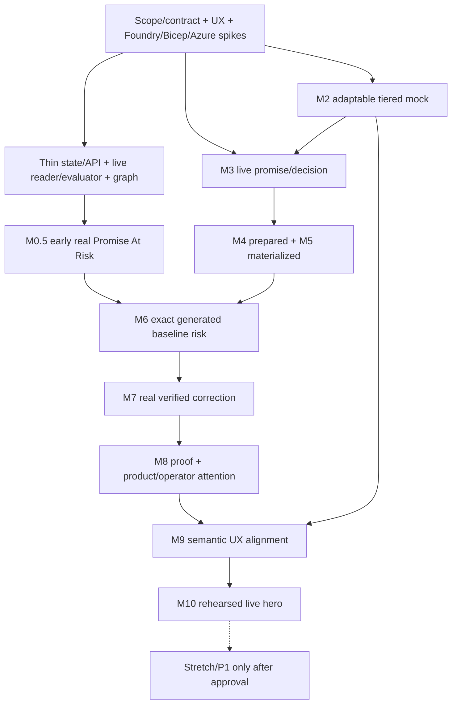

# Intent-to-Impact: Prioritized Local P0 Engineering Tasks

**Status:** Validated local Studio slice with a preserved historical task DAG.
The product is no longer wholly "not started"; neither are all 75 original tasks done.
**Publication baseline:** 2026-09-14. Only the bounded implemented slice below is
reported complete and validated; other original task packets and gates have **not
been re-audited**. No cloud operation or resource creation is authorized by this document.
**Original execution inventory:** 75 tasks (41 P0-HERO, 34 P0-SUPPORT), seven acceptance
gates replacing review-only tasks, six dispatch waves, and a separate six-entry
stretch/P1 hold queue. Original task IDs, dependencies and acceptance packets are
preserved. Review 04 is historical; this revision adds an implementation status overlay.

**Sources**

- [Detailed design specification](./intent-to-impact-design-spec.md)
- [Updated implementation plan](./intent-to-impact-p0-implementation-plan.md)
- Review 03: `_bkp\03-intent-to-impact-implementation-plan-review.md` (local-only, not published)
- Review 04: `_bkp\04-intent-to-impact-task-decomposition-review.md` (local-only, not published)

The implementation plan's current baseline and LOCAL-01 through LOCAL-09 decisions
govern interpretation of this backlog. The specification is also updated; old source
hashes describe historical bytes, not its present content. Task IDs preserve
the parent plan ID, for example `LOC-03-01` belongs to `LOC-03`.

## Current implementation status overlay

**Current priority:** preserve and harden the connected business-first Studio, its
separate assurance/revision loop and compiled package/manual Portal handoff. Do not
restart a manual-only frontend, or make NSP/V3/runtime backlog completion a prerequisite
for the already validated slice.

React `StudioApp` and loopback FastAPI use file-backed jobs/results and the existing
Foundry `gpt-5.2` deployment. **Two local Agent Framework roles/calls** perform synthesis
and separate assurance; there are no three deployed specialists or Hosted Orchestrator.
Strict per-request output schemas and runtime source/graph checks preserve literal
source bindings for existing external systems. Prompts include concrete component-ID
examples. This is a bounded implemented product, not the complete architecture below.

| Capability evidence in the implemented slice | Related original scope (not completion credit) | Status and remaining boundary |
| --- | --- | --- |
| Real alternatives, source inspection, live Studio, Dagre layout with Re-layout/direction/Expand/Fit preserving nodes | UI-01, UI-02, UI-04, INT-01 | Validated slice; not all original screens, graph projections or UX gates. Old `/draft` opens live Studio, not a separate manual workflow |
| Fresh synthesis and separate assurance, strict output/source/graph validation | AGT-01, AGT-02, ENG-01, ENG-02 | Validated two-role flow; original deployed Prompt Agent contracts and AGT-03 implementation/remediation role are not claimed |
| Request recommended change / Challenge -> explicit revision-only approval -> new immutable result and re-review | ENG-02, INT-01, UI-02 | `demo-human` approval binds parent result ID/hash, selected option and exact finding. Not risk waiver, final design signoff, build gate or deployment approval |
| File-backed results and opt-in shared workspace history retaining approvals, failures and packages | FND-02, FND-04, UI-01 | Default session-private. Not proof of complete case/work-engine semantics, real Entra identity or P1 cross-case historical decision awareness |
| Bounded deterministic Bicep catalog, actual compiler, eight-file ZIP, selected-only topology checks and direction-aware queue permissions | SPK-04, LOC-01, LOC-02, UI-03 | Validated package slice; unselected duplicates no longer block a valid selected option. Not the original controlled apply/materialization lifecycle or deployed business app |
| Verified-file/required-parameter **Deploy to Azure** manual Portal handoff | UI-03, HAR-02 (boundary only) | Portal navigation validated; no template upload or resource creation. Target, real Entra/external values and final resource/cost approval remain outstanding |
| Runtime drift/restoration, promise/outcome/attention metrics, full original policy/work-engine integration | ENG-03, ENG-04, INT-02, HAR-02, FND-03, FND-04, E2E-02 | Roadmap or separate proofs; not established by this Studio validation and not re-audited here |

The related IDs are a traceability crosswalk, **not** a status migration or a new task
list. Similar functionality does not satisfy a packet's additional contracts, human
acceptance, live evidence or transitive prerequisites. Original task states and M0.5-M10,
UX and release gates stay unasserted until exact acceptance is independently checked.
No percentage-complete or all-75-done claim is made.

**Reported validation:** fresh publication verification plus earlier bounded proofs;
commands/live calls were not rerun by this documentation edit.

- Current publication frontend verification: **89 tests across 6 files passed**.
  `npm run check:studio`, TypeScript typecheck and
  `npm test -- src/AppRoutes.test.tsx src/studio` passed; `npm run build` also passed.
- Earlier 59 frontend/client/deploy-handoff tests are a historical focused subset,
  not additive to the current 89-test result.
- 25 bundle tests, including 3 real compiler tests.
- 19 model-validation tests.
- 16 approval tests.
- Real Playwright on original `Order fulfilment-#1`, `opt-a`: two distinct compiles,
  SHA-verified eight-file downloads, history recovery and real Portal navigation;
  no upload/create.
- Both real business recommendation and challenge journeys used fresh synthesis
  and separate assurance calls, then produced compiled downloads.

These targeted counts are not a claimed full-suite total. Actual Azure resource
creation has **not been executed or verified**. A revision receipt or compiler pass
cannot close original runtime, promise or deployment acceptance.

For current behavior, use the [user guide](./intent-to-impact-user-guide.md),
[technical deep dive](./intent-to-impact-technical-deep-dive.md) and
[plan baseline](./intent-to-impact-p0-implementation-plan.md#17-implemented-slice-and-reported-validation).
The local product's no-GitHub-PR rule is not a ban on developer publication of this
repository to GitHub `main`; that separately authorized work is not an in-product
delivery receipt. Archives, `.azure`, `.github`, `.intent-to-impact`, virtual environments,
dependencies and build outputs are local-only, not published or required reading.

## Contents

- [Current implementation status overlay](#current-implementation-status-overlay)

1. [Execution contract](#1-execution-contract)
2. [Priority and dispatch rules](#2-priority-and-dispatch-rules)
3. [Owner and write-scope map](#3-owner-and-write-scope-map)
4. [First dispatch and external prerequisites](#4-first-dispatch-and-external-prerequisites)
5. [Wave 1: Contracts, UX and dependency proof](#5-wave-1-contracts-ux-and-dependency-proof)
6. [Wave 2: Thin skeleton and early magic moment](#6-wave-2-thin-skeleton-and-early-magic-moment)
7. [Wave 3: Live promise-to-decision](#7-wave-3-live-promise-to-decision)
8. [Wave 4: Reviewed implementation materialization](#8-wave-4-reviewed-implementation-materialization)
9. [Wave 5: Integrated risk, restoration and proof](#9-wave-5-integrated-risk-restoration-and-proof)
10. [Wave 6: Release support and rehearsal](#10-wave-6-release-support-and-rehearsal)
11. [Stretch and P1 hold queue](#11-stretch-and-p1-hold-queue)
12. [Integration gates and execution graph](#12-integration-gates-and-execution-graph)
13. [Task execution and review protocol](#13-task-execution-and-review-protocol)
14. [Coverage and review traceability](#14-coverage-and-review-traceability)

## 1. Execution contract

**Retained target contract.** Read the current overlay first. Sections 1-14 preserve
the original full-hero packets/DAG; commands, schemas, state machines and workflows
below are requirements for future acceptance, not declarations that they all exist.

### 1.1 Non-negotiable local decisions

- Run the UI, API, deterministic engines and **Agent Framework orchestrator locally**.
  Current Studio uses real Foundry calls through two local roles: synthesis and
  separate assurance. The original three-Prompt-Agent packets below remain historical
  targets; they are not the implemented deployment topology.
  Do not create a Foundry Hosted Orchestrator, cloud bridge or public tunnel.
- Use **files**, one writer and atomically replaced `case.json`; no SQLite, Cosmos DB,
  Service Bus, generalized snapshot store or distributed lock framework in required P0.
- Use one server-fixed **demo-human**. The compact **Demo Identity** marker links to
  the actual identity/separation-of-duties limitation. Models cannot impersonate it.
- No in-product GitHub credentials, remote branches, PRs, remote review or publication
  workflow. Developer publication of this repository is a separate authorized activity.
- **Implementation Prepared -> Implementation Approved -> Implementation Materialized**
  are separate from **Azure Deployment -> Runtime Verified**.
- Retain D12 `LocalApplicationReceipt`, A06 and the `apply-approved-change` command
  for contract compatibility. Server projections map the internal `applied` value to
  **Implementation Materialized**. Do not create duplicate mutable state fields.
- For the retained runtime-proof target, observe a **real authorized Azure sandbox**.
  This is not completed by the Studio package/Portal slice. Fixtures/replays/mock screens cannot
  satisfy live provider, build, materialization or verification proof.
- LOCAL-08 uses a public Storage endpoint, no private networking/verifier VM. New
  scenario V2 explicitly changes CP-01 to HTTPS-only/anonymous-access configuration.
  Historical V1 private-path evidence and approvals cannot satisfy V2. Provisioning
  and drift changes still require separate operator consent.
- Preserve customer-impact promises, deterministic option rejection, the Continuity
  Graph, proactive Customer Promise At Risk, and the three-question Outcome Receipt.
- Headline **Product Human Attention**; disclose **Demo/Test Operator Actions** in a
  separate expandable section. Do not hide required product decisions or operator effort.
- M9 is semantic/interaction/accessibility alignment, **not pixel-perfect matching**.
- JSON Schema is the only source of truth for generated contract types. No manual
  editing of generated Python or TypeScript outputs.
- Run mode is server-defined, persisted and immutable: live, fixture or replay. The
  browser can open another run, never convert an active run or its evidence to live.

### 1.2 What every task packet contains

The dispatch row and execution packet for the same ID jointly define a task:

| Field | Source in this document |
| --- | --- |
| Parent/source scope | Parent prefix, implementation-plan section 15.2 and source crosswalk in section 14 |
| Class, earliest wave, owner and hard dependencies | Dispatch row |
| Objective, bounded scope and explicit outputs | Execution packet |
| Inputs/contracts | Execution packet using D/E/P/A/U IDs from implementation-plan section 7 |
| Write scope/local effects | Scope alias from section 3 plus packet-specific restriction |
| Tests and evidence | Packet acceptance column plus universal completion rule below |
| Mock/production impact, UX checkpoint and reviewer | Dispatch `Review / surface` plus section 3 defaults |
| Promotion path | Shared mock/component rule in section 13; no separate UI rules |
| Integration milestone | Wave/gate mapping in section 12 |

All tasks inherit the exclusions in section 1.1 and the implementation plan's explicit
non-scope. They may not edit another owner's canonical section directly or expand
their root because it is convenient. Most tasks should fit one focused implementation
session, approximately half to one engineering day; review/integration/spike packets
may be shorter. If a packet exceeds that bound, split its acceptance into child tasks
under the same parent before coding; do not turn it into a multi-day hidden epic.

**Done means:** outputs saved; exact acceptance checked; targeted tests pass; error and
evidence modes covered; local diff reviewed; task evidence indexed; relevant UX decision
resolved. A mocked result can close a mock task, not a live integration task.
The budget is scope-based, not a promised completion date.

## 2. Priority and dispatch rules

Historical classes/waves below govern dependencies for remaining full-hero work.
They do not override the current business-first priority or convert implementation
overlap into accepted original tasks.

| Class | Meaning | Dispatch policy |
| --- | --- | --- |
| P0-HERO | Hero-critical capability or live proof | Prefer when ready; retain truth and safety boundaries |
| P0-SUPPORT | Minimal correctness, usability and rehearsal support | Run as soon as it unlocks a hero task; cannot be dropped if a gate requires it |
| P0-STRETCH | Additional polish/recovery permutations | Do not start before M10 passes and explicit capacity is available |
| P1 | Production hardening or later customer journey | No implementation assignment in this P0 backlog |

Waves are **earliest start/priority bands**, not global barriers. A task is ready when
all its explicit predecessor tasks are accepted, its required human configuration is
available, and its write scope is not occupied. Do not wait for every task in a previous
wave. Do not run later completion paths of a parent before their child prerequisites.
Dependencies may include explicit `GATE-*` acceptance records. A gate is reviewed at
the producing build task's acceptance, not assigned as another implementation task.
Only a material finding creates a bounded UXD-linked follow-up; no ritual review task
is required when the result is already acceptable.

M0.5 uses early slices of the same production adapters, evaluators and graph. Parent
plan completion dependencies do not block those narrow child slices; the exact task
DAG below is authoritative for scheduling. M6/M7 still require generated and
materialized/deployed lineage. An early known baseline is not full UC-01 proof.

If two ready tasks share a file/schema, reserve it for one owner and serialize the
edits. Independent adapters or presentation components can proceed in parallel.
One worker per lane is a safe starting point; a second worker is useful only with an
explicit disjoint subtree and contract version. Never equate the number of ready tasks
with permission to launch that many agents.

For each original task that is re-audited or resumed, keep status in a local execution ledger:
`not-started -> ready -> in-progress -> review -> done`, or `blocked`.
Record blocked reason, dependency/evidence, owner and next safe action. The original
"all not started" snapshot is historical. This publication overlay supplies bounded
capability evidence, not per-task acceptance for the complete backlog.

### 2.1 Bundle small same-owner work without hiding acceptance

| Dispatch bundle | Existing task IDs | Execution rule |
| --- | --- | --- |
| CONTRACT-CORE | FND-01-01, then FND-01-03 | One A-owned assignment can freeze base/event types and the runtime/risk projection seam; publish each usable schema slice for Sprint 0A |
| CONTRACT-DELIVERY | FND-01-02, then FND-01-04 | Same owner extends decision/generation/materialization/report contracts; wait for core prerequisites and retain separate acceptance records |

These bundles are dispatch conveniences, not new tasks or duplicate completion credit.
Keep existing child IDs for dependent agents and tests. Do not wait for every delivery
contract before using the core risk seam. Use the same principle for genuinely small
adjacent tasks; do not bundle unrelated code or weaken independent review boundaries.

### 2.2 Minimum Hero Cut

**Historical full-runtime-hero cut, not the implemented Studio delivery boundary.**

The following are **terminal targets and their mandatory dependency closure**, not a
permission to skip support tasks. Dispatch the named visible-path tasks first when
ready; execute every transitive task and gate predecessor needed by each target.
The live hero is integrated at E2E-02-06. M9/M10 remain release gates afterwards.

| Moment | Visible-path tasks to prioritize | Terminal acceptance |
| --- | --- | --- |
| Runtime truth / Sprint 0A | SPK-03-01, FND-01-03, INT-02-01, ENG-03-01 and the guarded seed/setup/commit prerequisites | Actual normalized Azure change yields a deterministic breached evaluation; recorded in INT-01-02 acceptance |
| Magic moment / Sprint 0B | ENG-04-01, UI-04-01, INT-01-02, E2E-02-01 | M0.5: live finding and exact broken graph path in the early UI |
| Promise -> Decision | SPK-01-01, AGT-01-01, AGT-02-01/02, ENG-01-01, ENG-02-01/02, INT-01-03, UI-02-01/02, E2E-02-02 | M3 plus GATE-UX02 |
| Local implementation | SPK-04-01, AGT-03-01, LOC-01-01/02, LOC-02-01/02/03, LOC-03-01, UI-03-02, E2E-02-03 | M4/M5 plus GATE-UX03 |
| Risk / restoration | HAR-02-02, INT-02-02, ENG-03-02, AGT-03-02, LOC-02-04, HAR-02-03, UI-04-02, E2E-02-04/05 | M6/M7 plus GATE-UX04 |
| Customer proof | ENG-04-02/03/04, UI-05-02, HAR-01-03, E2E-02-06 | M8 plus GATE-UX05 |

`01/02` shorthand denotes the two existing task IDs under the same prefix, not a new
ID. The dispatch tables below are machine-resolvable and include all prerequisites.
No safe live path exists merely by running the short visible-path list alone.

The precise minimum-cut membership is defined as the dependency closure of
`E2E-02-01`, `E2E-02-02`, `E2E-02-03`, `E2E-02-04`, `E2E-02-05`,
`E2E-02-06`, `GATE-UX02`, `GATE-UX03`, `GATE-UX04`, and `GATE-UX05`,
including those targets themselves. Section 12 declares gate prerequisites.
The task/gate graph, not HERO versus SUPPORT alone, determines what is indispensable.

For the preserved original DAG this is **68 tasks (41 HERO, 27 SUPPORT) and five UX
gates**. The seven remaining tasks are release support: SPK-06-01, UX-04-01,
E2E-01-02, E2E-01-03, HAR-02-04, UX-04-02 and E2E-02-07. GATE-UX06 and
GATE-RELEASE complete release acceptance. Recalculate this count if dependencies
change; do not advertise the 41 HERO-labelled tasks alone as the whole implementation.

Required work outside that closure remains release support: core accessible layout
checks, consolidated failure tests, reset, semantic alignment and repeated live
rehearsals. These are not required to call M0.5 an early technical proof, but cannot
be skipped when claiming M10 readiness.

## 3. Owner and write-scope map

These are the original proposed ownership paths, not a current repository inventory.
Path aliases avoid repeating long roots while remaining bounded. The current Studio's
actual implementation need not imply that every proposed module here exists.

| Alias | Proposed permitted source subtree | Default owner / reviewer | Local artifact effects |
| --- | --- | --- | --- |
| C-DOM | `contracts\domain\`, generated type outputs | A / E | Schema/test artifacts only |
| C-EXP | `contracts\experience\`, `contracts\events\`, capability registry | A / C/E | Projection/action contract outputs |
| STORE | `apps\control-plane\state\`, `engines\case\` | A / E | `runs\<id>\cases\<id>\case.json`, derived events only |
| POLICY | `apps\control-plane\policy\` | A / B/E | Decision/denial events, no cloud grants |
| WORK | `apps\control-plane\work\` | A / E | Bounded work/event/idempotency records inside case state |
| API | `apps\control-plane\api\` | A / C/E | Authorized projections and commands; no arbitrary paths |
| REQ | `engines\requirements\` | A / E | Confirmed requirements/promises via STORE |
| DESIGN | `engines\architecture-model\`, `engines\review-gates\`, `engines\decisions\` | A / B/E | Logical sections have separate owners through STORE |
| EVAL | `engines\drift\`, promise verifier registry | A / B/E | Findings/evaluations and evidence refs |
| REPORT | `reporting\` | A / C/E | Immutable graph/receipt exports and derived attention/away |
| FOUNDRY | `adapters\foundry\`, `apps\control-plane\orchestrator\`, `agents\` | B / A/E | Real invocation receipts; no agent approval tools |
| LOCAL | `adapters\local\`, `engines\generation\`, approved `templates\bicep\` | B, materialization coordinator A / E | Immutable candidates/materialized files, command receipts |
| AZURE | `adapters\azure\` | B / A/E | Read-only normalized provider evidence |
| HARNESS | `tools\` | E / A/B | Explicit owned run setup, operator receipts and scoped commands |
| UI | `apps\experience\src\` | C / D/E | Browser read/action events; no local filesystem writes |
| UX | `design\`, shared UI token/component contracts | D / C/A | Journey, tokens, checkpoint/UXD records |
| FIX | `fixtures\experience\`, `fixtures\scenarios\`, fixture transport | A owns shape; D authors reviewed content / E/C | Mock responses never stored as live evidence; scenario text can be a confirmed input to a fresh live run |
| TEST | `tests\` matching subject subtree | E; implementation owner adds unit tests / relevant owner | Test outputs and proof references |

The original run-contract target places live run data under a manifest-resolved
`.intent-to-impact\runs\<run-id>\` (local-only, not published).
Raw credentials never reside there or in source/fixtures. Task test output goes under
that run's `task-evidence\<task-id>\`; acceptance gates store local checkpoint records.
Any Azure mutation requires the named operator's separate consent and allowlisted
scope; assigning a task is not that consent.

Review shorthand: `UX01` through `UX06` mean the full UX-Checkpoint-01 through
UX-Checkpoint-06 in the implementation plan. `domain`, `adapter`, `evidence`, `safety`
refer to review type, not a new authority role. Surface values: `mock`, `live`, `both`,
`none` (no visual change). Every visible change uses the same approved component/props,
updates affected fixture examples, and records a UXD reference when semantics change.

### 3.1 One integration owner for every shared artifact

| Shared artifact | Integration owner | Contributor rule |
| --- | --- | --- |
| Domain/experience/event JSON Schemas, case.json shape and capability registry | A | Contributors propose a typed diff; A alone updates the shared schema during the dispatch window |
| Generated Python/TypeScript contract types and generator lock/config | A through FND-01-01 | Regenerate from JSON Schema; no manual edits, independent models or hand-patched interfaces |
| Shared UI props/components and fixture/live transport interface | C | D proposes interaction/mock changes; C integrates shared source, preserving component reuse |
| Design tokens/approved visual inventory | D | C consumes versioned tokens; token changes return to D rather than local copies |
| Projection fixture shape/content | A for shape, D for authored scenario content | Shape is schema-owned; content changes serialized against the frozen schema and canonical scenario |

Reserve the specific files and integration owner in the dispatch ledger, not just the
lane. Owner changes require an explicit handoff and current contract version. Parallel
contributors may work in isolated subtrees, but cannot each overwrite shared artifacts.
Human UX review is not a second canonical writer.

FND-01-01 owns the sole type-generation mechanism:
**JSON Schema -> pinned generator -> Python/TypeScript outputs -> contract drift tests**.
Generated files carry a generated notice; a regenerate-and-compare check fails when
outputs diverge. Runtime schema validation remains authoritative. Presentation-only
props may be handwritten in the C-owned UI layer but must use, not redefine, generated
domain/projection types. Avoid a custom compiler or multiple competing generators.

### 3.2 Shared acceptance for every UI packet

Every UI task and its mock equivalent must satisfy **at most one visually dominant
action per hero screen**. Multiple required decisions can remain separate actions, but
only the current next one receives primary emphasis. Secondary navigation, cancel,
download and disclosure actions must not compete with it.

| Screen | Dominant action for its current stage |
| --- | --- |
| Promise | Answer or Confirm the current consequential input |
| Options | Select the eligible option, then Approve the exact selected design |
| Implementation | Review the change, then Materialize only after required approval |
| Customer Promise At Risk | Review Correction |
| Outcome Receipt | Inspect Evidence or Finish |

This is hierarchy, not permission: server allowedActions determine availability.
Keep keyboard access to every secondary action and retain clear rejection/blocked
messages. UX gates reject a cluttered admin-style hero or visually implied permission.

The evidence drawer's initial level is customer-readable: source, observed time,
resource, freshness/status and supported promise. Provider request IDs, checksum,
collector/version, full scope and safe raw-artifact link remain one expansion away
under **Technical details**. Do not hide a stale/missing/fixture limitation in that
expansion. The graph remains a bounded projection and the away panel a concise
completed-work/current-decision summary, not independent platforms.

## 4. First dispatch and external prerequisites

**Historical first-dispatch plan.** Current Studio/model/compiler integration exists;
consult the overlay before resuming any packet. The runtime track below requires its
own scope and approval and does not delay the current business-first flow.

Original parallel starts, subject to owner availability:

| Track | First assignment | Stop/escalate if |
| --- | --- | --- |
| A: contracts | FND-01-01, then the risk/graph subset FND-01-03 | Canonical/projection ownership unclear |
| B: Azure risk | SPK-03-01 | No explicit sandbox scope, valid baseline, safe seed or verifier path |
| B: Foundry, independent worker if available | SPK-01-01 | Model/agent access or SDK behavior unproven |
| D: product | UX-01-01 and UX-03-01, then UX-02-01 | Local/materialized/runtime wording or hero hierarchy ambiguous |
| E/B: tangible artifacts | SPK-04-01 | Actual compiler/module resolution unavailable |
| A/E: file sanity | SPK-02-01 | The selected filesystem cannot support a bounded safe replacement |

External configuration is supplied by the operator, not inferred from an active CLI
subscription: Foundry project/model/agent permissions; Azure sandbox resource IDs;
approved observation scope and seed/rollback; legitimate baseline deployment; live
V2 property-read access; installed/pinnable local tools. Independent tasks may continue while
one prerequisite is blocked. There is no GitHub prerequisite.

If CP-01 cannot be safely verified, SPK-03-01 records the blocker. The source permits a
separately approved safe promise change before rehearsal; update contracts, fixtures
and tests deliberately. No task can quietly replace live Azure with a local JSON file
or silently lower the current scenario's verification criteria. LOCAL-08 is an explicit
public-only scenario revision, not a private-network pass.

**LOCAL-09 supersedes the historical V2 networking target, not this task DAG or the
current Studio package scenario.** After an actual
inherited-policy conflict stopped creation, the user selected Storage behind an
NSP, one profile and an Enforced association with zero external access rules.
SPK-03-01 must prepare and validate that exact replacement before final deployment
confirmation; no exclusion tags, policy changes or private networking are allowed.
The retained sandbox-track decision is in implementation-plan section 1.1.

A owns the versioned V3 scenario/contract publication; B returns genuine NSP and
storage observation fields; D/C migrate the corresponding fixtures and wording
after publication. Preserve V1/V2 artifacts and hashes. The existing V2 fixture
seam can unblock reusable mock shell/graph development only with an explicit
historical-fixture notice. No V2 evaluation may be relabelled current NSP proof.
These bounded revision continuations are not additional tasks in the 75-task count,
and no technical acceptance passes GATE-UX01.

### 4.1 Sprint 0A and 0B: runtime truth before broad infrastructure

These are retained separate runtime-proof targets, not the current delivery order
and not proof supplied by Portal navigation.

**Sprint 0A:** Prioritize SPK-03-01, CONTRACT-CORE, INT-02-01 and ENG-03-01.
Add only their bounded store, policy, operator seed and ingest prerequisites. Produce
actual baseline -> approved changed property -> normalized evidence -> `breached`
evaluation. Record this as the first acceptance check in INT-01-02; do not wait for
options, general generation, all UI fixtures or full agent plumbing.

**Sprint 0B:** Reuse the result through ENG-04-01, UI-04-01 and the remaining
INT-01-02 integration to E2E-02-01. Prove persisted finding -> exact broken graph edge
-> proactive Customer Promise At Risk UI. Do not introduce a second demo-only evaluator.

Foundry/Bicep spikes and the small hero mock can proceed in parallel. Delay substantial
broader infrastructure and P1 work until these proofs succeed. If Azure is blocked,
record it and continue independent work; do not call a fixture the completed sprint.

### 4.2 Immutable run mode and disposable early-proof state

At run creation the server writes D22 with immutable `runId`, `runMode` (`live`,
`fixture`, `replay`), `purpose` (`magic-moment-proof`, `hero`, `ux-mock`, `test`,
`rehearsal`), scenario ID/version/hash, configured scope and optional sourceRunId for
replay. UX mocks use runMode fixture and purpose ux-mock. `purpose` is also immutable.

Every request, worker job, approval, materialization and cloud-adapter call checks the
stored run context; a client-provided mode cannot override it. Fixture/replay runs
cannot invoke live model, Azure mutation or live-proof collectors. Fixture generation
and local preview artifacts stay under their own run directories and retain their
evidence classification. To change mode, create a new run and start the applicable
workflow; no copy/promote-state endpoint exists.

An immutable replay preserves original source references/times and never becomes fresh
evidence. Scenario text can be synthetic inside a live run; provider execution must
still be genuine and independently labelled.
Record the true origin of an actual local command even in a test run, but determine
hero-proof eligibility from both that origin and the immutable run context. A
fixture-run compiler test is not a completed live hero merely because compilation ran.

**M0.5 validates production code paths, not final hero case state.** Reuse the Azure
reader, normalizer, evaluator, graph, UI and evidence schema. Do not promote its
pre-supplied confirmations, known architecture graph, case IDs, shortcut test setup,
runtime binding or approval records into UC-01. After proof, archive the early run
for audit and create a fresh hero run with genuine confirmation/generation decisions.
A legitimate reusable Azure sandbox may remain, but the hero must independently record
its proper approved/deployed binding; copying M0.5's case JSON is forbidden.

### 4.3 Canonical scenario: DEMO-CASE-CLAIMS-V2

**Frozen historical scenario.** Current Studio browser validation uses Order fulfilment;
it neither mutates this V2 oracle nor verifies the pending NSP/V3 successor.

One versioned scenario artifact under `fixtures\scenarios\` is the stable shared input
for applicable mock, agent, engine and test work. FND-01-03 publishes the first
scenario artifact with the risk seam; FND-01-02 connects its fixed oracle to architecture
schemas. UX-01-01 owns approved business wording; E2E-01-01 owns assertion tests. These owners
do not independently author differing scenarios.

| Field | V2 definition under LOCAL-08 |
| --- | --- |
| Scenario ID | `DEMO-CASE-CLAIMS-V2`, scenario version 2.0.0, schema version 1.0.0, new immutable content hash; V1 retained historically |
| Business intent | Fictional Contoso Insurance must prepare digital claims for its customer-confirmed seasonal deadline; protect sensitive claims documents, keep approved US data geography, recover within 60 minutes, and keep the defined estimated workload cost within USD 8,000/month |
| Initial missing decision | RPO is null/unconfirmed; ask the consequential RPO question; scripted acceptance answer is 15 minutes, requiring an actual human confirmation in live mode |
| Customer context | One versioned approved service/module catalog and deterministic rule pack; no history/partner dependency |
| Candidate catalog | A: synthetic comparable USD 6,000/month; lacks the catalog's approved regional-recovery profile. B: synthetic USD 7,200/month; includes the approved active-passive recovery profile and required controls. C is optional P1, not required in V1 |
| Desired sandbox | Empty/synthetic-data Azure StorageV2 with publicNetworkAccess Enabled, supportsHttpsTrafficOnly true, allowBlobPublicAccess false and minimumTlsVersion TLS1_2; no private endpoint, private DNS, VNet, VPN or verifier VM |
| Resource configuration | Subscription, region, IDs and deployment receipts are operator-bound at preflight, never guessed or hard-coded as real resources in the scenario |
| Seed | Separately authorized supportsHttpsTrafficOnly change to false on the empty sandbox; anonymous blob access stays disabled and no real data is sent over HTTP; if policy prohibits it, block rather than bypass |
| Restoration | Reconcile runtime to the approved V2 desired-state hash with supportsHttpsTrafficOnly true; verify all four declared configuration predicates afresh |
| Expected product sequence | Confirm -> eligible design approval -> prepared/approved/materialized files -> acknowledged Azure baseline -> observed breach -> prepared correction -> authorized restoration -> fresh scoped verification |
| Evidence limits | Other promises without adequate evidence remain unknown; neither default 7/8 nor 8/8 is required. Budget/RPO design claims are not actual billing or recovery-test proof |

The eight promise IDs retain the specification's meanings:

| Promise ID | Bounded acceptance intent |
| --- | --- |
| CP-01 | Claims storage uses its approved public endpoint with HTTPS required, anonymous blob access disabled, and minimum TLS 1.2; verification is scoped configuration assurance, not private-connectivity or complete access-control proof |
| CP-02 | Approved managed identities and scoped roles for declared data operations |
| CP-03 | Approved storage encryption and secure-transfer controls |
| CP-04 | Recovery within 60 minutes for the specified regional-loss scenario; runtime proof requires a matching test |
| CP-05 | Confirmed RPO 15 minutes for the same scenario; no automatic confirmation |
| CP-06 | Declared processing/storage/dependencies in approved US geography with adequate scope evidence |
| CP-07 | Defined monthly workload cost basis <= USD 8,000; complete billed period required for runtime verification |
| CP-08 | Required diagnostics enabled and configured retention >= 90 days, not a claim that 90 days of logs already exist |

### 4.4 Frozen rejection oracle and simple remediation

The V2 test oracle retains the same normalized catalog-backed recovery/cost criteria,
with public-only CP-01 controls. It evaluates attributes, not prose:

```text
A: cost = 6000 < 7200; approved regional-loss recovery profile absent
   -> mandatory recovery-design rule fails -> INELIGIBLE
B: cost = 7200 <= 8000; approved recovery profile and mandatory design controls pass
   -> ELIGIBLE -> lowest-cost eligible recommendation
```

RTO/RPO design support must come from reviewed catalog/rule criteria, not a model
declaring "60" and "15." The promise runtime state stays unknown without actual test
evidence. Exclude A from eligible selection even when an agent likes its lower price.
Do not report a financial saving from comparing an infeasible option with a compliant
one, and do not import the unrelated USD 310 fixture into this hero.

The candidate catalog and scenario facts are deterministic inputs. Live Foundry
reasoning must still generate typed mappings/explanations and genuine review findings.
Its wording and analysis can vary; engines rederive eligibility. Missing, contradictory
or malformed live output blocks/retries as specified, never silently uses a canned
proposal or overwrites a verdict to force a good demo. The oracle is fixed for its
specified inputs, not a guarantee that every live model run succeeds.

Runtime-only remediation reuses unchanged approved Bicep. A minimal non-executable
plan records `action=reconcile-runtime-to-approved-state`, desiredStateHash,
finding/promise/resource refs, approval refs and existing verifier/rollback refs.
Keep it within D18/D11; do not build a new artifact platform or generic command runner.
Materialization may add the reviewed plan/receipt without a gratuitous Bicep edit.
Only the allowlisted operator capability can reconcile Azure after explicit consent.

## 5. Wave 1: Contracts, UX and dependency proof

### Dispatch

| Task ID | Class | Owner | Hard dependencies | Scope | Review / surface |
| --- | --- | --- | --- | --- | --- |
| FND-01-01 | P0-SUPPORT | A | None | C-DOM, C-EXP | domain / none |
| FND-01-02 | P0-SUPPORT | A | FND-01-01 | C-DOM, FIX scenario | domain / none |
| FND-01-03 | P0-HERO | A | FND-01-01 | C-DOM, C-EXP | domain + UX04 draft / both |
| FND-01-04 | P0-SUPPORT | A | FND-01-02, FND-01-03 | C-DOM, C-EXP | domain + UX03 draft / both |
| UX-01-01 | P0-HERO | D | None | UX | UX01 draft / mock |
| UX-02-01 | P0-SUPPORT | D | UX-01-01 | UX, UI tokens | UX01 draft / both |
| UX-03-01 | P0-SUPPORT | D | None | UX | UX01-06 process / none |
| SPK-01-01 | P0-HERO | B | None | TEST spikes, FOUNDRY sample boundary | adapter / none |
| SPK-02-01 | P0-SUPPORT | A | None | TEST spikes | safety / none |
| SPK-03-01 | P0-HERO | B | None | TEST spikes, AZURE sample boundary | adapter + safety / none |
| SPK-04-01 | P0-HERO | B | None | TEST spikes, LOCAL template sample | adapter / none |
| E2E-01-01 | P0-SUPPORT | E | FND-01-01 | TEST | evidence / none |
| MOCK-01-01 | P0-HERO | A | FND-01-03, UX-02-01 | FIX | UX01/04 draft / mock |
| MOCK-01-02 | P0-SUPPORT | A | MOCK-01-01, FND-01-04 | FIX | UX01-05 draft / mock |

### Execution packets

| Task ID | Bounded objective and inputs -> outputs | Acceptance, tests and evidence |
| --- | --- | --- |
| FND-01-01 | Freeze D01/D22 and E01-E04/E07/E08 base envelopes, immutable runMode/purpose/scenario hash, one actor and minimal case.json. Own pinned JSON Schema -> Python/TypeScript generation. | Schema negative tests, mode mutation rejection, reproducible regenerate-and-compare check; generated types not manually editable. No custom type compiler or independent hand-maintained model definitions. |
| FND-01-02 | Define D02-D09 requirements/promises/options/review/decision/approval schemas and connect DEMO-CASE-CLAIMS-V2's fixed catalog oracle. Preserve six gates and separate approval status. | Unknown RPO cannot auto-confirm; catalog A fails mandatory recovery design, B passes exact requirements; price examples not actual billing. Real typed model output required; no fixture fallback. |
| FND-01-03 | Freeze D13-D17/P01/P05/P06 risk seam, minimal D03 linkage and E05 classification. Publish scenario V2 and its public-endpoint CP-01 predicates for M0.5. | Missing binding/property evidence is unknown; failed secure-transfer property is breached; V1 private-path proof not reused. Facts and IDs match section 4.3; no private-network provisioning. |
| FND-01-04 | Define D10-D12, D18-D21 and P02/P03/P04/P07/P08/P09. Include materialization display mapping, runtime-only remediation descriptor, nullable savings and separate product/operator counters. | Contract examples for prepared/approved/materialized/pending/verified and correction; schema tests keep states distinct; generated Python/TS types agree or record checked generation route. |
| UX-01-01 | Design five-moment IA, navigation and customer impact hierarchy from source/local decisions; identify all FX states and Tier 1/2/3 visual priorities. | Reviewed local journey map includes every requested interaction and no P1 path; recorded UX01 questions; one dominant risk moment and clear Materialized wording. |
| UX-02-01 | Define a small shared token set and component/state inventory. Tier 1 gets deliberate typography, space and focused lineage; Tier 2/3 stay functional. | Token/prop artifacts map to fixtures/components; contrast/focus examples; no remote fonts/services dependency; both mock and live will consume the same tokens. |
| UX-03-01 | Establish lightweight UXD/checkpoint record template and promotion workflow. No heavyweight design management app. | Example feedback -> decision -> component/fixture/task mapping works; records have owner, rationale, state and acceptance; six checkpoint agendas exist without false approval. |
| SPK-01-01 | Prove local Agent Framework can call actual Foundry models and private Prompt Agents through the supported SDK/API. Pin versions and typed response/stream behavior. | Record actual IDs, version, valid and failed invocation evidence; no Hosted Orchestrator/relay. Block with diagnostic rather than replay if access fails. Timebox; production adapter comes later. |
| SPK-02-01 | Prove same-directory atomic replacement and single-writer rejection on selected local filesystem. Include restart and unreferenced artifact case. | Bounded failure test shows intact old/new case JSON and no external overwrite; record supported path/tool behavior. No fencing, distributed lease, every-instruction kill matrix or database build. |
| SPK-03-01 | Validate explicit sandbox permissions, actual V2 deployment/resource baseline, public-endpoint CP-01 property evidence and safe seed/restoration procedure. | Capture live properties, exact seed/rollback proposal and latency; no private infrastructure. Missing resource/evidence blocks proof; any mutation requires separate approval. |
| SPK-04-01 | Compile an approved narrow Bicep sample using actual `az bicep build`; resolve module versions and map template resource to component/promise. | Actual exit/stdout/stderr/tool version and file hashes; blocked module/tool captured; source permits reviewed local module, not fake compilation. |
| E2E-01-01 | Turn DEMO-CASE-CLAIMS-V2 and invariant/live-proof expectations into executable acceptance oracles. Fixtures remain test inputs, not provider execution. | Tests cover A-ineligible/B-eligible, unknown RPO, V2 property verification, mode immutability and origin separation; V1 approval/evidence cannot be silently rebound. |
| MOCK-01-01 | Materialize complete initial P01 responses for promise, risk/graph, pending and verified states using FND-01-03; include missing evidence, live-looking but explicitly mock data. | Schema checks pass; fixed topology graph and status conditions are fixture inputs, not frontend algorithms; fixture transport cannot call real mutation APIs. |
| MOCK-01-02 | Complete FX-00..19 and named correction/materialization subvariants against full projection schemas. | Every required state and allowed action represented; separate material approval/delivery/materialization examples; all origins mock/fixture; no new user-facing journey. |

## 6. Wave 2: Thin skeleton and early magic moment

### Dispatch

| Task ID | Class | Owner | Hard dependencies | Scope | Review / surface |
| --- | --- | --- | --- | --- | --- |
| FND-02-01 | P0-SUPPORT | A | FND-01-01, SPK-02-01 | STORE | safety / none |
| FND-03-01 | P0-SUPPORT | A | FND-01-01 | POLICY | domain + safety / both |
| FND-04-01 | P0-SUPPORT | A | FND-02-01, FND-03-01 | WORK | domain / both |
| INT-01-01 | P0-SUPPORT | A | FND-02-01, FND-03-01, FND-01-03 | API | domain / live |
| HAR-01-01 | P0-SUPPORT | E | INT-01-01 | HARNESS | safety / none |
| INT-02-01 | P0-HERO | B | SPK-03-01, FND-01-03 | AZURE | adapter / live |
| HAR-02-01 | P0-SUPPORT | E | INT-02-01, HAR-01-01 | HARNESS | safety / none |
| ENG-03-01 | P0-HERO | A | FND-01-03 | EVAL | domain / both |
| ENG-04-01 | P0-HERO | A | FND-01-03 | REPORT graph | domain + UX04 / both |
| INT-01-02 | P0-HERO | A | INT-01-01, INT-02-01, ENG-03-01, ENG-04-01, FND-04-01 | API risk projection | domain / live |
| UI-01-01 | P0-HERO | C | MOCK-01-01, UX-02-01 | UI shell/transport | UX01 draft / both |
| UI-04-01 | P0-HERO | C | MOCK-01-01, UX-02-01 | UI graph/risk | UX04 early / both |
| E2E-02-01 | P0-HERO | E | INT-01-02, UI-04-01, UI-01-01, HAR-02-01, HAR-01-01 | TEST M0.5 | evidence + UX04 early / live |
| MOCK-02-01 | P0-SUPPORT | D | MOCK-01-02, UX-02-01, UI-01-01, UI-04-01 | UI mock components, FIX transport | UX01-05 draft / mock |
| SPK-05-01 | P0-SUPPORT | A | INT-01-01, FND-04-01 | TEST transport spike | domain / both |
| SPK-06-01 | P0-SUPPORT | D | UI-04-01, UI-01-01 | UI graph/list, TEST UX | UX04 / both |

### Execution packets

| Task ID | Bounded objective and inputs -> outputs | Acceptance, tests and evidence |
| --- | --- | --- |
| FND-02-01 | Implement create/read/commit case.json, immutable D22 run mode/purpose/scenario identity, revision checks and basic single-writer replacement. | Old state intact on failure; restart preserves run mode; attempts to switch fixture/replay to live or import M0.5 canonical state as hero fail. No HEAD/fencing framework. |
| FND-03-01 | Guard every UI/CLI/model/worker entry by stored immutable run context, fixed human, server scope and capability allowlist. | Tampered actor/mode/root and cross-origin calls rejected; fixture/replay cannot invoke live model or Azure operations; agent cannot approve/materialize/deploy. Demo Identity detailed disclosure retained. |
| FND-04-01 | Persist bounded work/event/idempotency records in case.json; generate events.ndjson. Stamp immutable event IDs and server activityClass. | Same key/same payload returns same work/receipt, different payload conflicts; restart preserves pending work; failed NDJSON export is explicit and rebuildable; no duplicate product/operator counts. |
| INT-01-01 | Implement minimum create/read/action error seam and one confirmation mutation; registry allows a bounded known-baseline setup action for integration tests. | Harness/API share state; invalid revision returns stable error; no unknown route can bypass policy; projections are server-generated; local source directory cannot be client-supplied. |
| HAR-01-01 | Add PowerShell start/status/show-case/show-evidence wrappers plus known-case baseline setup through the guarded engine seam. | Explicit human confirmation captures supplied promise contract; legitimate provider binding inputs validated; one actual command/receipt visible; no direct canonical editing or automatic production approval. |
| INT-02-01 | Implement reusable exact-scope Azure reader and normalizer from spike evidence. Fetch configuration/path evidence only within explicit allowlist. | Genuine provider response metadata and hashes; partial/403/timeout/stale cases visible; fixture mode explicitly separate; no creation/seed/deployment in observer. |
| HAR-02-01 | Implement narrow approved seed and baseline restore wrappers for M0.5 using the known sandbox setup. Keep later generic deployment/materialization integration out. | Separate operator confirmation of exact resource/property, before/after evidence and rollback; refuse other scopes or policy bypass; active app/model cannot invoke operator mode. |
| ENG-03-01 | Implement pure promise predicates, phase/mode eligibility and count reduction for one selected live promise; unknowns stay in denominator. | Unit tests for live/fixture, stale/missing, conclusive breach and all-predicates-pass; no fixed 7/8 output or model override. Consumes normalized D15/E01, not Azure SDK directly. |
| ENG-04-01 | Implement pure scoped graph projection from existing lineage refs; accept known legitimate baseline only inside magic-moment-proof runs. | Exact affected edge and gaps; stable IDs; no graph database, generic traversal, relationship-management API, authoring/editing or UI inference. |
| INT-01-02 | Join one scheduled/commanded observation -> evaluator -> committed finding -> risk/graph projection; reuse existing reader/engines. | Live path persists D15-D17 and E04; re-reading does not rescan; basic scheduler starts only after authorization; duplicate poll updates one finding. |
| UI-01-01 | Build shared shell, select/create a run with server-locked mode, show identity/origin and load projections. Switching mode means opening a new run, not an active-case toggle. | Mode patch rejected server-side; fixture cannot call live actions; one dominant action on each hero screen; smoke keyboard/navigation and API failure tests. |
| UI-04-01 | Build Tier-1 focused promise-at-risk card/graph and accessible ordered list from P05/P06. | Actual broken edge text, customer impact and as-of origin visible; no color-only state; real-data-compatible props; layout functions on desktop and narrow width. |
| E2E-02-01 | Execute Sprint 0B / M0.5 after INT-01-02's Sprint 0A runtime truth proof. Reuse production code with known setup in purpose=magic-moment-proof. | Correlate real seed/read/finding/graph; archive early run and restore safe setup. Test fresh hero run cannot adopt its case/approval/binding data. No fabricated runtime proof or full UC-01 claim. |
| MOCK-02-01 | Finish interactive shared-component hero mock and all FX states at tiered fidelity. Reuse graph/shell; do not duplicate product components. | All 18 required experiences navigable, including explicit approval/materialization and pending restoration. Every response schema-valid and mock-labelled; functional failure/recovery states present. |
| SPK-05-01 | Prove bounded SSE delivery or documented current-projection reload after reconnect; reuse durable work IDs. | Disconnection does not approve/cancel/repeat commands; same work resumed; missed history explicitly shown. Advanced replay store is deferred, not spike output. |
| SPK-06-01 | Test graph/list, diff preview and evidence drawer concept with keyboard/zoom/narrow layout. | Record usable fallback (ordered list/simple per-file diff); no new graph service. Fix blocking basic access, defer pixel/device permutations. |

M0.5 may precede full M1/M2 acceptance. Its contract and write safety are real, but
the known input replaces discovery only for that early run; it does not prove live AI
decisions or new infrastructure generation. Code and evidence formats feed later tasks.

## 7. Wave 3: Live promise-to-decision

The packets below preserve original specialist and decision requirements. Two local
roles now provide a validated Studio subset, but deployed Prompt Agent versions,
full decision classes and all packet acceptance are not implied or marked done.

### Dispatch

| Task ID | Class | Owner | Hard dependencies | Scope | Review / surface |
| --- | --- | --- | --- | --- | --- |
| AGT-01-01 | P0-HERO | B | SPK-01-01, FND-01-02, FND-03-01 | FOUNDRY | adapter + safety / live |
| AGT-02-01 | P0-HERO | B | AGT-01-01 | FOUNDRY synthesis | adapter / live |
| AGT-02-02 | P0-HERO | B | AGT-01-01 | FOUNDRY assurance | adapter / live |
| AGT-03-01 | P0-HERO | B | AGT-01-01, FND-01-04 | FOUNDRY implementation | adapter / live |
| ENG-01-01 | P0-HERO | A | FND-02-01, FND-03-01, FND-01-02 | REQ | domain / both |
| ENG-02-01 | P0-HERO | A | ENG-01-01 | DESIGN model/review | domain / both |
| ENG-02-02 | P0-HERO | A | ENG-02-01, FND-03-01 | DESIGN decisions | domain + safety / both |
| INT-01-03 | P0-HERO | A | ENG-02-02, AGT-02-01, AGT-02-02, INT-01-01, FND-04-01 | API decision flow | domain / live |
| UI-02-01 | P0-HERO | C | UI-01-01, MOCK-02-01, GATE-UX01 | UI intent/question | UX02 / both |
| UI-02-02 | P0-HERO | C | UI-02-01 | UI options/decision | UX02 / both |
| FND-04-02 | P0-SUPPORT | A | SPK-05-01, INT-01-01, FND-04-01 | WORK, API events | domain / live |
| E2E-02-02 | P0-HERO | E | INT-01-03, UI-02-02, FND-04-02, HAR-01-01, E2E-01-01 | TEST UC01 decision | evidence / live |
| UX-04-01 | P0-SUPPORT | D | SPK-06-01, MOCK-02-01, GATE-UX01 | UX, TEST | UX03/04 draft / both |
| UI-03-01 | P0-SUPPORT | C | UI-01-01, MOCK-02-01, GATE-UX01 | UI implementation/diff | UX03 draft / both |
| UI-05-01 | P0-SUPPORT | C | UI-01-01, MOCK-02-01, GATE-UX01 | UI receipt/evidence | UX05 draft / both |

### Execution packets

| Task ID | Bounded objective and inputs -> outputs | Acceptance, tests and evidence |
| --- | --- | --- |
| AGT-01-01 | Implement local Agent Framework orchestration adapter, real Foundry call receipts, version config and narrow engine tool contract. | Actual model invocation evidence, explicit retry/timeouts and typed errors; no approval/materialize/deploy tool. No hosted orchestrator, public callback or fake history. |
| AGT-02-01 | Wire synthesis Prompt Agent to minimal D02/D03/current catalog packet; output D04 option proposals. | Real named/versioned agent calls; schema-invalid assumptions rejected; input hashes/evidence provenance captured; no canonical writes. |
| AGT-02-02 | Wire independent assurance Prompt Agent modes to exact model/requirements; keep security/reliability/cost results separate. | Actual invocation IDs; typed findings cite inputs, inference cannot soften deterministic failure. Modes may parallelize within same packet scope; no extra agents claimed. |
| AGT-03-01 | Wire implementation/remediation Prompt Agent packets to D09/D18 proposals including bounded desired state, rollback and verification criteria. | Actual agent result schema-checked; arbitrary scripts/paths rejected; generated-file writing remains deterministic. Test initial and remediation sample packets without applying anything. |
| ENG-01-01 | Implement confirmed intent/promise/customerImpact and issued RPO question flow through single writer. | Required unknown blocks dependent design only; explicit answers advance revision; missing or inferred values never auto-confirm; frontend renders P02. |
| ENG-02-01 | Validate architecture and narrow rule set, deterministic eligibility, review recording and aggregate gate result. | Cheapest failed option excluded, approved catalog enforced, result stricter of checks/review; unknown recovery evidence not runtime verified. No UI or model decides eligibility. |
| ENG-02-02 | Implement explicit version-bound decision/approval receipts for design, local delivery and material correction classes. | Same demo-human recorded honestly with distinct actions; stale/checksum-mismatch approval rejected; negative and duplicate cases tested. No independent-person security claim. |
| INT-01-03 | Connect UC-01 commands from intent through live synthesis/review and human decision, generating joined P02/P03. | End-to-end API state uses engine-approved actions; authoritative completion distinct from narrative; retry does not duplicate approvals; failures remain visible. |
| UI-02-01 | Connect PromiseCard/QuestionPanel to server-issued fields and action envelope, preserving customer impact and confirmation purpose. | Real projection and mock share props; missing/stale/question failure states render; keyboard focus maintained. No inferred confirmations; actions emit correct intent only. |
| UI-02-02 | Connect options and design approval screens, including rejected rationale and subject version/limitations. | Eligible/rejected props honoured; tampering a disabled button cannot authorize server action; explicit approve versus inspect; same semantic mock/live behavior. |
| FND-04-02 | Complete basic progress SSE and current-state resync, with stable cursor IDs and persisted pending work. | Reconnect returns current projection and pending actions without repeats; missing history explained. No exhaustive long-retention replay requirement. |
| E2E-02-02 | Prove M3 via actual UI+harness UC-01: input -> Foundry options -> failed-rule rejection -> explicit approval. | Same case revision/decision/evidence in UI and harness; include invalid proposal/stale action; live origin cannot be substituted; integration result records only observed timings. |
| UX-04-01 | Review all functional Tier-2 and core responsive states early; create bounded accessibility fixes or explicitly assign them to component owner. | Keyboard, 200% zoom, desktop and one narrow layout evidence; no inaccessible primary action; exhaustive viewport/pixel comparison deferred. |
| UI-03-01 | Build reusable change-set summary, per-file diff, validation list and Materialize panel using fixtures. | Prepared/approved/materializing/materialized labels, affected promises and actual path fields distinct from deployment; conflict/error accessible; no local writes from browser. |
| UI-05-01 | Build three-question receipt, product/operator attention sections and evidence drawer using fixtures. | Nullable financial data stays unavailable; Demo Identity subtle with detail; focus/close/return and source labels correct; no client counts or money calculations. |

## 8. Wave 4: Reviewed implementation materialization

Current compiler-validated ZIP generation is a narrower implemented slice. It does
not satisfy every diff, design/delivery approval or controlled-materialization
requirement in these preserved packets.

### Dispatch

| Task ID | Class | Owner | Hard dependencies | Scope | Review / surface |
| --- | --- | --- | --- | --- | --- |
| LOC-01-01 | P0-SUPPORT | B | FND-03-01, FND-01-04, SPK-02-01, SPK-04-01 | LOCAL safety | safety / none |
| LOC-01-02 | P0-SUPPORT | B | LOC-01-01 | LOCAL commands/evidence | adapter / live |
| LOC-02-01 | P0-HERO | B | AGT-03-01, ENG-02-02, LOC-01-01, SPK-04-01 | LOCAL renderer | domain + adapter / live |
| LOC-02-02 | P0-HERO | B | LOC-02-01, LOC-01-02 | LOCAL validation | adapter / live |
| LOC-02-03 | P0-HERO | B | LOC-02-02, FND-01-04 | LOCAL diff/manifest | safety / live |
| LOC-03-01 | P0-HERO | A | LOC-02-03, FND-02-01, FND-03-01, ENG-02-02 | STORE, LOCAL materialization | safety / live |
| LOC-03-02 | P0-SUPPORT | E | LOC-03-01 | TEST local failures | evidence + safety / none |
| UI-03-02 | P0-HERO | C | UI-03-01, LOC-03-01, INT-01-03 | UI implementation integration | UX03 / live |
| HAR-01-02 | P0-SUPPORT | E | HAR-01-01, LOC-03-01, INT-01-03 | HARNESS UC01/materialize | safety / none |
| E2E-02-03 | P0-HERO | E | UI-03-02, LOC-03-02, HAR-01-02, E2E-02-02 | TEST UC01 delivery | evidence / live |

### Execution packets

| Task ID | Bounded objective and inputs -> outputs | Acceptance, tests and evidence |
| --- | --- | --- |
| LOC-01-01 | Implement owned-root resolver, normalized path/operation checks and fixed executable/argument registry. No arbitrary file roots or shell snippets. | Tests reject traversal, UNC/reparse escape, case collision, alternate streams and reserved paths within MVP boundary; existing unrelated files preserved; no broad filesystem framework. |
| LOC-01-02 | Implement actual bounded process runner and E02 capture: argv, cwd ID, times, exit, redacted stdout/stderr hashes and correlation. | Success/failure/timeout/output-capture failure tested; no success proof with missing evidence; terminate only owned child process; secrets not logged. |
| LOC-02-01 | Consume approved D09 and reviewed templates; render actual Bicep/parameters and resource-to-promise inventory into immutable candidate directory. | All files mapped and expected; module versions pinned; no model direct write or guessed operator identifiers; changed input creates a new candidate. |
| LOC-02-02 | Execute actual Bicep compilation plus bounded static checks against persisted candidate; record target preflight independently when authorized. | Real compiler evidence and exact hashes; invalid Bicep blocks; skipped Azure target checks labelled not-run, not passed. No remote publication. |
| LOC-02-03 | Create local D10/D11 manifest and deterministic reviewed diff from current materialized base to candidate. | Per-file before/after hashes and affected promises correct; human diff inspection recorded independently; empty/changed base behavior explicit; staged tampering rejected. |
| LOC-03-01 | Implement guarded materialization of exact approved candidate into new immutable local directory; write D12 and reference it in atomic case.json. | Delivery approval plus separate human command required; re-read hashes before commit; same command idempotent; runtime status unaffected; UI receives Implementation Materialized. |
| LOC-03-02 | Prove bounded failure boundary: changed base, stale approval, duplicate command, interrupted temp write and orphan artifact before case replacement. | Prior authoritative case valid; externally edited bytes untouched; restart reports/reconciles incomplete operation; no exhaustive kill-point framework required. |
| UI-03-02 | Connect mock-compatible implementation screen to real manifests, approval actions, Materialize command and evidence. | Correct sequence prepared -> approved -> materializing -> materialized; failures stay visible; local receipt never displays Azure Deployed or Runtime Verified. |
| HAR-01-02 | Extend harness with run-uc01, show-local-diff and apply-approved-change through same guarded APIs. | Explicit human decisions, exact subject hash and actual output path; headless state matches UI; no canonical-file editing or remote branches. |
| E2E-02-03 | Prove M4/M5 with actual UI and harness file generation, compilation, diff inspection, delivery approval and materialization. | Real E02/D10/D11/D12 chain and negative approval/base test; no Azure mutation triggered; Implementation Materialized state survives restart. |

## 9. Wave 5: Integrated risk, restoration and proof

### Dispatch

| Task ID | Class | Owner | Hard dependencies | Scope | Review / surface |
| --- | --- | --- | --- | --- | --- |
| HAR-02-02 | P0-SUPPORT | E | LOC-03-01, HAR-02-01, HAR-01-02 | HARNESS deployment | safety / none |
| INT-02-02 | P0-HERO | B | INT-02-01, HAR-02-02, FND-01-04 | AZURE binding | adapter / live |
| ENG-03-02 | P0-HERO | A | ENG-03-01, INT-02-02, FND-04-01 | EVAL lifecycle | domain / live |
| AGT-03-02 | P0-HERO | B | AGT-03-01, ENG-03-02, LOC-02-03 | FOUNDRY remediation route | adapter + safety / live |
| LOC-02-04 | P0-HERO | B | AGT-03-02, LOC-02-03, LOC-03-01 | LOCAL corrective manifest | safety / live |
| ENG-04-02 | P0-HERO | A | FND-04-01, FND-01-04 | REPORT attention | domain / both |
| ENG-04-03 | P0-SUPPORT | A | FND-04-02, INT-01-01, FND-01-04 | REPORT away/cursors | domain / both |
| UI-04-02 | P0-HERO | C | UI-04-01, ENG-04-02, ENG-04-03, LOC-02-04 | UI risk/away integration | UX04 / live |
| E2E-02-04 | P0-HERO | E | E2E-02-01, E2E-02-03, INT-02-02, ENG-03-02, UI-04-02 | TEST integrated UC02 | evidence / live |
| HAR-02-03 | P0-SUPPORT | E | LOC-02-04, HAR-02-02, ENG-03-02 | HARNESS restore/verify | safety / none |
| E2E-02-05 | P0-HERO | E | E2E-02-04, HAR-02-03, UI-03-02 | TEST restoration | evidence / live |
| ENG-04-04 | P0-HERO | A | ENG-04-01, ENG-04-02, ENG-04-03, ENG-03-02, FND-01-04 | REPORT receipt | domain / both |
| UI-05-02 | P0-HERO | C | UI-05-01, ENG-04-04, INT-01-03 | UI receipt/evidence integration | UX05 / live |
| HAR-01-03 | P0-SUPPORT | E | HAR-01-02, ENG-04-04 | HARNESS proof/export | evidence / none |
| E2E-02-06 | P0-HERO | E | E2E-02-05, UI-05-02, HAR-01-03 | TEST UC08 | evidence / live |

### Execution packets

| Task ID | Bounded objective and inputs -> outputs | Acceptance, tests and evidence |
| --- | --- | --- |
| HAR-02-02 | Add separately operator-confirmed deploy/acknowledge workflow for exact materialized Bicep and fixed sandbox scope. No dependency on remote PR/CI. | Actual Azure operation/outputs in D13; exact manifest/hash checked; mismatched bytes/unknown scope fail; resource changes require explicit current consent. Operator effort classified separately. |
| INT-02-02 | Bind the current generated/materialized/deployed manifest to actual resource IDs and verifier scope. Separate pre-existing M0.5 setup from full case delivery. | Genuine D13 -> D14 -> D15 join; a local materialization alone cannot produce a binding; stale/wrong resource detection; no invented historical manifest. |
| ENG-03-02 | Complete scheduled drift lifecycle, dedup, freshness, current deployed baseline and correction closure. | Repeated reads yield one active finding; conclusive breach versus unknown/stale correct; no closure before all fresh predicates; live count not supplemented with fixtures. |
| AGT-03-02 | Automatically route persisted live finding to real bounded remediation planning through local orchestrator; do not require Scan or repeated prompt. | Actual Foundry plan cites finding/promise/deployed inputs, includes blast radius/rollback/verifiers; forbidden tools rejected; failures remain "preparing"/failed, not "ready." |
| LOC-02-04 | Build V2 correction through existing D18/D11 with action=reconcile-runtime-to-approved-state and the approved desiredStateHash; reuse unchanged approved Bicep. | Small plan/diff restores HTTPS-required without enabling anonymous access; no new artifact engine or arbitrary script; existing approval/materialization/operator guards remain. |
| ENG-04-02 | Derive product attention and operator action counters/durations separately from E05 registry-stamped classes. | Questions/decisions/interruptions/steps dedup; operator seed/deploy/reset not product steps; product materialization not hidden as setup; missing active time unavailable; tests verify both totals. |
| ENG-04-03 | Derive a minimal While You Were Away summary: drift detected, impact evaluated, correction ready/failed and current required decision. Use existing events/cursor only. | No scan on return; older pending item retained; seen is not approved; gaps explicit. No generic notification center, event search, activity-feed product or detailed agent timeline. |
| UI-04-02 | Join live risk graph, automatic event updates, corrective readiness, away summary and current decision queue. | Return shows actual prepared/failed/running work; no Scan needed; one dominant action, exact changed edge; correction still pending after local materialization. |
| E2E-02-04 | Prove M6 on full generated case: deploy/bind approved files, safely seed, observe actual Azure and display proactive risk with real corrective work. | Same contract/manifest/resource/finding across UI/harness, real latency recorded; early M0.5 proof reused but not substituted; capture missing-evidence test. |
| HAR-02-03 | Consume reviewed corrective descriptor/materialized set for explicit sandbox restoration and fresh verification commands. | No model cloud mutation; record Azure operation and all verifier evidence after restoration; old read or manual checkbox cannot verify; failed operation leaves pending/breached state. |
| E2E-02-05 | Prove M7: material/risk approval and delivery approval, materialize correction, operator restores Azure, UI verifies only after fresh eligible evidence. | Exercise "materialized locally but Azure unchanged" negative path; coverage stays reduced until eligible read; actual product/operator decisions counted. |
| ENG-04-04 | Generate immutable CustomerOutcomeReceipt, graph refs, labelled cost comparison/unavailable values and three-question P08. | Same current scope/cutoff; no fixed 7/8/310 or invented savings; product/operator effort split, correct materialized/deployed/verified status and evidence IDs; deterministic JSON/Markdown golden tests. |
| UI-05-02 | Wire receipt and two-level evidence drawer to actual report/artifact resolver. Lead with source, observed time, resource, freshness and supported promise; IDs/hashes/collector/raw artifact live under Technical details. | One dominant Inspect Evidence/Finish action; safe artifact references only; human-readable limitations remain visible; materialized never implies verified and missing proof is not buried. |
| HAR-01-03 | Add run-uc08/show-evidence/collect-live-proof and JSON/Markdown export using same reporting engine. | Live local vs external vs fixture/replay/mock eligibility enforced; proof index resolves hashes; export failure explicit; never fabricates receipt numbers. |
| E2E-02-06 | Prove M8 with live UI/harness/export parity after actual risk/restoration run. | Every number and claim drills to evidence; old receipt immutable; missing billing/recovery remain unknown; no partner/history dependency. |

## 10. Wave 6: Release support and rehearsal

### Dispatch

| Task ID | Class | Owner | Hard dependencies | Scope | Review / surface |
| --- | --- | --- | --- | --- | --- |
| E2E-01-02 | P0-SUPPORT | E | FND-01-04, MOCK-01-02, INT-01-03 | TEST contract conformance | evidence / both |
| E2E-01-03 | P0-SUPPORT | E | ENG-03-02, LOC-03-02, FND-04-02, HAR-01-03 | TEST bounded failures | evidence + safety / live |
| HAR-02-04 | P0-SUPPORT | E | HAR-02-03, FND-02-01, HAR-01-03 | HARNESS reset/preflight | safety / none |
| UX-04-02 | P0-SUPPORT | D | UI-02-02, UI-03-02, UI-04-02, UI-05-02, UX-04-01 | UX, TEST | UX06 preparation / both |
| E2E-02-07 | P0-SUPPORT | E | GATE-UX06, E2E-02-06, E2E-01-03, HAR-02-04 | TEST live rehearsal | evidence / live |

### Execution packets

| Task ID | Bounded objective and inputs -> outputs | Acceptance, tests and evidence |
| --- | --- | --- |
| E2E-01-02 | Run producer/consumer schema, generated-type drift and canonical scenario compatibility across API, UI props and FX catalog. Consolidate existing checks, do not build another schema system. | Regeneration leaves checked outputs unchanged; manual generated-type patch fails; scenario ID/hash and oracle consistent; invalid mode/action/shape rejected with no UI rule workaround. |
| E2E-01-03 | Consolidate bounded failures: stale/duplicate, invalid agent/artifact, missing evidence/binding, local conflict/interruption, reconnect, capture failure, mode mutation and M0.5-state promotion attempt. | Assert state/bytes/receipts unchanged on rejection, not just error strings; live proof cannot originate from mock/replay; no exhaustive crash or device matrix. |
| HAR-02-04 | Finish manifest-bounded local run archive/reset and authorized sandbox reset/preflight. Reuse early seed/restore operations, not another reset system. | New run IDs, evidence preserved, unknown files untouched; failed reset blocks rehearsal; pause owned observers, confirm scope and reverify baseline; no broad root deletion. |
| UX-04-02 | Check core final desktop/narrow/keyboard/zoom states, every Tier-1 moment and functional error/approval/evidence path. | No material usability/accessibility failures; document benign real-data layout differences. Do not block on pixel-perfect layout or exhaustive secondary devices. |
| E2E-02-07 | Run at least two clean headless live rehearsals and one full live browser run from reset baselines. | Real Foundry/build/local materialization/Azure evidence per run, fresh restoration, stable five moments; separately demonstrate labelled failure/replay fallback; no manual canonical edits. |

## 11. Stretch and P1 hold queue

Historical "history" in HOLD-05 means cross-case historical decision awareness,
not the implemented opt-in Studio workspace history. HOLD-06's remote publication
means an in-product delivery workflow, not developer publication of this repository.

These are deliberately **not executable P0 assignments**. No required task depends on
them. Create smaller tasks only after M10 and explicit capacity/scope approval.

| Hold ID | Class | Parent plan IDs | Optional objective | Prerequisite / why deferred |
| --- | --- | --- | --- | --- |
| HOLD-01 | P0-STRETCH | FND-02, SPK-02, E2E-01 | Exhaustive crash/power-loss matrix | M10; bounded replacement/restart already proved |
| HOLD-02 | P0-STRETCH | FND-04, INT-01, SPK-05 | Long-retention SSE replay and generalized cursors | M10; current-state resync and pending decisions suffice |
| HOLD-03 | P0-STRETCH | UX-04, SPK-06, E2E-03 | More device/browser combinations and finer cosmetic matching | M10; core a11y/semantic alignment remains required |
| HOLD-04 | P1 | FND-02, LOC-01 | Distributed/fenced multiwriter store and arbitrary filesystem support | Separate approved architecture need; reject unsupported roots in P0 |
| HOLD-05 | P1 | Source UC-03..07 | Billed-cost optimization, history, partner delivery, catalog replay and deep exceptions | Separate P1 tasks; none enters P0 navigation or proof |
| HOLD-06 | P1 | Source production deployment | Hosted Orchestrator/cloud persistence or remote publication | Explicit redesign approval; conflicts with locked local P0 otherwise |

## 12. Integration gates and execution graph

**Original acceptance gates; no blanket pass status is assigned by this update.**
See the overlay for actual targeted evidence. The dependency graph and all task
packets are retained unchanged; Portal/download proof is not runtime/release proof.

### 12.0 Acceptance gates, not review-only implementation tasks

The retired IDs remain traceable aliases only; do not dispatch them or reuse them for
new code. The listed build task's acceptance review records the gate result using
UX-03-01's lightweight log. Gate states are pending, passed or blocked. Required human
product/UX approval is never inferred from the agent's own work.

| Gate ID | Retired task alias | Coordinator | Hard prerequisites | Review / pass evidence |
| --- | --- | --- | --- | --- |
| GATE-UX01 | UX-01-02 | D | MOCK-02-01, UX-03-01 | UX-Checkpoint-01: approved five moments, all functional states, local wording and hierarchy; open material questions block |
| GATE-UX02 | E2E-03-01 | E | E2E-02-02, UX-03-01 | UX-Checkpoint-02: real promise/decision meaning, rejection reason and scope match approved mock |
| GATE-UX03 | E2E-03-02 | E | E2E-02-03, UX-03-01 | UX-Checkpoint-03: prepared/approved/materialized distinction and real diffs/errors understood |
| GATE-UX04 | E2E-03-03 | E | E2E-02-05, UX-03-01 | UX-Checkpoint-04: live graph, risk/away and fresh restoration have correct semantics and accessibility |
| GATE-UX05 | E2E-03-04 | E | E2E-02-06, UX-03-01 | UX-Checkpoint-05: three-question receipt, attention split and evidence are truthful and understandable |
| GATE-UX06 | E2E-03-05 | E | UX-04-02, GATE-UX02, GATE-UX03, GATE-UX04, GATE-UX05, E2E-01-02 | UX-Checkpoint-06 / M9: no material semantic/action/accessibility divergence; benign cosmetic differences accepted |
| GATE-RELEASE | E2E-03-06 | E | E2E-02-07, HAR-01-03 | M10: actual proof index, runbook and human go/no-go; no missing mandatory evidence or unclosed material gate |

The complete participant and approval criteria in implementation-plan section 10.5
still apply. Early UX04 reviews at M0.5 are useful feedback, not the final GATE-UX04.
If review finds a material issue, record one UXD entry and assign a bounded fix to the
owning component under its parent plan ID. Recheck the same gate; do not add layers
of review-only tasks. Minor formatting discrepancies do not require task proliferation.

### 12.1 Gate checklist

Milestones are evidence gates, not task completion aliases or simulated stages.

| Gate | Minimum accepted work / proof | What it does not prove |
| --- | --- | --- |
| M0.5 | E2E-02-01 plus its DAG: known confirmed promise, legitimate live baseline, safe seed, actual observation, evaluator and risk/graph UI | Full generated UC-01 or live AI decision; known setup is labelled |
| M1 | FND-02-01/FND-03-01/FND-04-01/INT-01-01/HAR-01-01 and same-state browser shell | All business capabilities or live AI |
| M2 | MOCK-01-01/02, MOCK-02-01, GATE-UX01 and fixture tests | Live engines or integration |
| M3 | E2E-02-02, GATE-UX02 | Materialization or Azure deployment |
| M4 | LOC-02-03 with actual compiler/diff and reviewable UI | Approval, materialization or deployment |
| M5 | E2E-02-03, GATE-UX03, D12 actual local files | Azure state or runtime restoration |
| M6 | E2E-02-04 after full generated/deployed binding | Corrected runtime |
| M7 | E2E-02-05, GATE-UX04 with fresh all-predicate verification | All eight promises, if some lack evidence |
| M8 | E2E-02-06, GATE-UX05 | Realized savings without a proper measured period |
| M9 | GATE-UX06 | Pixel identity or live-proof success without M7/M8 |
| M10 | E2E-02-07 and GATE-RELEASE; all required gate receipts | Completion of stretch/P1 features |



The task tables, not simplified graph labels, are the hard dependency DAG. M0.5 and
the Foundry/Bicep tracks proceed independently until full generated-lineage integration.
No global dependency makes risk discovery wait for all UI states or all agents.

### 12.2 Parallel handoffs and reservation rules

- A publishes contract freeze slices; D/C/E consume exact versions. Contract changes
  go through A with corresponding fixture/type/test changes, never local casts/defaults.
- B implements Azure/Foundry/local adapters behind typed interfaces, not canonical
  persistence. A commits validated outputs. E operates scripts; models do not.
- C owns shared production components. D's prototype changes use reserved component
  paths or provide tokens/fixtures to C; never independently rewrite the same component.
- E may add tests in disjoint files while owners implement; integrated test tasks reuse
  prior assertions rather than copy business logic into a test-only engine.
- ENV-sensitive seed/deploy/reset tasks for one sandbox are serialized by the operator
  even if their code work could be parallel. Independent live checks may use approved
  separate scopes only; do not assume shared-resource ownership.

## 13. Task execution and review protocol

### 13.1 Reusable assignment packet

```text
Task ID / parent plan ID / delivery class:
Earliest wave / hard predecessors:
Single accountable owner / reviewer:
Objective and exact output:
Input contracts and frozen versions:
Permitted source paths (alias expanded) / local run effects:
Explicit non-scope:
Mock / live / both / none; fixture and component IDs:
UX checkpoint / UXD reference / semantic promotion rule:
Unit/contract/integration tests and exact acceptance:
Live evidence needed / fixture permissions:
Failure, retry and restart behavior:
Evidence index location and review result:
```

Expand the dispatch row, packet row and scope alias into this template before assigning
to an implementation agent. The parent plan is context, not permission to implement
its entire scope in one child task.

### 13.2 Definition of done and review

1. Verify predecessors accepted and scope/credentials explicitly configured as needed.
2. Inspect relevant existing code/patterns before editing. Reserve shared files.
3. Implement only the bounded packet, including related tests and documentation.
4. Run the smallest relevant checks. Record exact command/API outcomes, correlation
   IDs, tool versions, timestamps and input/output hashes.
5. Test a meaningful failure: stale/denied/missing/partial/conflict as appropriate.
6. For UI changes, compare approved fixture meaning with actual props/API. Update
   tokens/components/fixture through UXD if needed. Cosmetic differences are allowed
   only when documented and not misleading/inaccessible.
7. Submit a local diff and evidence to the designated reviewer; no remote PR needed.
8. Reviewer checks output contract, ownership, evidence eligibility and acceptance.
   A model approving its own text cannot stand in for a required human UX/product action.
9. Index proof and mark task done. Failed live proof remains blocked even if a polished
   mock is available. Archived replay preserves original times/origin.

For known prototype inputs, evidence distinguishes synthetic business requirements
from actual Azure/Foundry observations. A materialization receipt may honestly be
live-local, but must not satisfy a live-external runtime gate.

### 13.3 Blockers and stop rules

- Missing live credentials, unsafe seed, missing V2 property evidence, or unsupported tool:
  stop that task, record exact evidence and permitted alternative. Continue independent
  ready work; never invent or reuse stale success.
- No compliant option: report deterministic rejection and fix the actual proposal/
  configuration through the workflow. Do not replace output with the fixture option.
- Candidate/base/hash conflict: reject materialization, preserve files, reprepare and
  obtain current approval; no last-writer-wins.
- Incomplete verification: keep promise breached/unknown/stale and correction pending.
  A reported deployment success does not close the promise alone.
- Excessive task scope: split before implementation; preserve parent ID and dependency
  meaning. Do not add databases or a new architecture to finish a bounded task faster.
- P0 stretch temptation: leave it in section 11 until M10 passes. Essential guards,
  keyboard use, source labels and deterministic evidence are not stretch.

## 14. Coverage and review traceability

### 14.1 Plan-parent coverage

Every required parent has child implementation packets or explicit acceptance gates:

| Parent group | Covered parents | Implementation focus |
| --- | --- | --- |
| Foundation | FND-01..04 | Thin schemas/store/policy/work |
| Design/mock | UX-01..04, MOCK-01..02 | Early reusable state-driven UI, tiered polish and six reviews |
| Production UI | UI-01..05 | Five-moment product, graph, local materialization, proof |
| Agents | AGT-01..03 | Locked local orchestration and actual Foundry specialists |
| Engines | ENG-01..04 | Confirmed promises, deterministic decisions/risk, evidence-backed reporting |
| Local artifacts | LOC-01..03 | Safe commands, actual Bicep/diff, reviewed materialization |
| Integration | INT-01..02 | API/projections and live Azure reads/bindings |
| Harness | HAR-01..02 | Local repeatability, explicit operator cloud work |
| Tests | E2E-01..03 | E2E-01/02 implement checks/live proof; E2E-03 is covered by explicit UX/release gates, not six review-only tasks |
| Spikes | SPK-01..06 | Early dependency/UX evidence rather than speculative infrastructure |

Use implementation-plan sections 6/7 for canonical ownership and contract details,
9/11/12 for harness/test/proof rules, and 10 for full UX checkpoint participant/approval
requirements. Source spec sections 8/9/13/14 remain the trust foundation as adapted by
LOCAL decisions; sections 15/20/27 define the customer experience and evidence limits.

### 14.2 Review 03 coverage

| Recommendation | Applied change / task evidence |
| --- | --- |
| Materialization terminology | FND-01-04, UI-03-01/02, LOC-03-01; prepared/approved/materialized/deployed/verified distinct |
| Thin file persistence | SPK-02-01, FND-02-01, FND-04-01; no snapshot store/fencing |
| Delivery risk/classes | Explicit task class and dependency/wave rather than treating every parent H equally |
| P0 Thin | Required hero/support packets; optional queue has no incoming prerequisite role |
| Early magic moment | E2E-02-01 / M0.5 before full UC-01 |
| Fidelity tiers | UX-01-01, UX-02-01, MOCK-02-01, UX-04-01/02 |
| Semantic alignment | GATE-UX01..06, GATE-RELEASE and UXD workflow; no pixel-perfect release gate |
| Attention split | FND-01-03, FND-04-01, ENG-04-02, UI-05-01/02 |
| Subtle Demo Identity | FND-03-01, UI-01-01, UI-02-02, UI-05-02 |
| Locked local orchestrator | SPK-01-01 and AGT-01-01; no hosted orchestrator task |
| Keep real proof/deterministic boundaries | Actual Foundry/Bicep/Azure, graph, coverage and receipt acceptance throughout |

### 14.3 Final dispatch reminder

Maintain the validated Studio/revision/package/manual-handoff slice first. For later
full-hero work, re-audit the exact packet and prerequisites, use real evidence and
obtain separate runtime scope/approval. Preserve the original five-moment target
without presenting it as delivered. This document records a current capability
overlay and future acceptance requirements; it does not execute cloud operations.

### 14.4 Review 04 disposition

| Item | Change applied |
| --- | --- |
| 1. Selective HERO class | 41 HERO and 34 SUPPORT tasks; correctness prerequisites remain mandatory in dependency closure |
| 2. Minimum Hero Cut | Section 2.2 gives terminal targets and exact closure semantics; no omission of support dependencies |
| 3. Review as gates | Seven review-only tasks retired to six UX gates plus release gate; material UXD fixes only |
| 4. Small foundation batches | Two same-owner contract bundles retain stable child IDs and publish early risk seams |
| 5. Shared integration owner | Section 3.1 fixes one owner per shared artifact/window |
| 6. Generated types | JSON Schema is sole authority; FND-01-01 owns generation and drift checks |
| 7. Disposable M0.5 state | Reuse code, not known-case approvals/bindings; fresh hero run required |
| 8. Immutable mode | Server-locked runMode/purpose/scenario/scope; no fixture-to-live toggle |
| 9. Canonical scenario | Historical LOCAL-08 introduced DEMO-CASE-CLAIMS-V2 while preserving V1; LOCAL-09 requires a separate V3 successor, not reinterpretation of old evidence |
| 10. Fixed rejection oracle | Catalog-backed A ineligible/B eligible for fixed confirmed inputs; real model failures remain failures |
| 11. Small runtime remediation | Reconcile approved desired-state hash using a minimal existing-contract descriptor |
| 12. Projection-only graph | No graph storage, editing, authoring or generic traversal subsystem |
| 13. One dominant action | Explicit shared UI acceptance rule and per-screen mapping |
| 14. Minimal away summary | Completed work plus required decision; no notification center or event-search product |
| 15. Readable evidence drawer | Human-readable source/time/resource/status/promise first; technical data behind detail |
| Earlier runtime core | Sprint 0A proves real normalized breach; Sprint 0B makes it visible through reused code |

The original decomposition remains available; do not recreate it or assign all
75 tasks a guessed status. Remaining work needs exact acceptance re-audit and its
operator prerequisites/authorization. Published source, immutable packages and a
Portal handoff do not imply a deployed business app or completed runtime continuity.
