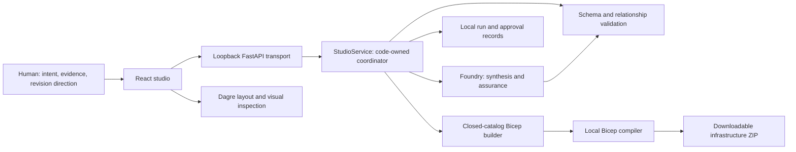

# Intent to Impact: Technical Deep Dive

## The governed design-to-evidence engine

**Baseline:** implemented local studio as reviewed on 14 September 2026, including
both contextual assurance actions, run history, selected-alternative package
validation/regeneration, Dagre topology layout, retired draft mode and the
guided Azure Portal handoff. Actual resource deployment remains unverified.

**Publication boundary:** operator archives, saved runs, raw receipts, local
tooling and agent configuration are excluded from Git. Local evidence paths
below identify prior verification records, not downloadable repository artifacts.
Use the [README](./README.md) for fresh-checkout prerequisites and the
[user guide](./intent-to-impact-user-guide.md) for current operation.

**Audience:** hackathon technical judges, architects, engineering leads, and developers taking the prototype forward.

**Scope:** this document explains the application that designs architectures, not just one architecture produced by it. The order-fulfilment design is a worked example.

> **Intent to Impact turns business intent into an inspectable architecture, a reviewable revision history, and compiler-checked infrastructure. AI proposes the design; code controls its acceptance, persistence, and translation into files; people authorize consequential requests.**

There is an engine behind the experience. It is a cooperating set of implemented modules, not a single class named "Intent Engine" and not an autonomous deployment agent. This document calls that set the **governed design-to-evidence engine** as a descriptive architectural term.

The distinguishing feature is not the diagram or the model alone. It is the controlled path between a customer's source material, a generated proposal, an explicit decision to request a change, and the exact infrastructure package produced from a selected revision.

### Reading map

1. [The customer problem](#1-the-customer-problem)
2. [What the engine actually is](#2-what-the-engine-actually-is)
3. [Relationship to the foundational pattern](#3-relationship-to-the-foundational-pattern)
4. [Runtime architecture](#4-runtime-architecture)
5. [The architecture contract as an intermediate representation](#5-the-architecture-contract-as-an-intermediate-representation)
6. [The model execution pipeline](#6-the-model-execution-pipeline)
7. [Grounding and deterministic validation](#7-grounding-and-deterministic-validation)
8. [Challenge, approve, regenerate, reassess](#8-challenge-approve-regenerate-reassess)
9. [Infrastructure generation and compilation](#9-infrastructure-generation-and-compilation)
10. [The topology layout engine](#10-the-topology-layout-engine)
11. [Persistence, lineage, and history](#11-persistence-lineage-and-history)
12. [Trust boundaries and local protections](#12-trust-boundaries-and-local-protections)
13. [Failure, concurrency, and recovery](#13-failure-concurrency-and-recovery)
14. [Worked example: order fulfilment](#14-worked-example-order-fulfilment)
15. [Evidence and validation](#15-evidence-and-validation)
16. [Trade-offs and remaining gaps](#16-trade-offs-and-remaining-gaps)
17. [Evolution toward a production system](#17-evolution-toward-a-production-system)
18. [Source map and operating guide](#18-source-map-and-operating-guide)

---

## 1. The customer problem

The customer-facing problem is the loss of intent between discovery and implementation.

A customer describes an outcome. Requirements are rewritten in a document. An architect draws a diagram. Reviewers raise concerns in another channel. Engineers translate the drawing into infrastructure. When something changes, the rationale, affected design, and implementation files can drift apart.

Intent to Impact brings that particular journey into one workspace:

| Customer moment | Friction being addressed | Implemented response |
|---|---|---|
| "Do you understand my process?" | Repeating context across people and documents | Prompt and process-document intake; source-linked requirements and explicit unknowns |
| "Show me the system, not another slide." | Prose that is difficult to inspect | Generated alternatives, connected components, interactive topology, source inspection |
| "Why is this blocked, and what can we change?" | Findings without an action path | Contextual recommendation/challenge, editable instruction, approval to revise, fresh review |
| "What exactly changed?" | Lost decisions and overwritten diagrams | New immutable result, parent binding, before/after finding, model change summary |
| "What can the delivery team use?" | Manual translation into infrastructure | Closed-catalog Bicep generation, real compilation, downloadable package |
| "Can we recover the earlier conversation?" | Work tied to a browser tab | Persisted runs, source snapshots, approval records, package retrieval |

This aligns with the "Reinvent Customer Experience Moments That Matter" hackathon
challenge: human direction combined with agents performing bounded work and
checking in at meaningful decisions. The original challenge text is an
operator-local archive, not published in this repository.

The demonstrated customer experience is the **architecture discovery-to-delivery handoff**. The studio does not itself process orders, take payments, or operate a warehouse. Those are responsibilities of the system being designed.

The current scope is stronger than a chat assistant returning a diagram, but narrower than a human-led agent operating an entire deployed business process.

The earlier offline draft workbench is retired from navigation and routing. Existing
`/draft` bookmarks open the live studio; the manual brief workflow is no longer
presented as a second product mode. Shared input helpers and saved browser draft
data are preserved, without automatically submitting that data to the model.

## 2. What the engine actually is

### 2.1 The central design

The engine coordinates a repeatable transformation:

```text
Business prompt + source documents
    -> validated and persisted request
    -> model-generated architecture representation
    -> deterministic reference and service checks
    -> separate model assurance review
    -> validated, immutable result
    -> human inspection / optional approved revision loop
    -> explicitly selected result and alternative
    -> deterministic infrastructure rendering
    -> actual compiler output and package receipt
```

It contains three materially different types of computation:

1. **Reasoning:** model synthesis and assurance. These are probabilistic proposals.
2. **Control and evidence:** validation, identity binding, admission, state transitions, hashes, and persisted receipts. These are code-owned.
3. **Transformation:** architecture-to-infrastructure generation and graph-to-screen layout. These use bounded deterministic rules.

Neither deterministic code nor successful compilation makes the model's architectural judgment correct. The separation makes each claim inspectable and limits what an incorrect model response can do.

### 2.2 Implementation ownership

| Responsibility | Implemented owner | Authority |
|---|---|---|
| Workflow sequencing, admission, jobs and builds | [StudioService](./apps/control-plane/studio/service.py) | Creates and persists local execution records; calls the model and package builder |
| Bounded model interaction | [FoundryModelClient](./apps/control-plane/studio/model_client.py) | Calls the existing configured model; does not approve or deploy |
| Model-facing structured output | [generation_schema.py](./apps/control-plane/studio/generation_schema.py) | Derives strict output schemas from the canonical contract |
| Input, source and graph validation | [validation.py](./apps/control-plane/studio/validation.py) | Accepts or rejects structural and relationship claims |
| Contextual revision authorization | [design_changes.py](./apps/control-plane/studio/design_changes.py) | Binds human direction to an exact prior result, option and finding |
| Infrastructure compilation | [bundle.py](./apps/control-plane/studio/bundle.py) and [templates](./apps/control-plane/studio/templates) | Maps supported component/edge types to fixed infrastructure rules |
| Topology geometry | [graphLayout.ts](./apps/experience/src/studio/views/graphLayout.ts) | Computes visual positions and routes; has no design-authoring authority |
| Human interaction and current-view checks | [StudioApp.tsx](./apps/experience/src/studio/StudioApp.tsx) | Collects consent, tracks unsent changes, displays results and decisions |
| Local HTTP boundary | [app.py](./apps/control-plane/studio/app.py) | Enforces loopback, origin, session and request restrictions |

**The orchestrator in the live path is application code.** The application uses Microsoft Agent Framework for its two specialist model calls, but a conversational model does not choose the next workflow action, acquire extra tools, or execute infrastructure.

## 3. Relationship to the foundational pattern

The original Generic Governed Agentic System Pattern establishes the foundation.
Its source file is retained in the operator-local `_bkp` archive, which is not
published; the relevant principle and current implementation mapping are
restated here:

> Models propose and coordinate. Deterministic code validates and records. Policy enforcement independently decides whether an action may run.

The live studio implements a deliberately bounded version of that pattern:

| Pattern element | Current realization | Important qualification |
|---|---|---|
| User-facing orchestrator | Studio UI plus Python service sequencing | Workflow selection is code-owned, not delegated to an autonomous coordinating model |
| Capability contracts | Canonical request/result schemas, fixed synthesis/review roles, infrastructure catalog | Not a general skill-discovery or tool-negotiation runtime |
| Private specialists | Synthesis and assurance calls | Two roles using the same configured deployment, not nine agents |
| Deterministic engines | Validation, revision authorization, persistence, generation, layout | These have different proof boundaries; layout success does not mean deployability |
| Canonical artifacts | Request, effective input, proposal, result, approval and build evidence | Local integrity checks, not a signed enterprise audit ledger |
| Runtime policy hooks | Transport checks, fixed provider guard, supported-operation rules | Not full integration with the older repository policy/gate engine |
| Independent assurance | A separately executed review that replaces synthesis self-review | Independence of execution, not an independent organization or model family |

The [earlier detailed design](./intent-to-impact-design-spec.md) describes a larger ambition: customer-promise contracts, intent continuity, runtime inventory, drift, remediation, stronger decision gates, and outcome reporting.

The repository also contains earlier [state](./apps/control-plane/state), [policy](./apps/control-plane/policy), and [work](./apps/control-plane/work) foundations. Their presence does **not** mean the live studio currently runs through that entire architecture.

This deep dive is the implemented-baseline companion to the broader design, not a claim that every original backlog item is complete.

## 4. Runtime architecture

### 4.1 Keep the studio and the generated system separate

There are two architectures to understand:

- **The studio runtime:** React in a browser, a local Python API, local persisted files, the configured Foundry model, and a local Bicep compiler.
- **The generated workload:** a customer-specific combination of supported Azure resources and existing external systems, described by an architecture result and infrastructure package.

Seeing Service Bus or Storage on a generated diagram does not mean the studio itself uses those services as its workflow store or message bus.



There is intentionally no arrow from the studio to an Azure deployment operation.

### 4.2 Technology baseline

| Area | Baseline |
|---|---|
| Browser application | React 19.2.4, TypeScript 5.9.3, Vite 7.3.1 |
| Browser validation | Generated AJV standalone validators; date/time formats registered during generation |
| Graph layout | `@dagrejs/dagre` 3.1.1 |
| HTTP service | FastAPI, Starlette, Uvicorn in a local Python environment |
| Agent/model integration | Microsoft Agent Framework, Foundry chat client, Azure AI Projects, Azure Identity |
| Model | Existing configured `gpt-5.2` deployment; both roles use it |
| Runtime request validation | Canonical JSON Schema with Python `jsonschema` |
| Durable store | Local JSON files and ZIP artifacts; no live-studio database |
| Infrastructure compiler | Verified local Bicep executable; recorded runs used 0.47.16 |

Exact dependency pins remain authoritative in [frontend dependencies](./apps/experience/package.json) and [backend requirements](./apps/control-plane/studio/requirements.txt).

### 4.3 Request and progress transport

The combined application is served from `http://127.0.0.1:5173/`.

The browser establishes a local session, submits an analysis, receives HTTP `202` with a `StudioJob`, and polls that job. The model response streams into the backend, but the browser sees bounded stage events through polling rather than a direct model-token stream or an SSE channel.

Stage events describe actual work such as synthesis, response validation, and assurance. They do not expose chain-of-thought, fabricate a completion percentage, or append a row for every received text chunk.

## 5. The architecture contract as an intermediate representation

The [studio schema](./apps/control-plane/studio/studio.schema.json) is the shared language between AI, backend, frontend, and builder.

It functions as an **intermediate representation**: richer than a diagram, but deliberately less expressive than arbitrary infrastructure code.

### 5.1 Principal objects

| Object | Meaning |
|---|---|
| `AnalysisRequest` | Title, original prompt, documents, refinement, optional parent result, consent and idempotency |
| `ArchitectureAnalysis` | Summary, process, requirements, assumptions, questions, alternatives, recommendation, review and change summary |
| `Requirement` | Stable-in-result ID, requirement text and allowed source IDs |
| `ArchitectureOption` | Alternative-specific rationale, trade-offs, cost notes, components and directed connections |
| `Component` | ID, business label, bounded kind/service, responsibility and requirement IDs |
| `ExternalDependency` | Business name, source identity and literal evidence that an integration already exists |
| `ReviewFinding` | One dimension, severity, finding, recommended action and source references |
| `StudioResult` | Immutable result identity, effective-input hash, analysis, source index and two model receipts |
| `StudioJob` | Execution status, stage events, optional result/error, optional revision approval |
| `ChangeApproval` | Permission to request a particular design revision, bound to its prior evidence |
| `BuildResult` | Selected result/option, compiler status, diagnostics, files, hashes, limitations and download location |
| `SavedRun` | Reopenable inputs, execution record and associated package index |

The model is instructed to generate two alternatives; the canonical analysis contract accepts two or three. Runtime bounds allow up to twelve components and twenty connections per alternative. The prompt encourages smaller designs; it is not the same thing as a schema limit.

### 5.2 The evidence relationships

```text
Source IDs
    <- Requirement.sourceIds
        <- Component.requirementIds
            <- ArchitectureOption.components and connections
                <- Build selection and manifest mapping

Source IDs
    <- ReviewFinding.sourceIds
        <- ChangeApproval.finding + baseResultId + baseResultHash
            <- next StudioJob and its new StudioResult
```

A connection's free-text label explains an integration to a reader. It is **not** an executable instruction or a permission definition. The builder derives permissions from supported source/target component kinds and its own integration rules.

The current review schema does not identify affected component IDs. Selecting a review lens therefore cannot honestly highlight "all impacted nodes"; the interface explicitly describes review findings as source-level observations.

### 5.3 One contract, several consumers

[generate-studio.mjs](./apps/experience/scripts/generate-studio.mjs) derives the browser TypeScript declarations and static validators from the canonical schema.

This avoids a second handwritten interpretation of the API. It also matters operationally: compiling AJV schemas at browser runtime required dynamic code evaluation and failed under the application's strict Content Security Policy. The shipped browser validators are generated ahead of time instead.

Generated types improve developer correctness. Runtime validators still check the actual received data. Neither should be substituted for the other.

## 6. The model execution pipeline

### 6.1 Initial generation

```mermaid
sequenceDiagram
    actor Human
    participant UI as Studio browser
    participant Service as StudioService
    participant Store as Local store
    participant Model as Foundry deployment
    participant Validator as Deterministic validators

    Human->>UI: Prompt, documents, explicit consent
    UI->>Service: POST analysis request
    Service->>Validator: Validate request, references and bounds
    Service->>Store: Persist request and queued job
    Service-->>UI: HTTP 202 and job ID
    Service->>Model: Synthesis with strict request-specific schema
    Model-->>Service: Architecture JSON and response ID
    Service->>Store: Preserve proposal and synthesis receipt
    Service->>Validator: Ground external bindings; validate analysis
    Service->>Model: Separate assurance call over proposal and sources
    Model-->>Service: Nine findings and a distinct response ID
    Service->>Validator: Validate assurance and merged analysis
    Service->>Store: Persist immutable result and result hash
    UI->>Service: Poll job
    Service-->>UI: Succeeded job, result and receipts
```

If an earlier stage fails, later stages do not manufacture a result. In particular, failed assurance does not promote the synthesis proposal as a successfully reviewed architecture.

### 6.2 Synthesis and assurance are different responsibilities

**Synthesis** proposes a representation of the customer's process: requirements, service boundaries, alternatives, integrations and unknowns.

**Assurance** receives the proposal and original source context and evaluates exactly nine dimensions:

| Dimension | Representative question |
|---|---|
| Business | Does the proposed system address the stated customer process and outcome? |
| Security | Are trust boundaries, authentication and data access assumptions supportable? |
| Reliability | What happens when a dependency or processing step fails? |
| Performance | Are load, latency and scaling assumptions defensible? |
| Cost | What cost drivers and unvalidated sizing assumptions remain? |
| Integration | Are existing systems, interfaces and callback assumptions compatible? |
| Compliance | Which requirements are established, and what evidence is still missing? |
| Operations | How will the system be operated and failures investigated? |
| Delivery | What setup, implementation or deployment prerequisites remain? |

The nine dimensions are nine findings in one assurance response, not nine independent agents or nine certification processes. The service checks that the assurance receipt has the correct role and a response ID distinct from synthesis.

### 6.3 Provider boundary

The application instantiates local Agent Framework agents with the configured Foundry client. The provider request is constrained to:

- The approved existing project Responses endpoint and deployment.
- Stateless requests with `store: false`.
- The exact expected strict output format.
- No tools, remote agent references, conversation IDs, or previous-response chaining.
- No automatic SDK retries or fallback provider.
- Bounded output size and execution time.

The browser cannot supply a different endpoint, deployment, tool list, or compiler command. Previous proposals are supplied as explicit application context, not provider-side conversational memory.

`store: false` is a request setting, not a guarantee of zero provider/security-log retention. Local input persistence is a separate, explicitly disclosed behavior.

## 7. Grounding and deterministic validation

### 7.1 Layered checks

| Layer | What it establishes | What it does not establish |
|---|---|---|
| JSON parsing | UTF-8 JSON, no duplicate keys, no non-finite constants | Correct business meaning |
| Schema validation | Required fields, allowed kinds, enums and bounds | A sound architecture |
| Relationship checks | References resolve to real sources, requirements and components | That a source logically supports a claim |
| External-binding check | An affirmative existing-system clause can be found in the named source | Actual ownership, API access or provider authentication capability |
| Separate assurance | A second model pass assessed the proposal | Certified security, compliance or completeness |
| Catalog validation | The selected design can be represented by supported deployment rules | Target subscription acceptance |
| Compiler validation | Actual Bicep/ARM generation succeeds for the rendered package | Application correctness or deployed runtime behavior |

This distinction is fundamental: **reference integrity is necessary for grounded output, but it is not semantic proof.**

### 7.2 Source identities are constrained before and after generation

The allowed source set consists of:

- `prompt` for the original business prompt.
- The IDs of attached source documents.
- `refinement` only when a nonempty refinement is part of the request.

The strict model output schema injects this request-specific set as an enum for source-reference fields. This prevents a known failure mode in which an initial analysis cited a nonexistent `refinement` source.

The provider schema is derived from reachable canonical definitions, with provider-compatible keywords and explicit required properties. Full runtime validation remains in place for constraints omitted from that provider representation.

The wire guard verifies the exact intended schema is sent; there is no silent downgrade to plain JSON-object mode.

Connection endpoints must be declared **component IDs**, not service kinds.
After a live revision incorrectly returned the literal `servicebus` as an
endpoint, the prompt was clarified with exact-ID examples. Runtime validation
still rejects unknown endpoints rather than guessing among possible queues.
The failed run remains recorded, and subsequent explicit recommendation and
challenge requests both passed synthesis and independent assurance.

### 7.3 Existing external systems are not service-name guesses

An external integration has two separate identities:

```text
Technical kind/service: external / External HTTPS API
Business identity: ERP, payment provider, warehouse, or another named source system
Evidence binding: exact business name + sourceId + literal affirmative source clause
```

The server reconstructs the evidence quotation from the actual supplied source instead of trusting a model paraphrase. Negated, proposed, unknown or mismatched integrations are rejected.

This establishes why the model may include an existing boundary. It does not prove that the provider supports a particular webhook signature, Entra token flow or replay-prevention mechanism.

### 7.4 Unknowns remain explicit

Unsupported services and uncertain requirements should become assumptions or questions, not disguised supported resources. A SQL database cannot safely become "Storage" merely because both store data.

There is no retrieval index, vector store, document OCR, remote website fetch, or automated interrogation of the customer's ERP in this path. Grounding uses the prompt and locally supplied UTF-8 text/Markdown documents.

The built-in example supplies illustrative business inputs only. Loading it does not load a canned architecture or skip live inference.

## 8. Challenge, approve, regenerate, reassess

### 8.1 The interaction

On an Assurance finding, the user can select:

- **Request recommended change:** start with the finding's recommendation.
- **Challenge finding:** explain a disagreement and propose a correction.

Both open a contextual panel containing the exact finding, recommendation and selected alternative. The human edits the instruction, gives fresh consent, and selects **Approve & regenerate**.

Approval means:

> "Use this direction to produce another proposal and review it again."

It does **not** mean:

> "This blocker is resolved," "I accept this risk," "the resulting design is approved," or "deploy this change."

### 8.2 Server binding

The ordinary analysis request gains an optional `designChange` object. No separate deployment or risk-waiver endpoint is introduced.

Before a new model job is scheduled, the server checks:

1. The parent is an accessible, completed result.
2. Its persisted content matches its recorded result hash.
3. The selected option belongs to that result.
4. The full finding matches the stored review, including severity, recommendation and source list.
5. Original prompt and documents are unchanged.
6. Confirmation is explicitly true.
7. The human instruction is within the contextual limits.

The instruction must contain at least ten non-padding characters and is bounded to 2,000 characters. The server composes the effective refinement from the instruction, exact original finding, selected option and revision-only policy. That complete context must fit the 4,000-character refinement limit; it is rejected rather than silently truncated if too large.

### 8.3 What is persisted before inference

| Approval field | Why it matters |
|---|---|
| `baseResultId` | Identifies the exact prior revision |
| `baseResultHash` | Binds the approval to the complete prior result content |
| `optionId` | Records the human's targeted alternative |
| `finding` | Preserves exactly what was challenged or selected |
| `intent` | Distinguishes recommendation from challenge |
| `instruction` | Preserves the original human direction |
| `refinement` | Preserves the exact composed source sent to the model |
| `approvedAt` | Server-recorded authorization time |
| `actor` | Fixed `demo-human` label |
| `scope` | Fixed `design-revision-only` boundary |

The immutable approval is stored alongside the job before execution and exposed through `StudioJob.changeApproval`. The local demo actor is not an independently authenticated enterprise approver.

The model is instructed to preserve and recommend the targeted alternative if feasible. This is not guaranteed by the model contract. The interface can identify a missing target option and asks the user to inspect the returned alternatives.

### 8.4 How the loop closes

The new proposal goes through the same synthesis and assurance path. The UI shows the original finding, the latest finding/severity, the approved instruction, and the model's change summary.

The original result is never edited in place. A failed revision retains its approval and failure record without lowering the original blocker.

The UI also prevents stale actions:

- Editing the proposed instruction clears its consent checkbox.
- An open approval becomes invalid if its working inputs or selected alternative change.
- A model response does not overwrite newer unsent input entered while the request was running.
- Old packages cannot masquerade as packages for a new result/alternative.
- Closing the approval panel during execution hides the panel; it does not cancel remote work.

**Important current gap:** the build endpoint does not gate package generation on the absence of model-review blockers or a final design sign-off. It compiles a selected validated/catalog-compatible proposal after explicit package-generation confirmation. That behavior must not be presented as a production release approval.

## 9. Infrastructure generation and compilation

### 9.1 Why generation is deterministic

The model returns the architecture representation, not executable Bicep.

The builder receives the server-stored result and selected option, validates them, and applies a fixed catalog. Display text, source documents, and connection descriptions do not become shell commands, module addresses or arbitrary executable infrastructure.

This is a compiler-style boundary:

```text
Validated architecture representation
    -> supported service and integration rules
    -> fixed template rendering
    -> generated Bicep and required parameters
    -> real Bicep compiler
    -> parsed ARM template, manifest and validation evidence
```

### 9.2 Current catalog

| Component | Generated infrastructure scope |
|---|---|
| App Service | Linux B1 plan, Node 22 host, managed identity and authentication configuration |
| Functions | Dedicated Linux B1 hosting, Python 3.12 / Functions v4, identity-based host storage; not Consumption/Flex |
| Storage | Blob storage and a non-anonymous data container; not SQL, Tables or Azure Files |
| Service Bus | Standard namespace and a work queue |
| Key Vault | Standard vault using RBAC, soft delete and purge protection |
| Client | Existing client boundary; no customer application bundle is generated |
| External HTTPS API | Existing integration; not a provisioned external system |

Pinned AVM modules are used for the App Service plan, user-assigned identity and vault. Key-free local templates are used for sites, Storage and Service Bus because the inspected module versions retained key-retrieval expressions. The catalog records these decisions and pins.

### 9.3 Edges have implementation rules

Representative mappings include:

| Directed connection | Deterministic infrastructure contribution |
|---|---|
| Application -> Blob Storage | Endpoint/settings plus container-scoped Blob Data Contributor |
| Application -> Service Bus | Queue endpoint/settings plus Data Sender |
| Service Bus -> application | Consumer settings plus Data Receiver |
| Application -> Key Vault | Vault settings plus Secrets User |
| Application -> application | Target endpoint/audience and caller managed-identity authorization |
| Client -> application | Existing Entra application setup remains a required prerequisite |
| Application -> external API | Required HTTPS endpoint parameter and application-side integration work |
| External API -> application | Existing same-tenant Entra caller-client-ID parameter and authenticated ingress allowlist |

Business handlers and SDK integration code must still consume those settings and use the intended identities.

Self-connections, duplicate directed connections, disconnected deployment graphs, unsupported edge types and cyclic app-to-app deployment dependencies are blocked. Feedback paths through queues or external systems are not the same thing as a forbidden app-to-app dependency cycle.

Build-only topology restrictions apply to the **selected alternative**, not all
alternatives in the result. Whole-result schema and reference validation remains.
This prevents an unsupported duplicate in one alternative from blocking another
otherwise supported selection. Queue sender/receiver permissions follow edge
direction, never a free-text "consume" label; legacy discrepancies require review.

### 9.4 Actual compiler evidence

The builder creates a unique bounded output directory, verifies the compiler, runs Bicep without a shell, and captures its exit code and diagnostics. It also parses the emitted ARM JSON and rejects forbidden embedded key-retrieval expressions.

A compiled result must have a successful compiler receipt, generated files and the expected local download URL. Failed or blocked results do not advertise a completed package.

The eight-file package contains:

| File | Purpose |
|---|---|
| `README.md` | Setup requirements, integration responsibilities and limitations |
| `bicepconfig.json` | Portable compiler/module configuration |
| `catalog.json` | Supported service rules, module pins and resource API versions |
| `main.bicep` | Rendered infrastructure source |
| `main.json` | Actual compiled ARM template |
| `main.parameters.json` | Parameter document; required existing values are intentionally not fabricated |
| `manifest.json` | Result/option/source lineage, mapping and content hashes |
| `validation.json` | Compiler evidence and explicit unperformed deployment checks |

The generator is deterministic in its rules and template selection. It does not guarantee byte-identical archives across separate build attempts: build IDs and local evidence metadata differ.

### 9.5 What "compiled" does not mean

Compilation does not prove:

- Target subscription policy, quota, RBAC or regional availability.
- Resource-name availability or data-residency compliance.
- Correct external provider configuration.
- Business application implementation, tests or authentication handlers.
- Deployment success, end-to-end application behavior or achieved customer outcomes.

The deployment scope is a resource group, with location based on that group's location unless explicitly supplied. No business residency requirement is inferred from a sandbox region.

The present catalog enables public endpoints with authentication/TLS controls. The known target governance configuration may reject public access. The live studio does not convert this into a private-network or Network Security Perimeter deployment merely because an earlier infrastructure experiment discussed one.

Every successful package still reports **`deploymentStatus: not-deployed`**.

### 9.6 Guided Azure Portal handoff

The Build panel now offers **Deploy to Azure** for the current compiled package.
This is a manual handoff, not a deployment endpoint: the browser verifies the
compiled JSON and parameter-file hashes, lists the required parameters and
offers downloads plus the official Azure Portal custom-template workflow.

The user must separately select the target, supply real integration values,
resolve blockers and approve costs before Azure Portal **Create**. No template
is publicly hosted or automatically uploaded. Portal outcomes are not imported
as studio success records. See the [user guide](./intent-to-impact-user-guide.md)
for the exact workflow and the distinction between handoff testing and provisioning.

## 10. The topology layout engine

The visual engine is an important subordinate engine, not the author of the architecture.

### 10.1 Why the earlier graph looked tangled

The old algorithm repeatedly propagated node depth but capped it at three. Later components and cyclic callback paths accumulated in the final column. The renderer then drew every connection from the right side of its source to the left side of its target, including backward connections.

The combination produced a tall column of blocks and large looping curves. Zooming out could fit the graph but made it difficult to read.

### 10.2 Current layout mechanics

The replacement uses Dagre's layered layout:

- Stable insertion ordering by node/edge IDs.
- Directed multigraph representation.
- Left-to-right or top-to-bottom ranking.
- Network-simplex ranking and greedy cycle handling.
- Explicit node, rank and edge separation.
- A routed point sequence for every connection.
- Coordinate conversion from layout centers to the UI's top-left node positioning.

The current node geometry is 214 by 100 pixels. Layout parameters use 70-pixel rank separation, 44-pixel node separation, 18-pixel edge separation, and 24-pixel margins.

External-source edges receive a lower layout weight than other edges. This is a visual heuristic to help organize feedback and integration paths, not a change in business importance, risk or authorization.

Cycles may be handled internally for ordering while the displayed routes retain the original directed connections. A clear diagram does not establish that every visualized cycle is supported by the infrastructure builder.

### 10.3 Interaction semantics

| Control | Effect |
|---|---|
| Re-layout | Discards manual placement for this view, restores automatic positions/routes, and fits the camera |
| Fit / Ctrl or Cmd + 0 | Fits current geometry without resetting manual node placement |
| Flow direction | Recomputes a left-to-right or top-to-bottom arrangement |
| Expand | Hides side panels and review summaries to give the graph usable space |
| Restore panels | Restores the previous panel visibility and context |
| Labels | Shows all connection labels; selection/hover exposes relevant labels otherwise |
| Drag / Shift + arrow keys | Moves nodes in the current visual view |
| Ctrl/Cmd plus/minus or Ctrl + wheel | Bounded 25-180% zoom; wheel zoom is anchored at the pointer |
| List view | Presents all component and connection descriptions without relying on geometry |

Moved nodes update connected route endpoints. Full automatic routing is restored with Re-layout. Arbitrary manual placement can still produce crossings; there is no claim of perfect obstacle-free routing after every drag.

Positions and camera state are presentation state, not canonical design data or persisted source evidence. Opening a saved result computes its layout again without inference.

The reported eleven-node, seventeen-edge alternative was browser-checked for node separation and visible bounds. Expanded view reached a readable scale rather than merely adding empty horizontal space. This is proof for the tested topology and viewport, not a universal crossing-free-layout guarantee.

## 11. Persistence, lineage, and history

### 11.1 Durable records

The application keeps local records under:

```text
.intent-to-impact\studio\runs\
  sessions.json
  jobs\<jobId>\
    input.json
    state.json
    synthesis-response-format.json
    synthesis-proposal.json
    synthesis-receipt.json
    assurance-response-format.json
    assurance-receipt.json
    result.json
    change-approval.json       # contextual revisions only
  build-records\<record>.json
  builds\<buildId>\
    generated files
    compiler cache/evidence
    receipt.json
    package.zip               # successfully compiled packages
```

Not every file exists for every failure stage. A rejected response can have its own rejected receipt; a job failing before assurance will not have completed-assurance evidence.

`input.json` preserves the submitted request, effective request and previous result context. `state.json` is mutable execution metadata. A successful `result.json` and a contextual `change-approval.json` are written as immutable files rather than overwritten on revision.

### 11.2 Integrity is explicit, but not a signature

The live service hashes sorted, compact, ASCII-escaped JSON using SHA-256. **Its digest does not append a trailing newline.** The bundle uses its own formatted JSON/content hashing for package provenance.

These serialization domains must not be mixed. A package's serialized-result hash should not be compared blindly with a service result hash as though the byte representations were identical.

Recovery verifies stored result content against the state record. Approval recovery also reconstructs the expected request/parent/finding binding and compares it to persisted approval evidence.

These checks detect accidental corruption and inconsistent files. They do not provide cryptographic non-repudiation against someone who controls the machine and can rewrite both records and hashes.

Writes use exclusive creation for immutable artifacts and a pending-file replacement pattern for mutable records. This is not a cross-file ACID transaction or a distributed event store.

### 11.3 History is recovery of evidence, not replay of intelligence

History can:

- List successful, failed and running jobs.
- Restore original inputs and saved outcomes.
- Resume polling an existing in-progress job.
- Download a run-record ZIP.
- Retrieve an already compiled package without another build.

The run ZIP contains input text and results but excludes session cookies, CSRF values, internal owner keys and idempotency metadata. Document bodies use fixed numbered ZIP paths rather than user-provided filenames.

The factory default is session-private visibility. The developer installation
explicitly enabled shared workspace history: any valid local studio session can
read those stored runs. That ignored local setting does not accompany a checkout.
This is an operator-controlled, single-user-demo choice, not production tenant isolation.

A saved result is labeled as saved, not as new live inference. Restoring it requires fresh consent for subsequent model calls.

## 12. Trust boundaries and local protections

The current security model is a deliberately local demonstration:

1. **Browser to local API:** direct loopback connection, exact Host/Origin checks, custom client header, local session cookie, CSRF token on POST, JSON-only bounded bodies.
2. **Local API to model:** fixed endpoint/deployment, server-held Azure CLI credential access, stateless no-tools calls and strict output guard.
3. **Untrusted output to durable state:** schema/reference validation and explicit promotion rules.
4. **Stored architecture to compiler:** fixed catalog/templates, bounded output paths, no arbitrary model-authored commands.
5. **Local machine to persisted evidence:** OS access controls and integrity checks, but no application-level encryption.

Additional protections include rejected forwarded requests, no permissive CORS/preflight, a strict script Content Security Policy, no browser Azure credentials, and rejection of recognized credential-like content.

These mechanisms should not be overstated:

- Secret-pattern rejection is a heuristic, not comprehensive DLP.
- "Documents are untrusted data" instructions reduce exposure but are not a proof against all prompt injection.
- Local session protection is not user authentication suitable for a network-hosted production system.
- Local approval hashes do not identify a real authorized enterprise approver.
- Customer text is persisted unencrypted and also sent to the configured model after consent.

The studio should not be published to a network or placed behind a proxy under this security model.

## 13. Failure, concurrency, and recovery

### 13.1 Job state machine

```text
queued -> running -> succeeded
   |         |
   +---------+----> failed

Restart finds queued/running:
    -> failed / recovery_needed
    -> explicit new submission if the user chooses to retry
```

There is no automatic continuation from an interrupted model call. Remote completion may be unknown even when local observation stops.

| Situation | Observable behavior |
|---|---|
| Invalid input or source binding | Explicit error before promotion; no substitute architecture |
| Model timeout/provider rejection | Failed job and bounded diagnostics; no automatic repair/fallback |
| Synthesis succeeds, assurance fails | Failed job; synthesis may be retained as a diagnostic proposal, not a reviewed result |
| Contextual revision fails | Original design remains unchanged; approval and failure remain inspectable |
| Browser stops waiting | Local polling stops; remote work is not claimed cancelled |
| Unsupported catalog or topology | Blocked build with diagnostics, no successful ZIP action |
| Compiler failure | Failed build with actual diagnostics |
| Compiler request deadline expires | Local compiler completion may be unknown; no automatic rerun |
| Corrupt stored job/result/approval | Startup recovery fails explicitly rather than silently discarding records |
| Same idempotency key, changed request | Conflict rather than a second interpretation of the same request |

### 13.2 Operational bounds

| Bound | Current value/behavior |
|---|---|
| Concurrent model jobs | One admitted live analysis at a time |
| Concurrent package requests | One at a time, using a separate build lock |
| Persisted analysis/build limits | 64 jobs and 64 builds |
| Local sessions | At most 16 unexpired sessions; one-hour lifetime |
| Request body | 800 KiB |
| Source documents | At most five; 150,000 combined text characters |
| Original prompt | At most 12,000 characters |
| Generic refinement | At most 4,000 characters |
| Contextual instruction | 10-2,000 characters; composed refinement still at most 4,000 |
| Local storage threshold | 200 MiB, with admission headroom for new work |
| Model call deadline | 120 seconds per role |
| Whole analysis deadline | 300 seconds |
| Service build deadline | 120 seconds |
| Builder subprocess timeout | 180 seconds; the service deadline is shorter |
| Completed package download bound at build admission | 20 MiB |

The service locks are in-process. They are not a distributed scheduler or a multi-process write-coordination protocol.

Idempotency is scoped to the local session owner and key. The UI normally generates a fresh key for a new explicit action. "Try again" is not necessarily a replay of the same idempotent request; it can create another chargeable run.

The shorter service build deadline can expire while a worker thread continues locally. That is an operational limit to resolve before production, not a reason to announce a success-shaped fallback.

## 14. Worked example: order fulfilment

### 14.1 Business intent

The built-in example describes a process that needs immediate order acknowledgement, reliable status updates, and continued operation during warehouse outages, while retaining existing ERP, payment-provider and warehouse integrations.

The customer moment is straightforward: an order should not disappear into uncertainty simply because a downstream system is temporarily unavailable.

The generated architecture uses application endpoints, asynchronous work processing, durable status storage, secret/configuration boundaries and existing integration endpoints.

### 14.2 The two revised alternatives

The examined saved revision contains:

- A **unified API and integration-worker design**, with a callback adapter as an explicit design element.
- A **split public API and back-office operations design**, also with callback-adapter responsibilities.

The second alternative contains eleven components and seventeen connections. The graph is not a fixed template; those nodes and links are read from the stored model result.

At a conceptual level:

```text
Storefront -> public order API -> status store
                            -> work queue -> integration worker -> ERP / warehouse

Operations UI -> status store / work queue / configuration

Payment provider / warehouse -> callback ingress or adapter -> work queue
```

This sketch abbreviates the recorded graph. It is not a replacement for its actual connection list or a claim that the depicted handlers have been implemented.

### 14.3 Why the Security blocker is legitimate

The package catalog's callback contract expects an existing same-tenant Entra caller and bearer-token authentication.

The sources establish callbacks and retries. They do not establish that the payment provider or warehouse can obtain that token. A design relying on that capability can compile as infrastructure while remaining unimplementable for the actual providers.

The contextual revision requested a corrected architecture and introduced an adapter responsibility. The subsequent assurance still reported a blocker because the provider-to-adapter authentication mechanism and replay protections were not established.

This is the engine behaving honestly:

1. It accepted permission to revise.
2. It produced a new model proposal and a separate review.
3. It recorded both the instruction and the outcome.
4. It did not convert the human click into evidence that the integration is secure.
5. It could compile the revised infrastructure while still exposing the unresolved design assumption.

To actually close that issue, the team needs provider capability evidence, a concrete authentication/verification design, and implemented/tested callback behavior. Adding a block called "adapter" is not sufficient.

### 14.4 The demonstrable customer benefit

The customer no longer has to discover this mismatch only after engineers deploy an application host. The architecture review makes the assumption visible, offers a contextual change path, and retains the reasoning and remaining work alongside the delivery package.

Reduced rework and faster handoff are the intended benefits. The current evidence demonstrates the workflow, not a measured percentage reduction in project cost, lead time or customer abandonment.

## 15. Evidence and validation

### 15.1 Latest relevant evidence

Raw evidence is retained locally beneath `.intent-to-impact\spikes`, not in Git.
Paths in this table are operator reference identifiers, not repository links.
The [maintained user guide](./intent-to-impact-user-guide.md) records the latest
numbered scenarios, outcomes and known limits.

| Evidence | Demonstrated scope | Boundary |
|---|---|---|
| Numbered browser run: `NUMBERED-GUIDE/64ee05aec6c247b8b79cea9103fdc973/receipt.json` | Points 1-17, original failed selection, two real compiles, distinct build IDs, ZIP hashes, history and real portal navigation | No inference, upload or resource creation in this run |
| Recommendation: `DESIGN-CHANGE/c2d731bb495f46e7b308c1895558d593/receipt.json` | Actual recommended-change approval, fresh synthesis and separate assurance | New immutable result; Business fit remained warning |
| Challenge: `DESIGN-CHANGE/76474b8ad572403cbf1808f27266a7bc/receipt.json` | Actual challenge approval, fresh synthesis and separate assurance | New immutable result; no risk waiver |
| Revised packages: `DESIGN-CHANGE/523fa3f5b0204f458205e47a0077f874/receipt.json` and `DESIGN-CHANGE/138e3c1a128940aebc09a702ef6c04a3/receipt.json` | Both revised designs compiled and downloaded; hashes and approval history checked | Reused completed results; no additional inference |
| Topology: `CANVAS-LAYOUT/566ae73224744913a0a079ab5451aea7/receipt.json` | Both saved alternatives, all nodes/edges, no block overlap, expanded bounds, Fit/Re-layout/direction/list behavior | Read-only existing run; no inference |
| Zoom: `CANVAS-ZOOM/30bf3c50c3ac4f5788577d33eb82ad79/receipt.json` | Keyboard, wheel anchor, limits, editable-field isolation and list mode | Explicitly replayed UI data, not new model proof |
| Publication frontend verification | 89 tests passed across studio, routing, client, layout and handoff; generated-contract check, TypeScript and build passed | Includes the earlier 59-test subset; not an all-repository certification |
| Backend/build tests | 25 bundle, 19 model/validation and 16 approval tests passed | Bundle includes real compiles; model/approval unit tests use injected models |

The first browser attempt at the contextual revision successfully caused real synthesis and assurance, but its test harness initially counted only HTTP `200`, not the analysis endpoint's `202`. The harness failed its capture assertion after the revision had completed. It was corrected, and verification resumed the stored revision instead of charging for another model run.

This detail explains why a successful completion receipt can correctly show zero new model requests while verifying fresh model receipts from the previously completed revision.

Earlier full-suite baselines were recorded during prior increments. Do not add overlapping historical test counts together and describe them as one current execution.

### 15.2 What each kind of evidence means

- A fixture test proves behavior under controlled inputs.
- A replayed-browser test proves UI behavior without inference.
- A live-model receipt proves a provider response was obtained and recorded, not its truth.
- A compiler receipt proves the rendered infrastructure compiled, not deployment readiness.
- A ZIP hash comparison proves the tested download matches the tested file contents.
- A saved approval proves the local system recorded revision permission, not independently verified human identity.

Evidence lives in an ignored local workspace subtree and does not accompany a
source-only checkout. A reviewer can inspect those receipts only where the
operator-local artifacts are present; otherwise rerun the appropriate tests
against new authorized synthetic input. Documentation publication itself does
not authorize or perform inference or Azure operations.

## 16. Trade-offs and remaining gaps

### 16.1 Deliberate trade-offs

| Decision | Benefit | Cost |
|---|---|---|
| Fixed two-stage reasoning pipeline | Predictable execution and understandable receipts | Less flexible than dynamic multi-agent planning |
| Same deployment for both roles | Simple setup and bounded operation | Correlated model errors remain possible |
| Strict structured output plus runtime checks | Fewer malformed/phantom references | Valid JSON can still contain poor architectural judgment |
| Closed infrastructure catalog | Traceable, repeatable generation without arbitrary model code | Limited services, runtimes, networking and integration patterns |
| Local file store | Fast demo setup and inspectable evidence | Unencrypted data, bounded capacity, no enterprise tenancy or distributed durability |
| Explicit revision permission | Actionable human control and exact lineage | Not final design approval or a risk-exception workflow |
| Client-side graph layout | Immediate visual organization without model cost | Geometry is temporary; labels/crossings still need interaction on dense graphs |
| No deployment endpoint | No accidental cloud mutation through the studio | Delivery stops at compiled infrastructure and documented prerequisites |

### 16.2 Material gaps

1. **No business application generation.** API handlers, callback verification, queue consumers and client flows remain implementation tasks.
2. **No final design/blocker release gate.** Review severity does not currently prohibit package compilation.
3. **No target deployment preflight or runtime verification.** What-if, policy, quota, RBAC, region checks and workload tests are outside this path.
4. **No real enterprise approver identity or separation of duties.**
5. **No comprehensive semantic-grounding proof.** Most source links identify whole sources; requirements are not backed by machine-verified passage entailment.
6. **No option-specific review-impact model.** Findings review the proposal as a whole and lack component-impact references.
7. **Limited long revision-chain semantics.** Parent results preserve lineage, but the current `refinement` source represents the current instruction. This is not a fully normalized decision-history or conflict-resolution model.
8. **No production durability, tenancy, retention or full tracing platform.**
9. **No measured business-outcome improvement or broad model-quality evaluation benchmark.**

The older intent-continuity/runtime-drift foundations and sandbox experiments should remain separately labeled until integrated into the actual user journey.

## 17. Evolution toward a production system

The strongest next step is to deepen the engine's evidence and execution boundaries, not simply add more agent roles.

### Step 1: Make the delivery boundary enforceable

- Define final design acceptance separately from permission to revise.
- Introduce option-specific findings and stable finding identities.
- Bind a release decision to the selected result, option, unresolved findings and required target checks.
- Decide explicitly whether risk exceptions are allowed; if they are, give them a separate authorized workflow.

### Step 2: Make integration responsibilities executable

- Add specific supported integration contracts rather than interpreting free-text labels.
- Generate or supply tested application adapters and consumers where justified.
- For callback ingress, require provider capability evidence and actual signature/token/replay tests.
- Associate application artifacts and test evidence with the same architecture revision.

### Step 3: Add a separately authorized target-validation path

- Gather an explicit approved resource group, region and identity context.
- Validate policy, quota, RBAC, names and region availability.
- Run what-if and deployment validation under a separate authority boundary.
- Keep compilation, deployment approval, deployment execution and runtime verification as separate states.

### Step 4: Replace local-demo controls with production foundations

- Real authentication, tenant isolation, authorization and separation of duties.
- Encrypted data storage, retention policies and user-controlled export/deletion.
- Transactional records, multi-worker coordination, bounded recovery and provider reconciliation.
- Signed/versioned evidence where required; shared canonicalization rules for each digest domain.
- Operational metrics and quality evaluations that distinguish latency, validity, correctness and customer value.

### Step 5: Close the original intent-continuity loop

Only after deployment/runtime evidence exists should the system claim to compare actual Azure state with the customer promise, diagnose drift, propose remediation and report measured outcomes.

That is the bridge from the current architecture studio to the broader original vision. It is a roadmap, not a description of today's live behavior.

## 18. Source map and operating guide

### 18.1 Where to read the implementation

| Topic | Primary source |
|---|---|
| Product pattern | Principle and implementation mapping in section 3; original pattern is operator-local and not published |
| Broader target design | [Detailed design specification](./intent-to-impact-design-spec.md) |
| Live experience and setup | [Frontend README](./apps/experience/README.md) |
| API, model and persistence behavior | [Backend README](./apps/control-plane/studio/README.md) |
| Sole transport contract | [studio.schema.json](./apps/control-plane/studio/studio.schema.json) |
| Job and build coordination | [service.py](./apps/control-plane/studio/service.py) |
| Model roles and provider guard | [model_client.py](./apps/control-plane/studio/model_client.py) |
| Strict provider format | [generation_schema.py](./apps/control-plane/studio/generation_schema.py) |
| Source/reference validation | [validation.py](./apps/control-plane/studio/validation.py) |
| Revision permission binding | [design_changes.py](./apps/control-plane/studio/design_changes.py) |
| Infrastructure compiler boundary | [bundle.py](./apps/control-plane/studio/bundle.py) |
| Catalog and integration contracts | [Template README](./apps/control-plane/studio/templates/README.md) |
| UI current-result and operation handling | [StudioApp.tsx](./apps/experience/src/studio/StudioApp.tsx) |
| Approval and before/after presentation | [DesignChange.tsx](./apps/experience/src/studio/views/DesignChange.tsx) |
| Azure handoff hash checks and instructions | [deployment.ts](./apps/experience/src/studio/deployment.ts) and [DeploymentPanel.tsx](./apps/experience/src/studio/views/DeploymentPanel.tsx) |
| Layout and routes | [graphLayout.ts](./apps/experience/src/studio/views/graphLayout.ts) |
| Graph interaction and camera | [ArchitectureCanvas.tsx](./apps/experience/src/studio/views/ArchitectureCanvas.tsx) |
| Typed client and transport checks | [client.ts](./apps/experience/src/studio/client.ts) |
| Generated contract tooling | [generate-studio.mjs](./apps/experience/scripts/generate-studio.mjs) |

### 18.2 Start and inspect the current demo

Use the existing [combined launcher](./tools/Run-LiveStudio.ps1):

```powershell
.\tools\Run-LiveStudio.ps1
```

The launcher builds the frontend, then replaces a recognized same-workspace
studio or Vite listener on port 5173 before starting the local API. It verifies
the process command line and creation identity, stops only explicit PIDs, and
waits up to ten seconds for port release. Unrelated/unidentifiable listeners,
inspection/termination errors and release timeouts stop startup explicitly.
`-SkipBuild` reuses existing assets with the same cleanup. Saved records are not
deleted; active work should finish first because termination can interrupt jobs
and leave remote completion unknown. A failed build leaves the old server running.

The same helper is executable directly as `.\tools\Stop-LiveStudioPort.ps1`
for stop-only operation. It derives the default workspace from its file location.
Dot-sourcing imports its functions without performing cleanup; direct invocation
runs the stop function. This distinction keeps launcher imports side-effect free.

At `http://127.0.0.1:5173/`:

1. Load example inputs or enter a process and attach text/Markdown sources.
2. Give explicit model-processing consent and generate.
3. Inspect alternatives, requirements and source links.
4. Use Expand and Re-layout for dense topologies.
5. Open Assurance, select a finding, request/challenge a change, and approve the revision instruction.
6. Inspect the new result and remaining findings.
7. Separately confirm infrastructure generation in Build.
8. Download the compiled package or reopen it later through Run history.

For a presentation, follow the [numbered user guide](./intent-to-impact-user-guide.md).
The earlier three-minute script is retained only in the local `_bkp` archive.
A saved run is a legitimate fallback when labeled as saved evidence, not as
fresh inference.

### 18.3 The concise technical explanation

> Intent to Impact is a human-directed architecture pipeline with a deterministic control core. Two bounded AI calls propose and review a typed design. Code verifies relationships, records exact revision permissions, preserves history, and translates supported designs into real compiler-checked infrastructure. A separate layout engine makes the same design inspectable. The current delivery boundary is a traceable compiled package, not a deployed or verified business application.

That is the engine to demonstrate: **not intelligence without controls, and not controls without useful output, but a visible path from intent to an inspectable, reviewable, reproducible handoff.**
